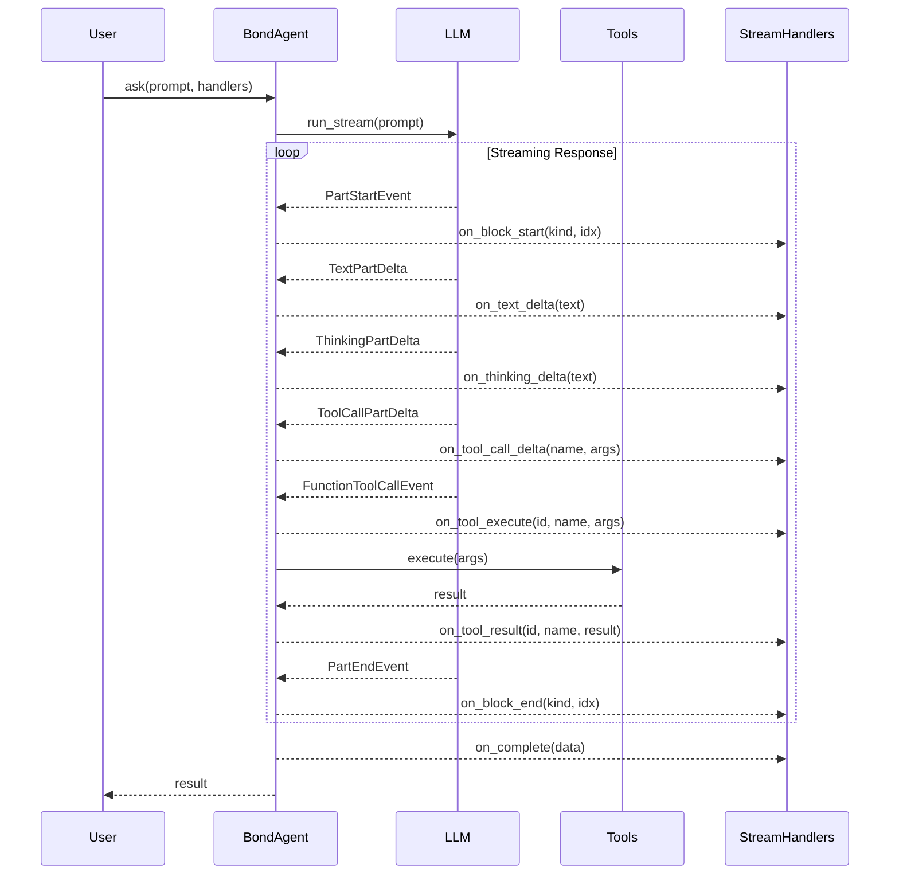
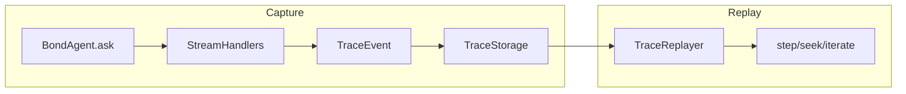

# Architecture

Bond's architecture is designed around one principle: **the agent's reasoning should be as observable as its output**.

## Overview



## StreamHandlers: The Forensic Core

`StreamHandlers` is a dataclass that maps callbacks to every stage of the LLM lifecycle. This is what makes Bond "forensic"—nothing is hidden.

```python
@dataclass
class StreamHandlers:
    # Lifecycle: Block open/close
    on_block_start: Callable[[str, int], None] | None = None
    on_block_end: Callable[[str, int], None] | None = None

    # Content: Incremental deltas
    on_text_delta: Callable[[str], None] | None = None
    on_thinking_delta: Callable[[str], None] | None = None
    on_tool_call_delta: Callable[[str, str], None] | None = None

    # Execution: Tool running/results
    on_tool_execute: Callable[[str, str, dict[str, Any]], None] | None = None
    on_tool_result: Callable[[str, str, str], None] | None = None

    # Lifecycle: Response complete
    on_complete: Callable[[Any], None] | None = None
```

### Callback Categories

#### Lifecycle Events

| Callback | When | Arguments | Purpose |
|----------|------|-----------|---------|
| `on_block_start` | New content block begins | `(kind: str, index: int)` | UI can render block container |
| `on_block_end` | Content block finishes | `(kind: str, index: int)` | UI can close block container |
| `on_complete` | Entire response done | `(data: Any)` | Final cleanup, logging |

#### Content Events (Typing Effect)

| Callback | When | Arguments | Purpose |
|----------|------|-----------|---------|
| `on_text_delta` | Text token arrives | `(text: str)` | Show response as it forms |
| `on_thinking_delta` | Reasoning token arrives | `(text: str)` | Show chain-of-thought |
| `on_tool_call_delta` | Tool args forming | `(name: str, args: str)` | Show tool selection |

#### Execution Events

| Callback | When | Arguments | Purpose |
|----------|------|-----------|---------|
| `on_tool_execute` | Tool call starts | `(id: str, name: str, args: dict)` | Show "working" state |
| `on_tool_result` | Tool returns | `(id: str, name: str, result: str)` | Show tool output |

### Event Flow

```mermaid
flowchart LR
    Start([Prompt]) --> B1[block_start]
    B1 --> T1[text_delta x N]
    T1 --> B1E[block_end]
    B1E --> B2[block_start]
    B2 --> TH[thinking_delta x N]
    TH --> B2E[block_end]
    B2E --> B3[block_start]
    B3 --> TC[tool_call_delta x N]
    TC --> B3E[block_end]
    B3E --> EX[tool_execute]
    EX --> RS[tool_result]
    RS --> Done([complete])
```



## BondAgent

`BondAgent` is a generic class that wraps PydanticAI's `Agent` with full-spectrum streaming.

```python
@dataclass
class BondAgent(Generic[T, DepsT]):
    name: str
    instructions: str
    model: str | Model
    toolsets: Sequence[Sequence[Tool[DepsT]]] = field(default_factory=list)
    deps: DepsT | None = None
    output_type: type[T] | Any = str
    max_retries: int = 3
```

### Constructor Parameters

| Parameter | Type | Description |
|-----------|------|-------------|
| `name` | `str` | Agent identifier for logging |
| `instructions` | `str` | System prompt defining behavior |
| `model` | `str \| Model` | Model identifier (e.g., `"anthropic:claude-sonnet-4-20250514"`) |
| `toolsets` | `Sequence[Sequence[Tool]]` | Groups of tools to provide |
| `deps` | `DepsT \| None` | Dependency injection for tools |
| `output_type` | `type[T]` | Expected output type (default: `str`) |
| `max_retries` | `int` | Retry count on failures (default: 3) |

### Run Methods

```python
# Async with streaming handlers
result = await agent.ask(prompt, handlers=handlers)

# Async without handlers
result = await agent.ask(prompt)

# Sync convenience method
result = agent.run_sync(prompt)
```

### Dynamic Instructions

Override the system prompt for a single call:

```python
# Uses base instructions
result = await agent.ask("Query")

# Uses custom instructions for this call only
result = await agent.ask(
    "Query",
    dynamic_instructions="You are a DBA. Focus on performance."
)
```

The agent's conversation history is preserved—only the system prompt changes.

### History Management

```python
# Get current message history
history = agent.get_message_history()

# Set message history (e.g., from storage)
agent.set_message_history(history)

# Clear history for fresh conversation
agent.clear_history()

# Clone agent with shared history
specialist = agent.clone_with_history()
```

## Handler Factories

Bond includes pre-built handler factories for common use cases.

### create_websocket_handlers

For WebSocket connections (e.g., FastAPI WebSocket, Socket.io):

```python
from bond import create_websocket_handlers

async def websocket_handler(ws: WebSocket):
    handlers = create_websocket_handlers(ws.send_json)
    await agent.ask("Query", handlers=handlers)
```

Sends JSON messages:

```json
{"t": "text", "c": "Hello"}
{"t": "thinking", "c": "Let me think..."}
{"t": "tool_exec", "id": "abc", "name": "search", "args": {"q": "test"}}
{"t": "tool_result", "id": "abc", "name": "search", "result": "..."}
{"t": "complete", "data": "Done"}
```

### create_sse_handlers

For Server-Sent Events:

```python
from bond import create_sse_handlers

async def sse_handler(request):
    async def send_sse(event: str, data: dict):
        await response.write(f"event: {event}\ndata: {json.dumps(data)}\n\n")

    handlers = create_sse_handlers(send_sse)
    await agent.ask("Query", handlers=handlers)
```

### create_print_handlers

For CLI apps and debugging:

```python
from bond import create_print_handlers

handlers = create_print_handlers(
    show_thinking=True,   # Print reasoning
    show_tool_args=True,  # Print tool arguments
)
```

### When to Use Each

| Handler | Use Case |
|---------|----------|
| `create_websocket_handlers` | Real-time web apps, chat UIs |
| `create_sse_handlers` | One-way streaming to browsers |
| `create_print_handlers` | CLI tools, debugging, testing |

## Trace Persistence

Bond's trace system captures all StreamHandlers events during execution for later analysis and replay. This enables forensic debugging, auditing, and side-by-side run comparison.

### Overview



### TraceEvent

Every callback is captured as a `TraceEvent`:

```python
@dataclass(frozen=True)
class TraceEvent:
    trace_id: str          # Unique trace identifier
    sequence: int          # 0-indexed event order
    timestamp: float       # Monotonic clock (perf_counter)
    wall_time: datetime    # Wall clock time (UTC)
    event_type: str        # One of 8 event types
    payload: dict[str, Any]  # Event-specific data
```

Event types map directly to StreamHandlers callbacks:

| Event Type | Payload Keys | Description |
|------------|--------------|-------------|
| `block_start` | `kind`, `index` | New block started |
| `block_end` | `kind`, `index` | Block finished |
| `text_delta` | `text` | Incremental text |
| `thinking_delta` | `text` | Reasoning content |
| `tool_call_delta` | `name`, `args` | Tool call forming |
| `tool_execute` | `id`, `name`, `args` | Tool executing |
| `tool_result` | `id`, `name`, `result` | Tool returned |
| `complete` | `data` | Response finished |

### Storage Protocol

Any storage backend must implement `TraceStorageProtocol`:

```python
@runtime_checkable
class TraceStorageProtocol(Protocol):
    async def save_event(self, event: TraceEvent) -> None: ...
    async def finalize_trace(self, trace_id: str, status: str = "complete") -> None: ...
    def load_trace(self, trace_id: str) -> AsyncIterator[TraceEvent]: ...
    async def list_traces(self, limit: int = 100) -> list[TraceMeta]: ...
    async def get_trace_meta(self, trace_id: str) -> TraceMeta | None: ...
    async def delete_trace(self, trace_id: str) -> None: ...
```

Bond includes `JSONFileTraceStore` for file-based storage:

```python
from bond import JSONFileTraceStore

store = JSONFileTraceStore(".bond/traces")
# Creates: .bond/traces/{trace_id}.json (events, newline-delimited)
# Creates: .bond/traces/{trace_id}.meta.json (metadata)
```

### Capture Workflow

Use `create_capture_handlers` to record executions:

```python
from bond import (
    BondAgent,
    JSONFileTraceStore,
    create_capture_handlers,
    finalize_capture,
)

# Setup
store = JSONFileTraceStore(".bond/traces")
handlers, trace_id = create_capture_handlers(store)

# Execute with capture
result = await agent.ask("What is the weather?", handlers=handlers)

# Finalize (marks trace complete)
await finalize_capture(store, trace_id)
```

The handlers record all 8 callback types as `TraceEvent` objects. Events are saved asynchronously to avoid blocking the main execution flow.

### Replay

`TraceReplayer` provides debugger-like navigation:

```python
from bond import TraceReplayer

replayer = TraceReplayer(store, trace_id)

# Iterate through all events
async for event in replayer:
    print(f"{event.event_type}: {event.payload}")

# Or step through manually
await replayer.reset()
event = await replayer.step()      # Move forward
event = await replayer.step_back() # Move backward
event = await replayer.seek(5)     # Jump to position 5
event = await replayer.current()   # Get current without moving

# Check position
print(f"Position: {replayer.position}/{replayer.total_events}")
```

### Use Cases

| Use Case | How |
|----------|-----|
| Audit agent behavior | Replay production traces to see exactly what happened |
| Debug failures | Step through failed runs to find the problematic event |
| Compare runs | Replay two traces side-by-side to find differences |
| Testing | Capture expected traces and compare against future runs |

## Tool Architecture

Bond uses a protocol-based pattern for tool backends.

### Protocol Pattern

```python
from typing import Protocol, runtime_checkable

@runtime_checkable
class MemoryBackend(Protocol):
    """Protocol for memory storage backends."""

    async def store(self, tenant_id: UUID, memory: Memory) -> Memory:
        """Store a memory."""
        ...

    async def search(self, tenant_id: UUID, query: str, limit: int = 10) -> list[Memory]:
        """Search memories by semantic similarity."""
        ...
```

### Backend Implementations

```python
# Qdrant backend
class QdrantMemoryStore:
    def __init__(self, collection: str):
        self.collection = collection

    async def store(self, tenant_id: UUID, memory: Memory) -> Memory:
        # Qdrant-specific implementation
        ...

# PostgreSQL + pgvector backend
class PgVectorMemoryStore:
    def __init__(self, connection_string: str):
        self.conn = connection_string

    async def store(self, tenant_id: UUID, memory: Memory) -> Memory:
        # pgvector-specific implementation
        ...
```

### Toolset Pattern

Tools are grouped into toolsets (lists of `Tool` objects):

```python
def create_memory_toolset(backend: MemoryBackend) -> list[Tool[MemoryBackend]]:
    """Create memory tools bound to a backend."""

    def store_memory(ctx: RunContext[MemoryBackend], content: str) -> str:
        """Store a memory for later recall."""
        ...

    def search_memories(ctx: RunContext[MemoryBackend], query: str) -> str:
        """Search stored memories."""
        ...

    return [Tool(store_memory), Tool(search_memories)]
```

### Using Toolsets

```python
from bond.tools.memory import create_memory_toolset, QdrantMemoryStore

store = QdrantMemoryStore(collection="agent-memory")
memory_tools = create_memory_toolset(store)

agent = BondAgent(
    name="memory-agent",
    instructions="You remember things.",
    model="anthropic:claude-sonnet-4-20250514",
    toolsets=[memory_tools],
    deps=store,
)
```

## PydanticAI Integration

Bond wraps [PydanticAI](https://ai.pydantic.dev/) to provide type-safe agent interactions.

### Why PydanticAI?

- **Schema Validation**: Tool inputs/outputs validated against Pydantic models
- **Type Safety**: Full IDE support with generics
- **Structured Output**: Enforce response schemas
- **Retry Logic**: Built-in retry with exponential backoff

### How Bond Extends It

| PydanticAI | Bond Addition |
|------------|---------------|
| `Agent.run_stream()` | Full event routing to `StreamHandlers` |
| Single system prompt | `dynamic_instructions` per-call |
| Manual history | `get/set/clear/clone_with_history` |
| Individual tools | Toolset composition pattern |

### RunContext in Tools

Tools receive a `RunContext` with dependency access:

```python
from pydantic_ai.tools import RunContext

def my_tool(ctx: RunContext[MyDeps], arg: str) -> str:
    # Access injected dependencies
    result = ctx.deps.do_something(arg)
    return result
```

## File Reference

| Component | Location |
|-----------|----------|
| StreamHandlers | `src/bond/agent.py:28-73` |
| BondAgent | `src/bond/agent.py:75-299` |
| Handler Factories | `src/bond/utils.py:20-199` |
| Memory Toolset | `src/bond/tools/memory/` |
| Schema Toolset | `src/bond/tools/schema/` |
