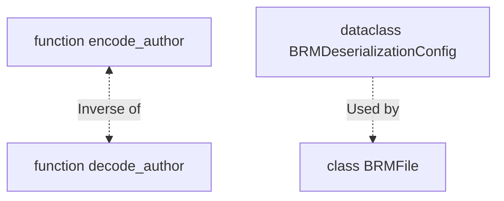

# `brickedit`: BRM (Brick Rigs MetaData)

## Having trouble understanding this?

Having trouble understanding this?

Are you a beginner in computer science or unfamiliar with Python? This short section will give some information to go back to if you need help reading:
- "Deserialization" refers to the process of converting something expressed in a specific format (binary) back into a data structure that a program can use.
- "Serialization" is the opposite of deserialization. It is the process of converting a data structure into a specific format (binary) for storage or transmission.

## Structure as a graph

-----

This contains everything to handle metadata files for BrickRigs:

- `BRMFile`: Class representing a BRM file, with methods to read from and write to BRM files.
- `BRMDeserializationConfig`: Configuration dataclass to pick the data to be deserialized from BRM files.
- `encode_author` and `decode_author`: Functions to encode and decode author names in the specific format used by BRM files.

## Setup for MetaData files: `BRMFile`

The `BRMFile` class contains all necessary methods to (de)serialize MetaData files used in Brick Rigs. It only contains a single attribute:

- `version` (`int`): The version of the Brick Rigs MetaData format to use when serializing a file. Must be one of the supported versions.

## Using `BRMFile` to (de)serialize MetaData files

### Serialization

Serialization is done using the `BRMFile.serialize` method. It takes the stored data as arguments:

- `file_name` (`Optional[str]`) = `None`: The display name of the vehicle.
- `description` (`str`) = `''`: The description of the vehicle.
- `brick_count` (`Optional[int]`) = `None`: The number of bricks in the vehicle.
- `size` (`_Vec3`) = `Vec3(0, 0, 0)`: The size of the vehicle in studs.
- `weight` (`float`) = `0.0`: The weight of the vehicle in kilograms.
- `price` (`float`) = `0.0`: The price of the vehicle in Brick Rigs currency.
- `author` (`int | None`) = `None`: The author name of the vehicle.
- `visibility` (`int`) = `VISIBILITY_PUBLIC`: The visibility level of the vehicle.
- `tags` (`Optional[list[str]]`) = `None`: A list of tags associated with the vehicle.
- `creation_time` (`int | None`) = `None`: The creation time of the vehicle as a .NET ticks timestamp.
- `last_update_time` (`int | None`) = `None`: The last update time of the vehicle as a .NET ticks timestamp.

It returns a bytearray object you may save. When writing the file, keep in mind Brick Rigs will only look for files named `MetaData.brm`.

### Deserialization

#### Configuration: `BRMDeserializationConfig`

Deserializing a BRMFile using brickedit will return a tuple containing selected data. You may select which data you wish to deserialize using the `BRMDeserializationConfig` dataclass. It contains the following attributes:

- `version`: The *detected* version of the BRM file.
- `name`: Whether to deserialize the name.
- `description`: Whether to deserialize the description.
- `brick_count`: Whether to deserialize the brick count.
- `size`: Whether to deserialize the size.
- `weight`: Whether to deserialize the weight.
- `price`: Whether to deserialize the price.
- `author`: Whether to deserialize the author.
- `creation_time`: Whether to deserialize the creation time.
- `last_update_time`: Whether to deserialize the last update time.
- `visibility`: Whether to deserialize the visibility.
- `tags`: Whether to deserialize the tags.

Note: We recommend you use keywords. This dataclass is subject to change.

#### Deserializing a BRM file

Deserialization is done using the `BRMFile.deserialize` method. It has 3 parameters:

- `data` (`bytes | bytearray`): The BRM file data to deserialize.
- `config` (`BRMDeserializationConfig`): Configuration to pick the data to be deserialized.
- `auto_version` (`bool`): Whether to automatically detect the version of the BRM file. If `True`, `self.version` will be updated.

The method returns a tuple of all requested data in the definition order of the attributes in `BRMDeserializationConfig`. If an attribute is set to `False`, it will not be included in the returned tuple. BrickEdit will not bother deserializing data that is not requested, which improves performance. It may also stop deserializing early if it has already retrieved all requested data.
