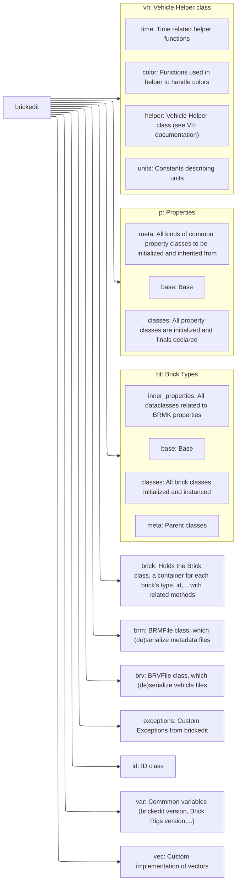

# Structure of brickedit

**If flowchards are not supported by your IDE, consider installing a plugin to add Mermaid support.**

## Base class

`base.py` files contains the essentials for the rest of the module if fair for all to be put in a single file. For example in the case of `p` (properties), is defined the main class all other classes inherit from, `InvalidVersion` (sentinel),  

## File structure 

