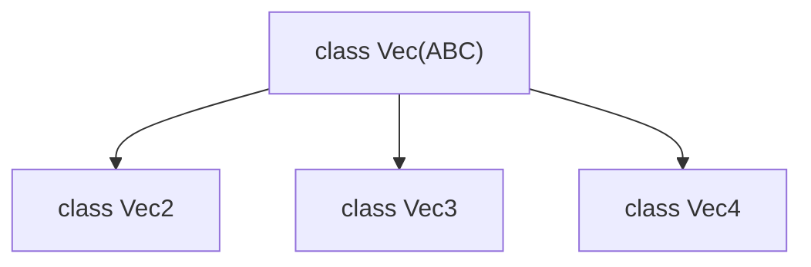

# `brickedit`: Vectors

## Structure as a graph

-----

This module contains vector-related classes used throughout brickedit.

## Base vector: `Vec(ABC)`

`Vec` is the abstract base class for all vector types in brickedit. It defines common methods and properties that all vector types must implement, such as addition, subtraction, scalar multiplication, and dot product.

It features generic implementations for most methods. These generic implementations are slower, and should be overriden with more efficient versions in subclasses whenever possible.

Subclasses must implement the following abstract methods:

- `@abstractmethod as_tuple(self) -> tuple[float, ...]`: Converts the vector to a tuple of floats.
- `@abstractmethod __len__(self) -> int`: Returns the number of dimensions in the vector.

For improved performance, subclasses should override the following methods:

- `magnitude(self) -> float`: Calculates the magnitude (length) of the vector.
- `normalize(self) -> Self`: Normalizes the vector to have a magnitude of 1.
- `__add__(self, other) -> Self`: Adds two vectors.
- `__sub__(self, other) -> Self`: Subtracts two vectors.
- `__mul__(self, other: float) -> Self`: Multiplies the vector by a scalar.
- `__repr__(self) -> str`: Returns a string representation of the vector.

Vectors also include the following method, whose generic implementation is already efficient and does not need to be overridden:

- `__rmul__(self, other: float) -> Self`: Right multiplication to support scalar * vector.

## Available vector types

BrickEdit implements 3 vectors: `Vec2`, `Vec3` and `Vec4`, representing 2D, 3D and 4D vectors respectively. Each of these classes inherit from the `Vec` base class and implement the required abstract methods as well as overriding the necessary methods for better performance. The attributes are named `x`, `y`, `z` and `w` respectively for each dimension.
