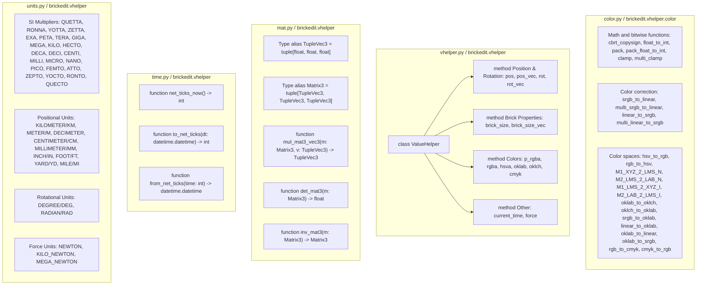

# `brickedit.vhelper`: Value Helper

## Structure as a graph



-----

The vhelper module provides unit conversion and value transformation utilities for working with Brick Rigs files. It handles conversions between user-friendly units (meters, feet, degrees, etc.) and Brick Rigs' internal format, plus color space transformations, time handling, and matrix operations. The main entry point is the `ValueHelper` class, which maintains file version context and default units for consistent conversions.

## Creating a value helper instance

A `ValueHelper` instance stores the file version and default units for conversion. You must specify the following parameters when creating an instance:

- `version`: The file version you are working with.
- `default_physical_unit`, optional: The default physical unit to use.
- `default_rotational_unit`, optional: The default rotational unit to use.
- `default_force_unit`, optional: The default force unit to use.

```py
from brickedit import *

vh = vhelper.ValueHelper(
    version=FILE_MAIN_VERSION,
    default_physical_unit=vhelper.METER
)
```

## Helpers available through a `ValueHelper` instance

These methods convert user-friendly input formats to the internal format that Brick Rigs uses in the specified version. All methods except `current_time` have a `unit` parameter to override the default unit.

### Position & Rotation

- **`pos(x: float, y: float, z: float, unit=None) -> tuple[float, float, float]`**:
Converts 3D position from the specified unit. Uses `default_physical_unit` if no unit override provided.

- **`pos_vec(v: Vec3, unit=None) -> tuple[float, float, float]`**:
Converts a `Vec3` position from the specified unit.

- **`rot(x: float, y: float, z: float, unit=None) -> tuple[float, float, float]`**:
Converts 3D rotation from the specified unit to degrees. Uses `default_rotational_unit` if no unit override provided.

- **`rot_vec(v: Vec3, unit=None) -> tuple[float, float, float]`**:
Converts a `Vec3` rotation from the specified unit.

### Brick Properties

- **`brick_size(x: float, y: float, z: float, unit=None) -> tuple[float, float, float]`**:
Converts brick dimensions from the specified unit.

- **`brick_size_vec(v: Vec3, unit=None) -> tuple[float, float, float]`**:
Converts a `Vec3` brick size from the specified unit.

### Colors

- **`p_rgba(color: int) -> tuple[float, float, float, float]`**:
Unpacks a packed RGBA color (format `0xrrggbbaa`).

- **`rgba(r: float, g: float, b: float, a: float) -> int`**:
Packs RGBA floats (0-1).

- **`hsva(h: float, s: float, v: float, a: float) -> int`**:
Converts HSVA (h: 0-360°, s/v: 0-1, a: 0-1).

- **`oklab(L: float, a: float, b: float) -> int`**:
Converts Oklab color.

- **`oklch(L: float, C: float, h: float) -> int`**:
Converts Oklch color (h: 0-360°).

- **`cmyk(c: float, m: float, y: float, k: float) -> int`**:
Converts CMYK (all 0-1).

### Other

- **`current_time() -> int`**:
Returns the current time in .NET DateTime ticks format for use in metadata files.

- **`force(value: float, unit=None) -> float`**:
Converts a force value from the specified unit. Uses `default_force_unit` if no unit override provided.

### Usage Examples

```py
from brickedit import *

vh = vhelper.ValueHelper(
    version=FILE_MAIN_VERSION,
    default_physical_unit=vhelper.METER,
    default_rotational_unit=vhelper.DEGREE
)

brv = BRVFile(FILE_MAIN_VERSION)
brv.add(Brick(ID("1")), bt.SCALABLE_BRICK
    pos=vh.pos(1, 2, 3),
    rot=vh.rot(0, 90, 45),
    ppatch={
        p.BRICK_COLOR: vh.p_rgba(0xff0000ff),
        p.BRICK_SIZE: vh.pos(10, 20, 30, unit=vhelper.INCH)
    }
)

brm = BRMFile(FILE_MAIN_VERSION)
brm.serialize(name="MetaData.brm", creation_time=vh.current_time())
```

## Helpers outside of the `ValueHelper` instance

Everything used by the `ValueHelper` instance and a few extras are made available outside of the class. Their outputs do not depend on version.

### Color related utils (`brickedit.vhelper.color`)

#### Math, bitwise and clamping functions

- **`cbrt_copysign(x: float) -> float`**:
Returns the cube root of `x`, preserving its sign.

- **`float_to_int(x: float) -> int`**:
Converts a float in the range [0.0, 1.0] to an integer in the range [0, 255].

- **`pack(*args) -> int`**:
Packs 8-bit arguments into an integer. For example, `pack(1, 2, 3)` returns `0x010203`.

- **`pack_float_to_int(*args) -> int`**:
Pack floats (converted to 8-bit integers) with float_to_int into a single integer. For example, `pack_float_to_int(0, 0.5, 1)` returns `0x007fff`

- **`clamp(value: float, min_value: float, max_value: float) -> float`**:
Clamps a float value between min_value and max_value.

- **`multi_clamp(*args, min_value: float, max_value: float) -> tuple[float, ...]`**:
Clamps multiple float values between min_value and max_value.

#### Color correction

- **`srgb_to_linear(x: float) -> float`**:
Converts an sRGB color value (0-1) to linear RGB (0-1).

- **`multi_srgb_to_linear(*args) -> tuple[float, ...]`**:
Converts multiple sRGB color values (0-1) to linear RGB (0-1).

- **`linear_to_srgb(x: float) -> float`**:
Converts a linear RGB color value (0-1) to sRGB (0-1).

- **`multi_linear_to_srgb(*args) -> tuple[float, ...]`**:
Converts multiple linear RGB color values (0-1) to sRGB (0-1).

#### Color spaces

- **`hsv_to_rgb(h: float, s: float, v: float) -> tuple[float, float, float]`**:
Converts a HSV color value (0-360, 0-1, 0-1) to a RGB color value (0-1).

- **`rgb_to_hsv(r: float, g: float, b: float) -> tuple[float, float, float]`**:
Converts a RGB color value (0-1) to a HSV color value (0-360, 0-1, 0-1).

- **`M1_XYZ_2_LMS_N`, `M2_LMS_2_LAB_N`, `M1_LMS_2_XYZ_I`, `M2_LAB_2_LMS_I`**:
Conversion matrices (as tuples of tuples) for oklab color space transformations.

- **`oklab_to_oklch(L: float, a: float, b: float) -> tuple[float, float, float]`**:
Converts a Oklab color value (L, a, b) to an Oklch color value (L, C, h).

- **`oklch_to_oklab(L: float, C: float, h: float) -> tuple[float, float, float]`**:
Converts a Oklch color value (L, C, h) to an Oklab color value (L, a, b).

- **`srgb_to_oklab(r: float, g: float, b: float) -> tuple[float, float, float]`**:
Converts a sRGB color value (0-1) to an Oklab color value (L, a, b).

- **`linear_to_oklab(r: float, g: float, b: float) -> tuple[float, float, float]`**:
Converts a linear RGB color value (0-1) to an Oklab color value (L, a, b).

- **`oklab_to_linear(L: float, a: float, b: float) -> tuple[float, float, float]`**:
Converts an Oklab color value (L, a, b) to a linear RGB color value (0-1 scale, unbound!).

- **`oklab_to_srgb(L: float, a: float, b: float) -> tuple[float, float, float]`**:
Converts an Oklab color value (L, a, b) to a sRGB color value (0-1).

- **`rgb_to_cmyk(r: float, g: float, b: float) -> tuple[float, float, float, float]`**:
Converts a RGB color value (0-1) to a CMYK color value (0-1).

- **`cmyk_to_rgb(c: float, m: float, y: float, k: float) -> tuple[float, float, float]`**:
Converts a CMYK color value (0-1) to a RGB color value (0-1).

### Time utils (`brickedit.vhelper`)

The .NET DateTime ticks format represents time as the number of 100-nanosecond intervals that have elapsed since 12:00 AM, January 1, 0001.

- **`net_ticks_now() -> int`**:
Provides the current time in the .NET DateTime ticks format.

- **`to_net_ticks(dt: datetime.datetime) -> int`**:
Converts a `datetime.datetime` object to the .NET DateTime ticks format.

- **`from_net_ticks(time: int) -> datetime.datetime`**:
Converts a .NET DateTime ticks value to a `datetime.datetime` object.

### Matrices (`brickedit.vhelper`)

The following types aliases are defined for matrix and vector representations:

```py
TupleVec3 = tuple[float, float, float]
Matrix3 = tuple[TupleVec3, TupleVec3, TupleVec3]
```

- **`mul_mat3_vec3(m: Matrix3, v: TupleVec3) -> TupleVec3`**:
Multiplies a 3x3 matrix by a 3D vector.

- **`det_mat3(m: Matrix3) -> float`**:
Calculates the determinant of a 3x3 matrix.

- **`inv_mat3(m: Matrix3) -> Matrix3`**:
Calculates the inverse of a 3x3 matrix.

### Units (`brickedit.vhelper`)

Units are provided as float constants for easy conversion between different measurement systems. Default units are centimeters for positional values, degrees for rotational values, and newtons for force values.

#### SI Multipliers

Standard SI prefixes for scaling:

- `QUETTA`: $10^{30}$
- `RONNA`: $10^{27}$
- `YOTTA`: $10^{24}$
- `ZETTA`: $10^{21}$
- `EXA`: $10^{18}$
- `PETA`: $10^{15}$
- `TERA`: $10^{12}$
- `GIGA`: $10^{9}$
- `MEGA`: $10^{6}$
- `KILO`: $10^{3}$
- `HECTO`: $10^{2}$
- `DECA`: $10^{1}$
- `DECI`: $10^{-1}$
- `CENTI`: $10^{-2}$
- `MILLI`: $10^{-3}$
- `MICRO`: $10^{-6}$
- `NANO`: $10^{-9}$
- `PICO`: $10^{-12}$
- `FEMTO`: $10^{-15}$
- `ATTO`: $10^{-18}$
- `ZEPTO`: $10^{-21}$
- `YOCTO`: $10^{-24}$
- `RONTO`: $10^{-27}$
- `QUECTO`: $10^{-30}$

#### Positional Units

Default unit is centimeters.

- `KILOMETER` / `KM`: 100,000 cm
- `METER` / `M`: 100 cm
- `DECIMETER`: 10 cm
- `CENTIMETER` / `CM`: 1 cm (default)
- `MILLIMETER` / `MM`: 0.1 cm
- `INCH` / `IN`: 2.54 cm
- `FOOT` / `FT`: 30.48 cm (12 inches)
- `YARD` / `YD`: 91.44 cm (3 feet)
- `MILE` / `MI`: 160,934.4 cm (1760 yards)

#### Rotational Units

Default unit is degrees.

- `DEGREE` / `DEG`: 1° (default)
- `RADIAN` / `RAD`: $\frac{180}{\pi}$ ≈ 57.2958°

#### Force Units

Default unit is newtons.

- `NEWTON`: 1 N (default)
- `KILO_NEWTON`: 1,000 N
- `MEGA_NEWTON`: 1,000,000 N

