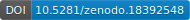

<!-- markdownlint-disable MD041 MD033 MD013 -->
<picture>
  <source media="(prefers-color-scheme: dark)" srcset="docs/assets/brkraw-logo-dark.svg">
  <source media="(prefers-color-scheme: light)" srcset="docs/assets/brkraw-logo-light.svg">
  
</picture>
<!-- markdownlint-enable MD041 MD033 MD013 -->

[](https://doi.org/10.5281/zenodo.3818614)

A modular toolkit for Bruker MRI raw-data handling.

BrkRaw (v0.5.6) converts raw data into standardized, neuroimaging-ready
datasets, with extensible rules/specs and plugin hooks.

- Documentation: [brkraw.github.io](https://brkraw.github.io/)
- Releases: [BrkRaw/brkraw releases](https://github.com/BrkRaw/brkraw/releases)
- PyPI: [brkraw on PyPI](https://pypi.org/project/brkraw/)

## Citation

If you use BrkRaw in your research, please cite it.

- Citation metadata: [CITATION.cff](./CITATION.cff)
- DOI (Zenodo): [10.5281/zenodo.3818614](https://doi.org/10.5281/zenodo.3818614)

### Cite as (BibTeX)

<!-- BEGIN: brkraw-bibtex -->
```biblatex
@software{brkraw,
  author = {Lee, Sung-Ho and Devenyi, Gabriel A. and Ban, Woomi and Shih, Yen-Yu Ian},
  title = {BrkRaw: A modular toolkit for Bruker MRI raw-data handling},
  version = {0.5.6},
  doi = {10.5281/zenodo.3818614},
  url = {https://github.com/BrkRaw/brkraw},
  note = {Documentation: https://brkraw.github.io},
  license = {GPL-3.0-only}
}
```
<!-- END: brkraw-bibtex -->