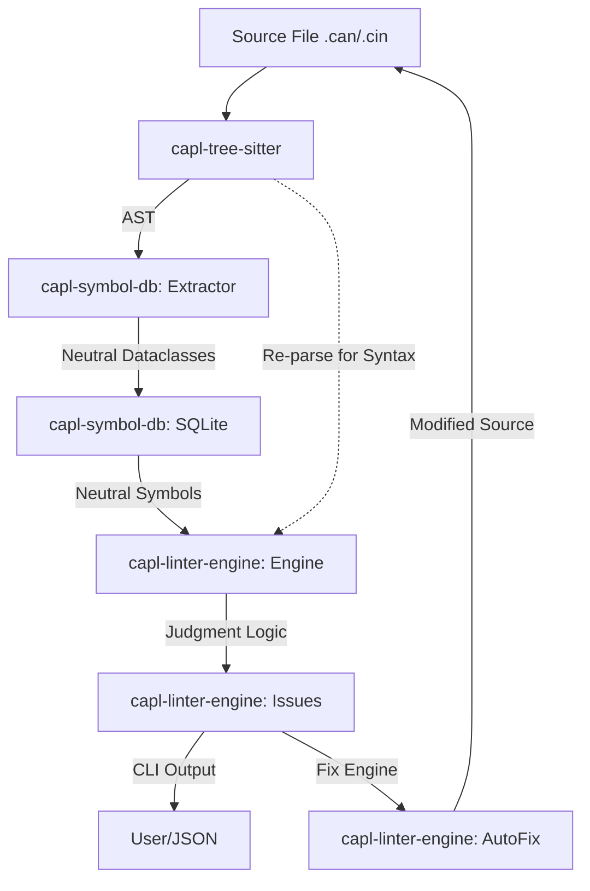

# CAPL Analyzer Architecture & Integration Map

This document defines the "Neutral Fact" architecture of the CAPL Analyzer. Use this as a reference to identify the "next step" and understand the impact of changes across the workspace.

## 1. System Overview & Data Flow

The system operates on a "Storage of Facts, Judgment by Linter" principle.

## 2. Package Responsibilities

### 📦 capl-tree-sitter (The "Eyes")
*   **Role**: Raw parsing and AST traversal.
*   **Source of Truth**: `tree-sitter-c` grammar + `CAPLPatterns` recognition.
*   **Constraint**: Stateless. Provides queries to find syntax patterns (like `extern` or `->`).

### 📦 capl-symbol-db (The "Memory")
*   **Role**: Persistent storage of **neutral metadata**.
*   **Neutral Facts Only**: It stores *what exists* (e.g., `has_body: false`, `param_count: 2`). It **never** stores judgments (e.g., no `is_forbidden` flags).
*   **Key Logic**: 
    *   `Extractor`: Populates the DB with raw symbol attributes.
    *   `XRef`: Maps usages vs. definitions for semantic analysis.

### 📦 capl-linter-engine (The "Brain")
*   **Role**: The "Judge" of the system.
*   **Two-Pronged Analysis**:
    1.  **Syntax Rules**: Re-parse the AST via `capl-tree-sitter` to find forbidden patterns (e.g., `extern`).
    2.  **Semantic Rules**: Query the `SymbolDatabase` for neutral facts that violate CAPL constraints (e.g., finding functions where `has_body: false`).
*   **Source of Truth**: The `RuleRegistry` (E###, W###, S###).

### 📦 capl-cli (The "Voice")
*   **Role**: Orchestration, `.capl-lint.toml` configuration, and Pydantic serialization.

### 📦 capl-formatter (The "Artisan")
*   **Role**: Structural transformation and style enforcement.
*   **Strategy**: Two-phase transformation (Structural + Indentation).
*   **Constraint**: Idempotent rules. Re-parses the source after each rule application to maintain AST accuracy.

---

## 3. The "Neutrality" Protocol
To scale without constant refactoring, we follow these data rules:
1.  **Extractor** MUST NOT validate. If it finds a prototype, it marks `has_body=false`.
2.  **Database** MUST NOT judge. It stores `has_body=false` without comment.
3.  **Linter** MUST judge. The `FunctionDeclarationRule` queries for `has_body=false` and issues an `ERROR`.

---

## 4. What Can Break (The "Fragile Zones")

1.  **Line Number Shifting**: 
    *   *The Risk*: `AutoFixEngine` modifies the file. If multiple fixes happen in one pass, line numbers in the DB become stale.
    *   *The Shield*: The CLI uses an iterative loop (`max_passes=10`). Fix one rule type, re-parse, re-analyze, repeat.
2.  **Database Staleness**: 
    *   *The Risk*: Rules checking the DB while the file on disk has changed but hasn't been re-extracted.
    *   *The Shield*: `LinterEngine.analyze_file(force=True)` must be called after every fix pass.
3.  **Grammar Limitations**:
    *   *The Risk*: CAPL keywords like `variables` or `on message` aren't in `tree-sitter-c`. 
    *   *The Shield*: `CAPLPatterns` uses sibling lookups. If the grammar/C-parser is updated, these lookups might fail.

---

## 5. Definition of Done (Finalization Roadmap)

To stop refactoring and finish the package, the following must be stable:

- [x] **Phase 5: AST-Based Formatter**: Implement `capl-formatter` with character-based atomic transformations.
- [ ] **Phase 6: Project Analysis**: Implement recursive `#include` visibility for semantic rules.
- [ ] **Phase 7: Precision Refinements**: Final stability pass for complex CAPL structures (multi-dim arrays, event handlers).
- [ ] **CLI Stability**: Support for `--format json` vs `--format text` using Pydantic.

---

## 6. Next Implementation Steps

1.  **Atomic DB Migration**: Add `param_count` and `has_body` to the `symbols` table.
2.  **Rule Migration**: Create `NoExternRule`, `PointerParameterRule`, and `ArrowOperatorRule` in the linter using re-parsing logic.
3.  **Cross-File Queries**: Implement `get_visible_symbols()` in the database to support semantic analysis across files.