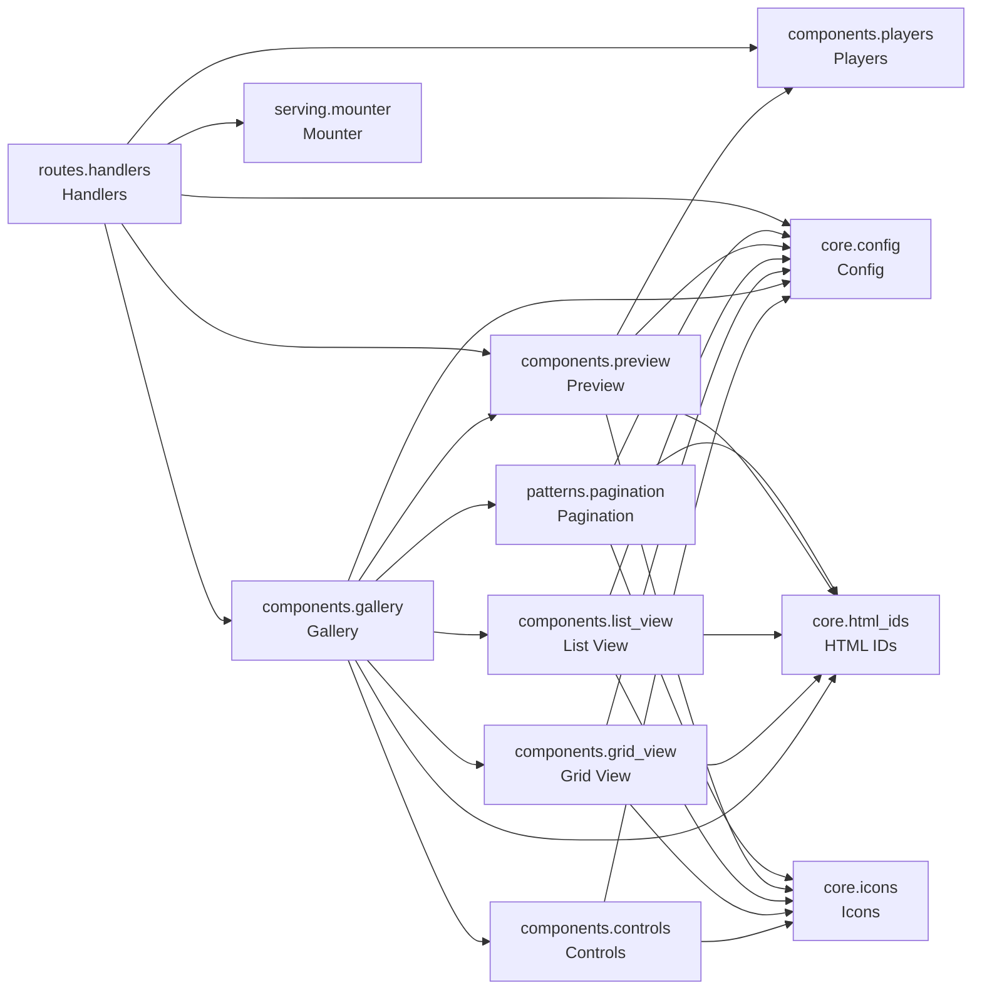

# cjm-fasthtml-media-gallery


<!-- WARNING: THIS FILE WAS AUTOGENERATED! DO NOT EDIT! -->

## Install

``` bash
pip install cjm_fasthtml_media_gallery
```

## Project Structure

    nbs/
    ├── components/ (6)
    │   ├── controls.ipynb   # Gallery control components for view toggle and type filtering.
    │   ├── gallery.ipynb    # Main gallery component that combines controls, views, and preview.
    │   ├── grid_view.ipynb  # Grid layout component for displaying media files as cards.
    │   ├── list_view.ipynb  # Table layout component for displaying media files as rows.
    │   ├── players.ipynb    # Media player components for video, audio, image, and document preview.
    │   └── preview.ipynb    # Preview modal component for viewing media files.
    ├── core/ (3)
    │   ├── config.ipynb    # Configuration dataclasses and enums for the media gallery.
    │   ├── html_ids.ipynb  # HTML ID constants for HTMX targeting in the media gallery.
    │   └── icons.ipynb     # Media type icon mappings and badge color definitions for the gallery.
    ├── patterns/ (1)
    │   └── pagination.ipynb  # Pagination utilities and components for the media gallery.
    ├── routes/ (1)
    │   └── handlers.ipynb  # Route handlers and router initialization for the media gallery.
    └── serving/ (1)
        └── mounter.ipynb  # Mounts directories as static files for serving through the web server.

Total: 12 notebooks across 5 directories

## Module Dependencies



*27 cross-module dependencies detected*

## CLI Reference

No CLI commands found in this project.

## Module Overview

Detailed documentation for each module in the project:

### Config (`config.ipynb`)

> Configuration dataclasses and enums for the media gallery.

#### Import

``` python
from cjm_fasthtml_media_gallery.core.config import (
    ViewMode,
    SelectionMode,
    CardSize,
    ListColumn,
    GridConfig,
    ListConfig,
    FilterConfig,
    PaginationConfig,
    PreviewConfig,
    GalleryCallbacks,
    GalleryConfig
)
```

#### Classes

``` python
class ViewMode(str, Enum):
    "Display modes for media gallery."
```

``` python
class SelectionMode(str, Enum):
    "File selection modes."
```

``` python
class CardSize(str, Enum):
    "Card size presets for grid view."
```

``` python
class ListColumn(str, Enum):
    "Available columns for list view."
```

``` python
@dataclass
class GridConfig:
    "Grid view display configuration."
    
    columns: int = 4  # Number of columns in grid
    card_size: CardSize = CardSize.MEDIUM  # Card size preset
    show_thumbnails: bool = True  # Show image/video thumbnails
    show_file_size: bool = True  # Show file size on cards
    show_file_type: bool = True  # Show file type badge
```

``` python
@dataclass
class ListConfig:
    "List view display configuration."
    
    columns: List[ListColumn] = field(...)
    show_icons: bool = True  # Show file type icons
    striped: bool = False  # Zebra striping for rows
    compact: bool = False  # Compact row height
```

``` python
@dataclass
class FilterConfig:
    "Filter configuration for media gallery."
    
    enabled_types: List[FileType] = field(...)
    allow_type_filter: bool = True  # Show type filter controls
    show_hidden: bool = False  # Show hidden files
    custom_filter: Optional[Callable[[FileInfo], bool]]  # Custom filter function
    
    def matches(
            self,
            file_info: FileInfo  # File to check against filter
        ) -> bool:  # True if file passes filter
        "Check if a file matches the filter criteria."
```

``` python
@dataclass
class PaginationConfig:
    "Pagination configuration."
    
    items_per_page: int = 24  # Items to show per page
    show_pagination: bool = True  # Show pagination controls
    show_page_size_selector: bool = False  # Allow changing page size
    page_size_options: List[int] = field(...)
```

``` python
@dataclass
class PreviewConfig:
    "Preview modal configuration."
    
    enable_preview: bool = True  # Enable preview modal on click
    show_download_button: bool = True  # Show download button in preview
    show_info_panel: bool = True  # Show file info in preview
    show_navigation: bool = True  # Show prev/next navigation
    autoplay_video: bool = False  # Autoplay videos in preview
    autoplay_audio: bool = False  # Autoplay audio in preview
```

``` python
@dataclass
class GalleryCallbacks:
    "Event callbacks for gallery customization."
    
    on_select: Optional[Callable[[str], None]]  # Called when file selected
    on_selection_change: Optional[Callable[[List[str]], None]]  # Called when selection changes
    on_preview: Optional[Callable[[str], None]]  # Called when preview opens
    on_download: Optional[Callable[[str], None]]  # Called when download clicked
    validate_selection: Optional[Callable[[str], Tuple[bool, str]]]  # Validate before select
```

``` python
@dataclass
class GalleryConfig:
    "Main configuration for media gallery."
    
    default_view: ViewMode = ViewMode.GRID  # Default view mode
    allow_view_toggle: bool = True  # Allow user to toggle view mode
    grid: GridConfig = field(...)
    list: ListConfig = field(...)
    filter: FilterConfig = field(...)
    pagination: PaginationConfig = field(...)
    preview: PreviewConfig = field(...)
    selection_mode: SelectionMode = SelectionMode.NONE
    max_selections: Optional[int]  # For MULTIPLE mode
    gallery_id: str = 'media-gallery'
    content_id: str = 'media-gallery-content'
    controls_id: str = 'media-gallery-controls'
    preview_modal_id: str = 'media-preview-modal'
    keyboard_config: Optional[Any]
    
    def can_select(
            self,
            file_info: FileInfo  # File to check
        ) -> bool:  # True if file can be selected
        "Check if a file can be selected based on config."
```

### Controls (`controls.ipynb`)

> Gallery control components for view toggle and type filtering.

#### Import

``` python
from cjm_fasthtml_media_gallery.components.controls import (
    FILE_TYPE_LABELS,
    render_view_toggle,
    render_type_filter_button,
    render_type_filters,
    render_gallery_controls
)
```

#### Functions

``` python
def render_view_toggle(
    current_mode: ViewMode,           # Current view mode
    toggle_url: str,                  # URL for toggle handler
    hx_target: Optional[str] = None,  # HTMX target for swap
) -> Any:  # View toggle button group
    "Render view mode toggle buttons."
```

``` python
def render_type_filter_button(
    file_type: FileType,              # File type for this button
    is_active: bool,                  # Whether this type is currently shown
    filter_url: str,                  # URL for filter handler
    hx_target: Optional[str] = None,  # HTMX target for swap
    count: Optional[int] = None,      # Number of files of this type
) -> Button:  # Filter button
    "Render a single type filter button."
```

``` python
def render_type_filters(
    available_types: List[FileType],  # File types to show buttons for
    active_types: List[FileType],     # Currently active (shown) types
    filter_url: str,                  # URL for filter handler
    hx_target: Optional[str] = None,  # HTMX target for swap
    type_counts: Optional[dict[FileType, int]] = None,  # File counts per type
) -> Any:  # Type filter button group
    "Render type filter buttons."
```

``` python
def render_gallery_controls(
    config: GalleryConfig,            # Gallery configuration
    current_view: ViewMode,           # Current view mode
    active_types: List[FileType],     # Currently active type filters
    toggle_view_url: str,             # URL for view toggle
    filter_url: str,                  # URL for type filter
    hx_target: Optional[str] = None,  # HTMX target
    type_counts: Optional[dict[FileType, int]] = None,  # File counts per type
    controls_id: Optional[str] = None,  # HTML ID for controls container
) -> Any:  # Controls bar component
    "Render the gallery controls bar."
```

#### Variables

``` python
FILE_TYPE_LABELS: dict[FileType, str]
```

### Gallery (`gallery.ipynb`)

> Main gallery component that combines controls, views, and preview.

#### Import

``` python
from cjm_fasthtml_media_gallery.components.gallery import (
    render_gallery_content,
    render_media_gallery
)
```

#### Functions

``` python
def render_gallery_content(
    files: List[FileInfo],            # Files to display
    config: GalleryConfig,            # Gallery configuration
    view_mode: ViewMode,              # Current view mode
    get_file_url: Optional[Callable[[str], str]] = None,  # Function to get file URL
    selected_paths: Optional[List[str]] = None,  # Currently selected paths
    preview_url: Optional[str] = None,  # URL for preview action
    select_url: Optional[str] = None,   # URL for selection action
    hx_target: Optional[str] = None,    # HTMX target for swaps
    start_index: int = 0,               # Starting index (for pagination)
) -> Any:  # Content component
    "Render the gallery content (grid or list view)."
```

``` python
def render_media_gallery(
    files: List[FileInfo],            # Files to display
    config: GalleryConfig,            # Gallery configuration
    view_mode: Optional[ViewMode] = None,  # Current view mode (defaults to config)
    active_types: Optional[List[FileType]] = None,  # Active type filters
    get_file_url: Optional[Callable[[str], str]] = None,  # Function to get file URL
    selected_paths: Optional[List[str]] = None,  # Currently selected paths
    # Route URLs
    toggle_view_url: Optional[str] = None,  # URL for view toggle
    filter_url: Optional[str] = None,       # URL for type filter
    preview_url: Optional[str] = None,      # URL for preview action
    select_url: Optional[str] = None,       # URL for selection action
    page_url: Optional[str] = None,         # URL for pagination
    # Pagination
    current_page: int = 1,                  # Current page number
    total_items: Optional[int] = None,      # Total items (for pagination)
    type_counts: Optional[dict[FileType, int]] = None,  # File counts per type
) -> Any:  # Complete gallery component
    "Render the complete media gallery."
```

### Grid View (`grid_view.ipynb`)

> Grid layout component for displaying media files as cards.

#### Import

``` python
from cjm_fasthtml_media_gallery.components.grid_view import (
    CARD_SIZE_CLASSES,
    render_media_card,
    render_grid_view,
    render_grid_empty_state
)
```

#### Functions

``` python
def render_media_card(
    file_info: FileInfo,              # File to render
    config: GalleryConfig,            # Gallery configuration
    index: int,                       # Index in the grid
    file_url: Optional[str] = None,   # URL for thumbnail/preview
    is_selected: bool = False,        # Whether file is selected
    preview_url: Optional[str] = None,  # URL for preview action
    select_url: Optional[str] = None,   # URL for selection action
    hx_target: Optional[str] = None,    # HTMX target for swaps
) -> Any:  # Card component
    "Render a media file as a grid card."
```

``` python
def _render_thumbnail_area(
    file_info: FileInfo,              # File info
    config: GalleryConfig,            # Gallery config
    file_url: Optional[str],          # URL for image thumbnail
    size_config: dict,                # Size configuration
) -> Any:  # Thumbnail area component
    "Render the thumbnail/icon area of a card."
```

``` python
def _render_info_area(
    file_info: FileInfo,              # File info
    config: GalleryConfig,            # Gallery config
) -> Any:  # Info area component
    "Render the file info area of a card."
```

``` python
def _render_selection_indicator(
    is_selected: bool,                # Current selection state
    select_url: Optional[str],        # URL for selection action
    file_path: str,                   # File path for HTMX
    hx_target: Optional[str],         # HTMX target
) -> Any:  # Selection indicator component
    "Render the selection indicator checkbox."
```

``` python
def _render_type_badge(
    file_info: FileInfo,              # File info
) -> Any:  # Type badge component
    "Render the file type badge."
```

``` python
def render_grid_view(
    files: List[FileInfo],            # Files to display
    config: GalleryConfig,            # Gallery configuration
    get_file_url: Optional[callable] = None,  # Function to get file URL
    selected_paths: Optional[List[str]] = None,  # Currently selected paths
    preview_url: Optional[str] = None,  # URL for preview action
    select_url: Optional[str] = None,   # URL for selection action
    hx_target: Optional[str] = None,    # HTMX target for swaps
    start_index: int = 0,               # Starting index for IDs (for pagination)
) -> Any:  # Grid view component
    "Render a grid view of media files."
```

``` python
def render_grid_empty_state(
    message: str = "No media files found",  # Message to display
) -> Any:  # Empty state component
    "Render empty state for grid view."
```

#### Variables

``` python
CARD_SIZE_CLASSES: dict[CardSize, dict[str, str]]
```

### Handlers (`handlers.ipynb`)

> Route handlers and router initialization for the media gallery.

#### Import

``` python
from cjm_fasthtml_media_gallery.routes.handlers import (
    GalleryState,
    init_router
)
```

#### Functions

``` python
def _handle_toggle_view(
    state_getter: Callable[[], GalleryState],  # Function to get current state
    state_setter: Callable[[GalleryState], None],  # Function to save state
    view_mode: str,                           # New view mode
    render_fn: Callable[[GalleryState], Any], # Function to render gallery
) -> Any:  # Rendered gallery component
    "Handle view mode toggle."
```

``` python
def _handle_filter_type(
    config: GalleryConfig,                    # Gallery configuration
    state_getter: Callable[[], GalleryState], # Function to get current state
    state_setter: Callable[[GalleryState], None],  # Function to save state
    file_type: str,                           # File type to toggle
    toggle: str,                              # "true" to toggle, else set exclusively
    render_fn: Callable[[GalleryState], Any], # Function to render gallery
) -> Any:  # Rendered gallery component
    "Handle type filter change."
```

``` python
def _handle_select(
    config: GalleryConfig,                    # Gallery configuration
    state_getter: Callable[[], GalleryState], # Function to get current state
    state_setter: Callable[[GalleryState], None],  # Function to save state
    callbacks: Optional[GalleryCallbacks],    # Optional callbacks
    path: str,                                # File path to select/deselect
    render_fn: Callable[[GalleryState], Any], # Function to render gallery
) -> Any:  # Rendered gallery component
    "Handle file selection."
```

``` python
def _handle_page(
    state_getter: Callable[[], GalleryState], # Function to get current state
    state_setter: Callable[[GalleryState], None],  # Function to save state
    page: int,                                # New page number
    render_fn: Callable[[GalleryState], Any], # Function to render gallery
) -> Any:  # Rendered gallery component
    "Handle page change."
```

``` python
def _handle_preview(
    files_getter: Callable[[], List[FileInfo]],  # Function to get files
    state_getter: Callable[[], GalleryState],  # Function to get current state
    config: GalleryConfig,  # Gallery configuration
    mounter: DirectoryMounter,  # File URL mounter
    callbacks: Optional[GalleryCallbacks],  # Optional callbacks
    path: str,  # File path to preview
    prev_url: str,  # URL for previous handler
    next_url: str,  # URL for next handler
) -> Any:  # Preview content
    "Handle preview request."
```

``` python
def _handle_preview_nav(
    files_getter: Callable[[], List[FileInfo]], # Function to get files
    state_getter: Callable[[], GalleryState],   # Function to get current state
    config: GalleryConfig,                    # Gallery configuration
    mounter: DirectoryMounter,                # File URL mounter
    callbacks: Optional[GalleryCallbacks],    # Optional callbacks
    current_path: str,                        # Current file path
    direction: int,                           # -1 for prev, +1 for next
    prev_url: str,                            # URL for previous handler
    next_url: str,                            # URL for next handler
) -> Any:  # Preview content
    "Handle preview navigation."
```

``` python
def init_router(
    config: GalleryConfig,                              # Gallery configuration
    files_getter: Callable[[], List[FileInfo]],         # Function to get files
    mounter: DirectoryMounter,                          # File URL mounter
    state_getter: Callable[[], GalleryState],           # Function to get current state
    state_setter: Callable[[GalleryState], None],       # Function to save state
    route_prefix: str = "/gallery",                     # Route prefix for all gallery routes
    callbacks: Optional[GalleryCallbacks] = None,       # Optional callbacks
) -> APIRouter:  # Configured APIRouter with all gallery routes
    "Initialize and return an APIRouter with all gallery routes."
```

#### Classes

``` python
@dataclass
class GalleryState:
    "State for the media gallery."
    
    view_mode: ViewMode = ViewMode.GRID  # Current view mode
    current_page: int = 1  # Current page
    active_types: List[FileType] = field(...)  # Active type filters
    selected_paths: List[str] = field(...)  # Selected file paths
    preview_path: Optional[str]  # Currently previewed file
    
    def to_dict(self) -> dict:  # Serializable dictionary
            """Convert to serializable dictionary."""
            return {
                "view_mode": self.view_mode.value,
        "Convert to serializable dictionary."
    
    def from_dict(
            cls,
            data: dict  # Dictionary data
        ) -> "GalleryState":  # GalleryState instance
        "Create from dictionary."
```

### HTML IDs (`html_ids.ipynb`)

> HTML ID constants for HTMX targeting in the media gallery.

#### Import

``` python
from cjm_fasthtml_media_gallery.core.html_ids import (
    GalleryHtmlIds
)
```

#### Classes

``` python
class GalleryHtmlIds:
    "Default HTML IDs for media gallery components."
    
    def grid_item_id(
            cls,
            index: int  # Item index in the grid
        ) -> str:  # HTML ID for the grid item
        "Generate grid item ID for a specific index."
    
    def list_item_id(
            cls,
            index: int  # Item index in the list
        ) -> str:  # HTML ID for the list row
        "Generate list item ID for a specific index."
    
    def as_selector(
            cls,
            html_id: str  # HTML ID
        ) -> str:  # CSS selector for the ID
        "Convert HTML ID to CSS selector."
```

### Icons (`icons.ipynb`)

> Media type icon mappings and badge color definitions for the gallery.

#### Import

``` python
from cjm_fasthtml_media_gallery.core.icons import (
    MEDIA_TYPE_ICONS,
    GALLERY_ICONS,
    MEDIA_TYPE_BADGE_COLORS,
    MEDIA_TYPE_TEXT_COLORS,
    get_media_type_icon,
    get_gallery_icon
)
```

#### Functions

``` python
def get_media_type_icon(
    file_type: FileType,  # File type to get icon for
    size: int = 4,        # Icon size (Tailwind scale)
    with_color: bool = True  # Apply semantic color
) -> Any:  # Lucide icon component
    "Get the appropriate icon for a file type."
```

``` python
def get_gallery_icon(
    icon_key: str,        # Key from GALLERY_ICONS
    size: int = 4,        # Icon size (Tailwind scale)
    cls: str = ""         # Additional CSS classes
) -> Any:  # Lucide icon component
    "Get a gallery UI icon by key."
```

#### Variables

``` python
MEDIA_TYPE_ICONS: Dict[FileType, str]
GALLERY_ICONS: Dict[str, str]
MEDIA_TYPE_BADGE_COLORS: Dict[FileType, str]
MEDIA_TYPE_TEXT_COLORS: Dict[FileType, str]
```

### List View (`list_view.ipynb`)

> Table layout component for displaying media files as rows.

#### Import

``` python
from cjm_fasthtml_media_gallery.components.list_view import (
    COLUMN_LABELS,
    render_list_header,
    render_list_row,
    render_list_view,
    render_list_empty_state
)
```

#### Functions

``` python
def render_list_header(
    config: GalleryConfig,            # Gallery configuration
    show_selection: bool = False,     # Show selection checkbox column
) -> Thead:  # Table header
    "Render the table header row."
```

``` python
def render_list_row(
    file_info: FileInfo,              # File to render
    config: GalleryConfig,            # Gallery configuration
    index: int,                       # Index in the list
    is_selected: bool = False,        # Whether file is selected
    preview_url: Optional[str] = None,  # URL for preview action
    select_url: Optional[str] = None,   # URL for selection action
    hx_target: Optional[str] = None,    # HTMX target for swaps
) -> Tr:  # Table row
    "Render a media file as a table row."
```

``` python
def _render_cell(
    file_info: FileInfo,              # File info
    column: ListColumn,               # Column to render
    config: GalleryConfig,            # Gallery config
) -> Td:  # Table cell
    "Render a single table cell."
```

``` python
def render_list_view(
    files: List[FileInfo],            # Files to display
    config: GalleryConfig,            # Gallery configuration
    selected_paths: Optional[List[str]] = None,  # Currently selected paths
    preview_url: Optional[str] = None,  # URL for preview action
    select_url: Optional[str] = None,   # URL for selection action
    hx_target: Optional[str] = None,    # HTMX target for swaps
    start_index: int = 0,               # Starting index for IDs (for pagination)
) -> Any:  # List view component
    "Render a list view of media files."
```

``` python
def render_list_empty_state(
    message: str = "No media files found",  # Message to display
) -> Any:  # Empty state component
    "Render empty state for list view."
```

#### Variables

``` python
COLUMN_LABELS: dict[ListColumn, str]
```

### Mounter (`mounter.ipynb`)

> Mounts directories as static files for serving through the web server.

#### Import

``` python
from cjm_fasthtml_media_gallery.serving.mounter import (
    DirectoryMounter
)
```

#### Functions

``` python
@patch
def mount(
    self: DirectoryMounter,
    app,  # FastHTML/Starlette application instance
    directories: List[str]  # List of directory paths to mount
) -> None
    "Mount directories to app for static file serving."
```

``` python
@patch
def get_url(
    self: DirectoryMounter,
    file_path: str  # Full path to the file
) -> Optional[str]:  # URL to access the file, or None if not in a mounted directory
    "Get URL for a file based on mounted directories."
```

``` python
@patch
def is_mounted(
    self: DirectoryMounter,
    directory: str  # Directory path to check
) -> bool:  # True if the directory is mounted
    "Check if a directory is currently mounted."
```

``` python
@patch
def get_mounted_directories(
    self: DirectoryMounter
) -> List[str]:  # List of mounted directory paths
    "Get list of currently mounted directories."
```

``` python
@patch
def unmount_all(
    self: DirectoryMounter
) -> None
    "Remove all mounts from this instance."
```

``` python
@patch
def _mount_directory(
    self: DirectoryMounter, 
    app,  # FastHTML/Starlette application instance
    directory: str  # Directory path to mount
) -> None
    "Mount a single directory."
```

``` python
@patch
def _generate_prefix(
    self: DirectoryMounter, 
    directory: str  # Directory path
) -> str:  # Route prefix string (e.g., "mg_static_abc12345")
    "Generate a unique route prefix for a directory using MD5 hash."
```

``` python
@patch
def _remove_existing_mounts(
    self: DirectoryMounter, 
    app  # FastHTML/Starlette application instance
) -> None
    "Remove existing mounts matching this mounter's prefix pattern."
```

``` python
@patch
def create_url_getter(
    self: DirectoryMounter
) -> callable:  # Function that converts path to URL
    "Create a URL getter function for use with gallery components."
```

#### Classes

``` python
class DirectoryMounter:
    def __init__(self):
        """Initialize the mounter with empty state."""
        self._mounted: Dict[str, str] = {}  # directory -> route_prefix
    "Mounts directories for static file serving with instance-level state."
    
    def __init__(self):
            """Initialize the mounter with empty state."""
            self._mounted: Dict[str, str] = {}  # directory -> route_prefix
        "Initialize the mounter with empty state."
```

### Pagination (`pagination.ipynb`)

> Pagination utilities and components for the media gallery.

#### Import

``` python
from cjm_fasthtml_media_gallery.patterns.pagination import (
    PaginationInfo,
    render_pagination,
    render_pagination_info
)
```

#### Functions

``` python
def render_pagination(
    info: PaginationInfo,             # Pagination info
    page_url: str,                    # URL for page change handler
    hx_target: Optional[str] = None,  # HTMX target for swap
    max_visible: int = 5,             # Maximum visible page buttons
) -> Any:  # Pagination component
    "Render pagination controls."
```

``` python
def _page_button(
    content: Any,                     # Button content
    page: int,                        # Page number
    page_url: str,                    # URL for page handler
    disabled: bool = False,           # Disable button
    is_current: bool = False,         # Is this the current page
    hx_target: Optional[str] = None,  # HTMX target
    title: Optional[str] = None,      # Button title
) -> Button:  # Page button
    "Render a single page button."
```

``` python
def render_pagination_info(
    info: PaginationInfo,  # Pagination info
) -> Any:  # Info text component
    "Render pagination info text."
```

#### Classes

``` python
@dataclass
class PaginationInfo:
    "Computed pagination information."
    
    total_items: int  # Total number of items
    items_per_page: int  # Items per page
    current_page: int  # Current page (1-indexed)
    
    def total_pages(self) -> int:  # Total number of pages
            """Calculate total pages."""
            if self.total_items == 0
        "Calculate total pages."
    
    def has_prev(self) -> bool:  # True if there's a previous page
            """Check if previous page exists."""
            return self.current_page > 1
        
        @property
        def has_next(self) -> bool:  # True if there's a next page
        "Check if previous page exists."
    
    def has_next(self) -> bool:  # True if there's a next page
            """Check if next page exists."""
            return self.current_page < self.total_pages
        
        @property
        def start_index(self) -> int:  # 0-based start index for current page
        "Check if next page exists."
    
    def start_index(self) -> int:  # 0-based start index for current page
            """Get start index for current page."""
            return (self.current_page - 1) * self.items_per_page
        
        @property
        def end_index(self) -> int:  # 0-based end index (exclusive)
        "Get start index for current page."
    
    def end_index(self) -> int:  # 0-based end index (exclusive)
            """Get end index for current page."""
            return min(self.start_index + self.items_per_page, self.total_items)
        
        @property
        def items_on_page(self) -> int:  # Number of items on current page
        "Get end index for current page."
    
    def items_on_page(self) -> int:  # Number of items on current page
            """Get number of items on current page."""
            return self.end_index - self.start_index
        
        def get_visible_pages(
            self,
            max_visible: int = 5  # Maximum visible page buttons
        ) -> List[int]:  # List of page numbers to show
        "Get number of items on current page."
    
    def get_visible_pages(
            self,
            max_visible: int = 5  # Maximum visible page buttons
        ) -> List[int]:  # List of page numbers to show
        "Get list of page numbers to display."
```

### Players (`players.ipynb`)

> Media player components for video, audio, image, and document preview.

#### Import

``` python
from cjm_fasthtml_media_gallery.components.players import (
    TEXT_PREVIEWABLE_EXTENSIONS,
    is_text_previewable,
    read_text_content,
    render_video_player,
    render_audio_player,
    render_image_viewer,
    render_text_viewer,
    render_document_preview,
    render_media_player
)
```

#### Functions

``` python
def is_text_previewable(
    file_info: FileInfo,  # File to check
) -> bool:  # True if file can be previewed as text
    "Check if a file can be previewed as text content."
```

``` python
def read_text_content(
    file_path: str,  # Path to the file
    max_size: int = 10 * 1024 * 1024,  # Maximum file size in bytes (default 10MB)
) -> Tuple[Optional[str], Optional[str]]:  # (content, error_message)
    "Read text file content with encoding fallback."
```

``` python
def render_video_player(
    file_url: str,                    # URL to the video file
    file_info: Optional[FileInfo] = None,  # File metadata for MIME type
    autoplay: bool = False,           # Autoplay video on load
    loop: bool = False,               # Loop video playback
    muted: bool = False,              # Start muted
    poster: Optional[str] = None,     # Poster image URL
    cls: str = "",                    # Additional CSS classes
) -> Any:  # Video element
    "Render an HTML5 video player."
```

``` python
def render_audio_player(
    file_url: str,                    # URL to the audio file
    file_info: Optional[FileInfo] = None,  # File metadata for MIME type
    autoplay: bool = False,           # Autoplay audio on load
    loop: bool = False,               # Loop audio playback
    cls: str = "",                    # Additional CSS classes
) -> Any:  # Audio element container
    "Render an HTML5 audio player."
```

``` python
def render_image_viewer(
    file_url: str,                    # URL to the image file
    file_info: Optional[FileInfo] = None,  # File metadata for alt text
    alt: Optional[str] = None,        # Alt text (uses filename if not provided)
    cls: str = "",                    # Additional CSS classes
) -> Any:  # Image element
    "Render an image viewer."
```

``` python
def render_text_viewer(
    "Render a scrollable text viewer."
```

``` python
def render_document_preview(
    file_url: str,                    # URL to the document file
    file_info: Optional[FileInfo] = None,  # File metadata
    cls: str = "",                    # Additional CSS classes
) -> Any:  # Document preview element
    "Render a document preview."
```

``` python
def render_media_player(
    file_url: str,  # URL to the media file
    file_info: FileInfo,  # File metadata
    autoplay: bool = False,  # Autoplay audio/video
    text_content: Optional[str] = None,  # Pre-read text content for text files
    text_error: Optional[str] = None,  # Error message if text reading failed
    cls: str = "",  # Additional CSS classes
) -> Any:  # Media player component
    "Render the appropriate media player based on file type."
```

#### Variables

``` python
TEXT_PREVIEWABLE_EXTENSIONS: Set[str]
```

### Preview (`preview.ipynb`)

> Preview modal component for viewing media files.

#### Import

``` python
from cjm_fasthtml_media_gallery.components.preview import (
    render_preview_content,
    render_preview_modal
)
```

#### Functions

``` python
def _render_preview_header(
    file_info: FileInfo,              # File being previewed
    config: PreviewConfig,            # Preview configuration
) -> Any:  # Header component
    "Render the preview modal header."
```

``` python
def _render_info_panel(
    file_info: FileInfo,              # File being previewed
) -> Any:  # Info panel component
    "Render the file info panel."
```

``` python
def _render_preview_footer(
    file_info: FileInfo,              # File being previewed
    file_url: str,                    # URL to the file
    config: PreviewConfig,            # Preview configuration
    modal_id: str,                    # Modal ID for HTMX targeting
    prev_url: Optional[str] = None,   # URL for previous file
    next_url: Optional[str] = None,   # URL for next file
    has_prev: bool = False,           # Whether there's a previous file
    has_next: bool = False,           # Whether there's a next file
) -> Any:  # Footer component
    "Render the preview modal footer."
```

``` python
def render_preview_content(
    file_info: FileInfo,  # File to preview
    file_url: str,  # URL to the file
    config: GalleryConfig,  # Gallery configuration
    prev_url: Optional[str] = None,  # URL for previous file handler
    next_url: Optional[str] = None,  # URL for next file handler
    has_prev: bool = False,  # Whether there's a previous file
    has_next: bool = False,  # Whether there's a next file
    modal_id: Optional[str] = None,  # Modal ID to show (for auto-show script)
    text_content: Optional[str] = None,  # Pre-read text content for text files
    text_error: Optional[str] = None,  # Error message if text reading failed
) -> Any:  # Preview modal content with auto-show script
    "Render the preview modal content with script to show the modal."
```

``` python
def render_preview_modal(
    modal_id: str = GalleryHtmlIds.PREVIEW_MODAL,  # Modal ID
) -> Dialog:  # Preview modal container
    "Render the preview modal container (empty, content loaded via HTMX)."
```
