# Comp Manager - Architecture Documentation

This document provides a comprehensive overview of the Comp Manager architecture, including system design, component interactions, data flows, and design decisions.

## Table of Contents

- [System Overview](#system-overview)
- [High-Level Architecture](#high-level-architecture)
- [Component Architecture](#component-architecture)
- [Data Flow](#data-flow)
- [Database Schema](#database-schema)
- [API Architecture](#api-architecture)
- [Caching System](#caching-system)
- [Computation Lifecycle](#computation-lifecycle)
- [Serialization Architecture](#serialization-architecture)
- [Security Considerations](#security-considerations)
- [Performance Considerations](#performance-considerations)
- [Design Decisions](#design-decisions)

---

## System Overview

Comp Manager is a Flask-based REST API framework designed to manage and track long-running mathematical computations with MongoDB as the persistence layer. The system provides three core capabilities:

1. **Computation Management**: Track computation lifecycle and state
2. **Result Caching**: Cache expensive computation results in MongoDB
3. **Complex Serialization**: Serialize Python and SageMath objects to JSON

### Key Characteristics

- **Document-Oriented**: Built on MongoDB's flexible document model
- **Decorator-Based**: Simple Python decorators for caching and tracking
- **Type-Safe**: Comprehensive type hints throughout
- **Mathematical Focus**: First-class support for SageMath mathematical objects
- **RESTful**: OpenAPI/Swagger-compatible REST API

---

## High-Level Architecture

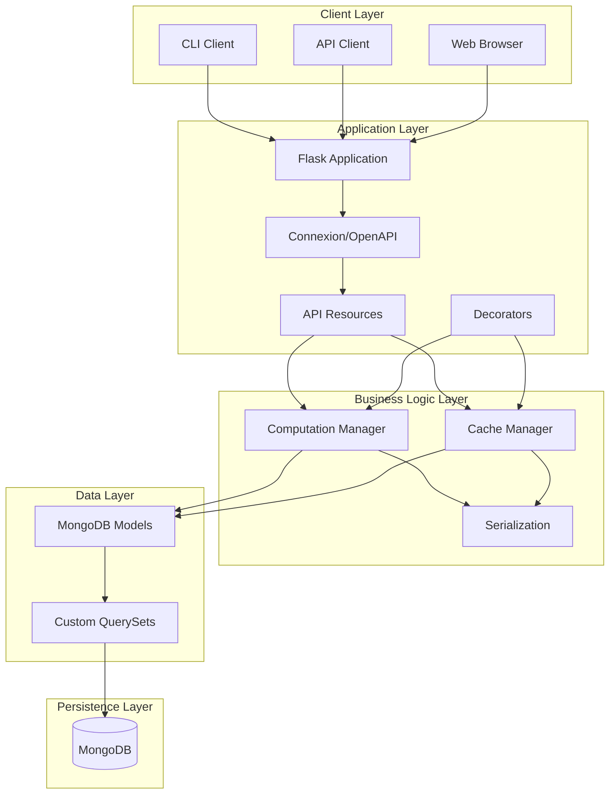

### Layers Description

1. **Client Layer**: Multiple client interfaces (CLI, API clients, web browsers)
2. **Application Layer**: Flask + Connexion for HTTP handling and routing
3. **Business Logic Layer**: Core computation and caching logic
4. **Data Layer**: MongoDB ODM with MongoEngine
5. **Persistence Layer**: MongoDB database

---

## Component Architecture

### Directory Structure and Responsibilities

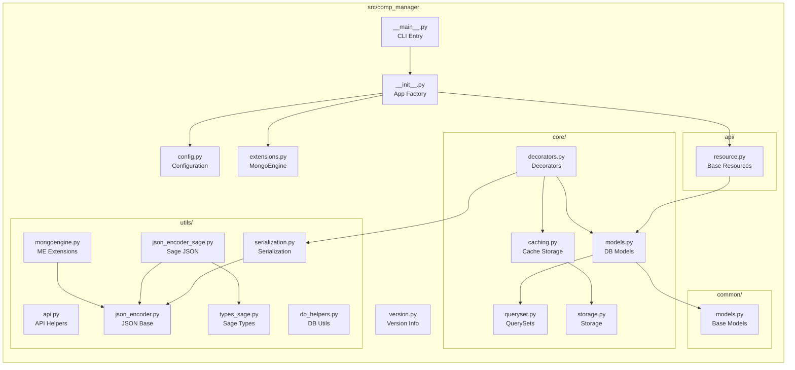

### Component Responsibilities

| Component | Responsibility | Key Classes/Functions |
|-----------|---------------|----------------------|
| **__main__.py** | CLI entry point | `main()` |
| **api/** | REST API endpoints | `MongoDBResource` |
| **core/models.py** | Database models | `DBObjectBase`, `DBObjectBaseAbstract`, `Computation`, `MongoCacheDB` |
| **core/decorators.py** | Caching & tracking | `@mongo_cache`, `@register_computation` |
| **core/caching.py** | Cache implementations | `ObjectCache`, `mongo_object_cache` |
| **common/models.py** | Shared base classes | `BaseDocument`, `HashableDocument` |
| **utils/mongoengine.py** | MongoEngine extensions | `JSONField`, `CMListField` |
| **utils/serialization.py** | Object serialization | `serialize()`, `deserialize()` |
| **utils/json_encoder.py** | Base JSON codec | `JSONEncoder`, `JSONDecoder` |
| **utils/json_encoder_sage.py** | Sage serialization | `SageJSONEncoder`, `SageJSONDecoder` |
| **version.py** | Version info | `__version__`, `version_tuple` |

---

## Data Flow

### Cached Function Call Flow

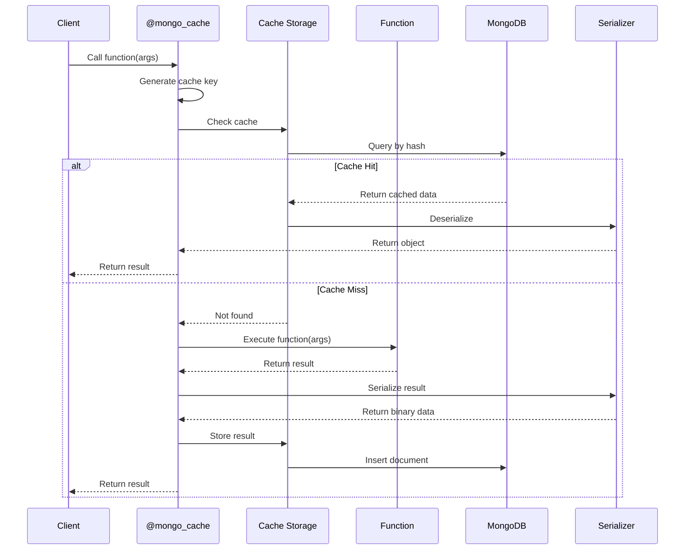

### Computation Tracking Flow

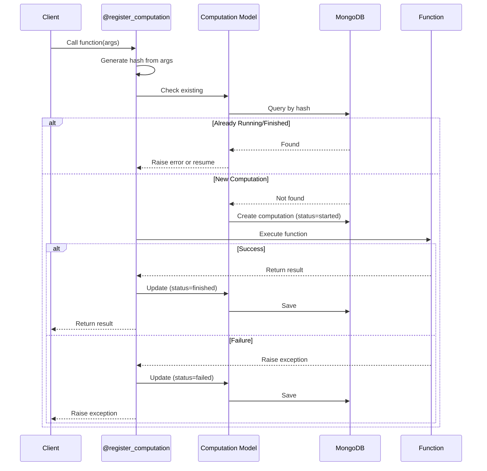

### API Request Flow

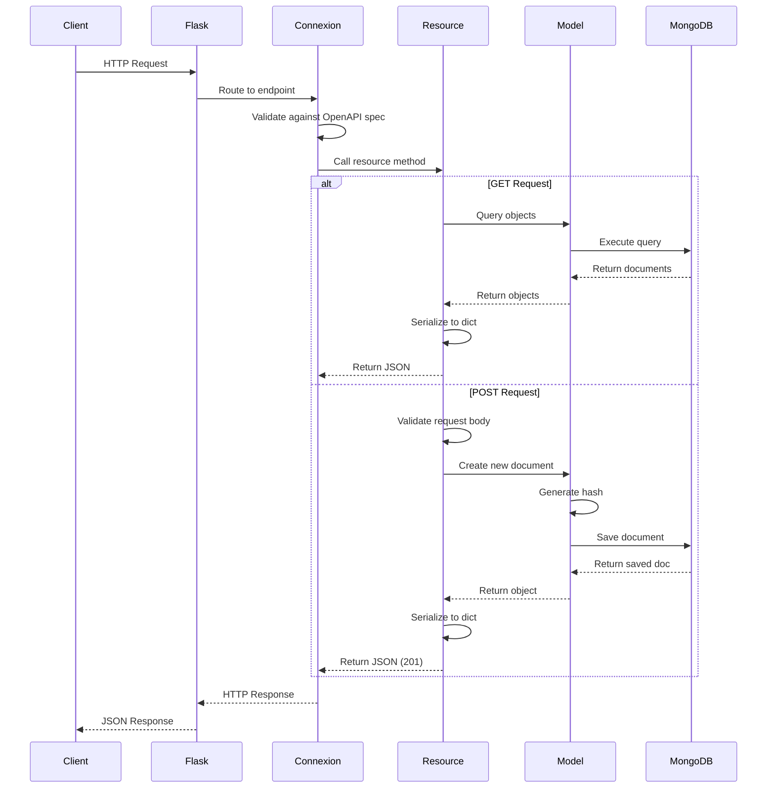

---

## Database Schema

### Collections Overview

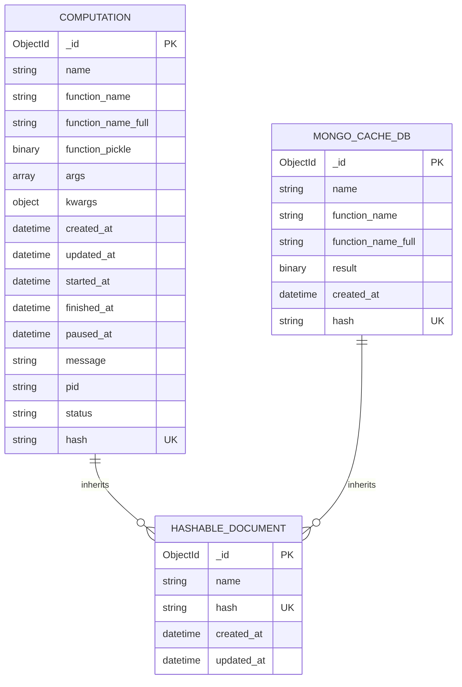

### Key Indexes

| Collection | Index Fields | Type | Purpose |
|------------|-------------|------|---------|
| `computation` | `hash` | Unique | Fast lookup by computation signature |
| `computation` | `status` | Non-unique | Query by status (started, finished, etc.) |
| `computation` | `function_name_full` | Non-unique | Query by function |
| `mongo_cache_d_b` | `hash` | Unique | Fast cache key lookup |
| `mongo_cache_d_b` | `created_at` | Non-unique | TTL index for expiration (future) |

### Hash Generation

The hash field is automatically generated for documents inheriting from `HashableDocument`:

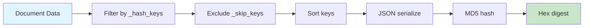

**Hash Key Strategy:**
- `Computation`: Uses `function_name_full`, `args`, `kwargs`
- `MongoCacheDB`: Uses `function_name_full`, `args`, `kwargs`
- Custom models: Configure via `_hash_keys` class variable

---

## API Architecture

### Resource Pattern

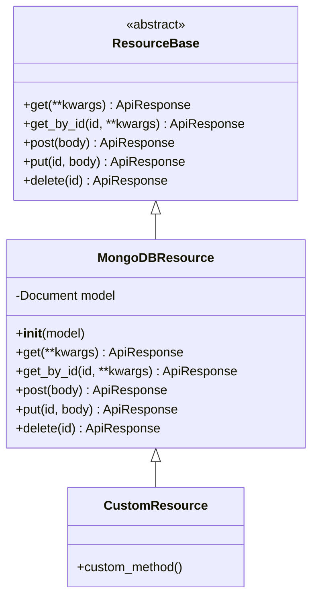

### Endpoint Structure

```
/api/v1/
├── health                    # Health check
├── {resource}/              # Resource collection
│   ├── GET                  # List (with pagination)
│   ├── POST                 # Create
│   └── {id}/               # Specific resource
│       ├── GET             # Retrieve
│       ├── PUT             # Update
│       └── DELETE          # Delete
└── computations/           # Example resource
    ├── GET ?status=started # Filtered list
    ├── POST                # Create computation
    └── {id}/
        ├── GET             # Get computation
        ├── PUT             # Update status
        └── DELETE          # Delete computation
```

### Pagination

All list endpoints support pagination:

```json
{
  "data": [...],
  "page": 1,
  "per_page": 20,
  "total": 150,
  "pages": 8
}
```

**Query Parameters:**
- `page`: Page number (default: 1)
- `per_page`: Items per page (default: 20, max: 100)

---

## Caching System

### Cache Architecture

```mermaid
graph TB
    subgraph "Decorator Layer"
        DEC[@mongo_cache]
    end

    subgraph "Cache Manager"
        CACHE[ObjectCache]
        KEY[Key Generator]
    end

    subgraph "Storage Layer"
        MONGO_CACHE[MongoCacheDB Model]
    end

    subgraph "Serialization"
        SER[serialize/deserialize]
        PICKLE[Pickle]
        JSON[JSON]
    end

    subgraph "Database"
        MONGO[(MongoDB)]
    end

    DEC --> KEY
    KEY --> CACHE
    CACHE --> MONGO_CACHE
    DEC --> SER
    SER --> PICKLE
    SER --> JSON
    MONGO_CACHE --> MONGO
```

### Cache Key Generation

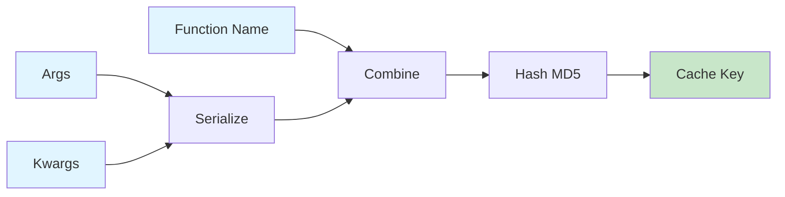

### Cache Workflow

1. **Cache Check**:
   - Generate cache key from function name + arguments
   - Query MongoDB for existing cache entry
   - If found and valid, deserialize and return

2. **Cache Miss**:
   - Execute original function
   - Serialize result (pickle or JSON)
   - Store in MongoDB with key and metadata
   - Return result to caller

3. **Cache Invalidation** (manual):
   ```python
   MongoCacheDB.objects(function_name='my_function').delete()
   ```

---

## Computation Lifecycle

### State Machine

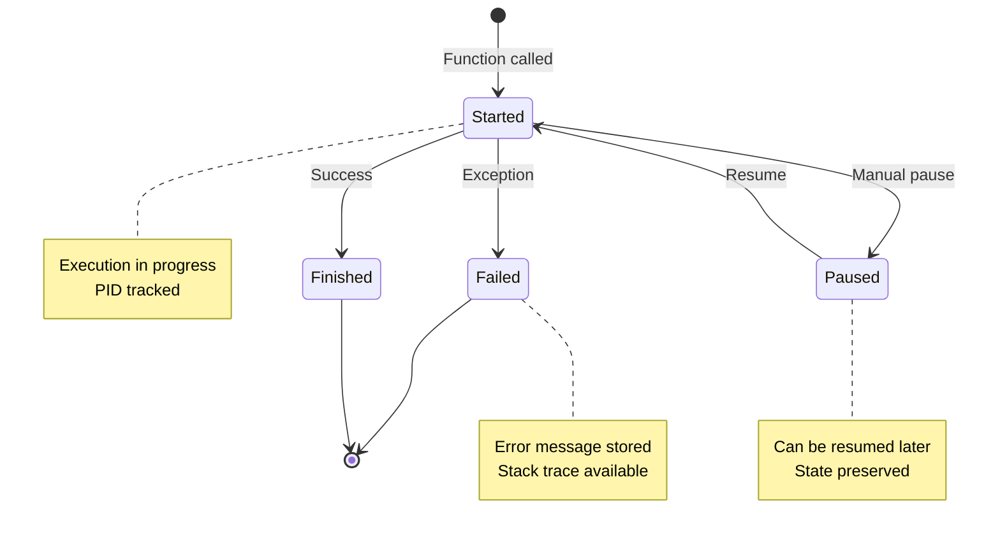

### Computation Properties

Each computation tracks:

| Property | Type | Description |
|----------|------|-------------|
| `name` | string | Display name |
| `function_name` | string | Short function name |
| `function_name_full` | string | Module.qualified.name |
| `args` | array | Positional arguments (JSON) |
| `kwargs` | object | Keyword arguments (JSON) |
| `status` | enum | started, paused, finished, failed |
| `pid` | string | Process ID |
| `started_at` | datetime | Start timestamp |
| `finished_at` | datetime | Completion timestamp |
| `paused_at` | datetime | Pause timestamp |
| `message` | string | Status message or error |
| `running_time` | computed | Elapsed or total time |

### Usage Pattern

```python
@register_computation
def long_running_task(data: list[int]) -> dict:
    """This function's execution will be tracked."""
    result = complex_calculation(data)
    return result

# Automatically creates Computation document
# Updates status on completion or failure
```

---

## Serialization Architecture

### Multi-Layer Serialization

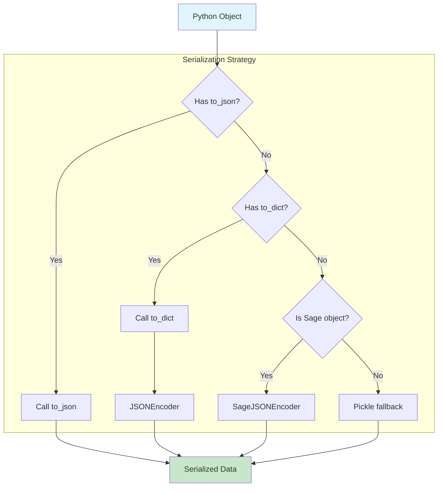

### Sage Object Serialization

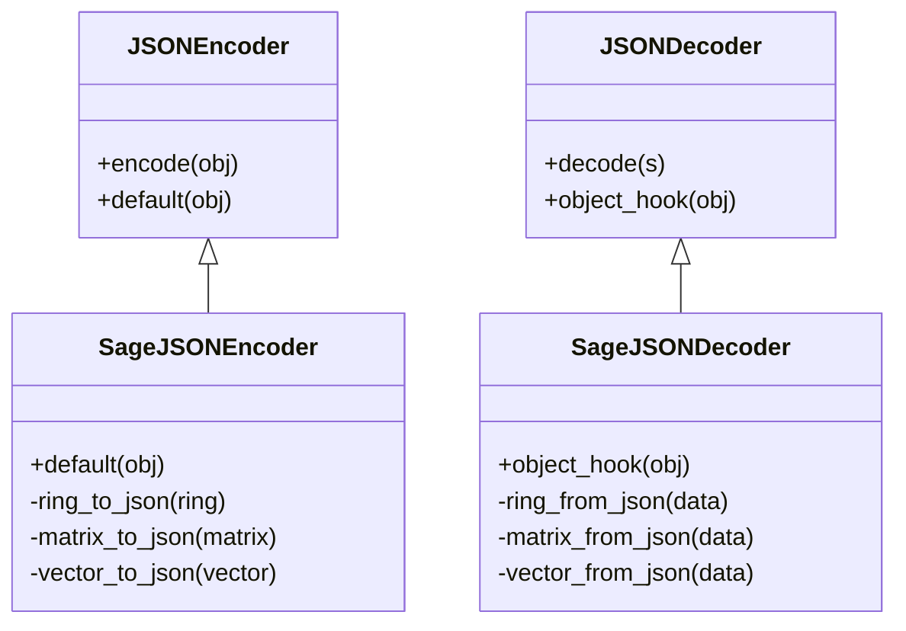

### Supported Sage Types

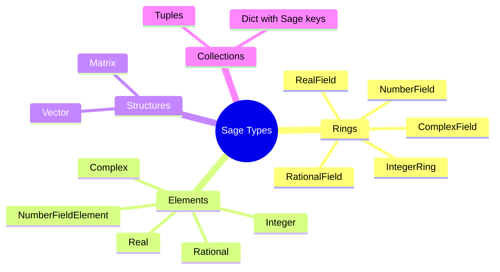

### Type Representation

Each Sage object is serialized with a `__type__` discriminator:

```json
{
  "__type__": "matrix",
  "base_ring": {
    "__type__": "ring",
    "name": "IntegerRing",
    "prec": 0
  },
  "entries": [["1", "2"], ["3", "4"]]
}
```

---

## Security Considerations

### Current Security Measures

1. **Input Validation**:
   - OpenAPI schema validation on all API inputs
   - Type checking with Python type hints
   - MongoEngine field validation

2. **Database Security**:
   - MongoDB connection URI via environment variables
   - No hardcoded credentials
   - Connection pooling with timeout

3. **Serialization Safety**:
   - Pickle deserialization only for trusted data
   - JSON preferred for user-facing APIs
   - Hash verification for cached data

### Security Recommendations

**For Production Deployment:**

1. **Authentication & Authorization**:
   - Add API authentication (JWT, OAuth2)
   - Implement role-based access control (RBAC)
   - Rate limiting on API endpoints

2. **Network Security**:
   - TLS/SSL for MongoDB connections
   - HTTPS only for API endpoints
   - Firewall rules for MongoDB access

3. **Data Protection**:
   - Encrypt sensitive data at rest
   - Secure key management
   - Regular security audits

4. **Input Sanitization**:
   - Validate all user inputs
   - Prevent NoSQL injection
   - Escape output in logs

---

## Performance Considerations

### Scalability Patterns

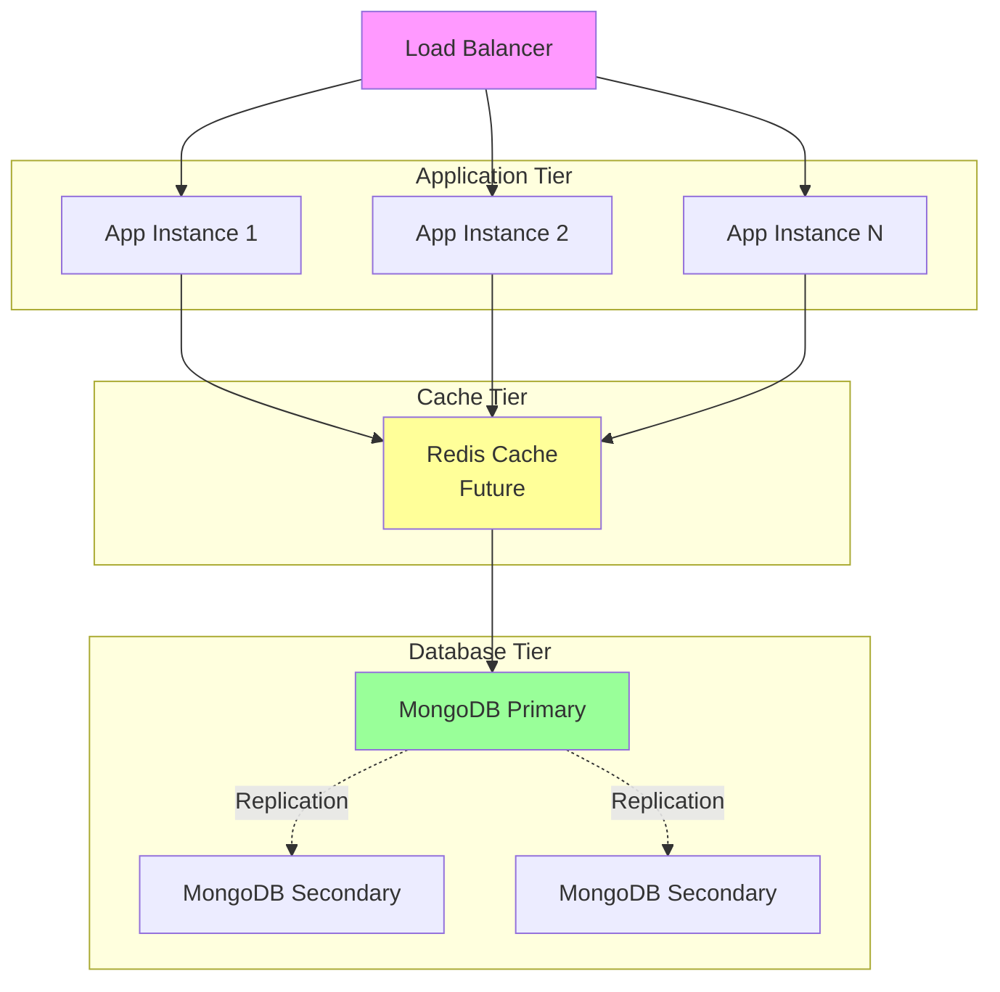

### Optimization Strategies

1. **Database Optimization**:
   - Compound indexes for common queries
   - Index on frequently filtered fields
   - Connection pooling
   - Query projection to reduce data transfer

2. **Caching Strategy**:
   - MongoDB for large, persistent cache
   - Consider Redis for hot cache layer
   - Cache invalidation strategy
   - TTL indexes for automatic expiration

3. **Serialization Performance**:
   - JSON preferred over pickle for speed
   - Lazy deserialization where possible
   - Streaming for large objects

4. **API Performance**:
   - Pagination for large result sets
   - Field selection in queries
   - ETag caching for unchanged data
   - Compression for responses

### Performance Metrics

Monitor these key metrics:

- **API Response Time**: < 200ms for cached queries
- **Cache Hit Rate**: > 80% for repeated queries
- **Database Query Time**: < 50ms for indexed queries
- **Serialization Time**: < 10ms for typical objects

---

## Design Decisions

### 1. MongoDB as Primary Database

**Decision**: Use MongoDB instead of relational database

**Rationale**:
- Flexible schema for diverse computation types
- Easy to store nested/complex arguments
- JSON-like documents match Python dictionaries
- Built-in GridFS for large binary data
- Good performance for write-heavy workloads

**Trade-offs**:
- No ACID transactions across multiple documents
- Manual referential integrity
- Limited join capabilities

### 2. Decorator-Based Interface

**Decision**: Use Python decorators for caching and tracking

**Rationale**:
- Minimal code changes for existing functions
- Clear separation of concerns
- Easy to add/remove functionality
- Pythonic and familiar pattern

**Trade-offs**:
- Less obvious for newcomers
- Debugging can be harder
- Order of decorators matters

### 3. Hash-Based Uniqueness

**Decision**: Use MD5 hash of arguments for deduplication

**Rationale**:
- Fast computation
- Fixed size regardless of input
- Low collision probability for typical data
- Enables efficient lookups

**Trade-offs**:
- Not cryptographically secure (not needed)
- Requires deterministic serialization
- Hash collisions theoretically possible

### 4. Hybrid Serialization

**Decision**: Support both Pickle and JSON serialization

**Rationale**:
- Pickle for complex Python objects
- JSON for cross-language compatibility
- JSON for user-facing APIs
- Flexibility for different use cases

**Trade-offs**:
- More code complexity
- Pickle has security concerns
- Need to choose strategy per use case

### 5. OpenAPI/Connexion for API

**Decision**: Use Connexion framework with OpenAPI specs

**Rationale**:
- Automatic request/response validation
- Interactive documentation (Swagger UI)
- API-first development
- Industry standard

**Trade-offs**:
- Learning curve for OpenAPI
- Some boilerplate in spec files
- Less flexibility than pure Flask

---

## Future Architecture Enhancements

### Planned Improvements

1. **Microservices Architecture**:
   - Split into separate services (API, Worker, Cache)
   - Message queue for async computations
   - Independent scaling of components

2. **Event-Driven Design**:
   - Event bus for computation state changes
   - Webhook support for notifications
   - Real-time updates via WebSockets

3. **Advanced Caching**:
   - Multi-tier cache (Redis + MongoDB)
   - Intelligent cache warming
   - Distributed cache invalidation

4. **Observability**:
   - Distributed tracing (OpenTelemetry)
   - Metrics (Prometheus)
   - Structured logging
   - Performance profiling

5. **High Availability**:
   - MongoDB replica sets
   - Application clustering
   - Automatic failover
   - Circuit breakers

---

## Conclusion

Comp Manager's architecture is designed for:

- **Simplicity**: Easy to understand and extend
- **Flexibility**: Adaptable to different use cases
- **Performance**: Optimized for mathematical workloads
- **Maintainability**: Clean separation of concerns
- **Scalability**: Foundation for future growth

The current design supports single-instance deployment with room to grow into a distributed, highly-available system as needs evolve.

---

## References

- [MongoDB Best Practices](https://www.mongodb.com/docs/manual/administration/production-notes/)
- [Flask Application Structure](https://flask.palletsprojects.com/en/latest/patterns/)
- [OpenAPI Specification](https://swagger.io/specification/)
- [MongoEngine Documentation](http://docs.mongoengine.org/)
- [SageMath Documentation](https://doc.sagemath.org/)

---

*Last Updated: 2026-01-06*
*Document Maintainer: Fredrik Stromberg*
