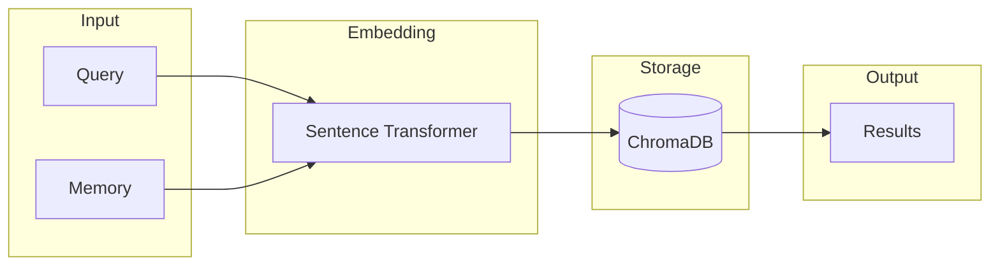

# RAG Backend

ContextFS uses Retrieval-Augmented Generation (RAG) to provide semantic search over memories.

## How It Works

### 1. Embedding Generation

When you save a memory, ContextFS generates a vector embedding:

```python
# Internally:
embedding = model.encode(memory.content)  # Returns 384-dim vector
```

The default model is `all-MiniLM-L6-v2`:

- **Dimensions**: 384
- **Speed**: ~2ms per embedding
- **Quality**: Excellent for semantic similarity
- **Size**: ~90MB

### 2. Vector Storage

Embeddings are stored in ChromaDB:

```
~/.contextfs/chroma/
├── chroma.sqlite3      # Metadata
└── [collection files]  # Vector data
```

ChromaDB provides:

- Persistent storage
- Fast similarity search
- Metadata filtering
- Automatic indexing

### 3. Semantic Search

Queries are embedded and compared against stored vectors:

```python
results = ctx.search("how does authentication work?")

# Internally:
# 1. Embed query: q_vec = model.encode(query)
# 2. Find similar: vectors.query(q_vec, n=limit)
# 3. Return ranked results
```

## Search Modes

### Semantic Search (Default)

Natural language queries matched by meaning:

```python
# These queries find the same memories:
ctx.search("user login flow")
ctx.search("how do users authenticate")
ctx.search("authentication process")
```

### Full-Text Search

Exact keyword matching via SQLite FTS5:

```python
# Finds memories containing exactly "JWT" and "RS256"
ctx.search("JWT RS256")
```

### Hybrid Search

ContextFS automatically combines both:

1. Run semantic search (RAG)
2. Run keyword search (FTS)
3. Merge and re-rank results

## Configuration

### Embedding Model

Change the embedding model in your environment:

```bash
export CONTEXTFS_EMBEDDING_MODEL="sentence-transformers/all-mpnet-base-v2"
```

Available models:

| Model | Dimensions | Size | Quality |
|-------|-----------|------|---------|
| `all-MiniLM-L6-v2` | 384 | 90MB | Good (default) |
| `all-mpnet-base-v2` | 768 | 420MB | Better |
| `all-MiniLM-L12-v2` | 384 | 120MB | Good |

### Search Parameters

```python
results = ctx.search(
    query="authentication",
    limit=10,              # Max results
    type=MemoryType.DECISION,  # Filter by type
    cross_repo=True,       # Search all repos
    project="my-project",  # Filter by project
)
```

## Performance

### Embedding Speed

| Operation | Time |
|-----------|------|
| Single memory embedding | ~2ms |
| Batch (100 memories) | ~100ms |
| Query embedding | ~2ms |

### Search Speed

| Collection Size | Query Time |
|----------------|------------|
| 1,000 memories | <10ms |
| 10,000 memories | <50ms |
| 100,000 memories | <200ms |

### Memory Usage

| Component | Memory |
|-----------|--------|
| Embedding model | ~200MB |
| ChromaDB base | ~50MB |
| Per 1K memories | ~10MB |

## Architecture



## Best Practices

### 1. Content Quality

Good content produces better embeddings:

```python
# Good: descriptive, contextual
ctx.save("JWT authentication with RS256 signing for API access tokens")

# Poor: too short, no context
ctx.save("JWT")
```

### 2. Chunking Long Content

For very long content, consider splitting:

```python
# Instead of one huge memory
ctx.save(very_long_document)

# Split into meaningful chunks
for section in document.sections:
    ctx.save(section, tags=["doc", document.title])
```

### 3. Use Summaries

Summaries are indexed too:

```python
ctx.save(
    content="[Long technical specification...]",
    summary="API rate limiting specification",  # Indexed!
)
```

### 4. Tag Consistently

Tags improve filtering but don't affect semantic search:

```python
# Tags help narrow down, embeddings find similar
results = ctx.search(
    "authentication",
    tags=["production"]  # Only prod-tagged memories
)
```
