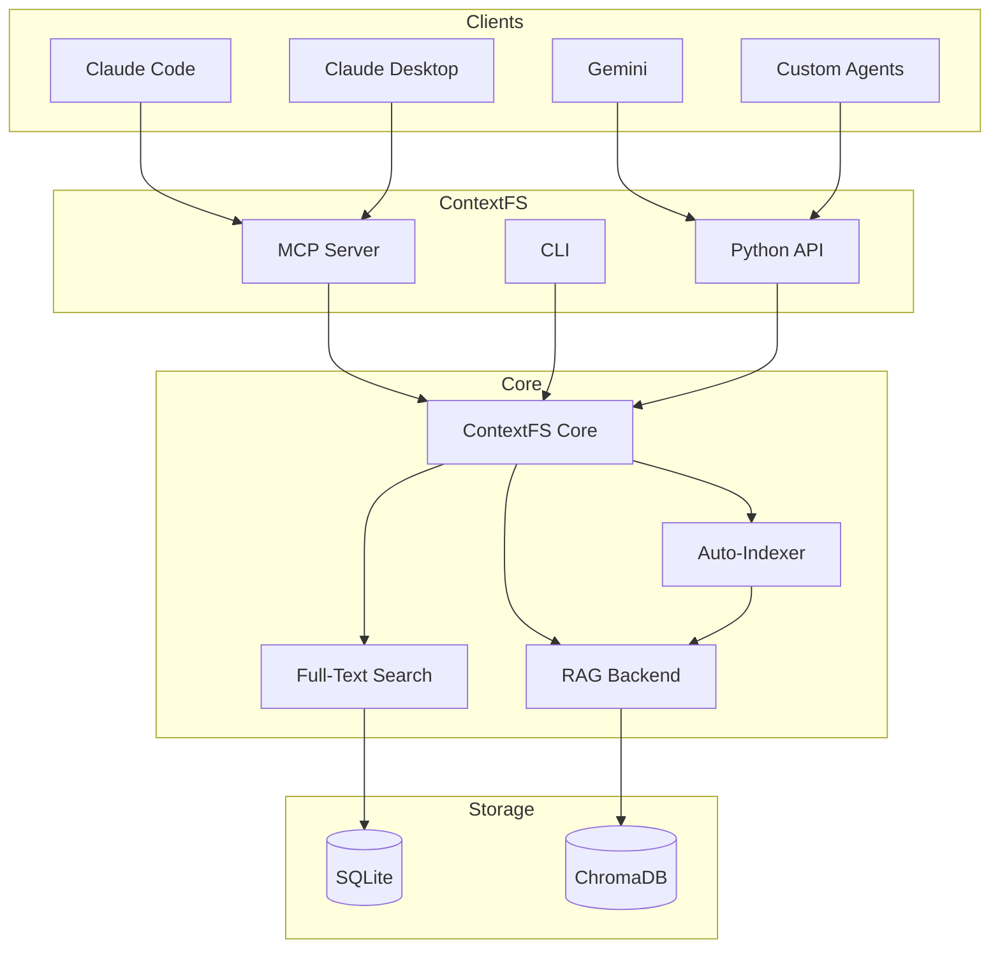
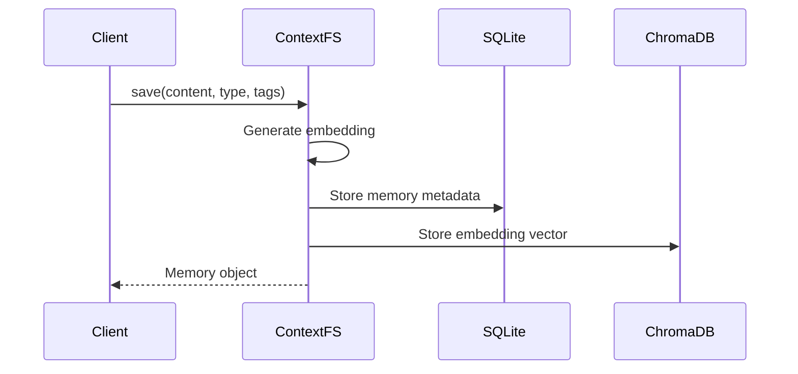
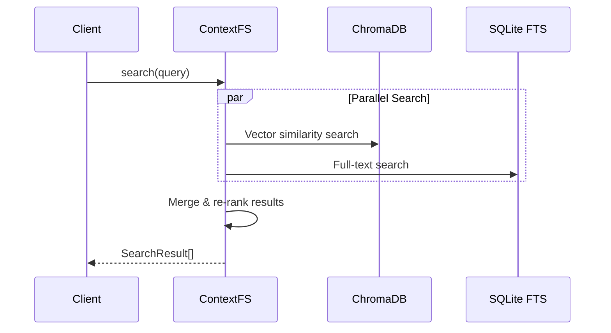
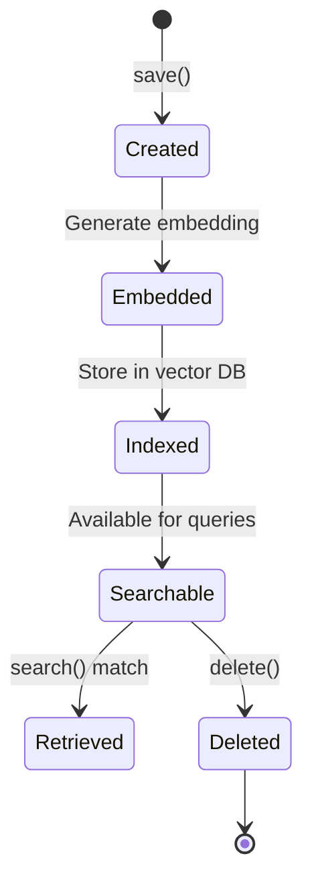

# Architecture Overview

ContextFS is designed as a **universal AI memory layer** that works across tools, repositories, and sessions.

## System Architecture



## Core Components

### ContextFS Core

The main interface (`contextfs.ContextFS`) handles:

- Memory CRUD operations
- Session management
- Namespace resolution
- Auto-indexing triggers

```python
from contextfs import ContextFS

ctx = ContextFS(
    data_dir=None,       # Default: ~/.contextfs
    namespace_id=None,   # Auto-detect from git repo
    auto_load=True,      # Load recent memories on startup
    auto_index=True,     # Index repo on first save
)
```

### RAG Backend

The RAG (Retrieval-Augmented Generation) backend provides semantic search:

- **Embeddings**: Sentence transformers (`all-MiniLM-L6-v2`)
- **Vector Store**: ChromaDB with persistent storage
- **Similarity**: Cosine similarity scoring

```python
# Semantic search
results = ctx.search("authentication patterns", limit=10)

# Returns SearchResult with score 0.0-1.0
for r in results:
    print(f"{r.score:.2f}: {r.memory.content[:100]}")
```

### Full-Text Search

SQLite FTS5 provides fast keyword search:

- Exact term matching
- Boolean operators
- Phrase search

```python
# FTS is automatically used for keyword-heavy queries
results = ctx.search("JWT RS256")
```

### Hybrid Search

ContextFS combines semantic and keyword search:

1. Run both RAG and FTS queries
2. Normalize scores
3. Merge and deduplicate
4. Re-rank by combined score

### Auto-Indexer

When you first save a memory in a repository, ContextFS indexes the codebase:

- Respects `.gitignore`
- Chunks large files intelligently
- Indexes git commit history
- Creates searchable code memories

## Data Flow

### Save Operation



### Search Operation



## Storage Layout

```
~/.contextfs/
├── context.db          # SQLite: memories, sessions, index status
├── chroma/             # ChromaDB: vector embeddings
│   ├── chroma.sqlite3
│   └── ...
└── config.json         # User configuration
```

## Memory Lifecycle



## Design Principles

### 1. Zero Configuration

Works immediately with sensible defaults:

- Auto-detect repository context
- Use local embeddings (no API keys)
- Automatic namespace isolation

### 2. Progressive Enhancement

Start simple, add complexity as needed:

- Basic: CLI save/search
- Intermediate: Python API integration
- Advanced: Multi-repo projects, custom embeddings

### 3. Universal Compatibility

Works with any AI tool via:

- MCP protocol (Claude Desktop/Code)
- Python API (direct integration)
- CLI (shell scripts, hooks)

### 4. Semantic-First

Designed around meaning, not keywords:

- Vector embeddings capture semantic similarity
- Natural language queries
- Fuzzy matching by default
