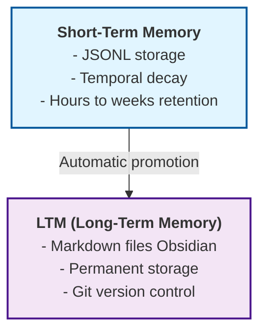
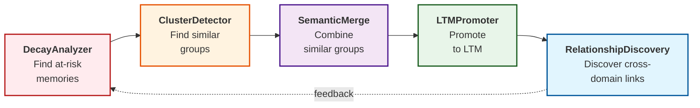

# CortexGraph: Temporal Memory for AI

<!-- mcp-name: io.github.prefrontal-systems/cortexgraph -->

A Model Context Protocol (MCP) server providing **human-like memory dynamics** for AI assistants. Memories naturally fade over time unless reinforced through use, mimicking the [Ebbinghaus forgetting curve](https://en.wikipedia.org/wiki/Forgetting_curve).

[](https://www.gnu.org/licenses/agpl-3.0)
[](https://www.python.org/downloads/)
[](https://github.com/prefrontal-systems/cortexgraph/actions/workflows/tests.yml)
[](https://github.com/prefrontal-systems/cortexgraph/actions/workflows/security.yml)
[](https://codecov.io/gh/prefrontal-systems/cortexgraph)
[](https://github.com/prefrontal-systems/cortexgraph/actions/workflows/security.yml)

> [!NOTE]
> **About the Name & Version**
>
> This project was originally developed as **mnemex** (published to PyPI up to v0.6.0). In November 2025, it was transferred to [Prefrontal Systems](https://prefrontal.systems) and renamed to **CortexGraph** to better reflect its role within a broader cognitive architecture for AI systems.
>
> **Version numbering starts at 0.1.0** for the cortexgraph package to signal a fresh start under the new name, while acknowledging the mature, well-tested codebase (791 tests, 98%+ coverage) inherited from mnemex. The mnemex package remains frozen at v0.6.0 on PyPI.
>
> This versioning approach:
> - Signals "new package" to PyPI users discovering cortexgraph
> - Gives room to evolve the brand, API, and organizational integration before 1.0
> - Maintains continuity: users can migrate from `pip install mnemex` → `pip install cortexgraph`
> - Reflects that while the code is mature, the cortexgraph identity is just beginning

> [!IMPORTANT]
> **🔬 RESEARCH ARTIFACT - NOT FOR PRODUCTION**
>
> This software is a **Proof of Concept (PoC)** and reference implementation for research purposes. It exists to validate theoretical frameworks in cognitive architecture and AI safety (specifically the [STOPPER Protocol](https://prefrontal.systems/frameworks/stopper) and [CortexGraph](https://prefrontal.systems/frameworks/cortexgraph)).
>
> **It is NOT a commercial product.** It is not maintained for general production use, may contain breaking changes, and offers no guarantees of stability or support. Use it to study the concepts, but build your own production implementations.

> **📖 New to this project?** Start with the [ELI5 Guide](ELI5.md) for a simple explanation of what this does and how to use it.

## What is CortexGraph?

**CortexGraph gives AI assistants like Claude a human-like memory system.**

### The Problem

When you chat with Claude, it forgets everything between conversations. You tell it "I prefer TypeScript" or "I'm allergic to peanuts," and three days later, you have to repeat yourself. This is frustrating and wastes time.

### What CortexGraph Does

CortexGraph makes AI assistants **remember things naturally**, just like human memory:

- 🧠 **Remembers what matters** - Your preferences, decisions, and important facts
- ⏰ **Forgets naturally** - Old, unused information fades away over time (like the [Ebbinghaus forgetting curve](https://en.wikipedia.org/wiki/Forgetting_curve))
- 💪 **Gets stronger with use** - The more you reference something, the longer it's remembered
- 📦 **Saves important things permanently** - Frequently used memories get promoted to long-term storage

### How It Works (Simple Version)

1. **You talk naturally** - "I prefer dark mode in all my apps"
2. **Memory is saved automatically** - No special commands needed
3. **Time passes** - Memory gradually fades if not used
4. **You reference it again** - "Make this app dark mode"
5. **Memory gets stronger** - Now it lasts even longer
6. **Important memories promoted** - Used 5+ times? Saved permanently to your Obsidian vault

**No flashcards. No explicit review. Just natural conversation.**

### Why It's Different

Most memory systems are dumb:
- ❌ "Delete after 7 days" (doesn't care if you used it 100 times)
- ❌ "Keep last 100 items" (throws away important stuff just because it's old)

CortexGraph is smart:
- ✅ Combines **recency** (when?), **frequency** (how often?), and **importance** (how critical?)
- ✅ Memories fade naturally like human memory
- ✅ Frequently used memories stick around longer
- ✅ You can mark critical things to "never forget"

## Technical Overview

This repository contains research, design, and a complete implementation of a short-term memory system that combines:

- **Novel temporal decay algorithm** based on cognitive science
- **Reinforcement learning** through usage patterns
- **Two-layer architecture** (STM + LTM) for working and permanent memory
- **Smart prompting patterns** for natural LLM integration
- **Git-friendly storage** with human-readable JSONL
- **Knowledge graph** with entities and relations

### Module Organization

CortexGraph follows a modular architecture:

- **`cortexgraph.core`**: Foundational algorithms (decay, similarity, clustering, consolidation, search validation)
- **`cortexgraph.agents`**: Multi-agent consolidation pipeline and storage utilities
- **`cortexgraph.storage`**: JSONL and SQLite storage backends with batch operations
- **`cortexgraph.tools`**: MCP tool implementations

## Why CortexGraph?

### 🔒 Privacy & Transparency

**All data stored locally on your machine** - no cloud services, no tracking, no data sharing.

- **Short-term memory**:
  - **JSONL** (default): Human-readable, git-friendly files (`~/.config/cortexgraph/jsonl/`)
  - **SQLite**: Robust database storage for larger datasets (`~/.config/cortexgraph/cortexgraph.db`)

- **Long-term memory**: Markdown files optimized for Obsidian
  - YAML frontmatter with metadata
  - Wikilinks for connections
  - Permanent storage you control

- **Export**: Built-in utility to export memories to Markdown for portability.

You own your data. You can read it, edit it, delete it, or version control it - all without any special tools.

## Core Algorithm

The temporal decay scoring function:

$$
\Large \text{score}(t) = (n_{\text{use}})^\beta \cdot e^{-\lambda \cdot \Delta t} \cdot s
$$

Where:

- $\large n_{\text{use}}$ - Use count (number of accesses)
- $\large \beta$ (beta) - Sub-linear use count weighting (default: 0.6)
- $\large \lambda = \frac{\ln(2)}{t_{1/2}}$ (lambda) - Decay constant; set via half-life (default: 3-day)
- $\large \Delta t$ - Time since last access (seconds)
- $\large s$ - Strength parameter $\in [0, 2]$ (importance multiplier)

Thresholds:

- $\large \tau_{\text{forget}}$ (default 0.05) — if score < this, forget
- $\large \tau_{\text{promote}}$ (default 0.65) — if score ≥ this, promote (or if $\large n_{\text{use}}\ge5$ in 14 days)

Decay Models:

- Power‑Law (default): heavier tail; most human‑like retention
- Exponential: lighter tail; forgets sooner
- Two‑Component: fast early forgetting + heavier tail

See detailed parameter reference, model selection, and worked examples in docs/scoring_algorithm.md.

## Tuning Cheat Sheet

- Balanced (default)
  - Half-life: 3 days (λ ≈ 2.67e-6)
  - β = 0.6, τ_forget = 0.05, τ_promote = 0.65, use_count≥5 in 14d
  - Strength: 1.0 (bump to 1.3–2.0 for critical)
- High‑velocity context (ephemeral notes, rapid switching)
  - Half-life: 12–24 hours (λ ≈ 1.60e-5 to 8.02e-6)
  - β = 0.8–0.9, τ_forget = 0.10–0.15, τ_promote = 0.70–0.75
- Long retention (research/archival)
  - Half-life: 7–14 days (λ ≈ 1.15e-6 to 5.73e-7)
  - β = 0.3–0.5, τ_forget = 0.02–0.05, τ_promote = 0.50–0.60
- Preference/decision heavy assistants
  - Half-life: 3–7 days; β = 0.6–0.8
  - Strength defaults: 1.3–1.5 for preferences; 1.8–2.0 for decisions
- Aggressive space control
  - Raise τ_forget to 0.08–0.12 and/or shorten half-life; schedule weekly GC
- Environment template
  - CORTEXGRAPH_DECAY_LAMBDA=2.673e-6, CORTEXGRAPH_DECAY_BETA=0.6
  - CORTEXGRAPH_FORGET_THRESHOLD=0.05, CORTEXGRAPH_PROMOTE_THRESHOLD=0.65
  - CORTEXGRAPH_PROMOTE_USE_COUNT=5, CORTEXGRAPH_PROMOTE_TIME_WINDOW=14

**Decision thresholds:**

- Forget: $\text{score} < 0.05$ → delete memory
- Promote: $\text{score} \geq 0.65$ OR $n_{\text{use}} \geq 5$ within 14 days → move to LTM

## Key Innovations

### 1. Temporal Decay with Reinforcement

Unlike traditional caching (TTL, LRU), Mnemex scores memories continuously by combining **recency** (exponential decay), **frequency** (sub-linear use count), and **importance** (adjustable strength). See [Core Algorithm](#core-algorithm) for the mathematical formula. This creates memory dynamics that closely mimic human cognition.

### 2. Smart Prompting System + Natural Language Activation (v0.6.0+)

Patterns for making AI assistants use memory naturally, now enhanced with **automatic entity extraction and importance scoring**:

**Auto-Enrichment (NEW in v0.6.0)**

When you save memories, CortexGraph automatically:
- Extracts entities (people, technologies, organizations) using spaCy NER
- Calculates importance/strength based on content markers
- Detects save/recall intent from natural language phrases

```python
# Before v0.6.0 - manual entity specification
save_memory(content="Use JWT for auth", entities=["JWT", "auth"])

# v0.6.0+ - automatic extraction
save_memory(content="Use JWT for auth")
# Entities auto-extracted: ["jwt", "auth"]
# Strength auto-calculated based on content
```

**Auto-Save**

```
User: "Remember: I prefer TypeScript over JavaScript"
→ Detected save phrase: "Remember"
→ Automatically saved with:
   - Entities: [typescript, javascript]
   - Strength: 1.5 (importance marker detected)
   - Tags: [preferences, programming]
```

**Auto-Recall**

```
User: "What did I say about TypeScript?"
→ Detected recall phrase: "what did I say about"
→ Automatically searches for TypeScript memories
→ Retrieves preferences and conventions
```

**Auto-Reinforce**

```
User: "Yes, still using TypeScript"
→ Memory strength increased, decay slowed
```

**Decision Support Tools (v0.6.0+)**

Two new tools help Claude decide when to save/recall:
- `analyze_message` - Detects memory-worthy content, suggests entities and strength
- `analyze_for_recall` - Detects recall intent, suggests search queries

No explicit memory commands needed - just natural conversation.

### 3. Natural Spaced Repetition

Inspired by how concepts naturally reinforce across different contexts (the "Maslow effect" - remembering Maslow's hierarchy better when it appears in history, economics, and sociology classes).

**No flashcards. No explicit review sessions. Just natural conversation.**

**How it works:**

1. **Review Priority Calculation** - Memories in the "danger zone" (0.15-0.35 decay score) get highest priority
2. **Cross-Domain Detection** - Detects when memories are used in different contexts (tag Jaccard similarity <30%)
3. **Automatic Reinforcement** - Memories strengthen naturally when used, especially across domains
4. **Blended Search** - Review candidates appear in 30% of search results (configurable)

**Usage pattern:**

```
User: "Can you help with authentication in my API?"
→ System searches, retrieves JWT preference memory
→ System uses memory to answer question
→ System calls observe_memory_usage with context tags [api, auth, backend]
→ Cross-domain usage detected (original tags: [security, jwt, preferences])
→ Memory automatically reinforced, strength boosted
→ Next search naturally surfaces memories needing review
```

**Configuration:**

```bash
CORTEXGRAPH_REVIEW_BLEND_RATIO=0.3           # 30% review candidates in search
CORTEXGRAPH_REVIEW_DANGER_ZONE_MIN=0.15      # Lower bound of danger zone
CORTEXGRAPH_REVIEW_DANGER_ZONE_MAX=0.35      # Upper bound of danger zone
CORTEXGRAPH_AUTO_REINFORCE=true              # Auto-reinforce on observe
```

See `docs/prompts/` for LLM system prompt templates that enable natural memory usage.

### 4. Two-Layer Architecture



### 5. Multi-Agent Consolidation Pipeline

Automated memory maintenance through five specialized agents:



**The Five Agents:**

| Agent | Purpose |
|-------|---------|
| **DecayAnalyzer** | Find memories at risk of being forgotten (danger zone: 0.15-0.35) |
| **ClusterDetector** | Group similar memories using embedding similarity |
| **SemanticMerge** | Intelligently combine clustered memories, preserving unique info |
| **LTMPromoter** | Move high-value memories to permanent Obsidian storage |
| **RelationshipDiscovery** | Find cross-domain connections via shared entities |

**Key Features:**

- **Dry-run mode**: Preview changes without modifying data
- **Rate limiting**: Configurable operations per minute (default: 60)
- **Audit trail**: Every decision tracked via beads issue tracking
- **Human override**: Review and approve decisions before execution

**Usage:**

```python
from cortexgraph.agents import Scheduler

# Preview what would change (dry run)
scheduler = Scheduler(dry_run=True)
preview = scheduler.run_pipeline()

# Run full pipeline
scheduler = Scheduler(dry_run=False)
results = scheduler.run_pipeline()

# Run single agent
decay_results = scheduler.run_agent("decay")
```

**CLI:**

```bash
# Dry run (preview)
cortexgraph-consolidate --dry-run

# Run specific agent
cortexgraph-consolidate --agent decay --dry-run

# Scheduled execution (with interval)
cortexgraph-consolidate --scheduled --interval-hours 1
```

See [docs/agents.md](docs/agents.md) for complete documentation including configuration, beads integration, and troubleshooting.

## Quick Start

### Installation

**Recommended: UV Tool Install (from PyPI)**

```bash
# Install from PyPI (recommended - fast, isolated, includes all 7 CLI commands)
uv tool install cortexgraph
```

This installs `cortexgraph` and all 7 CLI commands in an isolated environment.

**Alternative Installation Methods**

```bash
# Using pipx (similar isolation to uv)
pipx install cortexgraph

# Using pip (traditional, installs in current environment)
pip install cortexgraph

# From GitHub (latest development version)
uv tool install git+https://github.com/simplemindedbot/cortexgraph.git
```

**For Development (Editable Install)**

```bash
# Clone and install in editable mode
git clone https://github.com/simplemindedbot/cortexgraph.git
cd cortexgraph
uv pip install -e ".[dev]"
```

### Configuration

**IMPORTANT**: Configuration location depends on installation method:

**Method 1: .env file (Works for all installation methods)**

Create `~/.config/cortexgraph/.env`:

```bash
# Create config directory
mkdir -p ~/.config/cortexgraph

# Option A: Copy from cloned repo
cp .env.example ~/.config/cortexgraph/.env

# Option B: Download directly
curl -o ~/.config/cortexgraph/.env https://raw.githubusercontent.com/simplemindedbot/cortexgraph/main/.env.example
```

Edit `~/.config/cortexgraph/.env` with your settings:

```bash
# Storage
CORTEXGRAPH_STORAGE_PATH=~/.config/cortexgraph/jsonl

# Decay model (power_law | exponential | two_component)
CORTEXGRAPH_DECAY_MODEL=power_law

# Power-law parameters (default model)
CORTEXGRAPH_PL_ALPHA=1.1
CORTEXGRAPH_PL_HALFLIFE_DAYS=3.0

# Exponential (if selected)
# CORTEXGRAPH_DECAY_LAMBDA=2.673e-6  # 3-day half-life

# Two-component (if selected)
# CORTEXGRAPH_TC_LAMBDA_FAST=1.603e-5  # ~12h
# CORTEXGRAPH_TC_LAMBDA_SLOW=1.147e-6  # ~7d
# CORTEXGRAPH_TC_WEIGHT_FAST=0.7

# Common parameters
CORTEXGRAPH_DECAY_LAMBDA=2.673e-6
CORTEXGRAPH_DECAY_BETA=0.6

# Thresholds
CORTEXGRAPH_FORGET_THRESHOLD=0.05
CORTEXGRAPH_PROMOTE_THRESHOLD=0.65

# Long-term memory (optional)
LTM_VAULT_PATH=~/Documents/Obsidian/Vault
```

**Where cortexgraph looks for .env files:**
1. **Primary**: `~/.config/cortexgraph/.env` ← Use this for `uv tool install` / `uvx`
2. **Fallback**: `./.env` (current directory) ← Only works for editable installs

### MCP Configuration

**Recommended: Use absolute path (works everywhere)**

Add to `~/Library/Application Support/Claude/claude_desktop_config.json`:

```json
{
  "mcpServers": {
    "cortexgraph": {
      "command": "/Users/yourusername/.local/bin/cortexgraph"
    }
  }
}
```

**Find your actual path:**

```bash
which cortexgraph
# Example output: /Users/yourusername/.local/bin/cortexgraph
```

Use that path in your config. Replace `yourusername` with your actual username.

**Why absolute path?** GUI apps like Claude Desktop don't inherit your shell's PATH configuration (`.zshrc`, `.bashrc`). Using the full path ensures it always works.

**For development (editable install):**

```json
{
  "mcpServers": {
    "cortexgraph": {
      "command": "uv",
      "args": ["--directory", "/path/to/cortexgraph", "run", "cortexgraph"],
      "env": {"PYTHONPATH": "/path/to/cortexgraph/src"}
    }
  }
}
```

Configuration can be loaded from `./.env` in the project directory OR `~/.config/cortexgraph/.env`.

#### Troubleshooting: Command Not Found

If Claude Desktop shows `spawn cortexgraph ENOENT` errors, the `cortexgraph` command isn't in Claude Desktop's PATH.

**macOS/Linux: GUI apps don't inherit shell PATH**

GUI applications on macOS and Linux don't see your shell's PATH configuration (`.zshrc`, `.bashrc`, etc.). Claude Desktop only searches:
- `/usr/local/bin`
- `/opt/homebrew/bin` (macOS)
- `/usr/bin`
- `/bin`
- `/usr/sbin`
- `/sbin`

If `uv tool install` placed `cortexgraph` in `~/.local/bin/` or another custom location, Claude Desktop can't find it.

**Solution: Use absolute path**

```bash
# Find where cortexgraph is installed
which cortexgraph
# Example output: /Users/username/.local/bin/cortexgraph
```

Update your Claude config with the absolute path:

```json
{
  "mcpServers": {
    "cortexgraph": {
      "command": "/Users/username/.local/bin/cortexgraph"
    }
  }
}
```

Replace `/Users/username/.local/bin/cortexgraph` with your actual path from `which cortexgraph`.
### Maintenance

Use the maintenance CLI to inspect and compact JSONL storage:

```bash
# Show storage stats (active counts, file sizes, compaction hints)
cortexgraph-maintenance stats

# Compact JSONL (rewrite without tombstones/duplicates)
cortexgraph-maintenance compact
```

### Migrating to UV Tool Install

If you're currently using an editable install (`uv pip install -e .`), you can switch to the simpler UV tool install:

```bash
# 1. Uninstall editable version
uv pip uninstall cortexgraph

# 2. Install as UV tool
uv tool install git+https://github.com/simplemindedbot/cortexgraph.git

# 3. Update Claude Desktop config to just:
#    {"command": "cortexgraph"}
#    Remove the --directory, run, and PYTHONPATH settings
```

**Your data is safe!** This only changes how the command is installed. Your memories in `~/.config/cortexgraph/` are untouched.

## CLI Commands

The server includes 7 command-line tools:

```bash
cortexgraph                  # Run MCP server
cortexgraph-migrate          # Migrate from old STM setup
cortexgraph-index-ltm        # Index Obsidian vault
cortexgraph-backup           # Git backup operations
cortexgraph-vault            # Vault markdown operations
cortexgraph-search           # Unified STM+LTM search
cortexgraph-maintenance      # JSONL storage stats and compaction
```

## Visualization

Interactive graph visualization using PyVis:

```bash
# Install visualization dependencies
pip install "cortexgraph[visualization]"
# or with uv
uv pip install "cortexgraph[visualization]"

# Or install dependencies manually
pip install pyvis networkx

# Generate interactive HTML visualization
python scripts/visualize_graph.py

# Custom output location
python scripts/visualize_graph.py --output ~/Desktop/memory_graph.html

# Custom data paths
python scripts/visualize_graph.py --memories ~/data/memories.jsonl --relations ~/data/relations.jsonl
```

**Features:**
- Interactive network graph with pan/zoom
- Node colors by status (active=blue, promoted=green, archived=gray)
- Node size based on use count
- Edge colors by relation type
- Hover tooltips showing full content, tags, and entities
- Physics controls for layout adjustment

The visualization reads directly from your JSONL files and creates a standalone HTML file you can open in any browser.

## MCP Tools

13 tools for AI assistants to manage memories:

| Tool | Purpose |
|------|---------|
| `save_memory` | Save new memory with tags, entities (auto-enrichment in v0.6.0+) |
| `search_memory` | Search with filters and scoring (includes review candidates) |
| `search_unified` | Unified search across STM + LTM |
| `touch_memory` | Reinforce memory (boost strength) |
| `observe_memory_usage` | Record memory usage for natural spaced repetition |
| `analyze_message` | ✨ **NEW v0.6.0** - Detect memory-worthy content, suggest entities/strength |
| `analyze_for_recall` | ✨ **NEW v0.6.0** - Detect recall intent, suggest search queries |
| `gc` | Garbage collect low-scoring memories |
| `promote_memory` | Move to long-term storage |
| `cluster_memories` | Find similar memories |
| `consolidate_memories` | Merge similar memories (algorithmic) |
| `read_graph` | Get entire knowledge graph |
| `open_memories` | Retrieve specific memories |
| `create_relation` | Link memories explicitly |

### Example: Unified Search

Search across STM and LTM with the CLI:

```bash
cortexgraph-search "typescript preferences" --tags preferences --limit 5 --verbose
```

### Example: Reinforce (Touch) Memory

Boost a memory's recency/use count to slow decay:

```json
{
  "memory_id": "mem-123",
  "boost_strength": true
}
```

Sample response:

```json
{
  "success": true,
  "memory_id": "mem-123",
  "old_score": 0.41,
  "new_score": 0.78,
  "use_count": 5,
  "strength": 1.1
}
```

### Example: Promote Memory

Suggest and promote high-value memories to the Obsidian vault.

Auto-detect (dry run):

```json
{
  "auto_detect": true,
  "dry_run": true
}
```

Promote a specific memory:

```json
{
  "memory_id": "mem-123",
  "dry_run": false,
  "target": "obsidian"
}
```

As an MCP tool (request body):

```json
{
  "query": "typescript preferences",
  "tags": ["preferences"],
  "limit": 5,
  "verbose": true
}
```

### Example: Consolidate Similar Memories

Find and merge duplicate or highly similar memories to reduce clutter:

Auto-detect candidates (preview):

```json
{
  "auto_detect": true,
  "mode": "preview",
  "cohesion_threshold": 0.75
}
```

Apply consolidation to detected clusters:

```json
{
  "auto_detect": true,
  "mode": "apply",
  "cohesion_threshold": 0.80
}
```

The tool will:
- Merge content intelligently (preserving unique information)
- Combine tags and entities (union)
- Calculate strength based on cluster cohesion
- Preserve earliest `created_at` and latest `last_used` timestamps
- Create tracking relations showing consolidation history

## Mathematical Details

### Decay Curves

For a memory with $n_{\text{use}}=1$, $s=1.0$, and $\lambda = 2.673 \times 10^{-6}$ (3-day half-life):

| Time | Score | Status |
|------|-------|--------|
| 0 hours | 1.000 | Fresh |
| 12 hours | 0.917 | Active |
| 1 day | 0.841 | Active |
| 3 days | 0.500 | Half-life |
| 7 days | 0.210 | Decaying |
| 14 days | 0.044 | Near forget |
| 30 days | 0.001 | **Forgotten** |

### Use Count Impact

With $\beta = 0.6$ (sub-linear weighting):

| Use Count | Boost Factor |
|-----------|--------------|
| 1 | 1.0× |
| 5 | 2.6× |
| 10 | 4.0× |
| 50 | 11.4× |

Frequent access significantly extends retention.

## Documentation

- **[MCP Tools Reference](docs/mcp-tools.md)** - Comprehensive documentation for all 18 MCP tools
- **[API Quick Reference](docs/api.md)** - Minimal tool signatures and usage examples
- **[Scoring Algorithm](docs/scoring_algorithm.md)** - Complete mathematical model with LaTeX formulas
- **[Smart Prompting](docs/prompts/memory_system_prompt.md)** - Patterns for natural LLM integration
- **[Architecture](docs/architecture.md)** - System design and implementation
- **[Multi-Agent System](docs/agents.md)** - Consolidation agents and pipeline architecture
- **[Bear Integration](docs/bear-integration.md)** - Guide to using Bear app as an LTM store
- **[Graph Features](docs/graph_features.md)** - Knowledge graph usage

## Use Cases

### Personal Assistant (Balanced)

- 3-day half-life
- Remember preferences and decisions
- Auto-promote frequently referenced information

### Development Environment (Aggressive)

- 1-day half-life
- Fast context switching
- Aggressive forgetting of old context

### Research / Archival (Conservative)

- 14-day half-life
- Long retention
- Comprehensive knowledge preservation

## License

AGPL-3.0 License - See [LICENSE](LICENSE) for details.

This project uses the GNU Affero General Public License v3.0, which requires that modifications to this software be made available as source code when used to provide a network service.

## Related Work

- [Model Context Protocol](https://github.com/modelcontextprotocol) - MCP specification
- [Ebbinghaus Forgetting Curve](https://en.wikipedia.org/wiki/Forgetting_curve) - Cognitive science foundation
- [Basic Memory](https://github.com/basicmachines-co/basic-memory) - Primary inspiration for the integration layer. CortexGraph extends this concept by adding the Ebbinghaus forgetting curve, temporal decay algorithms, short-term memory in JSONL storage, and natural spaced repetition.
- Additional research inspired by: mem0, Neo4j Graph Memory

## Citation

If you use this work in research, please cite:

```bibtex
@software{cortexgraph_2025,
  title = {Mnemex: Temporal Memory for AI},
  author = {simplemindedbot},
  year = {2025},
  url = {https://github.com/simplemindedbot/cortexgraph},
  version = {0.5.3}
}
```

## Contributing

Contributions are welcome! See [CONTRIBUTING.md](CONTRIBUTING.md) for detailed instructions.

### 🚨 **Help Needed: Windows & Linux Testers!**

I develop on macOS and need help testing on Windows and Linux. If you have access to these platforms, please:

- Try the installation instructions
- Run the test suite
- Report what works and what doesn't

See the [**Help Needed section**](CONTRIBUTING.md#-help-needed-windows--linux-testers) in CONTRIBUTING.md for details.

### General Contributions

For all contributors, see [CONTRIBUTING.md](CONTRIBUTING.md) for:

- Platform-specific setup (Windows, Linux, macOS)
- Development workflow
- Testing guidelines
- Code style requirements
- Pull request process

Quick start:

1. Read [CONTRIBUTING.md](CONTRIBUTING.md) for platform-specific setup
2. Understand the [Architecture docs](docs/architecture.md)
3. Review the [Scoring Algorithm](docs/scoring_algorithm.md)
4. Follow existing code patterns
5. Add tests for new features
6. Update documentation

## Status

**Version:** 1.0.0
**Status:** Research implementation - functional but evolving

### Phase 1 (Complete) ✅

- 14 MCP tools
- Temporal decay algorithm
- Knowledge graph

### Phase 2 (Complete) ✅

- JSONL storage
- LTM index
- Git integration
- Smart prompting documentation
- Maintenance CLI
- Memory consolidation (algorithmic merging)

### Phase 3 (Complete) ✅

- **Multi-Agent Consolidation Pipeline**
  - DecayAnalyzer, ClusterDetector, SemanticMerge, LTMPromoter, RelationshipDiscovery
  - Scheduler for orchestration
  - Beads issue tracking integration
  - Dry-run and rate limiting support
- Natural language activation (v0.6.0+)
- Auto-enrichment for entity extraction

### Future Work

- Adaptive decay parameters
- Performance benchmarks
- LLM-assisted consolidation (optional enhancement)

---

**Built with** [Claude Code](https://claude.com/claude-code) 🤖
