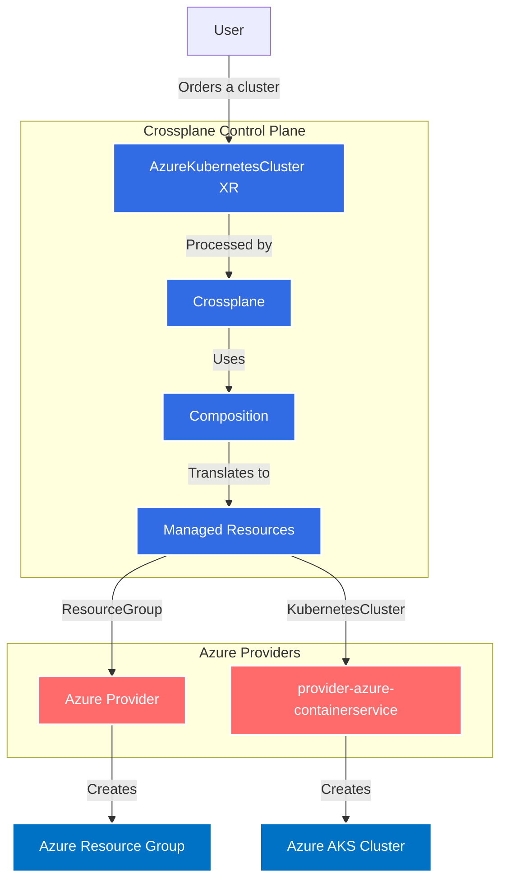
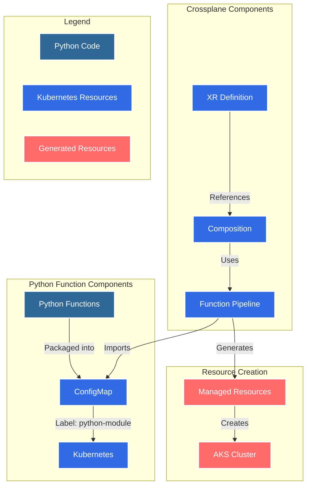

# AKS Cluster Example

This example demonstrates how to provision an AKS cluster using Crossplane v1.

## Prerequisites

- Kubernetes cluster (v1.31+)
- Helm v3.x

## Install Crossplane v1 via Helm

1. **Add the Crossplane Helm repository:**
    ```sh
    helm repo add crossplane-stable https://charts.crossplane.io/stable
    helm repo update
    ```

2. **Install Crossplane v1:**
    ```sh
    helm install crossplane --namespace crossplane-system --create-namespace crossplane-stable/crossplane --version 1.x.x
    ```
    Replace `1.x.x` with the desired Crossplane v1 release.

3. **Verify installation:**
    ```sh
    kubectl get pods -n crossplane-system
    ```

4. **Apply the manifests:**
    ```sh
    ./install.sh
    ```


## Architecture



## Technical Architecture

### Implementation Flow

1. **Python Functions**
   - Python code defines the resource configuration logic
   - Functions are packaged into ConfigMaps
   - ConfigMaps are labeled with ```function-pythonic.package: ''```

2. **Crossplane Integration**
   - XR Definition describes the custom resource structure
   - Composition references the Python functions
   - Function pipeline executes the Python code

3. **Resource Management**
   - Python functions generate Managed Resources
   - Managed Resources create actual cloud resources
   - Resources are managed through provider controllers

### Diagram


