```mermaid
graph TD
0["Generator"]
1["Doubler"]
2["AddFive"]
0 -->|x → x| 1
1 -->|y → y| 2
```

```mermaid
graph TD
0["Source"]
1["TaskA"]
2["TaskB"]
3["TaskC"]
0 -->|input → input| 1
0 -->|input → input| 2
0 -->|input → input| 3
```

```mermaid
graph TD
0["Source"]
1["PathA (+10)"]
2["PathB (+20)"]
3["PathA (+10)"]
4["PathB (+20)"]
5["Merge"]
0 -->|x → x| 1
0 -->|x → x| 2
0 -->|x → x| 3
0 -->|x → x| 4
2 --> 5
3 --> 5
1 --> 5
4 --> 5
style 1 fill:#e1f5ff
style 2 fill:#e1f5ff
```

```mermaid
graph TD
0["DataSource"]
1["Multiplier (v0)"]
2["Multiplier (v1)"]
3["Multiplier (v2)"]
4["Multiplier (v3)"]
0 -->|x → x| 1
0 -->|x → x| 2
0 -->|x → x| 3
0 -->|x → x| 4
style 1 fill:#e1f5ff
style 2 fill:#e1f5ff
style 3 fill:#e1f5ff
style 4 fill:#e1f5ff
style 1 fill:#ffe1e1
style 2 fill:#e1ffe1
style 3 fill:#ffe1ff
style 4 fill:#ffffe1
```

```mermaid
graph TD
0["Source"]
1["ProcessorA"]
2["ProcessorB"]
3["ProcessorA"]
4["ProcessorB"]
5["MergeNode"]
0 -->|input → input| 1
0 -->|input → input| 2
0 -->|input → input| 3
0 -->|input → input| 4
1 --> 5
2 --> 5
4 --> 5
3 --> 5
style 1 fill:#e1f5ff
style 2 fill:#e1f5ff
```

```mermaid
graph TD
0["CreateLargeData"]
1["ConsumerA"]
2["ConsumerB"]
3["ConsumerC"]
0 -->|data → data| 1
0 -->|data → data| 2
0 -->|data → data| 3
```

<div align="center">
  
  <p><em>A pure Rust DAG executor with intelligent dependency resolution and parallel execution</em></p>

  [](https://crates.io/crates/dagex)
  [](https://docs.rs/dagex)
  [](LICENSE)
</div>

# dagex

**dagex** is a pure Rust DAG (Directed Acyclic Graph) executor that automatically resolves data dependencies and executes computational pipelines in parallel. Build complex workflows with simple, composable functions.

## ✨ Highlights

- 🚀 **Automatic parallelization** of independent nodes
- 🔄 **Dataflow-aware dependency resolution** (broadcast → impl variable mapping)
- 🌳 **Branching and merging** with branch-scoped outputs
- 🔀 **Parameter sweeps** (variants) for hyperparameter exploration
- 📊 **Mermaid visualization** of the DAG structure
- ⚡ **Zero-copy sharing** for large data via Arc
- 🐍 **Python bindings** for seamless integration

## 📦 Installation

### Rust

Add to your `Cargo.toml`:

```toml
[dependencies]
dagex = "2026.15"
```

### Python

```bash
pip install dagex
```

## 🎯 Quick Start

Here's a minimal example showing the core concepts:

```rust
use dagex::{Graph, GraphData};
use std::collections::HashMap;

fn main() {
    let mut graph = Graph::new();
    
    // Add a data source - functions are automatically wrapped for thread safety
    graph.add(
        |_| {
            let mut out = HashMap::new();
            out.insert("value".to_string(), GraphData::int(10));
            out
        },
        Some("Source"),
        None,
        Some(vec![("value", "x")])
    );
    
    // Add a processor
    graph.add(
        |inputs: &HashMap<String, GraphData>| {
            let v = inputs.get("x").and_then(|d| d.as_int()).unwrap_or(0);
            let mut out = HashMap::new();
            out.insert("result".to_string(), GraphData::int(v * 2));
            out
        },
        Some("Doubler"),
        Some(vec![("x", "x")]),
        Some(vec![("result", "output")])
    );
    
    let dag = graph.build();
    let context = dag.execute(false, None);
    
    println!("Result: {}", context.get("output").unwrap().as_int().unwrap());
    // Output: Result: 20
}
```

## 📚 Examples

All examples include:
- 📊 Mermaid DAG diagrams for visualization
- ⏱️ Runtime and memory measurements
- 📖 Narrative explanations of concepts

Run any example with:

```bash
# Rust
cargo run --example 01_minimal_pipeline --release
cargo run --example 02_parallel_vs_sequential --release
cargo run --example 03_branch_and_merge --release
cargo run --example 04_variants_sweep --release
cargo run --example 05_output_access --release
cargo run --example 06_graphdata_large_payload_arc_or_shared_data --release

# Python
python3 examples/py/01_minimal_pipeline.py
python3 examples/py/02_parallel_vs_sequential.py
python3 examples/py/03_branch_and_merge.py
python3 examples/py/04_variants_sweep.py
python3 examples/py/05_output_access.py
python3 examples/py/06_graphdata_large_payload_arc_or_shared_data.py
```

### Example 01: Minimal Pipeline

The simplest possible DAG: generator → transformer → aggregator.

**Description:**
Shows a basic 3-node pipeline where each node depends on the previous one. Demonstrates the fundamental dataflow concept.

**Syntax:**
```rust
use dagex::{Graph, GraphData};

let mut graph = Graph::new();

// Functions are automatically wrapped for thread-safe parallel execution
graph.add(
    generate,  // Just pass the function directly
    Some("Generator"),
    None,
    Some(vec![("number", "x")])
);
```

**Mermaid Diagram:**


**Performance (Sequential):**
```
⏱️  Runtime: 300.184ms
💾 Memory: RSS: 2232 kB
```

**Performance (Parallel):**
```
⏱️  Runtime: 300.192ms
💾 Memory: RSS: 2232 kB
```

**Output:**
```
Sequential execution:
Final output: 25
Time: 300.184ms
Parallel execution:
Final output: 25
Time: 300.192ms
✅ Pipeline completed successfully!
(Started with 10, doubled to 20, added 5 = 25)
```

### Example 02: Parallel vs Sequential Execution

Demonstrates the power of parallel execution for independent tasks.

**Description:**
Shows three independent tasks (A, B, C) that each simulate I/O-bound work. When executed sequentially, tasks run one after another. When executed in parallel, independent tasks run simultaneously, demonstrating significant speedup.

**Syntax:**
```rust
use dagex::{Graph, GraphData};

// All tasks are automatically wrapped for thread-safe parallel execution
graph.add(task_a, Some("TaskA"), /* ... */);
graph.add(task_b, Some("TaskB"), /* ... */);
graph.add(task_c, Some("TaskC"), /* ... */);

// Execute with parallel=false or parallel=true
let context_seq = dag.execute(false, None);  // Sequential
let context_par = dag.execute(true, Some(4)); // Parallel with 4 threads
```

**Mermaid Diagram:**


**Performance (Sequential):**
```
⏱️  Runtime: 450.242ms
💾 Memory: RSS: 2296 kB
```

**Performance (Parallel):**
```
⏱️  Runtime: 150.416ms
💾 Memory: RSS: 2424 kB
```

**Output:**
```
Sequential results:
TaskA: 110
TaskB: 120
TaskC: 130
Time: 450.242ms
Parallel results:
TaskA: 110
TaskB: 120
TaskC: 130
Time: 150.416ms
⚡ Speedup: 2.99x faster with parallel execution!
```

### Example 03: Branch and Merge

Fan-out (branching) and fan-in (merging) patterns for complex workflows.

**Description:**
Demonstrates creating independent branches that process data in parallel, then merging their outputs. Each branch contains its own subgraph that can have multiple nodes.

**Syntax:**
```rust
use dagex::{Graph, GraphData};

// Create branches
let mut branch_a = Graph::new();
branch_a.add(path_a, Some("PathA (+10)"), /* ... */);
let branch_a_id = graph.branch(branch_a);

let mut branch_b = Graph::new();
branch_b.add(path_b, Some("PathB (+20)"), /* ... */);
let branch_b_id = graph.branch(branch_b);

// Merge branches - combine outputs from multiple branches
graph.merge(
    merge_function,  // Function automatically wrapped for thread safety
    Some("Merge"),
    vec![
        (branch_a_id, "result", "from_a"),
        (branch_b_id, "result", "from_b"),
    ],
    Some(vec![("combined", "final")])
);
```

**Mermaid Diagram:**


**Performance (Sequential):**
```
⏱️  Runtime: 600.331ms
💾 Memory: RSS: 2216 kB
```

**Performance (Parallel):**
```
⏱️  Runtime: 150.451ms
💾 Memory: RSS: 2344 kB
```

**Output:**
```
📊 Execution flow:
Source: 50
PathA: 50 + 10 = 60
PathB: 50 + 20 = 70
Merge: 60 + 70 = 130
Sequential execution:
Final output: 130
Time: 600.331ms
Parallel execution:
Final output: 130
Time: 150.451ms
✅ Branch and merge completed successfully!
```

### Example 04: Variants (Parameter Sweep)

Run multiple variants in parallel—perfect for hyperparameter tuning or A/B testing.

**Description:**
Demonstrates running multiple nodes with the same structure but different parameters. All variants execute at the same level in the DAG, enabling efficient parallel exploration of parameter spaces.

**Syntax:**
```rust
use dagex::{Graph, GraphData};

// Factory function to create variants with different parameters
fn make_multiplier(factor: i64) -> impl Fn(&HashMap<String, GraphData>) -> HashMap<String, GraphData> + Send + Sync + 'static {
    move |inputs: &HashMap<String, GraphData>| {
        let value = inputs.get("x").and_then(|d| d.as_int()).unwrap_or(0);
        let mut outputs = HashMap::new();
        outputs.insert("result".to_string(), GraphData::int(value * factor));
        outputs
    }
}

// Create multiple variants
let factors = vec![2, 3, 5, 7];
let variant_nodes: Vec<_> = factors.iter()
    .map(|&f| make_multiplier(f))
    .collect();

// Add all variants at once - functions automatically wrapped for thread safety
graph.variants(
    variant_nodes,
    Some("Multiplier"),
    Some(vec![("x", "x")]),
    Some(vec![("result", "results")])
);
```

**Mermaid Diagram:**


**Performance (Sequential):**
```
⏱️  Runtime: 600.355ms
💾 Memory: RSS: 2272 kB
```

**Performance (Parallel):**
```
⏱️  Runtime: 150.429ms
💾 Memory: RSS: 2400 kB
```

**Output:**
```
📊 Base value: 10
Sequential execution:
Time: 600.355ms
Parallel execution:
Time: 150.429ms
Detailed variant outputs:
Variant 0 (×2): 20
Variant 1 (×3): 30
Variant 2 (×5): 50
Variant 3 (×7): 70
✅ All 4 variants executed successfully!
```

### Example 05: Output Access

Access intermediate results and branch outputs, not just final values.

**Description:**
Demonstrates how to access different levels of output: final context outputs, individual node outputs, and branch-specific outputs. Uses `execute_detailed()` instead of `execute()` to get comprehensive execution information.

**Syntax:**
```rust
use dagex::{Graph, GraphData};

// Execute with detailed output
let result = dag.execute_detailed(true, Some(4));

// Access different output levels:
// 1. Final context outputs (global broadcast space)
let final_output = result.context.get("output");

// 2. Per-node outputs (each node's raw output)
for (node_id, outputs) in result.node_outputs.iter() {
    println!("Node {}: {} outputs", node_id, outputs.len());
}

// 3. Branch-specific outputs (scoped to branches)
for (branch_id, outputs) in result.branch_outputs.iter() {
    println!("Branch {}: {:?}", branch_id, outputs);
}
```

**Mermaid Diagram:**


**Performance (Sequential):**
```
⏱️  Runtime: 601.476ms
💾 Memory: RSS: 2232 kB
```

**Performance (Parallel):**
```
⏱️  Runtime: 150.479ms
💾 Memory: RSS: 2364 kB
```

**Output:**
```
📊 Accessing different output levels:
Sequential execution:
Time: 601.476ms
Parallel execution:
Time: 150.479ms
1. Final context outputs:
output: 351
2. Individual node outputs:
Total nodes executed: 6
Node 4: 1 outputs
Node 5: 1 outputs
Node 2: 1 outputs
Node 0: 1 outputs
Node 1: 1 outputs
Node 3: 1 outputs
3. Branch-specific outputs:
Total branches: 2
Branch 2:
result_b: 150
Branch 1:
result_a: 200
✅ Successfully accessed all output levels!
```

### Example 06: Zero-Copy Data Sharing

Large data is automatically wrapped in `Arc` for efficient sharing without copying.

**Description:**
Demonstrates efficient memory handling for large datasets. GraphData automatically wraps large vectors (int_vec, float_vec) in Arc, enabling multiple nodes to read the same data without duplication.

**Syntax:**
```rust
use dagex::{Graph, GraphData};

// Create large data - automatically wrapped in Arc by GraphData::int_vec
fn create_large_data(_inputs: &HashMap<String, GraphData>) -> HashMap<String, GraphData> {
    let large_vec: Vec<i64> = (0..1_000_000).collect();
    let mut outputs = HashMap::new();
    // int_vec automatically wraps the Vec in Arc for zero-copy sharing
    outputs.insert("large_data".to_string(), GraphData::int_vec(large_vec));
    outputs
}

// Functions are automatically wrapped for thread safety
graph.add(create_large_data, Some("CreateLargeData"), /* ... */);

// Multiple consumers access the same Arc<Vec<i64>> - no copying!
graph.add(consumer_a, Some("ConsumerA"), /* ... */);
graph.add(consumer_b, Some("ConsumerB"), /* ... */);
graph.add(consumer_c, Some("ConsumerC"), /* ... */);
```

**Mermaid Diagram:**


**Performance (Sequential):**
```
⏱️  Runtime: 1.316ms
💾 Memory: RSS: 10052 kB
```

**Performance (Parallel):**
```
⏱️  Runtime: 1.712ms
💾 Memory: RSS: 18008 kB
```

**Output:**
```
📊 Consumer outputs (each processes different segments):
ConsumerA (first 1000):  sum = 499500
ConsumerB (next 1000):   sum = 1499500
ConsumerC (next 1000):   sum = 2499500
Sequential execution:
Time: 1.316ms
Parallel execution:
Time: 1.712ms
✅ Zero-copy data sharing successful!
Memory benefit: Only 1 copy of data exists, shared by all consumers
```


## 🔧 Core API

### Graph Builder

```rust
use dagex::{Graph, GraphData};

let mut graph = Graph::new();

// Add a node - function is automatically wrapped for thread-safe parallel execution
graph.add(
    function,                // Function (automatically wrapped in Arc internally)
    Some("NodeLabel"),       // Optional label
    Some(vec![("in", "x")]), // Input mapping: broadcast → impl
    Some(vec![("out", "y")]) // Output mapping: impl → broadcast
);

// Create a branch
let branch_id = graph.branch(subgraph);

// Merge branches - function is automatically wrapped for thread safety
graph.merge(
    merge_function,
    Some("Merge"),
    vec![(branch_id_a, "out_a", "in_a"), (branch_id_b, "out_b", "in_b")],
    Some(vec![("result", "final")])
);

// Add variants (parameter sweep) - functions automatically wrapped
graph.variants(
    vec![func1, func2, func3],
    Some("Variants"),
    Some(vec![("input", "x")]),
    Some(vec![("output", "results")])
);

// Build and execute
let dag = graph.build();
let context = dag.execute(parallel, max_threads);
```

### GraphData Types

```rust
GraphData::int(42)                    // i64
GraphData::float(3.14)                // f64
GraphData::string("hello")            // String
GraphData::int_vec(vec![1,2,3])       // Arc<Vec<i64>>
GraphData::float_vec(vec![1.0,2.0])   // Arc<Vec<f64>>
GraphData::map(HashMap::new())        // Nested data
```

### Execution

```rust
// Simple execution
let context = dag.execute(parallel: bool, max_threads: Option<usize>);
let result = context.get("output_name").unwrap().as_int().unwrap();

// Detailed execution (access per-node and per-branch outputs)
let exec_result = dag.execute_detailed(parallel, max_threads);
let final_context = exec_result.context;
let node_outputs = exec_result.node_outputs;
let branch_outputs = exec_result.branch_outputs;
```

## 🐍 Python Usage

See [`README_PYPI.md`](README_PYPI.md) for Python-specific documentation with examples and API reference.

## 🤝 Contributing

Contributions are welcome! Please:

1. Add tests for new features in `tests/`
2. Add examples under `examples/rs/` and `examples/py/`
3. Update documentation as needed
4. Run `cargo test` and verify examples work

## 📄 License

MIT License - see [LICENSE](LICENSE) for details.

## 🔗 Links

- **Crate:** https://crates.io/crates/dagex
- **Documentation:** https://docs.rs/dagex
- **Repository:** https://github.com/briday1/graph-sp
- **Python Package:** https://pypi.org/project/dagex

---

<div align="center">Built with ❤️ in Rust — star the repo if you find it useful!</div>