```mermaid
graph TD
0["Generator"]
1["Doubler"]
2["AddFive"]
0 -->|x → x| 1
1 -->|y → y| 2
```

```mermaid
graph TD
0["Source"]
1["TaskA"]
2["TaskB"]
3["TaskC"]
0 -->|input → input| 1
0 -->|input → input| 2
0 -->|input → input| 3
```

```mermaid
graph TD
0["Source"]
1["PathA (+10)"]
2["PathB (+20)"]
3["Combine"]
4["PathA (+10)"]
5["PathB (+20)"]
0 -->|x → x| 1
0 -->|x → x| 2
4 -->|a → a| 3
2 -->|b → b| 3
5 -->|b → b| 3
1 -->|a → a| 3
0 -->|x → x| 4
0 -->|x → x| 5
style 1 fill:#e1f5ff
style 2 fill:#e1f5ff
```

```mermaid
graph TD
0["DataSource"]
1["Multiplier (v0)"]
2["Multiplier (v1)"]
3["Multiplier (v2)"]
4["Multiplier (v3)"]
0 -->|x → x| 1
0 -->|x → x| 2
0 -->|x → x| 3
0 -->|x → x| 4
style 1 fill:#e1f5ff
style 2 fill:#e1f5ff
style 3 fill:#e1f5ff
style 4 fill:#e1f5ff
style 1 fill:#ffe1e1
style 2 fill:#e1ffe1
style 3 fill:#ffe1ff
style 4 fill:#ffffe1
```

```mermaid
graph TD
0["Source"]
1["ProcessorA"]
2["ProcessorB"]
3["Combine"]
4["ProcessorA"]
5["ProcessorB"]
0 -->|input → input| 1
0 -->|input → input| 2
4 -->|a → a| 3
5 -->|b → b| 3
1 -->|a → a| 3
2 -->|b → b| 3
0 -->|input → input| 4
0 -->|input → input| 5
style 1 fill:#e1f5ff
style 2 fill:#e1f5ff
```

```mermaid
graph TD
0["CreateLargeData"]
1["ConsumerA"]
2["ConsumerB"]
3["ConsumerC"]
0 -->|data → data| 1
0 -->|data → data| 2
0 -->|data → data| 3
```

# dagex - Python Edition

A pure Rust DAG executor with Python bindings for building and executing complex computational workflows.

## 🚀 Quick Start

```bash
pip install dagex
```

## 📖 Overview

**dagex** provides a powerful yet simple API for building directed acyclic graphs (DAGs) of computational tasks. Key features:

- **Automatic dependency resolution** based on data flow
- **Parallel execution** of independent nodes
- **Branching** for creating independent subgraphs
- **Variants** for parameter sweeps and A/B testing
- **Mermaid diagrams** for visualizing your pipeline

### Python Parallel Execution & the GIL

Python's Global Interpreter Lock (GIL) means that pure Python computations cannot achieve true parallelism. However, **dagex enables true parallel execution** when your node functions perform operations that release the GIL, such as:

- **I/O operations**: File reads/writes, network calls, database queries
- **NumPy/SciPy operations**: Most numerical computations in these libraries release the GIL
- **C extensions**: Custom C/Rust extensions that release the GIL
- **Sleep/wait operations**: Simulating blocking operations

The examples in this package use `time.sleep()` to demonstrate parallelization benefits, as sleep operations release the GIL and allow other threads to run concurrently.

## 🎯 Basic Example

```python
import dagex

def generate(_inputs):
    return {"n": 7}

def double(inputs):
    v = inputs.get("x", 0)
    return {"y": v * 2}

# Build graph
g = dagex.Graph()
g.add(generate, label="Source", inputs=None, outputs=[("n", "x")])
g.add(double, label="Double", inputs=[("x", "x")], outputs=[("y", "out")])

# Execute
dag = g.build()
print(dag.to_mermaid())  # Visualize
context = dag.execute(parallel=False)
print('Result:', context.get('out'))  # Result: 14
```

## 📚 Examples

All examples can be run directly:

```bash
python3 examples/py/01_minimal_pipeline.py
python3 examples/py/02_parallel_vs_sequential.py
python3 examples/py/03_branch_and_merge.py
python3 examples/py/04_variants_sweep.py
python3 examples/py/05_output_access.py
python3 examples/py/06_graphdata_large_payload_arc_or_shared_data.py
```

### Example 01: Minimal Pipeline

The simplest possible DAG: generator → transformer → aggregator.

**Description:**
Shows a basic 3-node pipeline where each node depends on the previous one. Demonstrates the fundamental dataflow concept.

**Syntax:**
```python
import dagex

graph = dagex.Graph()

# Add nodes to the pipeline
graph.add(
    generate,                    # Python callable
    label="Generator",
    inputs=None,                 # No inputs (source node)
    outputs=[("number", "x")]    # Output mapping: impl → broadcast
)

graph.add(
    double,
    label="Doubler",
    inputs=[("x", "x")],         # Input mapping: broadcast → impl
    outputs=[("result", "y")]
)

# Build and execute
dag = graph.build()
context = dag.execute(parallel=False)  # Sequential
context = dag.execute(parallel=True)   # Parallel
```

**Mermaid Diagram:**


**Performance (Sequential):**
```
⏱️  Runtime: 302.202ms
💾 Memory: Current: 0.05 KB, Peak: 0.05 KB
```

**Performance (Parallel):**
```
⏱️  Runtime: 304.032ms
💾 Memory: Current: 0.07 KB, Peak: 0.07 KB
```

**Output:**
```
Sequential execution:
Final output: 25
Time: 302.202ms
Parallel execution:
Final output: 25
Time: 304.032ms
✅ Pipeline completed successfully!
(Started with 10, doubled to 20, added 5 = 25)
```

### Example 02: Parallel vs Sequential Execution

Demonstrates the power of parallel execution for independent tasks.

**Description:**
Shows three independent tasks (A, B, C) that each simulate I/O-bound work. When executed sequentially, tasks run one after another. When executed in parallel, independent tasks run simultaneously, demonstrating significant speedup.

**Syntax:**
```python
import dagex

# Add independent tasks
graph.add(task_a, label="TaskA", inputs=[("input", "input")], outputs=[("result_a", "a")])
graph.add(task_b, label="TaskB", inputs=[("input", "input")], outputs=[("result_b", "b")])
graph.add(task_c, label="TaskC", inputs=[("input", "input")], outputs=[("result_c", "c")])

# Build and execute
dag = graph.build()

# Sequential vs parallel
context_seq = dag.execute(parallel=False)
context_par = dag.execute(parallel=True, max_threads=4)
```

**Mermaid Diagram:**


**Performance (Sequential):**
```
⏱️  Runtime: 453.869ms
💾 Memory: Current: 0.04 KB, Peak: 0.04 KB
```

**Performance (Parallel):**
```
⏱️  Runtime: 150.673ms
💾 Memory: Current: 0.25 KB, Peak: 1.16 KB
```

**Output:**
```
Sequential results:
TaskA: 110
TaskB: 120
TaskC: 130
Time: 453.869ms
Parallel results:
TaskA: 110
TaskB: 120
TaskC: 130
Time: 150.673ms
⚡ Speedup: 3.01x faster with parallel execution!
```

### Example 03: Branch and Merge

Fan-out (branching) and fan-in (merging) patterns for complex workflows.

**Description:**
Demonstrates creating independent branches that process data in parallel, then merging their outputs. Each branch contains its own subgraph that can have multiple nodes.

**Syntax:**
```python
import dagex

# Create branches
branch_a = dagex.Graph()
branch_a.add(path_a_func, label="PathA (+10)", ...)
branch_a_id = graph.branch(branch_a)

branch_b = dagex.Graph()
branch_b.add(path_b_func, label="PathB (+20)", ...)
branch_b_id = graph.branch(branch_b)

# Merge branches
graph.merge(
    merge_func,
    label="Merge",
    branch_inputs=[
        (branch_a_id, "result", "from_a"),
        (branch_b_id, "result", "from_b"),
    ],
    outputs=[("combined", "final")]
)
```

**Mermaid Diagram:**


**Performance (Sequential):**
```
⏱️  Runtime: 602.807ms
💾 Memory: Current: 0.35 KB, Peak: 0.35 KB
```

**Performance (Parallel):**
```
⏱️  Runtime: 152.378ms
💾 Memory: Current: 0.62 KB, Peak: 1.37 KB
```

**Output:**
```
📊 Execution flow:
Source: 50
PathA: 50 + 10 = 60
PathB: 50 + 20 = 70
Combine: 60 + 70 = 130
Sequential execution:
Final output: 130
Time: 602.807ms
Parallel execution:
Final output: 130
Time: 152.378ms
✅ Branch and merge completed successfully!
```

### Example 04: Variants (Parameter Sweep)

Run multiple variants in parallel—perfect for hyperparameter tuning or A/B testing.

**Description:**
Demonstrates running multiple nodes with the same structure but different parameters. All variants execute at the same level in the DAG, enabling efficient parallel exploration of parameter spaces.

**Syntax:**
```python
import dagex

# Create variant functions with different parameters
def make_multiplier(factor):
    def multiplier(inputs):
        value = inputs.get("x", 0)
        return {"result": value * factor}
    return multiplier

# Create multiple variants
factors = [2, 3, 5, 7]
variant_funcs = [make_multiplier(f) for f in factors]

# Add all variants at once
graph.variants(
    variant_funcs,
    label="Multiplier",
    inputs=[("x", "x")],
    outputs=[("result", "results")]
)
```

**Mermaid Diagram:**


**Performance (Sequential):**
```
⏱️  Runtime: 605.985ms
💾 Memory: Current: 0.05 KB, Peak: 0.05 KB
```

**Performance (Parallel):**
```
⏱️  Runtime: 153.865ms
💾 Memory: Current: 0.48 KB, Peak: 1.53 KB
```

**Output:**
```
📊 Base value: 10
Sequential execution:
Time: 605.985ms
Parallel execution:
Time: 153.865ms
Detailed variant outputs:
Variant 0 (×2): 20
Variant 1 (×3): 30
Variant 2 (×5): 50
Variant 3 (×7): 70
✅ All 4 variants executed successfully!
```

### Example 05: Output Access

Access intermediate results and branch outputs, not just final values.

**Description:**
Demonstrates how to access different levels of output: final context outputs, individual node outputs, and branch-specific outputs. Uses `execute_detailed()` instead of `execute()` to get comprehensive execution information.

**Syntax:**
```python
import dagex

# Execute with detailed output
result = dag.execute_detailed(parallel=True, max_threads=4)

# Access different output levels:
# 1. Final context outputs
final_output = result.context.get("output")

# 2. Per-node outputs
for node_id, outputs in result.node_outputs.items():
    print(f"Node {node_id}: {len(outputs)} outputs")

# 3. Branch-specific outputs
for branch_id, outputs in result.branch_outputs.items():
    print(f"Branch {branch_id}: {outputs}")
```

**Mermaid Diagram:**


**Performance (Sequential):**
```
⏱️  Runtime: 603.634ms
💾 Memory: Current: 0.43 KB, Peak: 0.43 KB
```

**Performance (Parallel):**
```
⏱️  Runtime: 150.890ms
💾 Memory: Current: 0.70 KB, Peak: 1.55 KB
```

**Output:**
```
📊 Accessing outputs:
Sequential execution:
Time: 603.634ms
Parallel execution:
Time: 150.890ms
Final context outputs:
output: 351
Execution flow:
Source: 100
ProcessorA (branch A): 100 × 2 = 200
ProcessorB (branch B): 100 + 50 = 150
Combine: 200 + 150 + 1 = 351
✅ Successfully accessed outputs!
```

### Example 06: Zero-Copy Data Sharing

Large data is automatically wrapped in `Arc` for efficient sharing without copying.

**Description:**
Demonstrates efficient memory handling for large datasets. GraphData automatically wraps large vectors (int_vec, float_vec) in Arc, enabling multiple nodes to read the same data without duplication.

**Syntax:**
```python
import dagex
import numpy as np

# Create large data
def create_large_data(_inputs):
    # Large numpy array - efficiently shared
    large_array = list(range(1_000_000))
    return {"large_data": large_array}

graph.add(create_large_data, label="CreateLargeData", ...)

# Multiple consumers access the same data - minimal copying
graph.add(consumer_a, label="ConsumerA", ...)
graph.add(consumer_b, label="ConsumerB", ...)
graph.add(consumer_c, label="ConsumerC", ...)
```

**Mermaid Diagram:**


**Performance (Sequential):**
```
⏱️  Runtime: 597.179ms
💾 Memory: Current: 39054.78 KB, Peak: 39062.48 KB
```

**Performance (Parallel):**
```
⏱️  Runtime: 542.189ms
💾 Memory: Current: 39054.81 KB, Peak: 39062.76 KB
```

**Output:**
```
📊 Consumer outputs (each processes different segments):
ConsumerA (first 1000):  sum = 499500
ConsumerB (next 1000):   sum = 1499500
ConsumerC (next 1000):   sum = 2499500
Sequential execution:
Time: 597.179ms
Parallel execution:
Time: 542.189ms
✅ Reference-based data sharing successful!
Memory benefit: Data shared by reference, not copied
```


## 🔧 Python API

### Building a Graph

```python
import dagex

# Create graph
graph = dagex.Graph()

# Add a node
graph.add(
    function,                       # Python callable
    label="NodeLabel",              # Optional label
    inputs=[("broadcast", "impl")], # Input mapping
    outputs=[("impl", "broadcast")] # Output mapping
)

# Create branches
branch_graph = dagex.Graph()
# ... add nodes to branch_graph ...
branch_id = graph.branch(branch_graph)

# Merge branches
graph.merge(
    merge_function,
    label="Merge",
    branch_inputs=[
        (branch_id_a, "out_a", "in_a"),
        (branch_id_b, "out_b", "in_b")
    ],
    outputs=[("result", "final")]
)

# Add variants
graph.variants(
    [func1, func2, func3],
    label="Variants",
    inputs=[("input", "x")],
    outputs=[("output", "results")]
)

# Build and execute
dag = graph.build()
context = dag.execute(parallel=False)
context = dag.execute(parallel=True, max_threads=4)
```

### Data Types

Python values are automatically converted to GraphData:

```python
# Return Python dictionaries from node functions
def my_node(inputs):
    value = inputs.get("x", 0)  # Access inputs
    return {
        "int_val": 42,
        "float_val": 3.14,
        "str_val": "hello",
        "list_val": [1, 2, 3],
        "nested": {"a": 1, "b": 2}
    }
```

### Execution

```python
# Simple execution
context = dag.execute(parallel=False)  # Sequential
context = dag.execute(parallel=True, max_threads=4)  # Parallel

# Access results
result = context.get("output_name")

# Detailed execution
result = dag.execute_detailed(parallel=True, max_threads=4)
final_context = result.context
node_outputs = result.node_outputs
branch_outputs = result.branch_outputs
```

## 📄 License

MIT License

## 🔗 Links

- **Python Package:** https://pypi.org/project/dagex
- **Documentation:** https://docs.rs/dagex
- **Repository:** https://github.com/briday1/graph-sp
- **Rust Crate:** https://crates.io/crates/dagex