# 02. Model Context Protocol (MCP)

**Connect agents to Databricks resources and external services via MCP**

MCP provides a standardized way to expose tools from various sources to your agents. DAO AI supports multiple MCP integration patterns.

## Architecture Overview

```mermaid
%%{init: {'theme': 'base', 'themeVariables': { 'primaryColor': '#1565c0', 'primaryTextColor': '#fff', 'primaryBorderColor': '#0d47a1', 'lineColor': '#424242', 'secondaryColor': '#e8f5e9', 'tertiaryColor': '#fff3e0'}}}%%
flowchart TB
    subgraph Agent["🤖 DAO AI Agent"]
        direction TB
        Core["Agent Core"]
        MCPClient["MCP Client"]
        Core --> MCPClient
    end

    subgraph MCPTypes["🔌 MCP Integration Patterns"]
        direction TB
        subgraph Managed["📦 Managed MCP"]
            direction LR
            SQL["sql: true"]
            VS["vector_search:"]
            FN["functions:"]
            GE["genie_room:"]
        end
        
        subgraph External["🔗 External MCP"]
            UC["connection:"]
        end
        
        subgraph Custom["🛠️ Custom MCP"]
            URL["url:"]
        end
    end

    subgraph DBResources["☁️ Databricks Resources"]
        direction TB
        DBSQL["🗄️ SQL Warehouse<br/><code>sql: true</code>"]
        VectorStore["🔍 Vector Search<br/><code>vector_search: *store</code>"]
        UCFuncs["⚡ UC Functions<br/><code>functions: *schema</code>"]
        GenieRoom["🧞 Genie Room<br/><code>genie_room: *room</code>"]
    end

    subgraph ExtServices["🌐 External Services"]
        direction TB
        GitHub["🐙 GitHub<br/><i>UC Connection OAuth</i>"]
        JIRA["📋 JIRA<br/><i>Databricks App</i>"]
        Slack["💬 Slack<br/><i>Factory Tool</i>"]
    end

    MCPClient --> Managed
    MCPClient --> External
    MCPClient --> Custom
    
    SQL --> DBSQL
    VS --> VectorStore
    FN --> UCFuncs
    GE --> GenieRoom
    
    UC --> GitHub
    URL --> JIRA
    URL --> Slack

    style Agent fill:#1565c0,stroke:#0d47a1,color:#fff
    style Managed fill:#e3f2fd,stroke:#1565c0
    style External fill:#fff3e0,stroke:#e65100
    style Custom fill:#fce4ec,stroke:#c2185b
    style DBResources fill:#e8f5e9,stroke:#2e7d32
    style ExtServices fill:#f3e5f5,stroke:#7b1fa2
```



## Examples

| File | MCP Pattern | Description |
|------|-------------|-------------|
| [`managed_mcp.yaml`](./managed_mcp.yaml) | 📦 Managed | Databricks-native MCP (SQL, Vector Search, Functions, Genie) |
| [`external_mcp.yaml`](./external_mcp.yaml) | 🔗 External | UC Connection-based MCP (GitHub example) |
| [`custom_mcp.yaml`](./custom_mcp.yaml) | 🛠️ Custom URL | Self-hosted MCP App (JIRA example) |
| [`filtered_mcp.yaml`](./filtered_mcp.yaml) | 🔒 Filtered | Tool filtering with include/exclude patterns |
| [`slack_integration.yaml`](./slack_integration.yaml) | 🏭 Factory | UC Connection-based Slack messaging |

---

## Pattern 1: Managed MCP (Databricks-Native)

Use convenience properties to automatically connect to Databricks-managed MCP servers.

```mermaid
%%{init: {'theme': 'base', 'themeVariables': { 'primaryColor': '#1565c0'}}}%%
flowchart LR
    subgraph Config["📄 YAML Configuration"]
        direction TB
        C1["<code>sql: true</code>"]
        C2["<code>vector_search: *store</code>"]
        C3["<code>functions: *schema</code>"]
        C4["<code>genie_room: *room</code>"]
    end

    subgraph Auto["⚙️ Auto-Generated"]
        direction TB
        URL1["MCP URL for DBSQL"]
        URL2["MCP URL for Vector Search"]
        URL3["MCP URL for UC Functions"]
        URL4["MCP URL for Genie"]
    end

    subgraph Servers["🖥️ MCP Servers"]
        direction TB
        S1["🗄️ Serverless SQL MCP"]
        S2["🔍 Vector Search MCP"]
        S3["⚡ UC Functions MCP"]
        S4["🧞 Genie MCP"]
    end

    C1 --> URL1 --> S1
    C2 --> URL2 --> S2
    C3 --> URL3 --> S3
    C4 --> URL4 --> S4

    style Config fill:#e3f2fd,stroke:#1565c0
    style Auto fill:#fff3e0,stroke:#e65100
    style Servers fill:#e8f5e9,stroke:#2e7d32
```



### Configuration Example

```yaml
tools:
  # 🗄️ SQL MCP - Serverless Databricks SQL
  sql_mcp: &sql_mcp
    name: sql_mcp
    function:
      type: mcp
      sql: true                           # ← Enables serverless DBSQL MCP
      client_id: *client_id
      client_secret: *client_secret
      workspace_host: *workspace_host

  # 🔍 Vector Search MCP
  vector_search_mcp: &vector_search_mcp
    name: vector_search_mcp
    function:
      type: mcp
      vector_search: *retail_vector_store # ← Reference to vector store config
      client_id: *client_id
      client_secret: *client_secret

  # ⚡ Unity Catalog Functions MCP
  functions_mcp: &functions_mcp
    name: functions_mcp
    function:
      type: mcp
      functions: *retail_schema           # ← Reference to UC schema
      client_id: *client_id
      client_secret: *client_secret

  # 🧞 Genie MCP
  genie_mcp: &genie_mcp
    name: genie_mcp
    function:
      type: mcp
      genie_room: *retail_genie_room      # ← Reference to genie room config
      client_id: *client_id
      client_secret: *client_secret
```

### Data Flow


---

## Pattern 2: External MCP (UC Connection)

Use Unity Catalog Connections for secure OAuth authentication to external MCP servers.

```mermaid
%%{init: {'theme': 'base', 'themeVariables': { 'primaryColor': '#e65100'}}}%%
flowchart LR
    subgraph Config["📄 Configuration"]
        Conn["<code>connection: *github_connection</code>"]
    end

    subgraph UC["🔐 Unity Catalog"]
        UCConn["UC Connection<br/>━━━━━━━━━━━━━━━━<br/>🔑 OAuth Token<br/>🌐 Auto URL"]
    end

    subgraph External["🐙 GitHub MCP"]
        GH["GitHub API<br/>━━━━━━━━━━━━━━━━<br/>📁 Repos<br/>🐛 Issues<br/>🔀 PRs"]
    end

    Config -->|"Reference"| UCConn
    UCConn -->|"OAuth Auth"| GH

    style Config fill:#fff3e0,stroke:#e65100
    style UC fill:#e3f2fd,stroke:#1565c0
    style External fill:#f3e5f5,stroke:#7b1fa2
```



### Configuration Example

```yaml
resources:
  connections:
    github_connection: &github_connection
      name: github_pat_connection_nfleming  # UC Connection name

tools:
  github_mcp: &github_mcp
    name: github_mcp
    function:
      type: mcp
      connection: *github_connection        # ← UC Connection provides OAuth
      # URL is auto-generated from connection - no need to specify!
```

### Benefits

```mermaid
%%{init: {'theme': 'base'}}%%
graph LR
    subgraph Benefits["✅ UC Connection Benefits"]
        B1["🔐 Secure OAuth"]
        B2["🔄 Auto token refresh"]
        B3["🌐 Auto URL generation"]
        B4["📋 Centralized management"]
    end

    style Benefits fill:#e8f5e9,stroke:#2e7d32
```



---

## Pattern 3: Custom MCP (Explicit URL)

Specify an explicit URL for MCP servers hosted as Databricks Apps.

```mermaid
%%{init: {'theme': 'base', 'themeVariables': { 'primaryColor': '#c2185b'}}}%%
flowchart LR
    subgraph Config["📄 Configuration"]
        URL["<code>url: https://my-app.databricksapps.com/mcp/</code>"]
        Auth["<code>client_id: *sp_id</code><br/><code>client_secret: *sp_secret</code>"]
    end

    subgraph SP["🔐 Service Principal"]
        Token["OAuth Token"]
    end

    subgraph App["📱 Databricks App"]
        MCP["Custom MCP Server<br/>━━━━━━━━━━━━━━━━<br/>📋 JIRA<br/>📧 Email<br/>📊 Custom APIs"]
    end

    URL --> App
    Auth --> SP
    SP -->|"Bearer Token"| App

    style Config fill:#fce4ec,stroke:#c2185b
    style SP fill:#fff3e0,stroke:#e65100
    style App fill:#e3f2fd,stroke:#1565c0
```



### Configuration Example

```yaml
tools:
  jira_mcp: &jira_mcp
    name: jira_mcp
    function:
      type: mcp
      url: https://mcp-harbor-freight.databricksapps.com/mcp/  # ← Explicit URL
      client_id: *client_id
      client_secret: *client_secret
      workspace_host: *workspace_host
```

---

## Pattern 4: Filtered MCP (Tool Selection)

Control which tools are exposed from MCP servers using include/exclude patterns.

```mermaid
%%{init: {'theme': 'base'}}%%
flowchart TB
    subgraph MCP["🖥️ MCP Server - All Tools"]
        direction LR
        T1["query_sales"]
        T2["query_inventory"]
        T3["list_tables"]
        T4["drop_table ⚠️"]
        T5["delete_data ⚠️"]
        T6["execute_ddl ⚠️"]
    end

    subgraph Filters["🔒 Filtering Rules"]
        direction TB
        Inc["<b>include_tools:</b><br/>• query_*<br/>• list_*"]
        Exc["<b>exclude_tools:</b><br/>• drop_*<br/>• delete_*<br/>• execute_ddl"]
    end

    subgraph Agent["🤖 Agent - Safe Tools Only"]
        direction LR
        S1["✅ query_sales"]
        S2["✅ query_inventory"]
        S3["✅ list_tables"]
    end

    subgraph Blocked["🚫 Blocked"]
        direction LR
        B1["❌ drop_table"]
        B2["❌ delete_data"]
        B3["❌ execute_ddl"]
    end

    MCP --> Filters
    Filters --> Agent
    Filters -.->|"Blocked"| Blocked

    style MCP fill:#e3f2fd,stroke:#1565c0
    style Filters fill:#fff3e0,stroke:#e65100
    style Agent fill:#e8f5e9,stroke:#2e7d32
    style Blocked fill:#ffebee,stroke:#c62828
```



### Configuration Examples

```yaml
tools:
  # 🔒 Allowlist - Only specific tools
  sql_safe_tools:
    function:
      type: mcp
      sql: true
      include_tools:
        - execute_query
        - list_tables
        - "get_*"              # Pattern matching

  # 🚫 Denylist - Block dangerous operations
  sql_readonly:
    function:
      type: mcp
      sql: true
      exclude_tools:
        - "drop_*"
        - "delete_*"
        - execute_ddl

  # 🔐 Hybrid - Include categories, exclude specifics
  functions_filtered:
    function:
      type: mcp
      functions: *retail_schema
      include_tools:
        - "query_*"
        - "get_*"
      exclude_tools:
        - "*_sensitive"
        - "*_admin"
```

### Pattern Syntax

```mermaid
%%{init: {'theme': 'base'}}%%
graph TB
    subgraph Patterns["📝 Glob Pattern Syntax"]
        P1["<code>*</code> — Match any characters<br/><i>query_* → query_sales, query_inventory</i>"]
        P2["<code>?</code> — Match single character<br/><i>tool_? → tool_a, tool_b</i>"]
        P3["<code>[abc]</code> — Match chars in set<br/><i>tool_[123] → tool_1, tool_2</i>"]
        P4["<code>[!abc]</code> — Match chars NOT in set<br/><i>tool_[!abc] → tool_d, tool_1</i>"]
    end

    style Patterns fill:#f5f5f5,stroke:#424242
```



---

## Pattern 5: Factory Tool with UC Connection

Create tools using factory functions with UC Connection for authentication (non-MCP).

```mermaid
%%{init: {'theme': 'base'}}%%
flowchart LR
    subgraph Config["📄 Configuration"]
        Factory["<code>type: factory</code><br/><code>name: dao_ai.tools.create_send_slack_message_tool</code>"]
        Args["<code>args:</code><br/>  <code>connection: *slack</code><br/>  <code>channel_name: general</code>"]
    end

    subgraph UC["🔐 Unity Catalog"]
        Conn["Slack UC Connection<br/>━━━━━━━━━━━━━━━━<br/>🔑 Bot Token"]
    end

    subgraph Tool["🛠️ Generated Tool"]
        Slack["💬 send_slack_message<br/>━━━━━━━━━━━━━━━━<br/>📤 Post to #general"]
    end

    Factory --> Tool
    Args --> Conn
    Conn --> Tool

    style Config fill:#e3f2fd,stroke:#1565c0
    style UC fill:#fff3e0,stroke:#e65100
    style Tool fill:#e8f5e9,stroke:#2e7d32
```



### Configuration Example

```yaml
resources:
  connections:
    slack_connection: &slack_connection
      name: slack_bot_connection

tools:
  slack_tool: &slack_tool
    name: send_slack_message
    function:
      type: factory
      name: dao_ai.tools.create_send_slack_message_tool
      args:
        connection: *slack_connection
        channel_name: "general"
```

---

## Quick Reference

```mermaid
%%{init: {'theme': 'base'}}%%
graph TB
    subgraph Decision["🤔 Which Pattern?"]
        Q1{"Databricks resource?"}
        Q2{"External with<br/>UC Connection?"}
        Q3{"Custom App?"}
    end

    subgraph Answers["📋 Use This Pattern"]
        A1["📦 <b>Managed MCP</b><br/><code>sql:</code>, <code>vector_search:</code><br/><code>functions:</code>, <code>genie_room:</code>"]
        A2["🔗 <b>External MCP</b><br/><code>connection: *uc_conn</code>"]
        A3["🛠️ <b>Custom MCP</b><br/><code>url: https://...</code>"]
    end

    Q1 -->|"Yes"| A1
    Q1 -->|"No"| Q2
    Q2 -->|"Yes"| A2
    Q2 -->|"No"| Q3
    Q3 -->|"Yes"| A3

    style Decision fill:#fff3e0,stroke:#e65100
    style Answers fill:#e8f5e9,stroke:#2e7d32
```



## Quick Start

```bash
# Managed MCP (Databricks resources)
dao-ai chat -c config/examples/02_mcp/managed_mcp.yaml

# External MCP (GitHub via UC Connection)
dao-ai chat -c config/examples/02_mcp/external_mcp.yaml

# Custom MCP (JIRA via App URL)
dao-ai chat -c config/examples/02_mcp/custom_mcp.yaml

# Filtered MCP (Tool restrictions)
dao-ai chat -c config/examples/02_mcp/filtered_mcp.yaml
```

## Prerequisites

| Pattern | Requirements |
|---------|--------------|
| 📦 Managed | Service principal with resource access |
| 🔗 External | UC Connection configured |
| 🛠️ Custom | Databricks App deployed, service principal |
| 🔒 Filtered | Any MCP server |

## Next Steps

- **04_genie/** - Add caching to Genie queries
- **05_memory/** - Add conversation persistence
- **07_human_in_the_loop/** - Add approval workflows

## Related Documentation

- [MCP Protocol](https://modelcontextprotocol.io/)
- [Unity Catalog Connections](../../../docs/configuration-reference.md)
- [Tool Development Guide](../../../docs/contributing.md#adding-a-new-tool)
