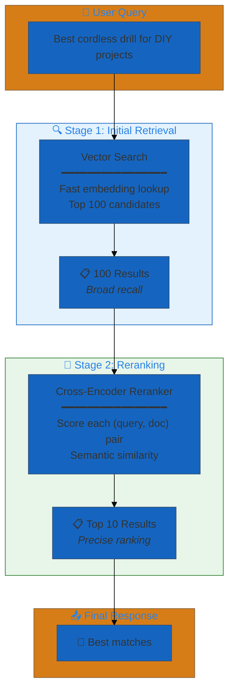
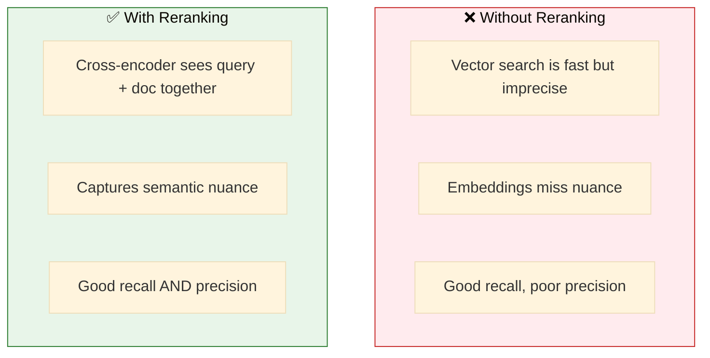
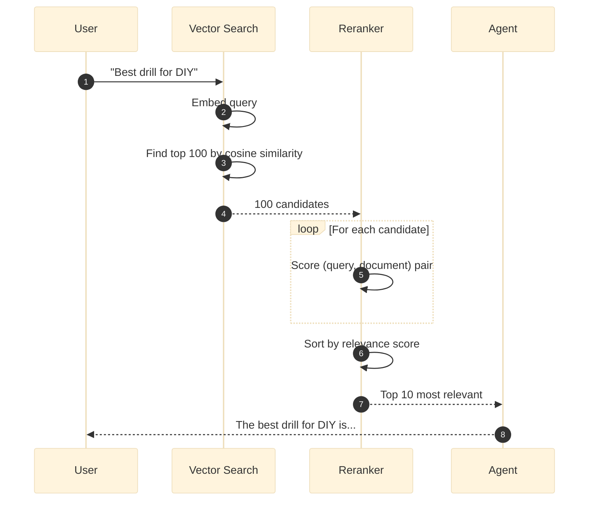
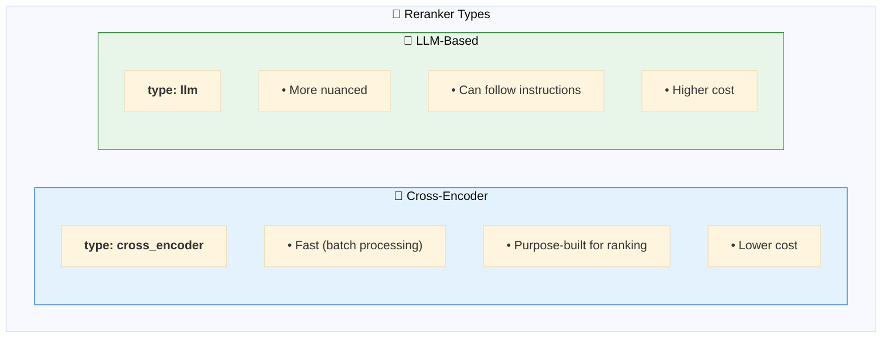
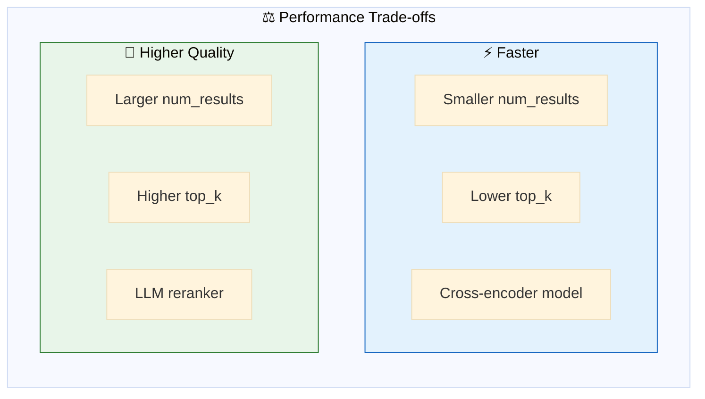
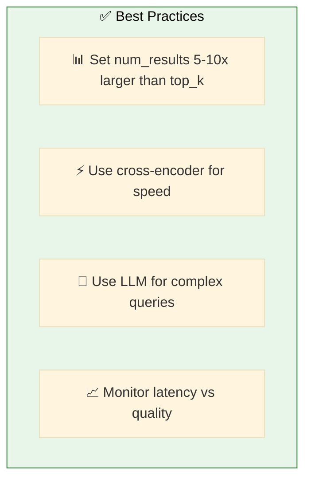

# 03. Reranking

**Improve search result relevance with semantic and instruction-aware reranking**

Improve search quality by reranking initial results using a cross-encoder or LLM-based reranker.

## Architecture Overview



## Examples

| File | Description | Use Case |
|------|-------------|----------|
| [`vector_search_with_reranking.yaml`](./vector_search_with_reranking.yaml) | Vector search + FlashRank reranking | High-quality semantic search with minimal latency |
| [`instruction_aware_reranking.yaml`](./instruction_aware_reranking.yaml) | FlashRank + LLM instruction-aware reranking | Constraint-aware reranking for price/brand/category |

## Why Reranking?



**Key Topics:**
- **Reranking Basics** - How reranking improves search quality
- **FlashRank Integration** - Fast, efficient cross-encoder models
- **Instruction-Aware Reranking** - LLM-based constraint prioritization
- **Performance Trade-offs** - Balance between quality and latency
- **Configuration Patterns** - Setting up reranking pipelines

## Two-Stage Process



## Configuration

```yaml
resources:
  vector_stores:
    products_store: &products_store
      catalog_name: retail_consumer_goods
      schema_name: hardware_store
      index_name: products_vs_index
      columns:
        - product_name
        - description
        - category

  rerankers:
    product_reranker: &product_reranker
      type: cross_encoder           # or 'llm' for LLM-based
      model: databricks-gte-large-en
      top_k: 10                      # Final results count

tools:
  search_tool: &search_tool
    name: search_products
    function:
      type: factory
      name: dao_ai.tools.create_vector_search_tool
      args:
        vector_store: *products_store
        reranker: *product_reranker   # ← Add reranking
        num_results: 100              # ← Initial retrieval count
```

## Reranker Types



### Cross-Encoder Configuration

```yaml
rerankers:
  cross_encoder_reranker: &cross_encoder_reranker
    type: cross_encoder
    model: databricks-gte-large-en
    top_k: 10
```

### LLM-Based Configuration

```yaml
rerankers:
  llm_reranker: &llm_reranker
    type: llm
    model: *default_llm
    top_k: 10
    prompt: |
      Rate the relevance of this document to the query.
      Query: {query}
      Document: {document}
      Score (0-10):
```

## Performance Trade-offs



| Setting | Trade-off |
|---------|-----------|
| `num_results: 50` | Faster, might miss relevant docs |
| `num_results: 200` | Slower, better recall |
| `top_k: 5` | Focused results |
| `top_k: 20` | More comprehensive |

## Quick Start

```bash
# Run with reranking
dao-ai chat -c config/examples/03_reranking/vector_search_with_reranking.yaml

# Compare results
> Search for cordless drills
# Notice: Results are more relevant to intent
```

Ask questions about your data - results will be semantically reranked for better relevance.

## Detailed Reranking Guide

### The Problem
Standard vector search retrieves the top-k results based on vector similarity, but:
- Vector similarity doesn't always match semantic relevance
- Initial retrieval may miss nuanced query intent
- Results may not be ordered optimally for the specific question

### The Solution
Reranking adds a second-stage model that:
1. Takes the initial top-k results (e.g., top 100)
2. Reorders them using a more sophisticated model
3. Returns the top-n most relevant results (e.g., top 5)

### The Benefit
- **Better Relevance**: 20-40% improvement in result quality
- **Minimal Latency**: Only reranks a small set of candidates
- **Cost Effective**: Reranking is faster than re-querying with better embeddings

## Reranking Models

### FlashRank (Recommended)
- **Speed**: Very fast (~10ms per query)
- **Quality**: Excellent for most use cases
- **Size**: Lightweight (~100MB)
- **Local**: Runs locally, no API calls

```yaml
reranker:
  model: flashrank
  top_n: 5
  num_candidates: 20
```

### Custom Rerankers
You can implement custom reranking logic:

```yaml
reranker:
  model: custom
  function: my_package.custom_reranker
  top_n: 5
```

## When to Use Reranking

### ✅ Use Reranking When:
- **Precision matters**: Need the absolute best results
- **Complex queries**: Multi-faceted or nuanced questions
- **Diverse corpus**: Documents vary significantly in style/format
- **User-facing search**: End-user applications where quality is critical

### ❌ Skip Reranking When:
- **Simple lookups**: Exact match queries
- **Small result sets**: Retrieving < 10 results anyway
- **Latency critical**: Need sub-10ms response times
- **Limited compute**: Resource-constrained environments

## Architecture Patterns

### Pattern 1: Two-Stage Retrieval (Recommended)

```
Query → Vector Search (top 100) → Rerank (top 5) → Agent
```

- Fast initial retrieval
- High-quality final results
- Best balance of speed and accuracy

### Pattern 2: FlashRank + Instruction-Aware

```
Query → Vector Search (top 50) → FlashRank (top 20) → Instruction-Aware LLM (top 10) → Agent
```

- FlashRank for semantic relevance (~10ms)
- LLM for constraint prioritization (~100ms)
- Best for queries with explicit constraints (price, brand, category)

## Instruction-Aware Reranking

Instruction-aware reranking adds an LLM stage after FlashRank to consider user constraints:

```yaml
rerank:
  model: ms-marco-MiniLM-L-12-v2
  top_n: 20                          # FlashRank outputs 20 candidates
  instruction_aware:
    model: *fast_llm                 # Use small model for speed
    instructions: |
      Prioritize results matching price and brand constraints.
    top_n: 10                        # Final count after instruction reranking
```

### When to Use Instruction-Aware Reranking
- Queries with explicit price constraints ("under $100")
- Brand preferences ("Milwaukee", "not DeWalt")
- Category requirements ("power tools")
- When FlashRank alone misses nuanced user intent

### Latency Comparison

| Configuration | Latency | Use Case |
|--------------|---------|----------|
| FlashRank only | ~110ms | General queries |
| FlashRank + Instruction-Aware | ~210ms | Constrained queries |

## Best Practices



## Troubleshooting

| Issue | Solution |
|-------|----------|
| Slow reranking | Reduce num_results, use cross-encoder |
| Poor results | Increase num_results, try LLM reranker |
| Missing relevant docs | Increase num_results in initial retrieval |

## Next Steps

- **04_genie/** - Add caching for repeated queries
- **02_mcp/** - Use MCP for vector search
- **10_agent_integrations/** - Combine with other tools

## Related Documentation

- [Reranking Configuration](../../../docs/key-capabilities.md#reranking)
- [Vector Search](../../../docs/configuration-reference.md#vector-stores)
