# 07. Human-in-the-Loop (HITL)

**Require human approval for sensitive operations**

Pause agent execution to request human confirmation before executing critical actions.

## Architecture Overview

```mermaid
%%{init: {'theme': 'base', 'themeVariables': { 'primaryColor': '#c2185b'}}}%%
flowchart TB
    subgraph Agent["🤖 Agent Execution"]
        LLM["🧠 Agent LLM"]
        Tool["🔧 Sensitive Tool<br/><i>update_record</i>"]
        LLM --> Tool
    end

    subgraph HITL["⏸️ Human-in-the-Loop"]
        Interrupt["🛑 Interrupt Execution"]
        Request["📋 Approval Request<br/>━━━━━━━━━━━━━━━━<br/>Tool: update_record<br/>Args: {id: 123, status: 'closed'}"]
        
        Interrupt --> Request
    end

    subgraph Human["👤 Human Review"]
        Review["Review request..."]
        Decision{Approve?}
        Approve["✅ Approve"]
        Reject["❌ Reject"]
        
        Review --> Decision
        Decision -->|"Yes"| Approve
        Decision -->|"No"| Reject
    end

    subgraph Result["📤 Result"]
        Execute["🔧 Execute Tool"]
        Cancel["🚫 Cancel Operation"]
    end

    Tool --> Interrupt
    Request --> Review
    Approve --> Execute
    Reject --> Cancel

    style Agent fill:#e3f2fd,stroke:#1565c0
    style HITL fill:#fff3e0,stroke:#e65100
    style Human fill:#fce4ec,stroke:#c2185b
    style Execute fill:#e8f5e9,stroke:#2e7d32
    style Cancel fill:#ffebee,stroke:#c62828
```



## Examples

| File | Description |
|------|-------------|
| [`hitl_tools.yaml`](./hitl_tools.yaml) | Tool-level approval for sensitive operations |

## How HITL Works

```mermaid
%%{init: {'theme': 'base'}}%%
sequenceDiagram
    autonumber
    participant 👤 as User
    participant 🤖 as Agent
    participant ⏸️ as HITL
    participant 👨‍💼 as Human Reviewer

    👤->>🤖: Close issue #123
    🤖->>🤖: Select update_record tool
    🤖->>⏸️: Requires approval
    ⏸️->>⏸️: Pause execution
    ⏸️->>👨‍💼: Request approval
    Note over 👨‍💼: Review tool: update_record<br/>Args: {id: 123, status: 'closed'}
    👨‍💼-->>⏸️: ✅ Approved
    ⏸️->>🤖: Resume execution
    🤖->>🤖: Execute tool
    🤖-->>👤: Issue #123 has been closed
```



## Configuration

```mermaid
%%{init: {'theme': 'base'}}%%
flowchart TB
    subgraph Config["📄 HITL Configuration"]
        subgraph ToolDef["🔧 Tool Definition"]
            T["tools:<br/>  update_tool: &update_tool<br/>    name: update_record<br/>    <b>human_in_the_loop: true</b><br/>    function:<br/>      type: python<br/>      code: ..."]
        end
        
        subgraph AgentDef["🤖 Agent Uses Tool"]
            A["agents:<br/>  my_agent:<br/>    tools:<br/>      - *update_tool"]
        end
    end

    ToolDef --> AgentDef

    style ToolDef fill:#e3f2fd,stroke:#1565c0
    style AgentDef fill:#e8f5e9,stroke:#2e7d32
```



```yaml
tools:
  # 🔓 Safe tool - no approval needed
  search_tool: &search_tool
    name: search_records
    function:
      type: python
      code: |
        def search_records(query: str):
            return {"results": [...]}

  # 🔒 Sensitive tool - requires approval
  update_tool: &update_tool
    name: update_record
    human_in_the_loop: true       # ← Requires human approval
    function:
      type: python
      code: |
        def update_record(id: int, status: str):
            return {"updated": id, "status": status}

agents:
  assistant: &assistant
    tools:
      - *search_tool     # ✅ Executes immediately
      - *update_tool     # ⏸️ Pauses for approval
```

## HITL Patterns

```mermaid
%%{init: {'theme': 'base'}}%%
graph TB
    subgraph Patterns["🛡️ When to Use HITL"]
        subgraph Write["✏️ Write Operations"]
            W1["Update records"]
            W2["Delete data"]
            W3["Create resources"]
        end
        
        subgraph Sensitive["🔐 Sensitive Actions"]
            S1["Access PII"]
            S2["Financial transactions"]
            S3["Permission changes"]
        end
        
        subgraph External["🌐 External Effects"]
            E1["Send notifications"]
            E2["API calls"]
            E3["File modifications"]
        end
    end

    style Write fill:#e3f2fd,stroke:#1565c0
    style Sensitive fill:#fce4ec,stroke:#c2185b
    style External fill:#fff3e0,stroke:#e65100
```



## Approval Flow

```mermaid
%%{init: {'theme': 'base'}}%%
flowchart TB
    subgraph Request["📋 Approval Request"]
        Info["<b>Tool:</b> update_record<br/><b>Arguments:</b><br/>  id: 123<br/>  status: 'closed'<br/><b>Reason:</b> User requested..."]
    end

    subgraph Options["🎯 Reviewer Options"]
        Approve["✅ <b>Approve</b><br/><i>Execute as requested</i>"]
        Modify["📝 <b>Modify</b><br/><i>Change arguments</i>"]
        Reject["❌ <b>Reject</b><br/><i>Cancel operation</i>"]
    end

    subgraph Outcomes["📤 Outcomes"]
        O1["🔧 Tool executes"]
        O2["🔧 Tool executes with changes"]
        O3["🚫 Agent informed, continues"]
    end

    Request --> Options
    Approve --> O1
    Modify --> O2
    Reject --> O3

    style Request fill:#e3f2fd,stroke:#1565c0
    style Approve fill:#e8f5e9,stroke:#2e7d32
    style Modify fill:#fff3e0,stroke:#e65100
    style Reject fill:#ffebee,stroke:#c62828
```



## Integration with Memory

```mermaid
%%{init: {'theme': 'base'}}%%
flowchart LR
    subgraph WithMemory["🧠 HITL + Memory"]
        Pending["⏸️ Pending approval"]
        Store["💾 State saved"]
        Later["⏰ Hours later..."]
        Resume["▶️ Resume & execute"]
    end

    Pending --> Store
    Store --> Later
    Later --> Resume

    style WithMemory fill:#e3f2fd,stroke:#1565c0
```



For async approval workflows, combine HITL with memory persistence:

```yaml
app:
  orchestration:
    swarm: true
    memory:
      checkpointer:
        type: postgres
        connection_string: "{{secrets/scope/postgres}}"
```

## Quick Start

```bash
dao-ai chat -c config/examples/07_human_in_the_loop/hitl_tools.yaml
```

**Example interaction:**
```
> Close issue #123

⏸️ APPROVAL REQUIRED
Tool: update_record
Arguments: {"id": 123, "status": "closed"}

Approve? [y/n]: y

✅ Issue #123 has been closed.
```

## Best Practices

```mermaid
%%{init: {'theme': 'base'}}%%
graph TB
    subgraph Best["✅ Best Practices"]
        BP1["🎯 Be selective - only sensitive tools"]
        BP2["📝 Clear tool descriptions"]
        BP3["🔍 Log all approvals/rejections"]
        BP4["⏰ Set timeout policies"]
        BP5["🧠 Use memory for async approval"]
    end

    style Best fill:#e8f5e9,stroke:#2e7d32
```



## Troubleshooting

| Issue | Solution |
|-------|----------|
| Tool executes without approval | Verify `human_in_the_loop: true` |
| Approval state lost | Add memory persistence |
| Too many interrupts | Reduce HITL tools, batch operations |

## Next Steps

- **05_memory/** - Persist approval state
- **08_guardrails/** - Combine with quality controls
- **15_complete_applications/** - Production HITL patterns

## Related Documentation

- [Human-in-the-Loop](../../../docs/key-capabilities.md#human-in-the-loop)
- [Memory Configuration](../05_memory/README.md)
