# 16. Instructed Retriever

**Improve retrieval quality with query decomposition and constraint-aware filtering**

Instructed Retriever extends traditional RAG by carrying system specifications through query decomposition, retrieval, and reranking stages. It automatically translates natural language constraints into executable metadata filters.

## Architecture Overview

```mermaid
%%{init: {'theme': 'base', 'themeVariables': { 'primaryColor': '#1565c0'}}}%%
flowchart TB
    subgraph Query["📝 User Query"]
        Q["Milwaukee power drills<br/>under $200 from last month"]
    end

    subgraph Stage1["🔀 Stage 1: Query Decomposition"]
        Decompose["LLM Decomposition<br/>━━━━━━━━━━━━━━━━<br/>Break into subqueries<br/>Extract metadata filters"]
        SubQ["📋 Subqueries + Filters<br/><i>brand_name: MILWAUKEE</i><br/><i>price &lt;: 200</i>"]
    end

    subgraph Stage2["🔍 Stage 2: Parallel Search"]
        VS1["Vector Search 1"]
        VS2["Vector Search 2"]
        VS3["Vector Search N"]
        Results1["📋 Results per query"]
    end

    subgraph Stage3["🎯 Stage 3: RRF Merge"]
        RRF["Reciprocal Rank Fusion<br/>━━━━━━━━━━━━━━━━<br/>Rank-based merging<br/>Deduplicate results"]
        Results2["📋 Merged Results<br/><i>Unified ranking</i>"]
    end

    subgraph Stage4["✨ Stage 4: Rerank"]
        Rerank["Reranker<br/>━━━━━━━━━━━━━━━━<br/>Instruction-aware<br/>Final precision pass"]
        Results3["📋 Top N Results<br/><i>Constraint-aware</i>"]
    end

    Q --> Decompose
    Decompose --> SubQ
    SubQ --> VS1
    SubQ --> VS2
    SubQ --> VS3
    VS1 --> Results1
    VS2 --> Results1
    VS3 --> Results1
    Results1 --> RRF
    RRF --> Results2
    Results2 --> Rerank
    Rerank --> Results3

    style Stage1 fill:#e3f2fd,stroke:#1565c0
    style Stage2 fill:#fff3e0,stroke:#ef6c00
    style Stage3 fill:#f3e5f5,stroke:#7b1fa2
    style Stage4 fill:#e8f5e9,stroke:#2e7d32
```



## Examples

| File | Description | Use Case |
|------|-------------|----------|
| [`instructed_retriever.yaml`](./instructed_retriever.yaml) | Instructed retrieval with RRF merging | Complex queries with metadata constraints |
| [`full_pipeline.yaml`](./full_pipeline.yaml) | Complete pipeline with Router + Verifier | Production-ready with auto-routing and verification |

## Why Instructed Retriever?

```mermaid
%%{init: {'theme': 'base'}}%%
graph TB
    subgraph Problem["❌ Without Instructed Retrieval"]
        P1["Vector search ignores metadata constraints"]
        P2["Can't handle relative time: 'last month'"]
        P3["Misses documents when query has multiple intents"]
        P4["No filter generation from natural language"]
    end
    
    subgraph Solution["✅ With Instructed Retrieval"]
        S1["LLM extracts filters from natural language"]
        S2["Resolves relative time to absolute dates"]
        S3["Subqueries capture different intents"]
        S4["RRF merge handles multi-intent recall"]
    end

    style Problem fill:#ffebee,stroke:#c62828
    style Solution fill:#e8f5e9,stroke:#2e7d32
```



**Key Topics:**
- **Query Decomposition** - Break complex queries into focused subqueries
- **Metadata Reasoning** - Auto-translate constraints to filters ("last month" → timestamp filter)
- **RRF Merging** - Combine results from multiple queries using Reciprocal Rank Fusion
- **Constraint Following** - Enforce recency, exclusions, and other user instructions
- **Query Routing** - Automatically route simple vs complex queries
- **Result Verification** - Validate results meet user constraints with intelligent retry

## Pipeline Flow


## Quick Start

```bash
dao-ai chat -c config/examples/16_instructed_retriever/instructed_retriever.yaml
```

Try queries like:
- "Find Milwaukee power tools under $200 from the last 6 months"
- "Show me cordless drills excluding DeWalt"
- "Recent paint products in the exterior category"

## Configuration

```yaml
retrievers:
  instructed_retriever:
    vector_store: *products_vector_store
    search_parameters:
      num_results: 50
      query_type: HYBRID
    instructed:
      decomposition_model: *fast_llm  # Smaller model for low latency
      schema_description: |
        Products table columns:
        - brand_name (STRING): Brand/manufacturer name
        - category (STRING): Product category
        - price (DOUBLE): Price in USD
        - updated_at (TIMESTAMP): Last update timestamp
        
        Valid filter operators:
        - Equality: {"column": "value"}
        - Comparison: {"column >": value}
        - Exclusion: {"column NOT": "value"}
      constraints:
        - "Prefer recently updated products"
      max_subqueries: 3
      rrf_k: 60
      examples:
        - query: "cheap Milwaukee drills"
          filters: {"price <": 100, "brand_name": "Milwaukee"}
    rerank:
      top_n: 10
```

## Pipeline Components

```mermaid
%%{init: {'theme': 'base'}}%%
graph TB
    subgraph Components["🔧 Pipeline Components"]
        subgraph Router["🔀 Router"]
            R1["<b>Selects execution mode</b>"]
            R2["• standard: simple queries"]
            R3["• instructed: constrained queries"]
            R4["• auto_bypass for fast path"]
        end
        
        subgraph Decomposer["🧠 Decomposer"]
            D1["<b>Query decomposition</b>"]
            D2["• Extracts metadata filters"]
            D3["• Resolves relative dates"]
            D4["• Generates subqueries"]
        end
        
        subgraph RRF["📊 RRF Merge"]
            M1["<b>Reciprocal Rank Fusion</b>"]
            M2["• Rank-based scoring"]
            M3["• Deduplicates results"]
            M4["• Score: 1/(k + rank)"]
        end
        
        subgraph Verifier["✅ Verifier"]
            V1["<b>Result validation</b>"]
            V2["• Checks constraints met"]
            V3["• Provides retry feedback"]
            V4["• Structured error info"]
        end
    end

    style Router fill:#e3f2fd,stroke:#1565c0
    style Decomposer fill:#fff3e0,stroke:#ef6c00
    style RRF fill:#f3e5f5,stroke:#7b1fa2
    style Verifier fill:#e8f5e9,stroke:#2e7d32
```



## Key Configuration Fields

### `decomposition_model`
Use a smaller, faster model (GPT-3.5, Llama 3 8B) for decomposition to keep latency low while the main agent uses a larger model for synthesis.

### `schema_description`
Critical for filter translation. Must include:
- Exact column names and types
- Valid filter syntax for Databricks Vector Search
- Example values when helpful

### `examples`
Few-shot examples teach the LLM your metadata "dialect":
```yaml
examples:
  - query: "cheap Milwaukee drills"
    filters: {"price <": 100, "brand_name": "Milwaukee"}
  - query: "exterior paint from last month"
    filters: {"category": "Exterior Paint", "updated_at >": "2025-12-01"}
```

### `rrf_k`
RRF constant (default: 60). Lower values weight top ranks more heavily.

## How RRF Merge Works

```mermaid
%%{init: {'theme': 'base'}}%%
flowchart LR
    subgraph Input["📥 Input Lists"]
        L1["List 1: [A, B, C, D]"]
        L2["List 2: [C, A, E, F]"]
        L3["List 3: [B, E, A, G]"]
    end
    
    subgraph Scoring["📊 RRF Scoring"]
        S["Score = Σ 1/(k + rank)<br/>━━━━━━━━━━━━━━━━<br/>A: 1/61 + 1/62 + 1/63 = 0.049<br/>B: 1/62 + 1/61 = 0.033<br/>C: 1/63 + 1/61 = 0.032"]
    end
    
    subgraph Output["📤 Merged Output"]
        O["[A, B, C, E, D, F, G]<br/><i>Sorted by RRF score</i>"]
    end
    
    Input --> Scoring --> Output
    
    style Scoring fill:#f3e5f5,stroke:#7b1fa2
```



**Why RRF over raw scores?**
- Databricks Vector Search scores aren't normalized across query types (HYBRID vs ANN)
- RRF uses rank position, making it score-agnostic
- Documents appearing in multiple lists get boosted

## Filter Syntax

The decomposer generates filters using Databricks Vector Search syntax:

```mermaid
%%{init: {'theme': 'base'}}%%
graph TB
    subgraph Operators["🔧 Supported Filter Operators"]
        subgraph Equality["Equality"]
            E1["{'brand': 'MILWAUKEE'}"]
            E2["{'brand': ['A', 'B']}"]
        end
        
        subgraph Comparison["Comparison"]
            C1["{'price <': 100}"]
            C2["{'price >=': 50}"]
        end
        
        subgraph Exclusion["Exclusion"]
            X1["{'brand NOT': 'DEWALT'}"]
            X2["{'desc NOT LIKE': 'refurb'}"]
        end
        
        subgraph Pattern["Pattern Match"]
            P1["{'desc LIKE': 'cordless'}"]
        end
    end

    style Equality fill:#e3f2fd,stroke:#1565c0
    style Comparison fill:#fff3e0,stroke:#ef6c00
    style Exclusion fill:#ffebee,stroke:#c62828
    style Pattern fill:#e8f5e9,stroke:#2e7d32
```



## Full Pipeline (Router + Verifier)

The `full_pipeline.yaml` example demonstrates all components working together:

```mermaid
%%{init: {'theme': 'base'}}%%
flowchart TB
    subgraph Simple["⚡ Simple Query Path"]
        direction TB
        SQ["'drill bits'"]
        SR["Router → standard"]
        SS["Standard Search"]
        SF["FlashRank"]
        SOut["Results<br/><i>~150ms</i>"]
        
        SQ --> SR --> SS --> SF --> SOut
    end
    
    subgraph Complex["🎯 Complex Query Path"]
        direction TB
        CQ["'Milwaukee drills<br/>excluding DeWalt'"]
        CR["Router → instructed"]
        CD["Decompose"]
        CP["Parallel Search"]
        CM["RRF Merge"]
        CF["FlashRank"]
        CI["Instruction Rerank"]
        CV["Verifier"]
        COut["Results<br/><i>~800-1200ms</i>"]
        
        CQ --> CR --> CD --> CP --> CM --> CF --> CI --> CV --> COut
    end

    style Simple fill:#e8f5e9,stroke:#2e7d32
    style Complex fill:#e3f2fd,stroke:#1565c0
```



### Auto-Bypass Behavior

When Router selects "standard" mode and `auto_bypass: true` (default):
- Instruction Reranker is skipped
- Verifier is skipped
- Simple queries stay fast (~150ms)

### Verification with Retry

The Verifier returns structured feedback for intelligent retry:

```python
VerificationResult(
    passed=False,
    confidence=0.6,
    feedback="Results are all blue shoes, user wanted red",
    suggested_filter_relaxation={"color": "REMOVE"},
    unmet_constraints=["color preference"]
)
```

On retry, this feedback is passed to decomposition to adjust filters.

## Performance Tuning

```mermaid
%%{init: {'theme': 'base'}}%%
graph LR
    subgraph Tradeoffs["⚖️ Performance Trade-offs"]
        subgraph Fast["⚡ Faster"]
            F1["Smaller decomposition model"]
            F2["Fewer max_subqueries"]
            F3["Lower num_results"]
            F4["Skip verifier"]
        end
        
        subgraph Quality["🎯 Higher Quality"]
            Q1["Larger decomposition model"]
            Q2["More max_subqueries"]
            Q3["Higher num_results"]
            Q4["Enable verifier + retry"]
        end
    end

    style Fast fill:#e3f2fd,stroke:#1565c0
    style Quality fill:#e8f5e9,stroke:#2e7d32
```



| Setting | Trade-off |
|---------|-----------|
| `max_subqueries: 2` | Faster, might miss intents |
| `max_subqueries: 5` | Slower, broader coverage |
| `rrf_k: 30` | Top ranks weighted more |
| `rrf_k: 100` | More uniform weighting |

### Decomposition Model
- Use a smaller model (GPT-3.5, Llama 3 8B) for speed
- Larger models improve filter accuracy but add latency

### Latency Comparison

| Configuration | Latency | Use Case |
|--------------|---------|----------|
| Standard (no decomposition) | ~100ms | Simple queries |
| Instructed (decomposition only) | ~200-300ms | Constrained queries |
| Full Pipeline (all stages) | ~800-1200ms | Complex queries with verification |

## Fallback Behavior

If decomposition fails (LLM error, parsing error), the system automatically falls back to standard single-query search. This ensures robustness in production.

## Observability Tags

MLflow tags for debugging:
- `router.mode`: "standard" or "instructed"
- `router.fallback`: "true" if Router LLM failed
- `router.bypassed_stages`: "true" if auto_bypass triggered
- `verifier.outcome`: "passed", "warned", "retried", "exhausted"
- `verifier.retries`: number of retry attempts
- `reranker.instruction_avg_score`: average score of returned results

### Quick Start

```bash
dao-ai chat -c config/examples/16_instructed_retriever/full_pipeline.yaml
```

## Best Practices

```mermaid
%%{init: {'theme': 'base'}}%%
graph TB
    subgraph Best["✅ Best Practices"]
        BP1["📊 Provide comprehensive schema_description"]
        BP2["📝 Include 3-5 few-shot examples"]
        BP3["⚡ Use small models for decomposition"]
        BP4["🔄 Enable auto_bypass for mixed workloads"]
        BP5["📈 Monitor verifier outcomes"]
    end

    style Best fill:#e8f5e9,stroke:#2e7d32
```



## Troubleshooting

| Issue | Solution |
|-------|----------|
| Poor filter extraction | Add more few-shot examples |
| Slow decomposition | Use smaller model (Haiku, GPT-3.5) |
| Missing relevant docs | Increase max_subqueries |
| Filters too restrictive | Adjust constraints, add fallback |
| Verifier always fails | Relax constraints, reduce max_retries |

## Next Steps

- **03_reranking/** - Combine with FlashRank for maximum precision
- **15_complete_applications/** - See instructed retrieval in production apps

## Related Documentation

- [Reranking Configuration](../../../docs/key-capabilities.md#reranking)
- [Vector Search](../../../docs/configuration-reference.md#vector-stores)
