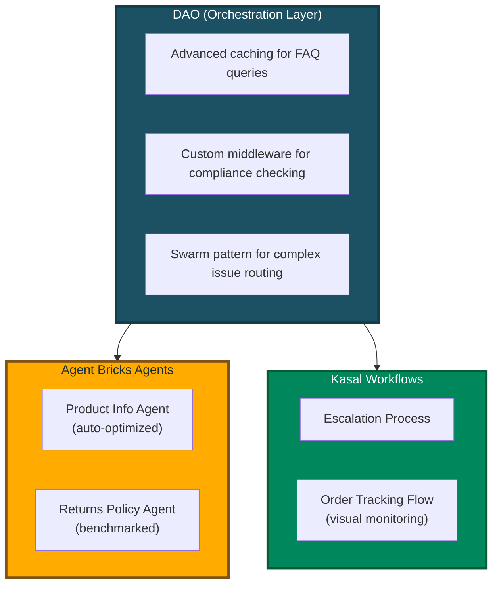

# Why DAO?

## For Newcomers to AI Agents

**What is an AI Agent?**
Think of an AI agent as an intelligent assistant that can actually *do things*, not just chat. Here's the difference:

- **Chatbot**: "The temperature in San Francisco is 65°F" (just talks)
- **AI Agent**: Checks weather APIs, searches your calendar, books a restaurant, and sends you a reminder (takes action)

An AI agent can:
- **Reason** about what steps are needed to accomplish a goal
- **Use tools** like databases, APIs, and search engines to gather information
- **Make decisions** about which actions to take next
- **Coordinate** with other specialized agents to handle complex requests

**Real-world example:** 
*"Find products that are low on stock and email the warehouse manager"*

- A chatbot would say: *"You should check inventory and contact the warehouse manager"*
- An AI agent would: Query the database, identify low-stock items, compose an email with the list, and send it

**What is Databricks?**
Databricks is a cloud platform where companies store and analyze their data. Think of it as a combination of:
- **Data warehouse** (where your business data lives)
- **AI/ML platform** (where you train and deploy models)
- **Governance layer** (controlling who can access what data)

Databricks provides several tools that DAO integrates with:
- **Unity Catalog**: Your organization's data catalog with security and permissions
- **Model Serving**: Turns AI models into APIs that applications can call
- **Vector Search**: Finds relevant information using semantic similarity (understanding meaning, not just keywords)
- **Genie**: Lets people ask questions in plain English and automatically generates SQL queries
- **MLflow**: Tracks experiments, versions models, and manages deployments

**Why DAO?**
DAO brings all these Databricks capabilities together into a unified framework for building AI agent systems. Instead of writing hundreds of lines of Python code to connect everything, you describe what you want in a YAML configuration file, and DAO handles the wiring for you.

**Think of it as:**
- **Traditional approach**: Building with LEGO bricks one by one (writing Python code)
- **DAO approach**: Using a blueprint that tells you exactly how to assemble the pieces (YAML configuration)

---

## Comparing Databricks AI Agent Platforms

Databricks offers **three complementary approaches** to building AI agents. Each is powerful and purpose-built for different use cases, teams, and workflows.

| Aspect | **DAO** (This Framework) | **Databricks Agent Bricks** | **Kasal** |
|--------|--------------------------|----------------------------|----------------------|
| **Interface** | YAML configuration files | Visual GUI (AI Playground) | Visual workflow designer (drag-and-drop canvas) |
| **Workflow** | Code-first, Git-native | UI-driven, wizard-based | Visual flowchart design with real-time monitoring |
| **Target Users** | ML Engineers, Platform Teams, DevOps | Data Analysts, Citizen Developers, Business Users | Business analysts, workflow designers, operations teams |
| **Learning Curve** | Moderate (requires YAML/config knowledge) | Low (guided wizards and templates) | Low (visual drag-and-drop, no coding required) |
| **Underlying Engine** | LangGraph (state graph orchestration) | Databricks-managed agent runtime | CrewAI (role-based agent collaboration) |
| **Orchestration** | Multi-agent patterns (Supervisor, Swarm) | Multi-agent Supervisor | CrewAI sequential/hierarchical processes |
| **Agent Philosophy** | State-driven workflows with graph execution | Automated optimization and template-based | Role-based agents with defined tasks and goals |
| **Tool Support** | Python, Factory, UC Functions, MCP, Agent Endpoints, Genie | UC Functions, MCP, Genie, Agent Endpoints | Genie, Custom APIs, UC Functions, Data connectors |
| **Advanced Caching** | LRU + Semantic caching (Genie SQL caching) | Standard platform caching | Standard platform caching |
| **Memory/State** | PostgreSQL, Lakebase, In-Memory, Custom backends | Built-in ephemeral state per conversation | Built-in conversation state (entity memory with limitations) |
| **Middleware/Hooks** | Assert/Suggest/Refine, Custom lifecycle hooks, Guardrails | None (optimization via automated tuning) | None (workflow-level control via UI) |
| **Deployment** | Databricks Asset Bundles, MLflow, CI/CD pipelines | One-click deployment to Model Serving | Databricks Marketplace or deploy from source |
| **Version Control** | Full Git integration, code review, branches | Workspace-based (not Git-native) | Source-based (Git available if deployed from source) |
| **Customization** | Unlimited (Python code, custom tools) | Template-based workflows | Workflow-level customization via visual designer |
| **Configuration** | Declarative YAML, infrastructure-as-code | Visual configuration in UI | Visual workflow canvas with property panels |
| **Monitoring** | MLflow tracking, custom logging | Built-in evaluation dashboard | Real-time execution tracking with detailed logs |
| **Evaluation** | Custom evaluation frameworks | Automated benchmarking and optimization | Visual execution traces and performance insights |
| **Best For** | Production multi-agent systems with complex requirements | Rapid prototyping and automated optimization | Visual workflow design and operational monitoring |

### When to Use DAO

✅ **Code-first workflow** — You prefer infrastructure-as-code with full Git integration, code reviews, and CI/CD pipelines  
✅ **Advanced caching** — You need LRU + semantic caching for Genie queries to optimize costs at scale  
✅ **Custom middleware** — You require assertion/validation logic, custom lifecycle hooks, or human-in-the-loop workflows  
✅ **Custom tools** — You're building proprietary Python tools or integrating with internal systems beyond standard integrations  
✅ **Swarm orchestration** — You need peer-to-peer agent handoffs (not just top-down supervisor routing)  
✅ **Stateful memory** — You require persistent conversation state in PostgreSQL, Lakebase, or custom backends  
✅ **Configuration reuse** — You want to maintain YAML templates, share them across teams, and version them in Git  
✅ **Regulated environments** — You need deterministic, auditable, and reproducible configurations for compliance  
✅ **Complex state management** — Your workflows require sophisticated state graphs with conditional branching and loops  

### When to Use Agent Bricks

✅ **Rapid prototyping** — You want to build and test an agent in minutes using guided wizards  
✅ **No-code/low-code** — You prefer GUI-based configuration over writing YAML or designing workflows  
✅ **Automated optimization** — You want the platform to automatically tune prompts, models, and benchmarks for you  
✅ **Business user access** — Non-technical stakeholders (analysts, product managers) need to build or modify agents  
✅ **Getting started** — You're new to AI agents and want pre-built templates (Information Extraction, Knowledge Assistant, Custom LLM)  
✅ **Standard use cases** — Your needs are met by UC Functions, MCP servers, Genie, and agent endpoints  
✅ **Multi-agent supervisor** — You need top-down orchestration with a supervisor routing to specialists  
✅ **Quality optimization** — You want automated benchmarking and continuous improvement based on feedback  

### When to Use Kasal

✅ **Visual workflow design** — You want to see and design agent interactions as a flowchart diagram  
✅ **Operational monitoring** — You need real-time visibility into agent execution with detailed logs and traces  
✅ **Role-based agents** — Your use case fits the CrewAI model of agents with specific roles, goals, and tasks  
✅ **Business process automation** — You're automating workflows where agents collaborate sequentially or hierarchically  
✅ **Data analysis pipelines** — You need agents to query, analyze, and visualize data with clear execution paths  
✅ **Content generation workflows** — Your agents collaborate on research, writing, and content creation tasks  
✅ **Team visibility** — Operations teams need to monitor and understand what agents are doing in real-time  
✅ **Quick deployment** — You want to deploy from Databricks Marketplace with minimal setup  
✅ **Drag-and-drop simplicity** — You prefer designing workflows visually rather than writing configuration files  

### Using All Three Together

Many teams use **multiple approaches** in their workflow, playing to each platform's strengths:

#### Progressive Sophistication Path

1. **Design in Kasal** → Visually prototype workflows and validate agent collaboration patterns
2. **Optimize in Agent Bricks** → Take validated use cases and let Agent Bricks auto-tune them
3. **Productionize in DAO** → For complex systems needing advanced features, rebuild in DAO with full control

#### Hybrid Architecture Patterns

**Pattern 1: Division by Audience**
- **Kasal**: Operations teams design and monitor customer support workflows
- **Agent Bricks**: Data analysts create optimized information extraction agents  
- **DAO**: ML engineers build the underlying orchestration layer with custom tools

**Pattern 2: Composition via Endpoints**
- **Agent Bricks**: Creates a Knowledge Assistant for HR policies (optimized automatically)
- **Kasal**: Designs a visual workflow for employee onboarding that calls the HR agent
- **DAO**: Orchestrates enterprise-wide employee support with custom payroll tools, approval workflows, and the agents from both platforms

**Pattern 3: Development Lifecycle**
- **Week 1**: Rapid prototype in Agent Bricks to validate business value
- **Week 2**: Redesign workflow visually in Kasal for team review and monitoring
- **Week 3**: Productionize in DAO with advanced caching, middleware, and CI/CD

#### Real-World Example: Customer Support System



#### Interoperability

All three platforms can call each other via **agent endpoints**:
- Deploy any agent to Databricks Model Serving
- Reference it as a tool using the `factory` tool type with `create_agent_endpoint_tool`
- Compose complex systems across platform boundaries

**Example:**
```yaml
# In DAO configuration
resources:
  llms:
    external_agent: &external_agent
      name: agent-bricks-hr-assistant  # Agent Bricks endpoint name

tools:
  hr_assistant:
    function:
      type: factory
      name: dao_ai.tools.create_agent_endpoint_tool
      args:
        llm: *external_agent
        name: hr_assistant
        description: "HR assistant built in Agent Bricks"
  
  workflow_monitor:
    function:
      type: factory
      name: dao_ai.tools.create_agent_endpoint_tool
      args:
        llm:
          name: kasal-workflow-monitor  # Kasal endpoint name
        name: workflow_monitor
        description: "Workflow monitor built in Kasal"
```

---

## Navigation

- [↑ Back to Documentation Index](../README.md#-documentation)
- [Next: Architecture →](architecture.md)

