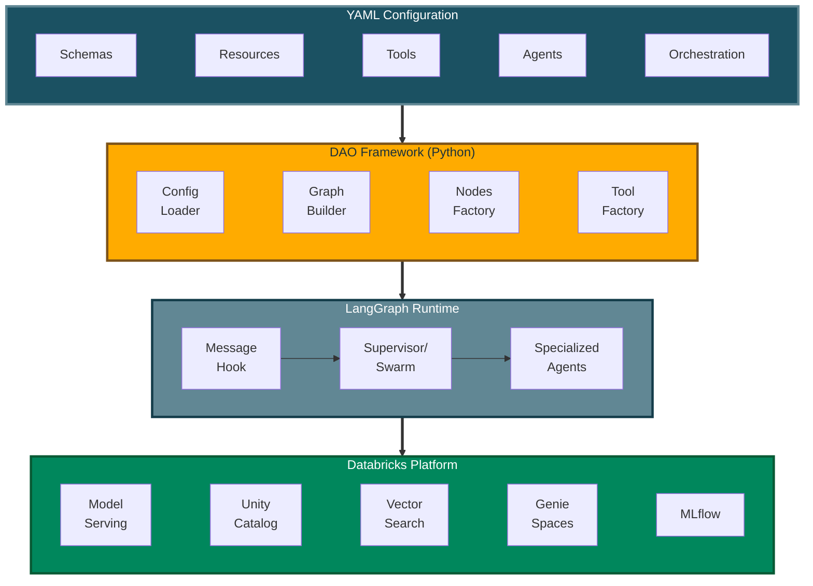

# DAO: Declarative Agent Orchestration

[](CHANGELOG.md)
[](https://www.python.org/)
[](LICENSE)

**Production-grade AI agents defined in YAML, powered by LangGraph, deployed on Databricks.**

DAO is an **infrastructure-as-code framework** for building, deploying, and managing multi-agent AI systems. Instead of writing boilerplate Python code to wire up agents, tools, and orchestration, you define everything declaratively in YAML configuration files.

```yaml
# Define an agent in 10 lines of YAML
agents:
  product_expert:
    name: product_expert
    model: *claude_sonnet
    tools:
      - *vector_search_tool
      - *genie_tool
    prompt: |
      You are a product expert. Answer questions about inventory and pricing.
```

### 🎨 Visual Configuration Studio

Prefer a visual interface? Check out **[DAO AI Builder](https://github.com/natefleming/dao-ai-builder)** — a React-based web application that provides a graphical interface for creating and editing DAO configurations. Perfect for:

- **Exploring** DAO's capabilities through an intuitive UI
- **Learning** the configuration structure with guided forms
- **Building** agents visually without writing YAML manually
- **Importing** and editing existing configurations

DAO AI Builder generates valid YAML configurations that work seamlessly with this framework. Use whichever workflow suits you best — visual builder or direct YAML editing.

<p align="center">
  
</p>

---

## 📚 Documentation

### Getting Started
- **[Why DAO?](docs/why-dao.md)** - Learn what DAO is and how it compares to other platforms
- **[Quick Start](#quick-start)** - Build and deploy your first agent in minutes
- **[Architecture](docs/architecture.md)** - Understand how DAO works under the hood

### Core Concepts
- **[Key Capabilities](docs/key-capabilities.md)** - Explore 15 powerful features for production agents
- **[Configuration Reference](docs/configuration-reference.md)** - Complete YAML configuration guide
- **[Examples](docs/examples.md)** - Ready-to-use example configurations

### Reference
- **[CLI Reference](docs/cli-reference.md)** - Command-line interface documentation
- **[Python API](docs/python-api.md)** - Programmatic usage and customization
- **[FAQ](docs/faq.md)** - Frequently asked questions

### Contributing
- **[Contributing Guide](docs/contributing.md)** - How to contribute to DAO

---

## Quick Start

### Prerequisites

Before you begin, you'll need:

- **Python 3.11 or newer** installed on your computer ([download here](https://www.python.org/downloads/))
- **A Databricks workspace** (ask your IT team or see [Databricks docs](https://docs.databricks.com/))
  - Access to **Unity Catalog** (your organization's data catalog)
  - **Model Serving** or **Databricks Apps** enabled (for deploying AI agents)
  - *Optional*: Vector Search, Genie (for advanced features)

**Not sure if you have access?** Your Databricks administrator can grant you permissions.

### Installation

**Option 1: Install from PyPI (Recommended)**

The simplest way to get started:

```bash
# Install directly from PyPI
pip install dao-ai
```

**Option 2: For developers familiar with Git**

```bash
# Clone this repository
git clone <repo-url>
cd dao-ai

# Create an isolated Python environment
uv venv
source .venv/bin/activate  # On Windows: .venv\Scripts\activate

# Install DAO and its dependencies
make install
```

**Option 3: For those new to development**

1. Download this project as a ZIP file (click the green "Code" button on GitHub → Download ZIP)
2. Extract the ZIP file to a folder on your computer
3. Open a terminal/command prompt and navigate to that folder
4. Run these commands:

```bash
# On Mac/Linux:
python3 -m venv .venv
source .venv/bin/activate
pip install -e .

# On Windows:
python -m venv .venv
.venv\Scripts\activate
pip install -e .
```

**Verification:** Run `dao-ai --version` to confirm the installation succeeded.

### Your First Agent

Let's build a simple AI assistant in 4 steps. This agent will use a language model from Databricks to answer questions.

**Step 1: Create a configuration file**

Create a new file called `config/my_agent.yaml` and paste this content:

```yaml
schemas:
  my_schema: &my_schema
    catalog_name: my_catalog        # Replace with your Unity Catalog name
    schema_name: my_schema          # Replace with your schema name

resources:
  llms:
    default_llm: &default_llm
      name: databricks-meta-llama-3-3-70b-instruct  # The AI model to use

agents:
  assistant: &assistant
    name: assistant
    model: *default_llm
    prompt: |
      You are a helpful assistant.

app:
  name: my_first_agent
  registered_model:
    schema: *my_schema
    name: my_first_agent
  agents:
    - *assistant
  orchestration:
    swarm:
      default_agent: *assistant
```

**💡 What's happening here?**
- `schemas`: Points to your Unity Catalog location (where the agent will be registered)
- `resources`: Defines the AI model (Llama 3.3 70B in this case)
- `agents`: Describes your assistant agent and its behavior
- `app`: Configures how the agent is deployed and orchestrated

**Step 2: Validate your configuration**

This checks for errors in your YAML file:

```bash
dao-ai validate -c config/my_agent.yaml
```

You should see: ✅ `Configuration is valid!`

**Step 3: Visualize the agent workflow** (optional)

Generate a diagram showing how your agent works:

```bash
dao-ai graph -c config/my_agent.yaml -o my_agent.png
```

This creates `my_agent.png` — open it to see a visual representation of your agent.

**Step 4: Deploy to Databricks**

**Option A: Using Python** (programmatic deployment)

```python
from dao_ai.config import AppConfig

# Load your configuration
config = AppConfig.from_file("config/my_agent.yaml")

# Package the agent as an MLflow model
config.create_agent()

# Deploy to Databricks Model Serving
config.deploy_agent()
```

**Option B: Using the CLI** (one command)

```bash
dao-ai bundle --deploy --run -c config/my_agent.yaml
```

This single command:
1. Validates your configuration
2. Packages the agent
3. Deploys it to Databricks
4. Creates a serving endpoint

**Deploying to a specific workspace:**

```bash
# Deploy to AWS workspace
dao-ai bundle --deploy --run -c config/my_agent.yaml --profile aws-field-eng

# Deploy to Azure workspace
dao-ai bundle --deploy --run -c config/my_agent.yaml --profile azure-retail
```

**Step 5: Interact with your agent**

Once deployed, you can chat with your agent using Python:

```python
from mlflow.deployments import get_deploy_client

# Connect to your Databricks workspace
client = get_deploy_client("databricks")

# Send a message to your agent
response = client.predict(
    endpoint="my_first_agent",
    inputs={
        "messages": [{"role": "user", "content": "Hello! What can you help me with?"}],
        "configurable": {
            "thread_id": "1",           # Conversation ID
            "user_id": "demo_user"      # User identifier
        }
    }
)

# Print the agent's response
print(response["message"]["content"])
```

**🎉 Congratulations!** You've built and deployed your first AI agent with DAO.

**Next steps:**
- Explore the [`config/examples/`](config/examples/) folder for more advanced configurations
- Try the [DAO AI Builder](https://github.com/natefleming/dao-ai-builder) visual interface
- Learn about [Key Capabilities](docs/key-capabilities.md) to add advanced features
- Read the [Architecture](docs/architecture.md) documentation to understand how it works

---

## Key Features at a Glance

DAO provides powerful capabilities for building production-ready AI agents:

| Feature | Description |
|---------|-------------|
| **Dual Deployment Targets** | Deploy to Databricks Model Serving or Databricks Apps with a single config |
| **Multi-Tool Support** | Python functions, Unity Catalog, MCP, Agent Endpoints |
| **On-Behalf-Of User** | Per-user permissions and governance |
| **Advanced Caching** | Two-tier (LRU + Semantic) caching for cost optimization |
| **Vector Search Reranking** | Improve RAG quality with FlashRank |
| **Human-in-the-Loop** | Approval workflows for sensitive operations |
| **Memory & Persistence** | PostgreSQL, Lakebase, or in-memory state |
| **Prompt Registry** | Version and manage prompts in MLflow |
| **Prompt Optimization** | Automated tuning with GEPA (Generative Evolution of Prompts and Agents) |
| **Guardrails** | Content filters, safety checks, validation |
| **Middleware** | Input validation, logging, performance monitoring, audit trails |
| **Conversation Summarization** | Handle long conversations automatically |
| **Structured Output** | JSON schema for predictable responses |
| **Custom I/O** | Flexible input/output with runtime state |
| **Hook System** | Lifecycle hooks for initialization and cleanup |

👉 **Learn more:** [Key Capabilities Documentation](docs/key-capabilities.md)

---

## Architecture Overview



👉 **Learn more:** [Architecture Documentation](docs/architecture.md)

---

## Example Configurations

The `config/examples/` directory contains ready-to-use configurations organized in a **progressive learning path**:

- `01_getting_started/minimal.yaml` - Simplest possible agent
- `02_tools/vector_search_with_reranking.yaml` - RAG with improved accuracy
- `04_genie/genie_semantic_cache.yaml` - NL-to-SQL with PostgreSQL semantic caching
- `04_genie/genie_in_memory_semantic_cache.yaml` - NL-to-SQL with in-memory semantic caching (no database)
- `05_memory/conversation_summarization.yaml` - Long conversation handling
- `06_on_behalf_of_user/obo_basic.yaml` - User-level access control
- `07_human_in_the_loop/human_in_the_loop.yaml` - Approval workflows

And many more! Follow the numbered path or jump to what you need. See the full guide in [Examples Documentation](docs/examples.md).

---

## CLI Quick Reference

```bash
# Validate configuration
dao-ai validate -c config/my_config.yaml

# Generate JSON schema for IDE support
dao-ai schema > schemas/model_config_schema.json

# Visualize agent workflow
dao-ai graph -c config/my_config.yaml -o workflow.png

# Deploy with Databricks Asset Bundles
dao-ai bundle --deploy --run -c config/my_config.yaml

# Deploy to a specific workspace (multi-cloud support)
dao-ai bundle --deploy -c config/my_config.yaml --profile aws-field-eng
dao-ai bundle --deploy -c config/my_config.yaml --profile azure-retail

# Interactive chat with agent
dao-ai chat -c config/my_config.yaml
```

### Multi-Cloud Deployment

DAO AI supports deploying to Azure, AWS, and GCP workspaces with automatic cloud detection:

```bash
# Deploy to AWS workspace
dao-ai bundle --deploy -c config/my_config.yaml --profile aws-prod

# Deploy to Azure workspace
dao-ai bundle --deploy -c config/my_config.yaml --profile azure-prod

# Deploy to GCP workspace
dao-ai bundle --deploy -c config/my_config.yaml --profile gcp-prod
```

The CLI automatically:
- Detects the cloud provider from your profile's workspace URL
- Selects appropriate compute node types for each cloud
- Creates isolated deployment state per profile

👉 **Learn more:** [CLI Reference Documentation](docs/cli-reference.md)

---

## Community & Support

- **Documentation**: [docs/](docs/)
- **Examples**: [config/examples/](config/examples/)
- **Issues**: [GitHub Issues](https://github.com/your-org/dao-ai/issues)
- **Discussions**: [GitHub Discussions](https://github.com/your-org/dao-ai/discussions)

---

## Contributing

We welcome contributions! See the [Contributing Guide](docs/contributing.md) for details on:

- Setting up your development environment
- Code style and testing guidelines
- How to submit pull requests
- Project structure overview

---

## License

This project is licensed under the MIT License - see the [LICENSE](LICENSE) file for details.
