# 01. Getting Started

**Foundation concepts for beginners**

Your starting point for DAO AI. These examples introduce core concepts with minimal complexity.

## Architecture Overview

```mermaid
%%{init: {'theme': 'base', 'themeVariables': { 'primaryColor': '#1565c0', 'primaryTextColor': '#fff'}}}%%
flowchart TB
    subgraph User["👤 User"]
        Query["What products do you have?"]
    end

    subgraph DAO["🤖 DAO AI Application"]
        subgraph Agent["Simple Agent"]
            direction TB
            LLM["🧠 Claude Sonnet 4<br/><i>Language Model</i>"]
            Prompt["📝 System Prompt<br/><i>Retail Assistant</i>"]
            LLM --- Prompt
        end
        
        subgraph Tools["🔧 Available Tools"]
            direction LR
            Genie["🧞 Genie Tool<br/><i>Natural Language → SQL</i>"]
            VS["🔍 Vector Search<br/><i>Semantic Search</i>"]
        end

        Agent --> Tools
    end

    subgraph Databricks["☁️ Databricks Platform"]
        direction TB
        GenieRoom["🧞 Genie Room<br/><i>retail_genie_room</i>"]
        VectorStore["📊 Vector Store<br/><i>products_vector_store</i>"]
        UC["🗄️ Unity Catalog<br/><i>retail_consumer_goods.hardware_store</i>"]
        
        GenieRoom --> UC
        VectorStore --> UC
    end

    Query --> Agent
    Genie --> GenieRoom
    VS --> VectorStore
    Agent -->|"Response"| Query

    style User fill:#f5f5f5,stroke:#424242
    style Agent fill:#e3f2fd,stroke:#1565c0
    style Tools fill:#fff3e0,stroke:#e65100
    style Databricks fill:#e8f5e9,stroke:#2e7d32
```



## Examples

| File | Description | Prerequisites |
|------|-------------|---------------|
| [`minimal.yaml`](./minimal.yaml) | Simplest agent with Genie and Vector Search | Databricks workspace, LLM endpoint |

## Configuration Structure

```mermaid
%%{init: {'theme': 'base'}}%%
flowchart TB
    subgraph YAML["📄 minimal.yaml Structure"]
        direction TB
        
        subgraph S1["1️⃣ schemas:"]
            Schema["Define Unity Catalog location<br/><code>catalog_name: retail_consumer_goods</code><br/><code>schema_name: hardware_store</code>"]
        end
        
        subgraph S2["2️⃣ resources:"]
            LLMs["<b>llms:</b> Language models"]
            VS["<b>vector_stores:</b> Search indexes"]
            GR["<b>genie_rooms:</b> Genie spaces"]
        end
        
        subgraph S3["3️⃣ tools:"]
            GT["<b>genie_tool:</b> Natural language SQL"]
            VST["<b>vector_search_tool:</b> Semantic search"]
        end
        
        subgraph S4["4️⃣ agents:"]
            Agent["<b>simple_agent:</b><br/>• model: *default_llm<br/>• tools: [*genie_tool, *vector_search_tool]<br/>• prompt: You are a helpful..."]
        end
        
        subgraph S5["5️⃣ app:"]
            App["<b>name:</b> minimal_dao<br/><b>agents:</b> [*simple_agent]<br/><b>registered_model:</b> ..."]
        end
    end

    S1 --> S2 --> S3 --> S4 --> S5

    style S1 fill:#e3f2fd,stroke:#1565c0
    style S2 fill:#e8f5e9,stroke:#2e7d32
    style S3 fill:#fff3e0,stroke:#e65100
    style S4 fill:#f3e5f5,stroke:#7b1fa2
    style S5 fill:#fce4ec,stroke:#c2185b
```



## Data Flow


## Key Concepts

```mermaid
%%{init: {'theme': 'base'}}%%
graph TB
    subgraph Concepts["📚 Core Concepts"]
        subgraph YAML["YAML Anchors & Aliases"]
            Anchor["<code>&default_llm</code> — Define anchor"]
            Alias["<code>*default_llm</code> — Reference it"]
        end

        subgraph Resources["Resource Types"]
            R1["🧠 <b>LLMs</b> — Language models"]
            R2["📊 <b>Vector Stores</b> — Semantic search"]
            R3["🧞 <b>Genie Rooms</b> — Natural language SQL"]
        end

        subgraph Tools["Tool Patterns"]
            T1["🏭 <b>Factory</b> — dao_ai.tools.create_*"]
            T2["🐍 <b>Python</b> — Custom functions"]
            T3["🔌 <b>MCP</b> — External services"]
        end
    end

    style YAML fill:#e3f2fd,stroke:#1565c0
    style Resources fill:#e8f5e9,stroke:#2e7d32
    style Tools fill:#fff3e0,stroke:#e65100
```



## Quick Start

```bash
# Validate configuration
dao-ai validate -c config/examples/01_getting_started/minimal.yaml

# Chat with the agent
dao-ai chat -c config/examples/01_getting_started/minimal.yaml

# Visualize architecture
dao-ai graph -c config/examples/01_getting_started/minimal.yaml -o graph.png
```

**Example queries:**
- "What products do you have?"
- "Show me power tools"
- "What's in the hardware department?"

## Prerequisites

```mermaid
%%{init: {'theme': 'base'}}%%
graph LR
    subgraph Required["✅ Prerequisites"]
        P1["☁️ Databricks workspace"]
        P2["🧠 LLM endpoint access"]
        P3["🧞 Genie space (optional)"]
        P4["📊 Vector index (optional)"]
    end

    style Required fill:#e8f5e9,stroke:#2e7d32
```



## Next Steps


## Troubleshooting

| Issue | Solution |
|-------|----------|
| "Model endpoint not found" | Verify endpoint name, check access |
| "Genie space not accessible" | Confirm space_id, check permissions |
| "Vector search failed" | Verify index exists and is active |

## Related Documentation

- [Configuration Reference](../../../docs/configuration-reference.md)
- [Key Capabilities](../../../docs/key-capabilities.md)
- [Python API](../../../docs/python-api.md)
