# 04. Genie

**Two-tier caching for Genie Room queries**

Optimize Genie Room query performance with LRU cache for exact matches and semantic cache for similar queries.

## Architecture Overview

```mermaid
%%{init: {'theme': 'base', 'themeVariables': { 'primaryColor': '#1565c0'}}}%%
flowchart TB
    subgraph Query["📝 User Query"]
        Q["What are total sales for Q4?"]
    end

    subgraph Cache["🚀 Two-Tier Cache"]
        subgraph LRU["⚡ LRU Cache (L1)"]
            LRUCheck{"Exact<br/>match?"}
            LRUHit["✅ Cache Hit<br/><i>Instant return</i>"]
        end
        
        subgraph Semantic["🧠 Semantic Cache (L2)"]
            SemCheck{"Similar<br/>query?"}
            SemHit["✅ Semantic Hit<br/><i>Use similar result</i>"]
            Embed["📐 Embeddings"]
        end
    end

    subgraph Genie["🧞 Genie Room"]
        GenieQuery["Generate SQL<br/>Execute query<br/>Return results"]
    end

    subgraph Response["📤 Response"]
        Result["Query results"]
    end

    Q --> LRUCheck
    LRUCheck -->|"Yes"| LRUHit
    LRUCheck -->|"No"| SemCheck
    SemCheck -->|"Yes"| SemHit
    SemCheck -->|"No"| GenieQuery
    LRUHit --> Result
    SemHit --> Result
    GenieQuery --> Result

    style LRU fill:#e8f5e9,stroke:#2e7d32
    style Semantic fill:#e3f2fd,stroke:#1565c0
    style Genie fill:#fff3e0,stroke:#e65100
```



## Examples

| File | Description |
|------|-------------|
| [`genie_cached.yaml`](./genie_cached.yaml) | Two-tier caching with LRU and PostgreSQL semantic cache |
| [`genie_in_memory_semantic_cache.yaml`](./genie_in_memory_semantic_cache.yaml) | In-memory semantic cache (no database required) |

## Cache Tiers

DAO provides two L2 semantic cache implementations:

| Implementation | Best For | Database Required |
|----------------|----------|-------------------|
| **PostgreSQL Semantic Cache** | Production multi-instance deployments, large cache sizes (thousands+), cross-instance sharing | Yes (PostgreSQL with pg_vector) |
| **In-Memory Semantic Cache** | Single-instance deployments, dev/test, no database access, moderate cache sizes (hundreds to low thousands) | No (in-memory only) |

Both use the same L2 distance algorithm and support conversation context awareness for consistent behavior.

```mermaid
%%{init: {'theme': 'base'}}%%
graph TB
    subgraph Tiers["🗄️ Cache Tiers"]
        subgraph L1["⚡ L1: LRU Cache"]
            LRU1["<b>Type:</b> Exact match"]
            LRU2["<b>Speed:</b> ~1ms"]
            LRU3["<b>Size:</b> maxsize: 100"]
            LRU4["<b>TTL:</b> None (LRU eviction)"]
        end
        
        subgraph L2["🧠 L2: Semantic Cache"]
            SEM1["<b>Type:</b> Similarity match"]
            SEM2["<b>Speed:</b> ~50ms"]
            SEM3["<b>Options:</b> PostgreSQL or In-Memory"]
            SEM4["<b>Threshold:</b> 0.85-0.95"]
            SEM5["<b>TTL:</b> ttl: 3600 (1 hour)"]
        end
    end

    style L1 fill:#e8f5e9,stroke:#2e7d32
    style L2 fill:#e3f2fd,stroke:#1565c0
```



## Configuration

### PostgreSQL Semantic Cache (Multi-Instance)

```yaml
genie_tool:
  function:
    type: factory
    name: dao_ai.tools.create_genie_tool
    args:
      genie_room: *retail_genie_room
      
      # ⚡ L1: LRU Cache - Exact match
      lru_cache_parameters:
        warehouse: *warehouse
        capacity: 100
        time_to_live_seconds: 3600
      
      # 🧠 L2: PostgreSQL Semantic Cache - Similar queries
      semantic_cache_parameters:
        database: *postgres_db
        warehouse: *warehouse
        embedding_model: *embedding_model
        similarity_threshold: 0.85
        time_to_live_seconds: 3600
        context_window_size: 3
```

### In-Memory Semantic Cache (Single-Instance)

```yaml
genie_tool:
  function:
    type: factory
    name: dao_ai.tools.create_genie_tool
    args:
      genie_room: *retail_genie_room
      
      # Optional L1: LRU Cache - Exact match
      # lru_cache_parameters:
      #   warehouse: *warehouse
      #   capacity: 100
      #   time_to_live_seconds: 3600
      
      # 🧠 In-Memory Semantic Cache - No database required
      in_memory_semantic_cache_parameters:
        warehouse: *warehouse
        embedding_model: *embedding_model
        similarity_threshold: 0.85
        time_to_live_seconds: 604800  # 1 week
        capacity: 1000                # LRU eviction when full
        context_window_size: 3
```

## Cache Flow

```mermaid
%%{init: {'theme': 'base'}}%%
sequenceDiagram
    autonumber
    participant 👤 as User
    participant ⚡ as LRU Cache
    participant 🧠 as Semantic Cache
    participant 🧞 as Genie Room

    Note over 👤,🧞: First query
    👤->>⚡: "What are Q4 sales?"
    ⚡->>⚡: Check exact match
    ⚡-->>🧠: Miss → Check semantic
    🧠->>🧠: Check embeddings
    🧠-->>🧞: Miss → Query Genie
    🧞->>🧞: Generate SQL, execute
    🧞-->>⚡: Store in LRU
    🧞-->>🧠: Store embedding
    🧞-->>👤: Results: $1.2M

    Note over 👤,🧞: Same query (LRU hit)
    👤->>⚡: "What are Q4 sales?"
    ⚡->>⚡: ✅ Exact match!
    ⚡-->>👤: Results: $1.2M (~1ms)

    Note over 👤,🧞: Similar query (Semantic hit)
    👤->>⚡: "Show Q4 revenue"
    ⚡-->>🧠: Miss → Check semantic
    🧠->>🧠: ✅ 96% similar!
    🧠-->>👤: Results: $1.2M (~50ms)
```



## Similarity Threshold

```mermaid
%%{init: {'theme': 'base'}}%%
graph TB
    subgraph Threshold["📊 Similarity Threshold"]
        subgraph High["0.95+ (Strict)"]
            H1["'Q4 sales' ≈ 'Q4 revenue'"]
            H2["Fewer false positives"]
            H3["More cache misses"]
        end
        
        subgraph Medium["0.85-0.95 (Balanced)"]
            M1["'total sales' ≈ 'sales summary'"]
            M2["Good balance"]
            M3["Recommended for most cases"]
        end
        
        subgraph Low["< 0.85 (Loose)"]
            L1["'sales' ≈ 'revenue report'"]
            L2["More cache hits"]
            L3["Risk of wrong results"]
        end
    end

    style High fill:#e8f5e9,stroke:#2e7d32
    style Medium fill:#e3f2fd,stroke:#1565c0
    style Low fill:#ffebee,stroke:#c62828
```



## Performance Impact

```mermaid
%%{init: {'theme': 'base'}}%%
graph LR
    subgraph Performance["⚡ Performance Comparison"]
        subgraph NoCache["❌ No Cache"]
            NC["~2-5 seconds<br/><i>Every query hits Genie</i>"]
        end
        
        subgraph LRUOnly["⚡ LRU Only"]
            LO["~1ms exact matches<br/>~2-5s misses"]
        end
        
        subgraph Both["✅ LRU + Semantic"]
            B["~1ms exact<br/>~50ms similar<br/>~2-5s new queries"]
        end
    end

    style NoCache fill:#ffebee,stroke:#c62828
    style LRUOnly fill:#fff3e0,stroke:#e65100
    style Both fill:#e8f5e9,stroke:#2e7d32
```



## Using Cached Genie

```yaml
tools:
  genie_tool: &genie_tool
    name: query_retail_data
    function:
      type: factory
      name: dao_ai.tools.create_genie_room_tool
      args:
        genie_room: *retail_genie_room  # ← Uses cached config

agents:
  data_agent: &data_agent
    name: data_analyst
    model: *default_llm
    tools:
      - *genie_tool                     # ← Cache applied automatically
    prompt: |
      You are a data analyst. Use the query tool to answer questions.
```

## Quick Start

### PostgreSQL Semantic Cache

```bash
# Run with PostgreSQL semantic cache
dao-ai chat -c config/examples/04_genie/genie_cached.yaml

# Test caching behavior
> What are the total sales for Q4?    # First query - Genie hit
> What are the total sales for Q4?    # LRU cache hit (~1ms)
> Show me Q4 revenue                  # Semantic cache hit (~50ms)
```

### In-Memory Semantic Cache

```bash
# Run with in-memory semantic cache (no database required)
dao-ai chat -c config/examples/04_genie/genie_in_memory_semantic_cache.yaml

# Test caching behavior
> What are the total sales for Q4?    # First query - Genie hit
> What are the total sales for Q4?    # Semantic cache hit (~50ms)
> Show me Q4 revenue                  # Semantic cache hit (~50ms)
```

## Cache Monitoring

```bash
# Enable DEBUG logging to see cache behavior
dao-ai chat -c config/examples/04_genie/genie_cached.yaml --log-level DEBUG
```

**Look for:**
- `"LRU cache hit for query: ..."` — Exact match
- `"Semantic cache hit (similarity: 0.97): ..."` — Similar query
- `"Cache miss, querying Genie Room"` — New query

## Best Practices

```mermaid
%%{init: {'theme': 'base'}}%%
graph TB
    subgraph Best["✅ Best Practices"]
        BP1["📊 Start with 0.95 threshold"]
        BP2["⏰ Set TTL for changing data"]
        BP3["📈 Monitor cache hit rates"]
        BP4["🔄 Adjust maxsize for workload"]
    end

    style Best fill:#e8f5e9,stroke:#2e7d32
```



## Troubleshooting

| Issue | Solution |
|-------|----------|
| Wrong cached results | Increase similarity_threshold |
| Too many cache misses | Lower similarity_threshold |
| Stale data | Reduce TTL |
| Memory issues | Reduce maxsize |

## Next Steps

- **02_mcp/** - Use MCP for Genie access
- **05_memory/** - Add conversation persistence
- **03_reranking/** - Improve result quality

## Related Documentation

- [Genie Configuration](../../../docs/key-capabilities.md#genie)
- [Caching Strategies](../../../docs/architecture.md#caching)
