# 06. On Behalf of User (OBO)

**Impersonate users for Databricks API calls**

Execute Databricks operations using the end user's identity and permissions via OAuth token exchange.

## Architecture Overview

```mermaid
%%{init: {'theme': 'base', 'themeVariables': { 'primaryColor': '#c2185b'}}}%%
flowchart TB
    subgraph User["👤 End User (Alice)"]
        Token["🔑 User OAuth Token"]
    end

    subgraph App["🤖 DAO AI Application"]
        Agent["Agent"]
        OBO["🔄 Token Exchange<br/>━━━━━━━━━━━━━━━━<br/>Exchange user token<br/>for scoped token"]
    end

    subgraph Databricks["☁️ Databricks"]
        subgraph Resources["User's Resources"]
            SQL["🗄️ SQL Warehouse<br/><i>Alice's permissions</i>"]
            VS["🔍 Vector Search<br/><i>Alice's data</i>"]
            Genie["🧞 Genie Room<br/><i>Alice's access</i>"]
        end
    end

    Token --> OBO
    OBO -->|"As Alice"| Resources
    Agent --> OBO

    style User fill:#fce4ec,stroke:#c2185b
    style OBO fill:#fff3e0,stroke:#e65100
    style Resources fill:#e8f5e9,stroke:#2e7d32
```



## Examples

| File | Description |
|------|-------------|
| [`obo_config.yaml`](./obo_config.yaml) | On-behalf-of user token exchange configuration |

## How OBO Works

```mermaid
%%{init: {'theme': 'base'}}%%
sequenceDiagram
    autonumber
    participant 👤 as User (Alice)
    participant 🖥️ as Web App
    participant 🤖 as DAO AI Agent
    participant 🔑 as OAuth Service
    participant ☁️ as Databricks

    👤->>🖥️: Login (OAuth)
    🖥️-->>👤: User token
    👤->>🤖: Query with user token
    
    🤖->>🔑: Exchange token (OBO)
    Note over 🔑: Grant: urn:ietf:params:oauth:grant-type:jwt-bearer
    🔑-->>🤖: Scoped token (as Alice)
    
    🤖->>☁️: Execute query (as Alice)
    Note over ☁️: Uses Alice's permissions
    ☁️-->>🤖: Results
    🤖-->>👤: Response
```



## Configuration

```yaml
app:
  # Enable on-behalf-of user mode
  on_behalf_of_user: true
```

That's it! When enabled, DAO AI will:
1. Accept user tokens from incoming requests
2. Exchange them for Databricks tokens
3. Execute all Databricks operations as that user

## Service Principal vs OBO

```mermaid
%%{init: {'theme': 'base'}}%%
graph TB
    subgraph Comparison["🔐 Authentication Comparison"]
        subgraph SP["🔧 Service Principal"]
            SP1["Agent uses SP credentials"]
            SP2["Same permissions for all users"]
            SP3["Simpler setup"]
            SP4["❌ No user-level audit"]
        end
        
        subgraph OBO["👤 On-Behalf-Of"]
            OBO1["Agent uses user's identity"]
            OBO2["User's permissions apply"]
            OBO3["Requires OAuth setup"]
            OBO4["✅ Full user audit trail"]
        end
    end

    style SP fill:#e3f2fd,stroke:#1565c0
    style OBO fill:#e8f5e9,stroke:#2e7d32
```



| Aspect | Service Principal | On-Behalf-Of |
|--------|------------------|--------------|
| **Identity** | Shared SP | Per-user |
| **Permissions** | SP's permissions | User's permissions |
| **Audit** | Actions logged as SP | Actions logged as user |
| **Setup** | Simpler | OAuth required |
| **Use Case** | Internal tools | User-facing apps |

## OBO Flow

```mermaid
%%{init: {'theme': 'base'}}%%
flowchart TB
    subgraph Flow["🔄 OBO Token Flow"]
        subgraph Step1["1️⃣ User Authenticates"]
            Auth["User logs into app<br/>Receives OAuth token"]
        end
        
        subgraph Step2["2️⃣ Token Exchange"]
            Exchange["App exchanges user token<br/>for Databricks token"]
            Grant["grant_type: jwt-bearer<br/>assertion: user_token"]
        end
        
        subgraph Step3["3️⃣ Execute as User"]
            Execute["Databricks operations<br/>run with user's identity"]
        end
    end

    Step1 --> Step2 --> Step3

    style Step1 fill:#e3f2fd,stroke:#1565c0
    style Step2 fill:#fff3e0,stroke:#e65100
    style Step3 fill:#e8f5e9,stroke:#2e7d32
```



## Prerequisites

```mermaid
%%{init: {'theme': 'base'}}%%
graph TB
    subgraph Prerequisites["✅ Prerequisites"]
        P1["🔑 OAuth application configured"]
        P2["👤 Users have Databricks accounts"]
        P3["🔐 Proper scope configuration"]
        P4["🖥️ Frontend sends user tokens"]
    end

    style Prerequisites fill:#e3f2fd,stroke:#1565c0
```



1. **OAuth Application** - Register in Databricks Account Console
2. **User Accounts** - Users must have Databricks workspace access
3. **Token Handling** - Frontend must pass user tokens to agent

## Quick Start

```bash
# Run with OBO enabled
dao-ai serve -c config/examples/06_on_behalf_of_user/obo_config.yaml

# Frontend sends request with user token
curl -X POST http://localhost:8000/chat \
  -H "Authorization: Bearer <user_oauth_token>" \
  -d '{"message": "What tables can I access?"}'
```

## Security Considerations

```mermaid
%%{init: {'theme': 'base'}}%%
graph TB
    subgraph Security["🔐 Security Considerations"]
        S1["✅ Tokens are short-lived"]
        S2["✅ User permissions enforced"]
        S3["✅ Full audit trail"]
        S4["⚠️ Token handling in frontend"]
    end

    style Security fill:#e8f5e9,stroke:#2e7d32
```



## Troubleshooting

| Issue | Solution |
|-------|----------|
| Token exchange fails | Check OAuth app configuration |
| Permission denied | User lacks Databricks access |
| Token expired | Implement token refresh in frontend |

## Next Steps

- **07_human_in_the_loop/** - Add user approval workflows
- **05_memory/** - Per-user conversation history
- **15_complete_applications/** - Production OBO patterns

## Related Documentation

- [OAuth Configuration](../../../docs/key-capabilities.md#on-behalf-of-user)
- [Databricks OAuth](https://docs.databricks.com/dev-tools/auth/oauth.html)
