# 08. Guardrails

**LLM-based quality control for agent responses**

Use a judge LLM to evaluate response quality and automatically retry with feedback when standards aren't met.

## Architecture Overview

```mermaid
%%{init: {'theme': 'base', 'themeVariables': { 'primaryColor': '#e65100'}}}%%
flowchart TB
    subgraph Agent["🤖 Agent"]
        LLM["🧠 Agent LLM<br/><i>Claude Sonnet</i>"]
        Response["📝 Generated Response"]
        LLM --> Response
    end

    subgraph Guardrails["🛡️ Guardrail Evaluation"]
        Judge["⚖️ Judge LLM<br/><i>Evaluates quality</i>"]
        
        subgraph Checks["Quality Checks"]
            direction LR
            Tone["👔 Tone Check<br/><i>Professional?</i>"]
            Complete["✅ Completeness<br/><i>Thorough?</i>"]
        end
        
        Judge --> Checks
    end

    subgraph Result["📊 Result"]
        Pass{Score?}
        Retry["🔄 Retry with Feedback<br/><i>Judge's critique</i>"]
        Approve["✅ Return to User"]
    end

    Response --> Judge
    Checks --> Pass
    Pass -->|"0 (fail)"| Retry
    Retry -->|"Improve"| LLM
    Pass -->|"1 (pass)"| Approve

    style Agent fill:#e3f2fd,stroke:#1565c0
    style Guardrails fill:#fff3e0,stroke:#e65100
    style Approve fill:#e8f5e9,stroke:#2e7d32
    style Retry fill:#ffebee,stroke:#c62828
```



## Examples

| File | Description |
|------|-------------|
| [`guardrails_basic.yaml`](./guardrails_basic.yaml) | LLM-based guardrails with tone and completeness checks |

## How Guardrails Work

```mermaid
%%{init: {'theme': 'base'}}%%
sequenceDiagram
    autonumber
    participant 👤 as User
    participant 🤖 as Agent LLM
    participant ⚖️ as Judge LLM
    participant 🛡️ as Guardrails

    👤->>🤖: How can I help?
    🤖->>🤖: Generate response
    🤖->>🛡️: Submit for evaluation
    
    🛡️->>⚖️: Evaluate TONE
    ⚖️-->>🛡️: Score: 1 ✅
    
    🛡️->>⚖️: Evaluate COMPLETENESS
    ⚖️-->>🛡️: Score: 0 ❌ "Too brief"
    
    🛡️->>🤖: Retry with feedback
    Note over 🤖: "Make response more complete"
    🤖->>🤖: Generate improved response
    
    🤖->>🛡️: Re-evaluate
    🛡️->>⚖️: Evaluate COMPLETENESS
    ⚖️-->>🛡️: Score: 1 ✅
    
    🛡️-->>👤: Final approved response
```



## Configuration

### 1️⃣ Define Guardrail Prompts

```mermaid
%%{init: {'theme': 'base'}}%%
graph TB
    subgraph Prompts["📝 Guardrail Prompts"]
        subgraph Tone["👔 Tone Prompt"]
            T["Evaluate if response is professional...<br/><br/><code>{inputs}</code> ← User request<br/><code>{outputs}</code> ← Agent response<br/><br/>Score 1 if criteria met, 0 if not."]
        end
        
        subgraph Complete["✅ Completeness Prompt"]
            C["Evaluate if response fully addresses...<br/><br/><code>{inputs}</code> ← User request<br/><code>{outputs}</code> ← Agent response<br/><br/>Score 1 if complete, 0 if incomplete."]
        end
    end

    style Prompts fill:#e3f2fd,stroke:#1565c0
```



```yaml
prompts:
  professional_tone_prompt: &professional_tone_prompt
    schema: *retail_schema
    name: professional_tone_guardrail
    default_template: |
      Evaluate if the response is professional and appropriate.
      
      User Request: {inputs}
      Agent Response: {outputs}
      
      The response should:
      - Use professional language (no slang)
      - Be respectful and courteous
      - Be clear and easy to understand
      
      Score 1 if criteria met, 0 if not.
      Provide a brief comment explaining your decision.
```

### 2️⃣ Define Guardrails

```mermaid
%%{init: {'theme': 'base'}}%%
graph TB
    subgraph Guardrail["🛡️ Guardrail Definition"]
        Name["<b>name:</b> tone_check"]
        Model["<b>model:</b> *judge_llm"]
        Prompt["<b>prompt:</b> *professional_tone_prompt"]
        Retries["<b>num_retries:</b> 2"]
    end

    style Guardrail fill:#fff3e0,stroke:#e65100
```



```yaml
guardrails:
  tone_guardrail: &tone_guardrail
    name: tone_check
    model: *judge_llm             # Separate LLM for evaluation
    prompt: *professional_tone_prompt
    num_retries: 2                # Max retries before giving up
  
  completeness_guardrail: &completeness_guardrail
    name: completeness_check
    model: *judge_llm
    prompt: *completeness_guardrail_prompt
    num_retries: 2
```

### 3️⃣ Apply to Agents

```yaml
agents:
  general_agent: &general_agent
    name: assistant
    model: *default_llm
    tools:
      - *search_tool
    
    # 🛡️ Apply guardrails to this agent
    guardrails:
      - *tone_guardrail
      - *completeness_guardrail
```

## Evaluation Flow

```mermaid
%%{init: {'theme': 'base'}}%%
flowchart TB
    subgraph Input["📥 Input"]
        Response["Agent Response:<br/><i>'Sure.'</i>"]
    end

    subgraph Evaluation["⚖️ Guardrail Evaluation"]
        subgraph ToneCheck["👔 tone_check"]
            TS["Score: 1 ✅"]
        end
        
        subgraph CompleteCheck["✅ completeness_check"]
            CS["Score: 0 ❌"]
            Feedback["Feedback:<br/><i>'Response is too brief.<br/>Needs more detail.'</i>"]
        end
    end

    subgraph Retry["🔄 Retry Logic"]
        R1["Retry 1 of 2"]
        Improve["Agent improves response"]
    end

    subgraph Output["📤 Output"]
        Final["✅ Approved Response:<br/><i>'I'd be happy to help!<br/>What can I assist with?'</i>"]
    end

    Response --> ToneCheck
    Response --> CompleteCheck
    CS --> Feedback
    Feedback --> R1
    R1 --> Improve
    Improve --> Final

    style Evaluation fill:#fff3e0,stroke:#e65100
    style Retry fill:#ffebee,stroke:#c62828
    style Final fill:#e8f5e9,stroke:#2e7d32
```



## LLM Configuration

```mermaid
%%{init: {'theme': 'base'}}%%
graph LR
    subgraph LLMs["🧠 Two LLMs"]
        subgraph Agent["Agent LLM"]
            A["<b>default_llm</b><br/>━━━━━━━━━━━━━━━━<br/>temperature: 0.7<br/>max_tokens: 4096<br/><i>Generates responses</i>"]
        end
        
        subgraph Judge["Judge LLM"]
            J["<b>judge_llm</b><br/>━━━━━━━━━━━━━━━━<br/>temperature: 0.3<br/>max_tokens: 2048<br/><i>Evaluates quality</i>"]
        end
    end

    style Agent fill:#e3f2fd,stroke:#1565c0
    style Judge fill:#fff3e0,stroke:#e65100
```



```yaml
resources:
  llms:
    default_llm: &default_llm
      name: databricks-claude-3-7-sonnet
      temperature: 0.7            # Higher for creative responses
      max_tokens: 4096

    judge_llm: &judge_llm
      name: databricks-claude-3-7-sonnet
      temperature: 0.3            # Lower for consistent evaluation
      max_tokens: 2048
```

## Guardrail Types

```mermaid
%%{init: {'theme': 'base'}}%%
graph TB
    subgraph Types["🛡️ Common Guardrail Types"]
        Tone["👔 <b>Tone</b><br/><i>Professional, courteous</i>"]
        Complete["✅ <b>Completeness</b><br/><i>Thorough, addresses question</i>"]
        Accuracy["🎯 <b>Accuracy</b><br/><i>No fabrication, uses tools</i>"]
        Safety["🔒 <b>Safety</b><br/><i>No harmful content</i>"]
    end

    style Types fill:#e3f2fd,stroke:#1565c0
```



## Quick Start

```bash
# Run with guardrails
dao-ai chat -c config/examples/08_guardrails/guardrails_basic.yaml

# See guardrail evaluation in logs
dao-ai chat -c config/examples/08_guardrails/guardrails_basic.yaml --log-level DEBUG
```

**Look for in logs:**
- `"Guardrail 'X' evaluating..."` — Starting evaluation
- `"Response approved by guardrail 'X'"` — Passed
- `"Guardrail 'X' requested improvements (retry N/M)"` — Failed, retrying
- `"Judge's critique: ..."` — Feedback for retry

## Best Practices

```mermaid
%%{init: {'theme': 'base'}}%%
graph TB
    subgraph BestPractices["✅ Best Practices"]
        BP1["📊 Monitor trigger rates"]
        BP2["⚖️ Balance quality vs latency"]
        BP3["🌡️ Use lower temp for judge"]
        BP4["🧪 Test edge cases"]
        BP5["📚 Version prompts in MLflow"]
    end

    style BestPractices fill:#e8f5e9,stroke:#2e7d32
```



## Troubleshooting

| Issue | Solution |
|-------|----------|
| Too many retries | Improve agent prompt, reduce strictness |
| Guardrails never trigger | Check prompt scoring criteria |
| High latency | Reduce num_retries, faster judge model |
| Inconsistent evaluation | Lower judge temperature |

## Next Steps

- **11_prompt_engineering/** - Optimize guardrail prompts
- **12_middleware/** - Combine with other middleware
- **15_complete_applications/** - See guardrails in production

## Related Documentation

- [Guardrails Configuration](../../../docs/key-capabilities.md#guardrails)
- [Prompt Engineering](../11_prompt_engineering/README.md)
