# 09. Structured Output

**Enforce JSON schema on LLM responses**

Guarantee LLM outputs conform to specific data structures using Pydantic schemas.

## Architecture Overview

```mermaid
%%{init: {'theme': 'base', 'themeVariables': { 'primaryColor': '#1565c0'}}}%%
flowchart TB
    subgraph Input["📝 User Request"]
        Query["Extract product info from:<br/>'Dewalt 18V drill, $199, in stock'"]
    end

    subgraph Agent["🤖 Agent with Structured Output"]
        LLM["🧠 LLM"]
        Schema["📋 Pydantic Schema<br/>━━━━━━━━━━━━━━━━<br/>name: str<br/>price: float<br/>in_stock: bool"]
        
        LLM --> Schema
    end

    subgraph Output["📤 Structured Response"]
        JSON["<code>{</code><br/><code>  'name': 'Dewalt 18V drill',</code><br/><code>  'price': 199.0,</code><br/><code>  'in_stock': true</code><br/><code>}</code>"]
    end

    Query --> Agent
    Agent --> JSON

    style Agent fill:#e3f2fd,stroke:#1565c0
    style Output fill:#e8f5e9,stroke:#2e7d32
```



## Examples

| File | Description |
|------|-------------|
| [`structured_output.yaml`](./structured_output.yaml) | Pydantic schema-enforced responses |

## Why Structured Output?

```mermaid
%%{init: {'theme': 'base'}}%%
graph TB
    subgraph Problem["❌ Without Structure"]
        P1["Free-form text responses"]
        P2["Inconsistent formats"]
        P3["Parsing nightmares"]
        P4["Integration failures"]
    end
    
    subgraph Solution["✅ With Structured Output"]
        S1["Guaranteed JSON schema"]
        S2["Type-safe responses"]
        S3["Reliable parsing"]
        S4["Easy integration"]
    end

    style Problem fill:#ffebee,stroke:#c62828
    style Solution fill:#e8f5e9,stroke:#2e7d32
```



## How It Works

```mermaid
%%{init: {'theme': 'base'}}%%
sequenceDiagram
    autonumber
    participant 👤 as User
    participant 🤖 as Agent
    participant 🧠 as LLM
    participant 📋 as Schema

    👤->>🤖: Extract product info
    🤖->>📋: Get output schema
    📋-->>🤖: ProductInfo schema
    🤖->>🧠: Generate with schema constraint
    🧠->>🧠: Constrained decoding
    🧠-->>🤖: Valid JSON matching schema
    🤖->>📋: Validate response
    📋-->>🤖: ✅ Valid
    🤖-->>👤: Structured ProductInfo
```



## Configuration

### 1️⃣ Define Pydantic Schema

```yaml
structured_outputs:
  product_info: &product_info
    type: pydantic
    schema: |
      from pydantic import BaseModel
      from typing import Optional
      
      class ProductInfo(BaseModel):
          name: str
          price: float
          in_stock: bool
          category: Optional[str] = None
```

### 2️⃣ Apply to Agent

```yaml
agents:
  extraction_agent: &extraction_agent
    name: product_extractor
    model: *default_llm
    structured_output: *product_info    # ← Enforce schema
    prompt: |
      Extract product information from the user's message.
      Return structured data matching the schema.
```

## Schema Types

```mermaid
%%{init: {'theme': 'base'}}%%
graph TB
    subgraph Types["📋 Supported Schema Types"]
        subgraph Pydantic["🐍 Pydantic"]
            PY1["<b>type: pydantic</b>"]
            PY2["Python BaseModel"]
            PY3["Full type validation"]
            PY4["Nested structures"]
        end
        
        subgraph JSON["📄 JSON Schema"]
            JS1["<b>type: json_schema</b>"]
            JS2["Standard JSON Schema"]
            JS3["Language agnostic"]
        end
    end

    style Pydantic fill:#e3f2fd,stroke:#1565c0
    style JSON fill:#e8f5e9,stroke:#2e7d32
```



## Example Schemas

### Simple Schema

```yaml
structured_outputs:
  product_info:
    type: pydantic
    schema: |
      from pydantic import BaseModel
      
      class ProductInfo(BaseModel):
          name: str
          price: float
          in_stock: bool
```

### Complex Schema

```yaml
structured_outputs:
  order_summary:
    type: pydantic
    schema: |
      from pydantic import BaseModel
      from typing import List, Optional
      from enum import Enum
      
      class OrderStatus(str, Enum):
          pending = "pending"
          shipped = "shipped"
          delivered = "delivered"
      
      class LineItem(BaseModel):
          product: str
          quantity: int
          unit_price: float
      
      class OrderSummary(BaseModel):
          order_id: str
          customer_name: str
          status: OrderStatus
          items: List[LineItem]
          total: float
          notes: Optional[str] = None
```

## Use Cases

```mermaid
%%{init: {'theme': 'base'}}%%
graph TB
    subgraph UseCases["🎯 Use Cases"]
        subgraph Extract["📤 Data Extraction"]
            E1["Parse emails → structured data"]
            E2["Extract entities from text"]
        end
        
        subgraph API["🔌 API Integration"]
            A1["Generate API payloads"]
            A2["Create database records"]
        end
        
        subgraph Analysis["📊 Analysis"]
            A3["Sentiment classification"]
            A4["Topic categorization"]
        end
    end

    style Extract fill:#e3f2fd,stroke:#1565c0
    style API fill:#e8f5e9,stroke:#2e7d32
    style Analysis fill:#fff3e0,stroke:#e65100
```



## Quick Start

```bash
# Run with structured output
dao-ai chat -c config/examples/09_structured_output/structured_output.yaml

# Test extraction
> Extract info: "Dewalt 18V drill, $199, in stock"

# Response is guaranteed JSON:
# {"name": "Dewalt 18V drill", "price": 199.0, "in_stock": true}
```

## Validation Flow

```mermaid
%%{init: {'theme': 'base'}}%%
flowchart TB
    subgraph Validation["✅ Validation Flow"]
        LLM["🧠 LLM Output"]
        Parse["Parse JSON"]
        Validate["Validate Schema"]
        
        Success["✅ Return structured data"]
        Retry["🔄 Retry generation"]
    end

    LLM --> Parse
    Parse --> Validate
    Validate -->|"Valid"| Success
    Validate -->|"Invalid"| Retry
    Retry --> LLM

    style Success fill:#e8f5e9,stroke:#2e7d32
    style Retry fill:#fff3e0,stroke:#e65100
```



## Best Practices

```mermaid
%%{init: {'theme': 'base'}}%%
graph TB
    subgraph Best["✅ Best Practices"]
        BP1["📝 Use Optional for nullable fields"]
        BP2["📋 Provide field descriptions"]
        BP3["🔄 Handle validation errors"]
        BP4["🧪 Test with edge cases"]
    end

    style Best fill:#e8f5e9,stroke:#2e7d32
```



## Troubleshooting

| Issue | Solution |
|-------|----------|
| Validation fails | Check schema types match output |
| Missing fields | Add Optional or defaults |
| Complex nested fails | Simplify schema, add examples |

## Next Steps

- **08_guardrails/** - Combine with quality checks
- **14_basic_tools/** - Use with tool outputs
- **15_complete_applications/** - Production patterns

## Related Documentation

- [Structured Output](../../../docs/key-capabilities.md#structured-output)
- [Pydantic Documentation](https://docs.pydantic.dev/)
