# 10. Agent Integrations

**Compose agents for modular architectures**

Build complex systems by integrating specialized agents as tools within other agents.

## Architecture Overview

```mermaid
%%{init: {'theme': 'base', 'themeVariables': { 'primaryColor': '#1565c0'}}}%%
flowchart TB
    subgraph Main["🤖 Main Agent"]
        MainLLM["🧠 Orchestrator LLM"]
    end

    subgraph SubAgents["🔧 Agent-as-Tool"]
        direction TB
        subgraph DataAgent["📊 Data Agent"]
            DA["SQL queries<br/>Data analysis"]
        end
        
        subgraph SearchAgent["🔍 Search Agent"]
            SA["Vector search<br/>Document retrieval"]
        end
        
        subgraph ActionAgent["⚡ Action Agent"]
            AA["Write operations<br/>Notifications"]
        end
    end

    MainLLM -->|"call_data_agent"| DataAgent
    MainLLM -->|"call_search_agent"| SearchAgent
    MainLLM -->|"call_action_agent"| ActionAgent

    style Main fill:#e3f2fd,stroke:#1565c0
    style DataAgent fill:#e8f5e9,stroke:#2e7d32
    style SearchAgent fill:#fff3e0,stroke:#e65100
    style ActionAgent fill:#fce4ec,stroke:#c2185b
```



## Examples

| File | Description |
|------|-------------|
| [`nested_agents.yaml`](./nested_agents.yaml) | Main agent calling specialized sub-agents |
| [`parallel_agents.yaml`](./parallel_agents.yaml) | Parallel agent execution pattern |

## Integration Patterns


## Hub-and-Spoke Pattern


## Configuration

### Define Sub-Agents

```yaml
agents:
  # 📊 Specialized data agent
  data_agent: &data_agent
    name: data_analyst
    model: *default_llm
    tools:
      - *sql_tool
      - *genie_tool
    prompt: |
      You are a data analysis specialist.
      Execute queries and return structured results.

  # 🔍 Specialized search agent
  search_agent: &search_agent
    name: search_specialist
    model: *default_llm
    tools:
      - *vector_search_tool
    prompt: |
      You are a search specialist.
      Find relevant documents and information.
```

### Create Agent Tools

```yaml
tools:
  # 🔧 Wrap data_agent as a tool
  call_data_agent: &call_data_agent
    name: call_data_agent
    function:
      type: factory
      name: dao_ai.tools.agent.create_agent_tool
      args:
        agent: *data_agent
    description: |
      Call the data analysis agent for SQL queries and data analysis.

  # 🔧 Wrap search_agent as a tool
  call_search_agent: &call_search_agent
    name: call_search_agent
    function:
      type: factory
      name: dao_ai.tools.agent.create_agent_tool
      args:
        agent: *search_agent
```

### Main Agent Uses Sub-Agents

```yaml
agents:
  main_agent: &main_agent
    name: orchestrator
    model: *default_llm
    tools:
      - *call_data_agent      # ← Sub-agent as tool
      - *call_search_agent    # ← Sub-agent as tool
    prompt: |
      You are an orchestrator that coordinates specialized agents.
      
      Use call_data_agent for data queries and analysis.
      Use call_search_agent for document search and retrieval.
      
      Combine results from multiple agents when needed.
```

## Sequential Pattern

```mermaid
%%{init: {'theme': 'base'}}%%
flowchart LR
    subgraph Pipeline["📋 Sequential Pipeline"]
        A1["🔍 Extract Agent<br/><i>Parse input</i>"]
        A2["📊 Analyze Agent<br/><i>Process data</i>"]
        A3["📝 Format Agent<br/><i>Create output</i>"]
    end

    Input["📥 Raw Input"] --> A1
    A1 --> A2
    A2 --> A3
    A3 --> Output["📤 Formatted Output"]

    style Pipeline fill:#e3f2fd,stroke:#1565c0
```



## Parallel Pattern

```mermaid
%%{init: {'theme': 'base'}}%%
flowchart TB
    subgraph Parallel["⚡ Parallel Execution"]
        Query["📝 User Query"]
        
        subgraph Agents["Simultaneous Execution"]
            direction LR
            A1["📊 Data Agent"]
            A2["🔍 Search Agent"]
            A3["📋 Summary Agent"]
        end
        
        Aggregate["🔗 Aggregate Results"]
    end

    Query --> A1
    Query --> A2
    Query --> A3
    A1 --> Aggregate
    A2 --> Aggregate
    A3 --> Aggregate

    style Parallel fill:#e8f5e9,stroke:#2e7d32
```



## Benefits

```mermaid
%%{init: {'theme': 'base'}}%%
graph TB
    subgraph Benefits["✅ Integration Benefits"]
        B1["🧩 <b>Modularity</b><br/>Reusable components"]
        B2["🎯 <b>Specialization</b><br/>Focused agents"]
        B3["🔧 <b>Maintainability</b><br/>Isolated changes"]
        B4["📈 <b>Scalability</b><br/>Add agents easily"]
    end

    style Benefits fill:#e8f5e9,stroke:#2e7d32
```



## Quick Start

```bash
# Run nested agent example
dao-ai chat -c config/examples/10_agent_integrations/nested_agents.yaml

# Test agent delegation
> Analyze sales data and find related product reviews

# Main agent calls data_agent for sales, search_agent for reviews
```

## Best Practices

```mermaid
%%{init: {'theme': 'base'}}%%
graph TB
    subgraph Best["✅ Best Practices"]
        BP1["🎯 Clear agent responsibilities"]
        BP2["📝 Descriptive tool descriptions"]
        BP3["🔄 Handle sub-agent errors"]
        BP4["📊 Monitor nested call depth"]
    end

    style Best fill:#e8f5e9,stroke:#2e7d32
```



## Troubleshooting

| Issue | Solution |
|-------|----------|
| Wrong agent called | Improve tool descriptions |
| Deep nesting | Flatten hierarchy, limit depth |
| Slow responses | Use parallel pattern |

## Next Steps

- **13_orchestration/** - Compare with supervisor/swarm
- **12_middleware/** - Apply middleware to sub-agents
- **15_complete_applications/** - Production patterns

## Related Documentation

- [Agent Tools](../../../docs/key-capabilities.md#agent-tools)
- [Orchestration](../13_orchestration/README.md)
