# 11. Prompt Engineering

**MLflow Prompt Registry integration**

Manage, version, and optimize agent prompts using MLflow's Prompt Registry.

## Architecture Overview

```mermaid
%%{init: {'theme': 'base', 'themeVariables': { 'primaryColor': '#1565c0'}}}%%
flowchart TB
    subgraph Registry["📚 MLflow Prompt Registry"]
        subgraph Prompts["Versioned Prompts"]
            V1["v1: Initial prompt"]
            V2["v2: Improved clarity"]
            V3["v3: Added examples"]
        end
        
        Alias["📌 Aliases<br/>━━━━━━━━━━━━━━━━<br/>production → v3<br/>staging → v4<br/>development → v5"]
    end

    subgraph Agent["🤖 DAO AI Agent"]
        Ref["prompt: *system_prompt<br/><i>References registry</i>"]
    end

    subgraph Runtime["⚡ Runtime"]
        Load["Load prompt by alias"]
        Execute["Execute with prompt"]
    end

    Alias --> Ref
    Ref --> Load
    Load --> Execute

    style Registry fill:#e3f2fd,stroke:#1565c0
    style Agent fill:#e8f5e9,stroke:#2e7d32
```



## Examples

| File | Description |
|------|-------------|
| [`prompt_registry.yaml`](./prompt_registry.yaml) | MLflow Prompt Registry integration |
| [`gepa_optimization.yaml`](./gepa_optimization.yaml) | GEPA-based prompt optimization |

## Benefits

```mermaid
%%{init: {'theme': 'base'}}%%
graph TB
    subgraph Benefits["✅ Registry Benefits"]
        B1["📋 <b>Version Control</b><br/>Track prompt changes"]
        B2["🔀 <b>A/B Testing</b><br/>Compare versions"]
        B3["🚀 <b>Safe Deployment</b><br/>Rollback support"]
        B4["📊 <b>Evaluation</b><br/>Track performance"]
    end

    style Benefits fill:#e8f5e9,stroke:#2e7d32
```



## Configuration

### Define Prompts in Registry

```yaml
prompts:
  # 📝 Prompt from MLflow Registry
  system_prompt: &system_prompt
    schema: *retail_schema           # Unity Catalog location
    name: retail_assistant_prompt    # Prompt name in registry
    version: production              # Alias or version number
    
    # 📋 Default template (used if not in registry)
    default_template: |
      You are a helpful retail assistant for a hardware store.
      
      Your responsibilities:
      - Answer product questions accurately
      - Check inventory when asked
      - Provide helpful recommendations
      
      Always be professional and courteous.
```

### Use in Agent

```yaml
agents:
  retail_agent: &retail_agent
    name: retail_assistant
    model: *default_llm
    tools:
      - *search_tool
      - *inventory_tool
    prompt: *system_prompt           # ← Reference registered prompt
```

## Prompt Workflow

```mermaid
%%{init: {'theme': 'base'}}%%
sequenceDiagram
    autonumber
    participant 👩‍💻 as Developer
    participant 📚 as MLflow Registry
    participant 🏷️ as Aliases
    participant 🤖 as Agent

    👩‍💻->>📚: Create prompt v1
    👩‍💻->>🏷️: Set alias: development → v1
    👩‍💻->>🤖: Test with development alias
    🤖-->>👩‍💻: Results
    
    Note over 👩‍💻: Iterate...
    
    👩‍💻->>📚: Create prompt v2
    👩‍💻->>🏷️: Update: development → v2
    👩‍💻->>🏷️: Set: staging → v1
    
    Note over 👩‍💻: After validation...
    
    👩‍💻->>🏷️: Set: production → v2
    Note over 🤖: Production uses v2
```



## GEPA Optimization

```mermaid
%%{init: {'theme': 'base'}}%%
flowchart TB
    subgraph GEPA["🔬 GEPA Optimization Loop"]
        subgraph Generate["1️⃣ Generate"]
            G["Create prompt variants"]
        end
        
        subgraph Evaluate["2️⃣ Evaluate"]
            E["Test on evaluation set"]
        end
        
        subgraph Promote["3️⃣ Promote"]
            P["Select best performer"]
        end
        
        subgraph Apply["4️⃣ Apply"]
            A["Update production alias"]
        end
    end

    Generate --> Evaluate --> Promote --> Apply
    Apply -.->|"Iterate"| Generate

    style Generate fill:#e3f2fd,stroke:#1565c0
    style Evaluate fill:#fff3e0,stroke:#e65100
    style Promote fill:#e8f5e9,stroke:#2e7d32
    style Apply fill:#fce4ec,stroke:#c2185b
```



**GEPA (Generate-Evaluate-Promote-Apply):**
1. **Generate** - Create prompt variations
2. **Evaluate** - Test against benchmark dataset
3. **Promote** - Select best performing variant
4. **Apply** - Deploy to production

## Alias Strategy

```mermaid
%%{init: {'theme': 'base'}}%%
graph LR
    subgraph Strategy["📌 Alias Strategy"]
        subgraph Dev["development"]
            D["Latest experimental<br/><i>Rapid iteration</i>"]
        end
        
        subgraph Staging["staging"]
            S["Validated candidate<br/><i>Pre-production testing</i>"]
        end
        
        subgraph Prod["production"]
            P["Stable, tested<br/><i>Live traffic</i>"]
        end
    end

    Dev -->|"promote"| Staging
    Staging -->|"promote"| Prod

    style Dev fill:#fff3e0,stroke:#e65100
    style Staging fill:#e3f2fd,stroke:#1565c0
    style Prod fill:#e8f5e9,stroke:#2e7d32
```



## Prompt Template Variables

```yaml
prompts:
  parametric_prompt: &parametric_prompt
    name: retail_assistant
    default_template: |
      You are a {role} for {company_name}.
      
      Store locations: {store_locations}
      
      Current promotions: {promotions}
      
      Respond in {language}.
```

Variables can be filled at runtime or from configuration.

## Quick Start

```bash
# Validate prompt configuration
dao-ai validate -c config/examples/11_prompt_engineering/prompt_registry.yaml

# Run with registered prompt
dao-ai chat -c config/examples/11_prompt_engineering/prompt_registry.yaml
```

## Creating Prompts in Registry

```python
import mlflow

# Create and register a prompt
prompt_template = """
You are a helpful retail assistant.
Always be professional and accurate.
"""

# Log to MLflow
with mlflow.start_run():
    mlflow.log_param("prompt_version", "v1")
    mlflow.log_text(prompt_template, "prompt.txt")
```

## Best Practices

```mermaid
%%{init: {'theme': 'base'}}%%
graph TB
    subgraph Best["✅ Best Practices"]
        BP1["📋 Always provide default_template"]
        BP2["🏷️ Use aliases, not version numbers"]
        BP3["🧪 Test in staging before production"]
        BP4["📊 Track performance metrics"]
        BP5["🔙 Keep rollback plan ready"]
    end

    style Best fill:#e8f5e9,stroke:#2e7d32
```



## Troubleshooting

| Issue | Solution |
|-------|----------|
| Prompt not found | Check schema, name, verify registration |
| Wrong version loaded | Verify alias points to correct version |
| Template variables missing | Provide defaults or check runtime |

## Next Steps

- **08_guardrails/** - Version guardrail prompts
- **13_orchestration/** - Apply to multi-agent systems
- **15_complete_applications/** - Production prompt management

## Related Documentation

- [Prompt Registry](../../../docs/key-capabilities.md#prompt-engineering)
- [MLflow Prompts](https://mlflow.org/docs/latest/llms/prompt-engineering.html)
