# 12. Middleware

**Cross-cutting concerns for agent pipelines**

Apply preprocessing, logging, PII handling, and other transformations to agent inputs and outputs.

## Architecture Overview

```mermaid
%%{init: {'theme': 'base', 'themeVariables': { 'primaryColor': '#7b1fa2'}}}%%
flowchart TB
    subgraph Pipeline["🔄 Middleware Pipeline"]
        direction TB
        
        subgraph Input["📥 Input Middleware"]
            I1["🔒 PII Detection"]
            I2["📝 Logging"]
            I3["🔍 Preprocessing"]
        end
        
        subgraph Agent["🤖 Agent"]
            Core["Agent Core<br/><i>LLM + Tools</i>"]
        end
        
        subgraph Output["📤 Output Middleware"]
            O1["🔓 PII Restoration"]
            O2["📝 Logging"]
            O3["🎨 Formatting"]
        end
    end

    User["👤 User"] --> I1
    I1 --> I2 --> I3 --> Core
    Core --> O1 --> O2 --> O3 --> Response["📤 Response"]

    style Input fill:#e3f2fd,stroke:#1565c0
    style Agent fill:#e8f5e9,stroke:#2e7d32
    style Output fill:#fff3e0,stroke:#e65100
```



## Examples

| File | Description |
|------|-------------|
| [`middleware_basic.yaml`](./middleware_basic.yaml) | PII detection and logging middleware |
| [`middleware_advanced.yaml`](./middleware_advanced.yaml) | Custom preprocessing and formatting |

## Middleware Execution Flow

```mermaid
%%{init: {'theme': 'base'}}%%
sequenceDiagram
    autonumber
    participant 👤 as User
    participant 🔒 as PII Detection
    participant 📝 as Logger
    participant 🤖 as Agent
    participant 🔓 as PII Restoration

    👤->>🔒: "Call John at 555-1234"
    🔒->>🔒: Detect PII
    Note over 🔒: Found: phone number
    🔒->>📝: "Call John at [PHONE_1]"
    📝->>📝: Log input
    📝->>🤖: Process message
    🤖->>🤖: Generate response
    🤖->>🔓: "I'll call [PHONE_1]"
    🔓->>🔓: Restore PII
    🔓-->>👤: "I'll call 555-1234"
```



## Middleware Types

```mermaid
%%{init: {'theme': 'base'}}%%
graph TB
    subgraph Types["🔧 Middleware Types"]
        subgraph PII["🔒 PII Handling"]
            P1["<b>pii_detection</b><br/><i>Mask sensitive data before LLM</i>"]
            P2["<b>pii_restoration</b><br/><i>Restore data in response</i>"]
        end
        
        subgraph Log["📝 Logging"]
            L1["<b>logger</b><br/><i>Log inputs/outputs</i>"]
        end
        
        subgraph Custom["🛠️ Custom"]
            C1["<b>python</b><br/><i>Custom preprocessing</i>"]
        end
    end

    style PII fill:#e3f2fd,stroke:#1565c0
    style Log fill:#e8f5e9,stroke:#2e7d32
    style Custom fill:#fff3e0,stroke:#e65100
```



## PII Detection Configuration

```mermaid
%%{init: {'theme': 'base'}}%%
flowchart TB
    subgraph Config["📄 PII Middleware"]
        subgraph Detection["🔒 Detection Strategy"]
            D1["<b>strategy:</b> local | presidio"]
            D2["<b>entities:</b><br/>  - PHONE_NUMBER<br/>  - EMAIL_ADDRESS<br/>  - CREDIT_CARD"]
        end
        
        subgraph Transformation["🔄 Transformation"]
            direction LR
            Before["'Call 555-1234'"]
            After["'Call [PHONE_1]'"]
            Before -->|"mask"| After
        end
    end

    style Detection fill:#e3f2fd,stroke:#1565c0
    style Transformation fill:#e8f5e9,stroke:#2e7d32
```



```yaml
middleware:
  pii_detection: &pii_detection
    type: pii_detection
    strategy: local                # or 'presidio' for production
    entities:
      - PHONE_NUMBER
      - EMAIL_ADDRESS
      - CREDIT_CARD
      - US_SSN
```

## Complete Configuration

```yaml
middleware:
  # 🔒 PII Detection - mask before LLM
  pii_detection: &pii_detection
    type: pii_detection
    strategy: local
    entities:
      - PHONE_NUMBER
      - EMAIL_ADDRESS
      - CREDIT_CARD

  # 🔓 PII Restoration - restore in response
  pii_restoration: &pii_restoration
    type: pii_restoration
    strategy: local

  # 📝 Logging
  logger: &logger
    type: logger
    level: INFO

agents:
  assistant: &assistant
    name: assistant
    middleware:                    # Applied to this agent
      - *pii_detection
      - *logger
      - *pii_restoration

app:
  orchestration:
    swarm:
      middleware:                  # Applied to all agents
        - *pii_detection
        - *pii_restoration
```

## Middleware Scopes

```mermaid
%%{init: {'theme': 'base'}}%%
flowchart TB
    subgraph Scopes["📍 Where to Apply Middleware"]
        subgraph Agent["🤖 Agent-Level"]
            A["agents:<br/>  my_agent:<br/>    <b>middleware:</b><br/>      - *pii_detection"]
            A1["<i>Only this agent</i>"]
        end
        
        subgraph Swarm["🐝 Swarm-Level"]
            S["orchestration:<br/>  swarm:<br/>    <b>middleware:</b><br/>      - *pii_detection"]
            S1["<i>All agents in swarm</i>"]
        end
        
        subgraph Supervisor["👔 Supervisor-Level"]
            V["orchestration:<br/>  supervisor:<br/>    <b>middleware:</b><br/>      - *pii_detection"]
            V1["<i>All agents + supervisor</i>"]
        end
    end

    style Agent fill:#e3f2fd,stroke:#1565c0
    style Swarm fill:#e8f5e9,stroke:#2e7d32
    style Supervisor fill:#fff3e0,stroke:#e65100
```



## PII Detection Strategies

```mermaid
%%{init: {'theme': 'base'}}%%
graph TB
    subgraph Strategies["🔐 PII Detection Strategies"]
        subgraph Local["🏠 local"]
            L1["✅ Fast, no dependencies"]
            L2["✅ Regex-based"]
            L3["⚠️ Limited entity types"]
            L4["<i>Good for development</i>"]
        end
        
        subgraph Presidio["🏛️ presidio"]
            P1["✅ ML-based detection"]
            P2["✅ Many entity types"]
            P3["✅ Context-aware"]
            P4["⚠️ Requires setup"]
            P5["<i>Good for production</i>"]
        end
    end

    style Local fill:#e3f2fd,stroke:#1565c0
    style Presidio fill:#e8f5e9,stroke:#2e7d32
```



## Custom Middleware

```yaml
middleware:
  custom_preprocessor:
    type: python
    code: |
      def preprocess(message: str) -> str:
          # Custom preprocessing logic
          return message.strip().lower()
      
      def postprocess(response: str) -> str:
          # Custom postprocessing logic
          return response.capitalize()
```

## Quick Start

```bash
# Basic middleware
dao-ai chat -c config/examples/12_middleware/middleware_basic.yaml

# Test PII handling
> Call me at 555-123-4567

# Agent sees: "Call me at [PHONE_1]"
# Response restores: "I'll call 555-123-4567"
```

## Best Practices

```mermaid
%%{init: {'theme': 'base'}}%%
graph TB
    subgraph Best["✅ Best Practices"]
        BP1["🔒 Always mask PII before LLM"]
        BP2["📝 Log for debugging & audit"]
        BP3["🔓 Restore PII in responses"]
        BP4["🏛️ Use presidio in production"]
        BP5["📍 Apply at appropriate scope"]
    end

    style Best fill:#e8f5e9,stroke:#2e7d32
```



## Troubleshooting

| Issue | Solution |
|-------|----------|
| PII not detected | Check entity types, try presidio |
| PII not restored | Ensure restoration middleware after agent |
| Performance issues | Use local strategy, reduce entities |

## Next Steps

- **08_guardrails/** - Combine with quality controls
- **13_orchestration/** - Apply to multi-agent systems
- **15_complete_applications/** - Production middleware patterns

## Related Documentation

- [Middleware Configuration](../../../docs/key-capabilities.md#middleware)
- [PII Handling](../../../docs/architecture.md#pii-handling)
