```mermaid
%%{init: {'theme': 'base'}}%%
sequenceDiagram
    autonumber
    participant 👤 as User
    participant 🎯 as Supervisor
    participant 📦 as Inventory Agent
    participant ☁️ as Databricks

    👤->>🎯: Do you have Dewalt drills in stock?
    🎯->>🎯: Analyze: Stock question → inventory_agent
    🎯->>📦: Handle request
    📦->>☁️: Check inventory
    ☁️-->>📦: Stock data
    📦-->>🎯: "Yes, 15 units available"
    🎯-->>👤: We have 15 Dewalt drills in stock!
```

```mermaid
%%{init: {'theme': 'base'}}%%
sequenceDiagram
    autonumber
    participant 👤 as User
    participant 🛒 as Product Agent
    participant 📦 as Inventory Agent

    👤->>🛒: Tell me about Dewalt drill and stock
    🛒->>🛒: Get product details...
    Note over 🛒: 18V, 1/2" chuck, 500 RPM
    🛒->>🛒: Need stock info → handoff
    🛒->>📦: transfer_to_inventory()
    Note over 📦: Context preserved
    📦->>📦: Check inventory...
    Note over 📦: 15 units available
    📦-->>👤: The Dewalt 18V drill has 1/2" chuck,<br/>500 RPM, and we have 15 in stock!
```

# 13. Orchestration

**Multi-agent coordination patterns**

Coordinate multiple specialized agents to solve complex problems using supervisor or swarm orchestration.

## Architecture Overview

```mermaid
%%{init: {'theme': 'base', 'themeVariables': { 'primaryColor': '#1565c0'}}}%%
flowchart TB
    subgraph Patterns["🎭 Two Orchestration Patterns"]
        direction LR
        
        subgraph Supervisor["👔 Supervisor Pattern"]
            direction TB
            S["🎯 Supervisor LLM<br/><i>Analyzes & routes</i>"]
            S --> PA["🛒 Product Agent"]
            S --> IA["📦 Inventory Agent"]
            S --> GA["💬 General Agent"]
        end

        subgraph Swarm["🐝 Swarm Pattern"]
            direction TB
            P["🛒 Product"] <-->|"handoff"| I["📦 Inventory"]
            I <-->|"handoff"| C["⚖️ Comparison"]
            C <-->|"handoff"| P
        end
    end

    style Supervisor fill:#e3f2fd,stroke:#1565c0
    style Swarm fill:#e8f5e9,stroke:#2e7d32
```



## Examples

| File | Pattern | Description |
|------|---------|-------------|
| [`supervisor_pattern.yaml`](./supervisor_pattern.yaml) | 👔 Supervisor | Central LLM routes to specialized agents |
| [`swarm_pattern.yaml`](./swarm_pattern.yaml) | 🐝 Swarm | Agents use handoff tools to transfer |

## Pattern Comparison

```mermaid
%%{init: {'theme': 'base'}}%%
graph TB
    subgraph Compare["📊 Pattern Comparison"]
        subgraph SupervisorFeatures["👔 Supervisor"]
            SF1["🎯 Centralized routing"]
            SF2["📋 Single prompt controls all"]
            SF3["🔄 Agents don't talk to each other"]
            SF4["⚡ Lower overhead"]
        end
        
        subgraph SwarmFeatures["🐝 Swarm"]
            WF1["🔀 Distributed decisions"]
            WF2["🛠️ Each agent has handoff tools"]
            WF3["💬 Agents collaborate directly"]
            WF4["🎨 More flexible workflows"]
        end
    end

    style SupervisorFeatures fill:#e3f2fd,stroke:#1565c0
    style SwarmFeatures fill:#e8f5e9,stroke:#2e7d32
```



| Aspect | 👔 Supervisor | 🐝 Swarm |
|--------|--------------|----------|
| **Control** | Centralized LLM | Distributed agents |
| **Routing** | Supervisor prompt | Handoff tools per agent |
| **Configuration** | `orchestration.supervisor` | Handoff tools |
| **Best For** | Clear categories | Fluid collaboration |
| **Overhead** | Single router call | Per-agent logic |

---

## 👔 Supervisor Pattern

A central supervisor LLM analyzes requests and routes to specialized worker agents.

```mermaid
%%{init: {'theme': 'base'}}%%
flowchart TB
    subgraph User["👤 User Request"]
        Q["Do you have the Dewalt drill in stock?"]
    end

    subgraph Supervisor["🎯 Supervisor Agent"]
        Analyze["Analyze request...<br/>━━━━━━━━━━━━━━━━<br/>🔍 Stock question detected<br/>📍 Route to: inventory_agent"]
    end

    subgraph Workers["👷 Specialized Workers"]
        direction LR
        Product["🛒 <b>product_agent</b><br/><i>Details, specs, features</i>"]
        Inventory["📦 <b>inventory_agent</b><br/><i>Stock, availability</i>"]
        General["💬 <b>general_agent</b><br/><i>Policies, hours</i>"]
    end

    Q --> Analyze
    Analyze -->|"Route"| Inventory
    Product -.->|"Not selected"| Analyze
    General -.->|"Not selected"| Analyze
    Inventory -->|"Response"| Q

    style Supervisor fill:#fff3e0,stroke:#e65100
    style Inventory fill:#e8f5e9,stroke:#2e7d32
```



### Configuration

```yaml
app:
  agents:
    - *product_agent      # 🛒 Product details
    - *inventory_agent    # 📦 Stock levels
    - *general_agent      # 💬 General inquiries

  orchestration:
    supervisor:
      model: *default_llm
      prompt: |
        You are a routing coordinator. Analyze requests and route to:
        
        - product_agent: Product details, features, specs, pricing
        - inventory_agent: Stock availability, inventory levels
        - general_agent: Store policies, hours, general questions
        
        Route to the single most appropriate agent.
```

### Sequence Diagram



---

## 🐝 Swarm Pattern

Agents dynamically hand off conversations to each other using handoff tools.

```mermaid
%%{init: {'theme': 'base'}}%%
flowchart TB
    subgraph User["👤 User Request"]
        Q["Tell me about Dewalt drill<br/>and check if you have it"]
    end

    subgraph Swarm["🐝 Agent Swarm"]
        direction TB
        
        subgraph Product["🛒 Product Agent"]
            PT["Tools:<br/>• search_products<br/>• <b>transfer_to_inventory</b><br/>• <b>transfer_to_comparison</b>"]
        end
        
        subgraph Inventory["📦 Inventory Agent"]
            IT["Tools:<br/>• check_inventory<br/>• <b>transfer_to_product</b><br/>• <b>transfer_to_comparison</b>"]
        end
        
        subgraph Comparison["⚖️ Comparison Agent"]
            CT["Tools:<br/>• search_products<br/>• <b>transfer_to_product</b><br/>• <b>transfer_to_inventory</b>"]
        end
    end

    Q --> Product
    Product -->|"Need stock info"| Inventory
    Inventory -->|"Need comparison"| Comparison
    Comparison -->|"Back to product"| Product

    style Swarm fill:#e8f5e9,stroke:#2e7d32
```



### Configuration

```yaml
tools:
  # 🔀 Handoff tools for agent-to-agent routing
  transfer_to_inventory: &transfer_to_inventory
    name: transfer_to_inventory
    function:
      type: factory
      name: dao_ai.tools.agent.create_handoff_tool
      args:
        agent_name: inventory_agent

  transfer_to_product: &transfer_to_product
    name: transfer_to_product
    function:
      type: factory
      name: dao_ai.tools.agent.create_handoff_tool
      args:
        agent_name: product_agent

agents:
  product_agent: &product_agent
    name: product_agent
    tools:
      - *search_products
      - *transfer_to_inventory     # Can hand off
      - *transfer_to_comparison    # Can hand off
    prompt: |
      You are a product specialist.
      
      When to hand off:
      - STOCK questions → use transfer_to_inventory
      - COMPARE requests → use transfer_to_comparison
    handoff_prompt: |
      Questions about product details of a SINGLE product.
```

### Sequence Diagram



---

## When to Use Each Pattern

```mermaid
%%{init: {'theme': 'base'}}%%
flowchart TB
    subgraph Decision["🤔 Which Pattern?"]
        Q1{"Clear task<br/>categories?"}
        Q2{"Need mid-conversation<br/>collaboration?"}
        Q3{"Simple routing<br/>logic?"}
    end

    subgraph Answers["📋 Recommendation"]
        Sup["👔 <b>Supervisor</b><br/>━━━━━━━━━━━━━━━━<br/>• Centralized control<br/>• Clear categories<br/>• Lower complexity"]
        Swa["🐝 <b>Swarm</b><br/>━━━━━━━━━━━━━━━━<br/>• Fluid handoffs<br/>• Agent autonomy<br/>• Complex workflows"]
    end

    Q1 -->|"Yes"| Q3
    Q1 -->|"No"| Q2
    Q2 -->|"Yes"| Swa
    Q2 -->|"No"| Q3
    Q3 -->|"Yes"| Sup
    Q3 -->|"No"| Swa

    style Sup fill:#e3f2fd,stroke:#1565c0
    style Swa fill:#e8f5e9,stroke:#2e7d32
```



## Quick Start

```bash
# Validate patterns
dao-ai validate -c config/examples/13_orchestration/supervisor_pattern.yaml
dao-ai validate -c config/examples/13_orchestration/swarm_pattern.yaml

# Chat with supervisor
dao-ai chat -c config/examples/13_orchestration/supervisor_pattern.yaml

# Visualize architecture
dao-ai graph -c config/examples/13_orchestration/supervisor_pattern.yaml -o graph.png
```

## Prerequisites

- Understanding of single-agent patterns
- Multiple specialized agents defined
- Clear task decomposition strategy
- For swarm: handoff tools configured

## Troubleshooting

| Issue | Solution |
|-------|----------|
| Wrong agent selected | Improve supervisor/handoff prompts |
| Infinite handoff loops | Add termination conditions |
| Context lost | Configure shared memory |

## Next Steps

- **12_middleware/** - Add cross-cutting concerns
- **15_complete_applications/** - See orchestration in production

## Related Documentation

- [Orchestration Architecture](../../../docs/architecture.md)
- [Multi-Agent Patterns](../../../docs/key-capabilities.md)
