# 14. Basic Tools

**Core tool patterns for agent capabilities**

Fundamental tool implementations including SQL, Python functions, and factory tools.

## Architecture Overview

```mermaid
%%{init: {'theme': 'base', 'themeVariables': { 'primaryColor': '#1565c0'}}}%%
flowchart TB
    subgraph Agent["🤖 Agent"]
        LLM["🧠 LLM"]
        ToolCall["Tool Selection"]
    end

    subgraph Tools["🔧 Tool Types"]
        subgraph SQL["🗄️ SQL Tool"]
            SQLCode["Direct SQL execution"]
        end
        
        subgraph Python["🐍 Python Tool"]
            PyCode["Custom Python functions"]
        end
        
        subgraph Factory["🏭 Factory Tool"]
            FactoryCode["Pre-built tool creators"]
        end
        
        subgraph MCP["🔌 MCP Tool"]
            MCPCode["External MCP servers"]
        end
    end

    subgraph Resources["☁️ Databricks"]
        Warehouse["SQL Warehouse"]
        Compute["Compute"]
        Services["External Services"]
    end

    LLM --> ToolCall
    ToolCall --> SQL
    ToolCall --> Python
    ToolCall --> Factory
    ToolCall --> MCP
    
    SQL --> Warehouse
    Python --> Compute
    Factory --> Resources
    MCP --> Services

    style Agent fill:#e3f2fd,stroke:#1565c0
    style Tools fill:#e8f5e9,stroke:#2e7d32
    style Resources fill:#fff3e0,stroke:#e65100
```



## Examples

| File | Description |
|------|-------------|
| [`sql_tools.yaml`](./sql_tools.yaml) | SQL warehouse query tools |
| [`python_tools.yaml`](./python_tools.yaml) | Custom Python function tools |
| [`factory_tools.yaml`](./factory_tools.yaml) | Pre-built factory tools |

## Tool Types

```mermaid
%%{init: {'theme': 'base'}}%%
graph TB
    subgraph Types["🔧 Tool Types"]
        subgraph SQL["🗄️ SQL"]
            S1["<b>type: sql</b>"]
            S2["Direct warehouse queries"]
            S3["Parameterized SQL"]
        end
        
        subgraph Python["🐍 Python"]
            P1["<b>type: python</b>"]
            P2["Custom logic"]
            P3["Any Python code"]
        end
        
        subgraph Factory["🏭 Factory"]
            F1["<b>type: factory</b>"]
            F2["Pre-built creators"]
            F3["Configurable args"]
        end
        
        subgraph MCP["🔌 MCP"]
            M1["<b>type: mcp</b>"]
            M2["External servers"]
            M3["Standard protocol"]
        end
    end

    style SQL fill:#e3f2fd,stroke:#1565c0
    style Python fill:#e8f5e9,stroke:#2e7d32
    style Factory fill:#fff3e0,stroke:#e65100
    style MCP fill:#fce4ec,stroke:#c2185b
```



---

## 🗄️ SQL Tools

Execute SQL queries against Databricks SQL Warehouse.

```mermaid
%%{init: {'theme': 'base'}}%%
flowchart LR
    subgraph Tool["🗄️ SQL Tool"]
        Query["SELECT * FROM products<br/>WHERE category = :category"]
    end

    subgraph Warehouse["☁️ SQL Warehouse"]
        Execute["Execute Query"]
        Results["Return Results"]
    end

    Tool --> Execute
    Execute --> Results

    style Tool fill:#e3f2fd,stroke:#1565c0
    style Warehouse fill:#e8f5e9,stroke:#2e7d32
```



### Configuration

```yaml
resources:
  warehouses:
    default_warehouse: &default_warehouse
      warehouse_id: "abc123def456"

tools:
  search_products: &search_products
    name: search_products
    function:
      type: sql
      warehouse: *default_warehouse
      query: |
        SELECT product_id, name, price, stock
        FROM retail.products
        WHERE category = :category
          AND price <= :max_price
        ORDER BY stock DESC
        LIMIT 10
    description: |
      Search products by category and price.
      Parameters:
        - category: Product category (e.g., "power_tools")
        - max_price: Maximum price filter
```

### Parameterized Queries

```mermaid
%%{init: {'theme': 'base'}}%%
flowchart TB
    subgraph Params["📝 Parameters"]
        P1["category: 'drills'"]
        P2["max_price: 200"]
    end

    subgraph Query["🗄️ Query Template"]
        Q["WHERE category = :category<br/>AND price <= :max_price"]
    end

    subgraph Executed["⚡ Executed Query"]
        E["WHERE category = 'drills'<br/>AND price <= 200"]
    end

    Params --> Query --> Executed

    style Params fill:#e3f2fd,stroke:#1565c0
    style Executed fill:#e8f5e9,stroke:#2e7d32
```



---

## 🐍 Python Tools

Custom Python functions for complex logic.

```mermaid
%%{init: {'theme': 'base'}}%%
flowchart LR
    subgraph Tool["🐍 Python Tool"]
        Code["def calculate_discount(price, quantity):<br/>    if quantity > 10:<br/>        return price * 0.9<br/>    return price"]
    end

    subgraph Execution["⚡ Runtime"]
        Exec["Execute function"]
        Result["Return result"]
    end

    Tool --> Exec --> Result

    style Tool fill:#e3f2fd,stroke:#1565c0
    style Execution fill:#e8f5e9,stroke:#2e7d32
```



### Configuration

```yaml
tools:
  calculate_discount: &calculate_discount
    name: calculate_discount
    function:
      type: python
      code: |
        def calculate_discount(price: float, quantity: int) -> float:
            """Calculate discounted price based on quantity."""
            if quantity >= 100:
                return price * 0.8  # 20% off
            elif quantity >= 50:
                return price * 0.85  # 15% off
            elif quantity >= 10:
                return price * 0.9  # 10% off
            return price
    description: |
      Calculate bulk discount for order quantity.
```

### With Dependencies

```yaml
tools:
  parse_date: &parse_date
    name: parse_date
    function:
      type: python
      imports:
        - datetime
        - dateutil.parser
      code: |
        def parse_date(date_string: str) -> str:
            """Parse various date formats to ISO format."""
            from dateutil import parser
            parsed = parser.parse(date_string)
            return parsed.isoformat()
```

---

## 🏭 Factory Tools

Pre-built tool creators with configuration.

```mermaid
%%{init: {'theme': 'base'}}%%
flowchart TB
    subgraph Factory["🏭 Factory Pattern"]
        Creator["dao_ai.tools.create_*"]
        Args["args:<br/>  vector_store: *store<br/>  num_results: 10"]
    end

    subgraph Tool["🔧 Generated Tool"]
        Instance["Configured tool instance"]
    end

    Creator --> Args --> Instance

    style Factory fill:#e3f2fd,stroke:#1565c0
    style Tool fill:#e8f5e9,stroke:#2e7d32
```



### Available Factories

```mermaid
%%{init: {'theme': 'base'}}%%
graph TB
    subgraph Factories["🏭 Built-in Factories"]
        VS["<b>create_vector_search_tool</b><br/><i>Semantic search</i>"]
        GE["<b>create_genie_room_tool</b><br/><i>Natural language SQL</i>"]
        UC["<b>create_uc_function_tool</b><br/><i>Unity Catalog functions</i>"]
        HO["<b>create_handoff_tool</b><br/><i>Agent handoffs</i>"]
        SL["<b>create_send_slack_message_tool</b><br/><i>Slack messaging</i>"]
    end

    style Factories fill:#e3f2fd,stroke:#1565c0
```



### Configuration

```yaml
tools:
  # 🔍 Vector Search Tool
  vector_search: &vector_search
    name: search_products
    function:
      type: factory
      name: dao_ai.tools.create_vector_search_tool
      args:
        vector_store: *products_store
        num_results: 10

  # 🧞 Genie Tool
  genie_query: &genie_query
    name: query_data
    function:
      type: factory
      name: dao_ai.tools.create_genie_room_tool
      args:
        genie_room: *retail_genie
```

---

## Quick Reference

```mermaid
%%{init: {'theme': 'base'}}%%
graph TB
    subgraph Decide["🤔 Which Tool Type?"]
        Q1{"Database query?"}
        Q2{"Custom logic?"}
        Q3{"Pre-built pattern?"}
    end

    subgraph Use["📋 Use This"]
        SQL["🗄️ <b>type: sql</b>"]
        Python["🐍 <b>type: python</b>"]
        Factory["🏭 <b>type: factory</b>"]
        MCP["🔌 <b>type: mcp</b>"]
    end

    Q1 -->|"Yes"| SQL
    Q1 -->|"No"| Q2
    Q2 -->|"Yes"| Python
    Q2 -->|"No"| Q3
    Q3 -->|"Yes"| Factory
    Q3 -->|"No"| MCP

    style SQL fill:#e3f2fd,stroke:#1565c0
    style Python fill:#e8f5e9,stroke:#2e7d32
    style Factory fill:#fff3e0,stroke:#e65100
    style MCP fill:#fce4ec,stroke:#c2185b
```



## Quick Start

```bash
# SQL tools
dao-ai chat -c config/examples/14_basic_tools/sql_tools.yaml

# Python tools
dao-ai chat -c config/examples/14_basic_tools/python_tools.yaml

# Factory tools
dao-ai chat -c config/examples/14_basic_tools/factory_tools.yaml
```

## Best Practices

```mermaid
%%{init: {'theme': 'base'}}%%
graph TB
    subgraph Best["✅ Best Practices"]
        BP1["📝 Clear tool descriptions"]
        BP2["🔒 Use parameterized SQL"]
        BP3["🧪 Test tools independently"]
        BP4["📚 Document parameters"]
    end

    style Best fill:#e8f5e9,stroke:#2e7d32
```



## Troubleshooting

| Issue | Solution |
|-------|----------|
| SQL syntax error | Validate query in Databricks console |
| Python import fails | Check imports list |
| Factory not found | Verify factory name spelling |

## Next Steps

- **02_mcp/** - External tool integration
- **07_human_in_the_loop/** - Add approval workflows
- **15_complete_applications/** - See tools in production

## Related Documentation

- [Tool Configuration](../../../docs/configuration-reference.md#tools)
- [Factory Tools](../../../docs/key-capabilities.md#tools)
