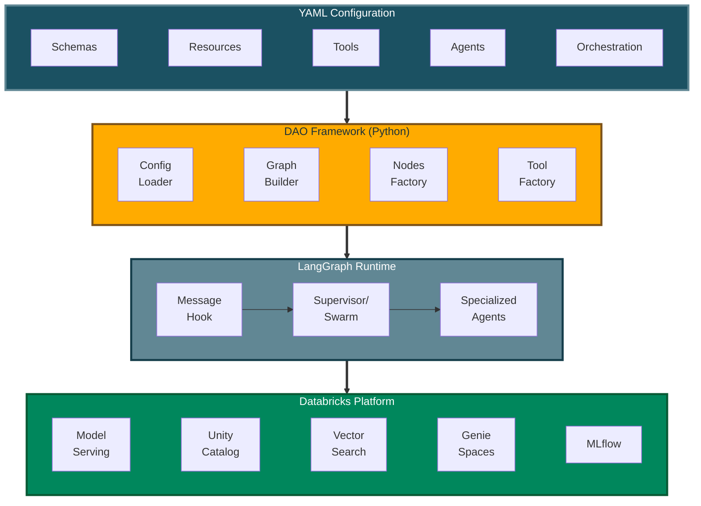
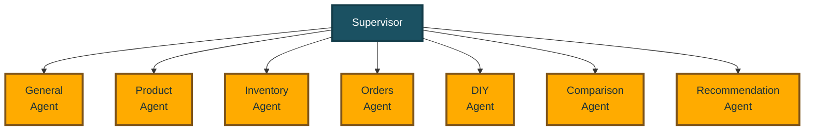
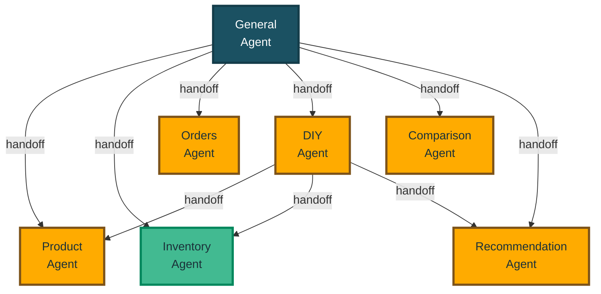

# Architecture

## How It Works (Simple Explanation)

Think of DAO as a three-layer cake:

**1. Your Configuration (Top Layer)** 🎂  
You write a YAML file describing what you want: which AI models, what data to access, what tools agents can use.

**2. DAO Framework (Middle Layer)** 🔧  
DAO reads your YAML and automatically wires everything together using LangGraph (a workflow engine for AI agents).

**3. Databricks Platform (Bottom Layer)** ☁️  
Your deployed agent runs on Databricks, accessing Unity Catalog data, calling AI models, and using other Databricks services.

## Technical Architecture Diagram

For developers and architects, here's the detailed view:



## System-Level Data Flow

This diagram shows how a deployed DAO agent integrates with Databricks services and external systems:

```mermaid
graph TB
    User([User])
    
    subgraph model_serving["Databricks Model Serving"]
        subgraph agent_runtime["DAO Agent Runtime"]
            orchestration[Agent Orchestration Layer<br/>Supervisor / Swarm with multiple agents]
            
            subgraph tools["Agent Tools"]
                genie_tool[Genie Tool]
                dbsql_tool[DBSQL Tool]
                agent_endpoint_tool[Agent Endpoint Tool]
                mcp_tool[MCP Tool]
            end
            
            orchestration -->|Tool Call| genie_tool
            orchestration -->|Tool Call| dbsql_tool
            orchestration -->|Tool Call| agent_endpoint_tool
            orchestration -->|Tool Call| mcp_tool
        end
    end
    
    subgraph external_services["External Services"]
        genie_service[Genie Service]
        another_agent[Another Agent Endpoint]
        mcp_server[MCP Server<br/>GitHub, Slack, Custom]
        
        dbsql_warehouse[Databricks SQL / Warehouse]
        unity_catalog[Unity Catalog<br/>• Tables & Views<br/>• Functions<br/>• Permissions]
        
        dbsql_warehouse --> unity_catalog
    end
    
    subgraph persistence["State Persistence Layer"]
        subgraph lakebase["Lakebase (Postgres)"]
            checkpoints[Conversation Checkpoints<br/>• Thread state<br/>• Message history<br/>• Agent context]
            preferences[User Preferences Store<br/>• User settings<br/>• Semantic search<br/>• Key-value storage]
        end
    end
    
    User -->|HTTP Request| orchestration
    
    genie_tool --> genie_service
    genie_service -->|NL → SQL| dbsql_warehouse
    
    dbsql_tool -->|Direct SQL Query| dbsql_warehouse
    
    agent_endpoint_tool --> another_agent
    another_agent --> dbsql_warehouse
    
    mcp_tool --> mcp_server
    
    orchestration -.->|Persists State| lakebase
    lakebase -.->|Unity Catalog<br/>governed storage| orchestration
    
    style User fill:#618794,stroke:#1B5162,stroke-width:3px,color:#fff
    style model_serving fill:#00875C,stroke:#095A35,stroke-width:3px,color:#fff
    style agent_runtime fill:#00A972,stroke:#095A35,stroke-width:3px,color:#fff
    style orchestration fill:#42BA91,stroke:#00875C,stroke-width:2px,color:#1B3139
    style tools fill:#70C4AB,stroke:#00A972,stroke-width:2px,color:#1B3139
    style genie_tool fill:#9FD6C4,stroke:#42BA91,stroke-width:1px,color:#1B3139
    style dbsql_tool fill:#9FD6C4,stroke:#42BA91,stroke-width:1px,color:#1B3139
    style agent_endpoint_tool fill:#9FD6C4,stroke:#42BA91,stroke-width:1px,color:#1B3139
    style mcp_tool fill:#9FD6C4,stroke:#42BA91,stroke-width:1px,color:#1B3139
    style external_services fill:#BD2B26,stroke:#801C17,stroke-width:3px,color:#fff
    style genie_service fill:#FCBA33,stroke:#7D5319,stroke-width:2px,color:#1B3139
    style another_agent fill:#FCBA33,stroke:#7D5319,stroke-width:2px,color:#1B3139
    style mcp_server fill:#FCBA33,stroke:#7D5319,stroke-width:2px,color:#1B3139
    style dbsql_warehouse fill:#FCBA33,stroke:#7D5319,stroke-width:2px,color:#1B3139
    style unity_catalog fill:#FFDB96,stroke:#BD802B,stroke-width:2px,color:#1B3139
    style persistence fill:#1B5162,stroke:#143D4A,stroke-width:3px,color:#fff
    style lakebase fill:#143D4A,stroke:#1B3139,stroke-width:2px,color:#fff
    style checkpoints fill:#618794,stroke:#143D4A,stroke-width:2px,color:#fff
    style preferences fill:#618794,stroke:#143D4A,stroke-width:2px,color:#fff
```



### Data Flow Explanation

**1. User Interaction**
- User sends a request to the DAO agent via Databricks Model Serving endpoint
- Request includes message, conversation ID, and user context

**2. Agent Processing**
- Agent orchestration layer (Supervisor or Swarm) processes the request
- Determines which tools to invoke based on the user's question
- Multiple agents may collaborate to answer complex queries

**3. Tool Integration Patterns**

**A. Genie Tool → Genie Service → DBSQL**
- Agent invokes Genie tool with natural language question
- Genie service translates NL to SQL query
- Executes against Databricks SQL / Unity Catalog
- Returns structured data results
- *Use case:* "What products are low on stock?"

**B. Direct DBSQL Tool**
- Agent calls SQL warehouse directly with pre-defined SQL
- Executes Unity Catalog functions or queries
- Returns data from governed tables
- *Use case:* Execute a stored procedure or predefined query

**C. Agent Endpoint Tool**
- Agent calls another deployed agent endpoint
- Enables composition and specialization
- Other agent may use different tools/models
- *Use case:* Call a specialized HR agent from a general assistant

**D. MCP Tool**
- Agent communicates with external MCP server
- Supports GitHub, Slack, custom APIs
- Extends agent capabilities beyond Databricks
- *Use case:* Create GitHub issue, send Slack message

**4. State Persistence**
- Conversation state saved to Lakebase checkpointer (PostgreSQL table)
- User preferences stored in Lakebase store (Unity Catalog governed)
- Enables multi-turn conversations and personalization
- Survives agent restarts and scales across instances

**5. Security & Governance**
- **On-Behalf-Of User**: Requests execute with caller's permissions
- **Unity Catalog**: Row/column-level security enforced
- **Audit Logs**: All data access tracked per user
- **Isolation**: Conversation state partitioned by user/thread

## Orchestration Patterns

When you have multiple specialized agents, you need to decide how they work together. DAO supports two patterns:

**Think of it like a company:**
- **Supervisor Pattern** = Traditional hierarchy (manager assigns tasks to specialists)
- **Swarm Pattern** = Collaborative team (specialists hand off work to each other)

DAO supports both approaches for multi-agent coordination:

### 1. Supervisor Pattern

**Best for:** Clear separation of responsibilities with centralized control

A central "supervisor" agent reads each user request and decides which specialist agent should handle it. Think of it like a call center manager routing calls to different departments.

**Example use case:** Hardware store assistant
- User asks about product availability → Routes to **Inventory Agent**
- User asks about order status → Routes to **Orders Agent**  
- User asks for DIY advice → Routes to **DIY Agent**
- User asks for product details → Routes to **Product Agent**
- User wants product comparison → Routes to **Comparison Agent**
- User needs product suggestions → Routes to **Recommendation Agent**
- General inquiries → Routes to **General Agent**

**Configuration:**

```yaml
orchestration:
  supervisor:
    model: *router_llm
    prompt: |
      Route queries to the appropriate specialist agent based on the content.
```



### 2. Swarm Pattern

**Best for:** Complex, multi-step workflows where agents need to collaborate

Agents work more autonomously and can directly hand off tasks to each other. Think of it like a team of specialists who know when to involve their colleagues.

**Example use case:** Complex customer inquiry
1. User: *"I need a drill for a home project, do we have any in stock, and can you suggest how to use it?"*
2. **General Agent** (entry point) → Hands off to **Product Agent** for product info
3. **Product Agent** checks details → Hands off to **Inventory Agent** for stock
4. **Inventory Agent** confirms availability → Hands off to **DIY Agent** for usage tips
5. **DIY Agent** provides instructions → Done

No central supervisor needed — agents decide collaboratively.

**Configuration:**

```yaml
orchestration:
  swarm:
    default_agent: *general    # Entry point for new conversations
    handoffs:
      general: ~               # Can hand off to ANY agent (universal router)
      diy:                     # DIY can hand off to specific agents
        - product
        - inventory
        - recommendation
      inventory: []            # Terminal agent - no outbound handoffs
```



**Legend:**
- **Blue** (General): Entry point / universal router
- **Orange**: Standard agents with handoff capabilities  
- **Green** (Inventory): Terminal agent (no outbound handoffs)

---

## Navigation

- [← Previous: Why DAO?](why-dao.md)
- [↑ Back to Documentation Index](../README.md#-documentation)
- [Next: Key Capabilities →](key-capabilities.md)
