# Key Capabilities

These are the powerful features that make DAO production-ready. Don't worry if some seem complex — you can start simple and add these capabilities as you need them.

## 1. Dual Deployment Targets

**What is this?** DAO agents can be deployed to either **Databricks Model Serving** or **Databricks Apps** using the same configuration, giving you flexibility in how you expose your agent.

**Why this matters:**
- **Model Serving**: Traditional endpoint for inference workloads, autoscaling, pay-per-token pricing
- **Databricks Apps**: Full web applications with custom UI, background jobs, and richer integrations
- **Single Configuration**: Switch deployment targets with one line change — no code rewrite needed
- **Environment Consistency**: Same YAML config works in both environments

**Comparison:**

| Feature | Model Serving | Databricks Apps |
|---------|--------------|-----------------|
| **Use Case** | Inference API endpoint | Full web application |
| **Scaling** | Auto-scales based on load | Manual scaling configuration |
| **UI** | API only | Custom web UI possible |
| **Pricing** | Pay per token/request | Compute-based |
| **Deployment Speed** | ~2-5 minutes | ~2-5 minutes |
| **Best For** | API integrations, high throughput | Interactive apps, custom UX |

**How to configure:**

```yaml
app:
  name: my_agent
  deployment_target: model_serving  # or 'apps'
  
  # Model Serving specific options (only used when deployment_target: model_serving)
  endpoint_name: my_agent_endpoint
  workload_size: Small
  scale_to_zero: true
  
  agents:
    - *my_agent
```

**Deploy to Model Serving:**
```bash
dao-ai deploy -c config.yaml --target model_serving
```

**Deploy to Databricks Apps:**
```bash
dao-ai deploy -c config.yaml --target apps
```

**CLI override:** The `--target` flag always takes precedence over the YAML config, making it easy to deploy the same config to different environments.

**Behind the scenes:**
- Model Serving deployments create an MLflow model and serving endpoint
- Apps deployments create a Databricks App with MLflow experiment tracking
- Both share the same agent code, tools, and orchestration logic
- Environment variables and secrets are automatically configured for each platform

## 2. Multi-Tool Support

**What are tools?** Tools are actions an agent can perform — like querying a database, calling an API, or running custom code.

DAO supports four types of tools, each suited for different use cases:

| Tool Type | Use Case | Example |
|-----------|----------|---------|
| **Python** | Custom business logic | `dao_ai.tools.current_time_tool` |
| **Factory** | Complex initialization with config | `create_vector_search_tool(retriever=...)`, `create_genie_tool(genie_room=...)` |
| **Agent Endpoint** | Call external agents as tools | `create_agent_endpoint_tool(llm=...)` for Agent Bricks, Kasal |
| **Unity Catalog** | Governed SQL functions | `catalog.schema.find_product_by_sku` |
| **MCP** | External services via Model Context Protocol | GitHub, Slack, custom APIs |

```yaml
tools:
  # Python function - direct import
  time_tool:
    function:
      type: python
      name: dao_ai.tools.current_time_tool

  # Factory - initialized with config
  search_tool:
    function:
      type: factory
      name: dao_ai.tools.create_vector_search_tool
      args:
        retriever: *products_retriever

  # Agent Endpoint - call external agents
  specialist_agent:
    function:
      type: factory
      name: dao_ai.tools.create_agent_endpoint_tool
      args:
        llm: *external_agent_endpoint
        name: specialist
        description: "Delegate to external specialist agent"

  # Unity Catalog - governed SQL function
  sku_lookup:
    function:
      type: unity_catalog
      name: find_product_by_sku
      schema: *retail_schema

  # MCP - external service integration
  github_mcp:
    function:
      type: mcp
      transport: streamable_http
      connection: *github_connection
```

## 3. On-Behalf-Of User Support

**What is this?** Many Databricks resources (like SQL warehouses, Genie spaces, and LLMs) can operate "on behalf of" the end user, using their permissions instead of the agent's service account credentials.

**Why this matters:**
- **Security**: Users can only access data they're authorized to see
- **Compliance**: Audit logs show the actual user who made the request, not a service account
- **Governance**: Unity Catalog permissions are enforced at the user level
- **Flexibility**: No need to grant broad permissions to a service account

**How it works:** When `on_behalf_of_user: true` is set, the resource inherits the calling user's identity and permissions from the API request.

**Supported resources:**
```yaml
resources:
  # LLMs - use caller's permissions for model access
  llms:
    claude: &claude
      name: databricks-claude-3-7-sonnet
      on_behalf_of_user: true      # Inherits caller's model access
  
  # Warehouses - execute SQL as the calling user
  warehouses:
    analytics: &analytics_warehouse
      warehouse_id: abc123def456
      on_behalf_of_user: true      # Queries run with user's data permissions
  
  # Genie - natural language queries with user's context
  genie_rooms:
    sales_genie: &sales_genie
      space_id: xyz789
      on_behalf_of_user: true      # Genie uses caller's data access
```

**Real-world example:**  
Your agent helps employees query HR data. With `on_behalf_of_user: true`:
- Managers can see their team's salary data
- Individual contributors can only see their own data
- HR admins can see all data

The same agent code enforces different permissions for each user automatically.

**Important notes:**
- The calling application must pass the user's identity in the API request
- The user must have the necessary permissions on the underlying resources
- Not all Databricks resources support on-behalf-of functionality

## 4. Advanced Caching (Genie Queries)

**Why caching matters:** When users ask similar questions repeatedly, you don't want to pay for the same AI processing over and over. Caching stores results so you can reuse them.

**What makes DAO's caching special:** Instead of just storing old answers (which become stale), DAO stores the **SQL query** that Genie generated. When a similar question comes in, DAO re-runs the SQL to get **fresh data** without calling the expensive Genie API again.

**💰 Cost savings:** If users frequently ask "What's our inventory?", the first query costs $X (Genie API call). Subsequent similar queries cost only pennies (just running SQL).

DAO provides **two-tier caching** for Genie natural language queries, dramatically reducing costs and latency:

```yaml
genie_tool:
  function:
    type: factory
    name: dao_ai.tools.create_genie_tool
    args:
      genie_room: *retail_genie_room
      
      # L1: Fast O(1) exact match lookup
      lru_cache_parameters:
        warehouse: *warehouse
        capacity: 1000                   # Max cached queries (default: 1000)
        time_to_live_seconds: 86400      # 1 day (default), use -1 or None for never expire

      # L2: Semantic similarity search via pg_vector
      semantic_cache_parameters:
        database: *postgres_db
        warehouse: *warehouse
        embedding_model: *embedding_model  # Default: databricks-gte-large-en
        similarity_threshold: 0.85         # 0.0-1.0 (default: 0.85), higher = stricter
        time_to_live_seconds: 86400        # 1 day (default), use -1 or None for never expire
        table_name: genie_semantic_cache   # Optional, default: genie_semantic_cache
```

### Cache Architecture

```mermaid
graph TB
    question[/"Question: 'What products are low on stock?'"/]
    
    l1_cache["L1: LRU Cache (In-Memory)<br/>• Capacity: 1000 entries<br/>• Hash-based lookup<br/>• O(1) exact string match"]
    l1_hit{Hit?}
    
    l2_cache["L2: Semantic Cache<br/>• PostgreSQL (pg_vector) OR In-Memory<br/>• Dual embeddings (question + context)<br/>• L2 distance similarity<br/>• Conversation context aware<br/>• Partitioned by Genie space ID"]
    l2_hit{Hit?}
    
    genie["Genie API<br/>(Expensive call)<br/>Natural language to SQL"]
    
    execute["Execute SQL via Warehouse<br/>Always fresh data!"]
    
    result[/"Return Result"/]
    
    question --> l1_cache
    l1_cache --> l1_hit
    l1_hit -->|Hit| execute
    l1_hit -->|Miss| l2_cache
    
    l2_cache --> l2_hit
    l2_hit -->|Hit| execute
    l2_hit -->|Miss| genie
    
    genie --> execute
    execute --> result
    
    style question fill:#1B5162,stroke:#143D4A,stroke-width:3px,color:#fff
    style l1_cache fill:#00875C,stroke:#095A35,stroke-width:3px,color:#fff
    style l2_cache fill:#FFAB00,stroke:#7D5319,stroke-width:3px,color:#1B3139
    style genie fill:#FF5F46,stroke:#BD2B26,stroke-width:3px,color:#fff
    style execute fill:#618794,stroke:#143D4A,stroke-width:3px,color:#fff
    style result fill:#1B5162,stroke:#143D4A,stroke-width:3px,color:#fff
    style l1_hit fill:#C4CCD6,stroke:#1B3139,stroke-width:2px,color:#1B3139
    style l2_hit fill:#C4CCD6,stroke:#1B3139,stroke-width:2px,color:#1B3139
```



### LRU Cache (L1)

The **LRU (Least Recently Used) Cache** provides instant lookups for exact question matches:

| Parameter | Default | Description |
|-----------|---------|-------------|
| `capacity` | 1000 | Maximum number of cached queries |
| `time_to_live_seconds` | 86400 | Cache entry lifetime (-1 = never expire) |
| `warehouse` | Required | Databricks warehouse for SQL execution |

**Best for:** Repeated exact queries, chatbot interactions, dashboard refreshes

### Semantic Cache (L2)

The **Semantic Cache** finds similar questions even when worded differently using vector embeddings and similarity search. It includes **conversation context awareness** to improve matching in multi-turn conversations. DAO provides two implementations:

#### PostgreSQL-Based Semantic Cache

Uses PostgreSQL with pg_vector for persistent, multi-instance shared caching:

| Parameter | Default | Description |
|-----------|---------|-------------|
| `similarity_threshold` | 0.85 | Minimum similarity for cache hit (0.0-1.0) |
| `time_to_live_seconds` | 86400 | Cache entry lifetime (-1 = never expire) |
| `embedding_model` | `databricks-gte-large-en` | Model for generating question embeddings |
| `database` | Required | PostgreSQL with pg_vector extension |
| `warehouse` | Required | Databricks warehouse for SQL execution |
| `table_name` | `genie_semantic_cache` | Table name for cache storage |
| `context_window_size` | 3 | Number of previous conversation turns to include |
| `context_similarity_threshold` | 0.80 | Minimum similarity for conversation context |
| `question_weight` | 0.6 | Weight for question similarity in combined score (0.0-1.0) |
| `context_weight` | 0.4 | Weight for context similarity (computed as 1 - question_weight if not set) |
| `embedding_dims` | Auto-detected | Embedding vector dimensions (auto-detected from model if not specified) |
| `max_context_tokens` | 2000 | Maximum token length for conversation context embeddings |

**Best for:** Production deployments with multiple instances, large cache sizes (thousands+), and cross-instance cache sharing

#### In-Memory Semantic Cache

Uses in-memory storage without external database dependencies:

```yaml
genie_tool:
  function:
    type: factory
    name: dao_ai.tools.create_genie_tool
    args:
      genie_room: *retail_genie_room
      
      # In-memory semantic cache (no database required)
      in_memory_semantic_cache_parameters:
        warehouse: *warehouse
        embedding_model: *embedding_model  # Default: databricks-gte-large-en
        similarity_threshold: 0.85         # 0.0-1.0 (default: 0.85)
        time_to_live_seconds: 86400        # 1 day (default), use -1 or None for never expire
        capacity: 1000                     # Max cache entries (LRU eviction when full)
        context_window_size: 3             # Number of previous conversation turns
        context_similarity_threshold: 0.80 # Minimum context similarity
        question_weight: 0.6               # Weight for question similarity
        context_weight: 0.4                # Weight for context similarity
        embedding_dims: null               # Auto-detected from model
        max_context_tokens: 2000           # Max context token length
```

| Parameter | Default | Description |
|-----------|---------|-------------|
| `similarity_threshold` | 0.85 | Minimum similarity for cache hit (0.0-1.0) |
| `time_to_live_seconds` | 86400 | Cache entry lifetime (-1 = never expire) |
| `embedding_model` | `databricks-gte-large-en` | Model for generating question embeddings |
| `warehouse` | Required | Databricks warehouse for SQL execution |
| `capacity` | 1000 | Maximum cache entries (LRU eviction when full) |
| `context_window_size` | 3 | Number of previous conversation turns to include |
| `context_similarity_threshold` | 0.80 | Minimum similarity for conversation context |
| `question_weight` | 0.6 | Weight for question similarity in combined score (0.0-1.0) |
| `context_weight` | 0.4 | Weight for context similarity (computed as 1 - question_weight if not set) |
| `embedding_dims` | Auto-detected | Embedding vector dimensions (auto-detected from model if not specified) |
| `max_context_tokens` | 2000 | Maximum token length for conversation context embeddings |

**Best for:** Single-instance deployments, development/testing, scenarios without database access, moderate cache sizes (hundreds to low thousands)

**Key Differences:**
- ✅ **No external database required** - Simpler setup and deployment
- ✅ **Same L2 distance algorithm** - Consistent behavior with PostgreSQL version
- ⚠️ **Per-instance cache** - Each replica has its own cache (not shared)
- ⚠️ **No persistence** - Cache is lost on restart
- ⚠️ **Memory-bound** - Limited by available RAM; use capacity limits

**Best for:** Catching rephrased questions like:
- "What's our inventory status?" ≈ "Show me stock levels"
- "Top selling products this month" ≈ "Best sellers in December"

**Conversation Context Awareness:**  
The semantic cache tracks conversation history to resolve ambiguous references:
- **User:** "Show me products with low stock"
- **User:** "What about *them* in the warehouse?" ← Uses context to understand "them" = low stock products

This works by embedding both the current question *and* recent conversation turns, then computing a weighted similarity score. This dramatically improves cache hits in multi-turn conversations where users naturally use pronouns and references.

**Weight Configuration:**  
The `question_weight` and `context_weight` parameters control how question vs conversation context similarity are combined into the final score:
- Both weights must sum to 1.0 (if only one is provided, the other is computed automatically)
- Higher `question_weight` prioritizes matching the exact question wording
- Higher `context_weight` prioritizes matching the conversation context, useful for multi-turn conversations with pronouns and references

### Cache Behavior

1. **SQL Caching, Not Results**: The cache stores the *generated SQL query*, not the query results. On a cache hit, the SQL is re-executed against your warehouse, ensuring **data freshness**.

2. **Conversation-Aware Matching**: The semantic cache uses a rolling window of recent conversation turns to provide context for similarity matching. This helps resolve pronouns and references like "them", "that", or "the same products" by considering what was discussed previously.

3. **Refresh on Hit**: When a semantic cache entry is found but expired:
   - The expired entry is deleted
   - A cache miss is returned
   - Genie generates fresh SQL
   - The new SQL is cached

4. **Multi-Instance Aware**: Each LRU cache is per-instance (in Model Serving, each replica has its own). The PostgreSQL semantic cache is shared across all instances. The in-memory semantic cache is per-instance (not shared).

5. **Space ID Partitioning**: Cache entries are isolated per Genie space, preventing cross-space cache pollution.

## 5. Vector Search Reranking

**The problem:** Vector search (semantic similarity) is fast but sometimes returns loosely related results. It's like a librarian who quickly grabs 50 books that *might* be relevant.

**The solution:** Reranking is like having an expert review those 50 books and pick the best 5 that *actually* answer your question.

**Benefits:**
- ✅ More accurate search results
- ✅ Better user experience (relevant answers)
- ✅ No external API calls (runs locally with FlashRank)

DAO supports **two-stage retrieval** with FlashRank reranking to improve search relevance without external API calls:

```yaml
retrievers:
  products_retriever: &products_retriever
    vector_store: *products_vector_store
    columns: [product_id, name, description, price]
    search_parameters:
      num_results: 50        # Retrieve more candidates
      query_type: ANN
    rerank:
      model: ms-marco-MiniLM-L-12-v2   # Local cross-encoder model
      top_n: 5                          # Return top 5 after reranking
```

### How It Works

```mermaid
graph TB
    query[/"Query: 'heavy duty outdoor extension cord'"/]
    
    stage1["Stage 1: Vector Similarity Search<br/>• Returns 50 candidates<br/>• Milliseconds latency<br/>• Fast, approximate matching<br/>• Uses embedding similarity"]
    
    docs50[("50 documents")]
    
    stage2["Stage 2: Cross-Encoder Rerank<br/>• FlashRank (local, no API)<br/>• Returns top 5 most relevant<br/>• Precise relevance scoring<br/>• Query-document interaction"]
    
    result[("5 documents<br/>(reordered by relevance)")]
    
    query --> stage1
    stage1 --> docs50
    docs50 --> stage2
    stage2 --> result
    
    style query fill:#1B5162,stroke:#143D4A,stroke-width:3px,color:#fff
    style stage1 fill:#00875C,stroke:#095A35,stroke-width:3px,color:#fff
    style docs50 fill:#42BA91,stroke:#00875C,stroke-width:3px,color:#1B3139
    style stage2 fill:#FFAB00,stroke:#7D5319,stroke-width:3px,color:#1B3139
    style result fill:#FCBA33,stroke:#7D5319,stroke-width:3px,color:#1B3139
```



### Why Reranking?

| Approach | Pros | Cons |
|----------|------|------|
| **Vector Search Only** | Fast, scalable | Embedding similarity ≠ relevance |
| **Reranking** | More accurate relevance | Slightly higher latency |
| **Both (Two-Stage)** | Best of both worlds | Optimal quality/speed tradeoff |

Vector embeddings capture semantic similarity but may rank loosely related documents highly. Cross-encoder reranking evaluates query-document pairs directly, dramatically improving result quality for the final user.

### Available Models

See [FlashRank](https://github.com/PrithivirajDamodaran/FlashRank) for the full list of supported models.

| Model | Size | Speed | Use Case |
|-------|------|-------|----------|
| `ms-marco-TinyBERT-L-2-v2` | ~4MB | ⚡⚡⚡ Fastest | High-throughput, latency-sensitive |
| `ms-marco-MiniLM-L-12-v2` | ~34MB | ⚡⚡ Fast | Default, best cross-encoder |
| `rank-T5-flan` | ~110MB | ⚡ Moderate | Best non cross-encoder |
| `ms-marco-MultiBERT-L-12` | ~150MB | Slower | Multilingual (100+ languages) |
| `ce-esci-MiniLM-L12-v2` | - | ⚡⚡ Fast | E-commerce optimized |
| `miniReranker_arabic_v1` | - | ⚡⚡ Fast | Arabic language |

### Configuration Options

```yaml
rerank:
  model: ms-marco-MiniLM-L-12-v2    # FlashRank model name
  top_n: 10                          # Documents to return (default: all)
  cache_dir: ~/.dao_ai/cache/flashrank  # Model weights cache location
  columns: [description, name]       # Columns for Databricks Reranker (optional)
```

**Note:** Model weights are downloaded automatically on first use (~34MB for MiniLM-L-12-v2).

## 6. Human-in-the-Loop Approvals

**Why this matters:** Some actions are too important to automate completely. For example, you might want human approval before an agent:
- Deletes data
- Sends external communications
- Places large orders
- Modifies production systems

**How it works:** Add a simple configuration to any tool, and the agent will pause and ask for human approval before executing it.

Add approval gates to sensitive tool calls without changing tool code:

```yaml
tools:
  dangerous_operation:
    function:
      type: python
      name: my_package.dangerous_function
      human_in_the_loop:
        review_prompt: "This operation will modify production data. Approve?"
```

## 7. Memory & State Persistence

**What is memory?** Your agent needs to remember past conversations. When a user asks "What about size XL?" the agent should remember they were talking about shirts.

**Memory backend options:**
1. **In-Memory**: Fast but temporary (resets when agent restarts). Good for testing and development.
2. **PostgreSQL**: Persistent relational storage (survives restarts). Good for production systems requiring conversation history and user preferences.
3. **Lakebase**: Databricks-managed PostgreSQL instance with Unity Catalog integration. Good for production deployments that want to stay within the Databricks ecosystem.

**Why Lakebase?**
- **Native Databricks integration** - No external database required
- **Managed PostgreSQL** - ACID transactions, full relational database capabilities
- **Unified governance** - Same Unity Catalog permissions as your data
- **Cost-effective** - Uses existing Databricks infrastructure

Configure conversation memory with in-memory, PostgreSQL, or Lakebase backends:

```yaml
memory:
  # Option 1: PostgreSQL (external database)
  checkpointer:
    name: conversation_checkpointer
    type: postgres
    database: *postgres_db
  
  store:
    name: user_preferences_store
    type: postgres
    database: *postgres_db
    embedding_model: *embedding_model

# Option 2: Lakebase (Databricks-native)
memory:
  checkpointer:
    name: conversation_checkpointer
    type: lakebase
    schema: *my_schema              # Unity Catalog schema
    table_name: agent_checkpoints   # PostgreSQL table for conversation state
  
  store:
    name: user_preferences_store
    type: lakebase
    schema: *my_schema
    table_name: agent_store         # PostgreSQL table for key-value storage
    embedding_model: *embedding_model
```

**Choosing a backend:**
- **In-Memory**: Development and testing only
- **PostgreSQL**: When you need external database features or already have PostgreSQL infrastructure
- **Lakebase**: When you want Databricks-native persistence with Unity Catalog governance

## 8. MLflow Prompt Registry Integration

**The problem:** Prompts (instructions you give to AI models) need constant refinement. Hardcoding them in YAML means every change requires redeployment.

**The solution:** Store prompts in MLflow's Prompt Registry. Now prompt engineers can:
- Update prompts without touching code
- Version prompts (v1, v2, v3...)
- A/B test different prompts
- Roll back to previous versions if needed

**Real-world example:**  
Your marketing team wants to make the agent's tone more friendly. With the prompt registry, they update it in MLflow, and the agent uses the new prompt immediately — no code deployment required.

Store and version prompts externally, enabling prompt engineers to iterate without code changes:

```yaml
prompts:
  product_expert_prompt:
    schema: *retail_schema
    name: product_expert_prompt
    alias: production  # or version: 3
    default_template: |
      You are a product expert...
    tags:
      team: retail
      environment: production

agents:
  product_expert:
    prompt: *product_expert_prompt  # Loaded from MLflow registry
```

## 9. Automated Prompt Optimization

**What is this?** Instead of manually tweaking prompts through trial and error, DAO can automatically test variations and find the best one.

**How it works:** Using GEPA (Generative Evolution of Prompts and Agents):
1. You provide a training dataset with example questions
2. DAO generates multiple prompt variations
3. Each variation is tested against your examples
4. The best-performing prompt is selected

**Think of it like:** A/B testing for AI prompts, but automated.

Use GEPA (Generative Evolution of Prompts and Agents) to automatically improve prompts:

```yaml
optimizations:
  prompt_optimizations:
    optimize_diy_prompt:
      prompt: *diy_prompt
      agent: *diy_agent
      dataset: *training_dataset
      reflection_model: "openai:/gpt-4"
      num_candidates: 5
```

## 10. Guardrails & Response Quality Middleware

**What are guardrails?** Safety and quality controls that validate agent responses before they reach users. Think of them as quality assurance checkpoints.

**Why this matters:** AI models can sometimes generate responses that are:
- Inappropriate or unsafe
- Too long or too short
- Missing required information (like citations)
- In the wrong format or tone
- Off-topic or irrelevant
- Containing sensitive keywords that should be blocked

DAO provides two complementary middleware systems for response quality control:

---

### A. Guardrail Middleware (Content Safety & Quality)

**GuardrailMiddleware** uses LLM-as-judge to evaluate responses against custom criteria, with automatic retry and improvement loops.

**Use cases:**
- Professional tone validation
- Completeness checks (did the agent fully answer the question?)
- Accuracy verification
- Brand voice consistency
- Custom business rules

**How it works:**
1. Agent generates a response
2. LLM judge evaluates against your criteria (prompt-based)
3. If fails: Provides feedback and asks agent to try again
4. If passes: Response goes to user
5. After max retries: Falls back or raises error

```yaml
agents:
  customer_service_agent:
    model: *default_llm
    guardrails:
      # Professional tone check
      - name: professional_tone
        model: *judge_llm
        prompt: *professional_tone_prompt  # From MLflow Prompt Registry
        num_retries: 3
      
      # Completeness validation
      - name: completeness_check
        model: *judge_llm
        prompt: |
          Does the response fully address the user's question?
          Score 1 if yes, 0 if no. Explain your reasoning.
        num_retries: 2
```

**Additional guardrail types:**

```yaml
# Content Filter - Deterministic keyword blocking
guardrails:
  - name: sensitive_content_filter
    type: content_filter
    blocked_keywords:
      - password
      - credit_card
      - ssn
    case_sensitive: false
    on_failure: fallback
    fallback_message: "I cannot provide that information."

# Safety Guardrail - Model-based safety evaluation
guardrails:
  - name: safety_check
    type: safety
    model: *safety_model
    categories:
      - violence
      - hate_speech
      - self_harm
    threshold: 0.7           # Sensitivity threshold
    num_retries: 1
```

**Real-world example:**  
Your customer service agent must maintain a professional tone and never discuss competitor products:

```yaml
agents:
  support_agent:
    guardrails:
      - name: professional_tone
        model: *judge_llm
        prompt: *professional_tone_prompt
        num_retries: 3
      
      - name: no_competitors
        type: content_filter
        blocked_keywords: [competitor_a, competitor_b, competitor_c]
        on_failure: fallback
        fallback_message: "I can only discuss our own products and services."
```

---

### B. DSPy-Style Assertion Middleware (Programmatic Validation)

**Assertion middleware** provides programmatic, code-based validation inspired by DSPy's assertion mechanisms. Best for deterministic checks and custom logic.

| Middleware | Behavior | Use Case |
|------------|----------|----------|
| **AssertMiddleware** | Hard constraint - retries until satisfied or fails | Required output formats, mandatory citations, length constraints |
| **SuggestMiddleware** | Soft constraint - logs feedback, optional single retry | Style preferences, quality suggestions, optional improvements |
| **RefineMiddleware** | Iterative improvement - generates N attempts, selects best | Optimizing response quality, A/B testing variations |

```yaml
# Configure via middleware in agents
agents:
  research_agent:
    middleware:
      # Hard constraint: Must include citations
      - type: assert
        constraint: has_citations
        max_retries: 3
        on_failure: fallback
        fallback_message: "Unable to provide cited response."
      
      # Soft suggestion: Prefer concise responses
      - type: suggest
        constraint: length_under_500
        allow_one_retry: true
```

**Programmatic usage:**

```python
from dao_ai.middleware.assertions import (
    create_assert_middleware,
    create_suggest_middleware,
    create_refine_middleware,
    LengthConstraint,
    KeywordConstraint,
)

# Hard constraint: response must be between 100-500 chars
assert_middleware = create_assert_middleware(
    constraint=LengthConstraint(min_length=100, max_length=500),
    max_retries=3,
    on_failure="fallback",
)

# Soft constraint: suggest professional tone
suggest_middlewares = create_suggest_middleware(
    constraint=lambda response, ctx: "professional" in response.lower(),
    allow_one_retry=True,
)

# Iterative refinement: generate 3 attempts, pick best
def quality_score(response: str, ctx: dict) -> float:
    # Score based on length, keywords, structure
    score = 0.0
    if 100 <= len(response) <= 500:
        score += 0.5
    if "please" in response.lower() or "thank you" in response.lower():
        score += 0.3
    if response.endswith(".") or response.endswith("!"):
        score += 0.2
    return score

refine_middlewares = create_refine_middleware(
    reward_fn=quality_score,
    threshold=0.8,
    max_iterations=3,
)

# Combine all middlewares into a single list
all_middlewares = assert_middlewares + suggest_middlewares + refine_middlewares
```

---

### When to Use Which?

| Use Case | Recommended Middleware |
|----------|------------------------|
| **Tone/style validation** | GuardrailMiddleware (LLM judge) |
| **Safety checks** | SafetyGuardrailMiddleware |
| **Keyword blocking** | ContentFilterMiddleware |
| **Length constraints** | AssertMiddleware (deterministic) |
| **Citation requirements** | AssertMiddleware or GuardrailMiddleware |
| **Custom business logic** | AssertMiddleware (programmable) |
| **Quality optimization** | RefineMiddleware (generates multiple attempts) |
| **Soft suggestions** | SuggestMiddleware |

**Best practice:** Combine both approaches:
- **ContentFilter** for fast, deterministic blocking
- **AssertMiddleware** for programmatic constraints
- **GuardrailMiddleware** for nuanced, LLM-based evaluation

```yaml
agents:
  production_agent:
    middleware:
      # Layer 1: Fast keyword blocking
      - type: content_filter
        blocked_keywords: [password, ssn]
      
      # Layer 2: Deterministic length check
      - type: assert
        constraint: length_range
        min_length: 50
        max_length: 1000
      
      # Layer 3: LLM-based quality evaluation
      - type: guardrail
        name: professional_tone
        model: *judge_llm
        prompt: *professional_tone_prompt
```

## 11. Conversation Summarization

**The problem:** AI models have a maximum amount of text they can process (the "context window"). Long conversations eventually exceed this limit.

**The solution:** When conversations get too long, DAO automatically:
1. Summarizes the older parts of the conversation
2. Keeps recent messages as-is (for accuracy)
3. Continues the conversation with the condensed history

**Example:**  
After 20 messages about product recommendations, the agent summarizes: *"User is looking for power tools, prefers cordless, budget around $200."* This summary replaces the old messages, freeing up space for the conversation to continue.

Automatically summarize long conversation histories to stay within context limits:

```yaml
chat_history:
  max_tokens: 4096                    # Max tokens for summarized history
  max_tokens_before_summary: 8000     # Trigger summarization at this threshold
  max_messages_before_summary: 20     # Or trigger at this message count
```

The `LoggingSummarizationMiddleware` provides detailed observability:

```
INFO | Summarization: BEFORE 25 messages (~12500 tokens) → AFTER 3 messages (~2100 tokens) | Reduced by ~10400 tokens
```

## 12. Structured Output (Response Format)

**What is this?** A way to force your agent to return data in a specific JSON structure, making responses machine-readable and predictable.

**Why it matters:** 
- **Data extraction**: Extract structured information (product details, contact info) from text
- **API integration**: Return data that other systems can consume directly
- **Form filling**: Populate forms or databases automatically
- **Consistent parsing**: No need to write brittle text parsing code

**How it works:** Define a schema (Pydantic model, dataclass, or JSON schema) and the agent will return data matching that structure.

```yaml
agents:
  contact_extractor:
    name: contact_extractor
    model: *default_llm
    prompt: |
      Extract contact information from the user's message.
    response_format:
      response_schema: |
        {
          "type": "object",
          "properties": {
            "name": {"type": "string"},
            "email": {"type": "string"},
            "phone": {"type": ["string", "null"]}
          },
          "required": ["name", "email"]
        }
      use_tool: true  # Use function calling strategy (recommended for Databricks)
```

**Real-world example:**  
User: *"John Doe, john.doe@example.com, (555) 123-4567"*  
Agent returns:
```json
{
  "name": "John Doe",
  "email": "john.doe@example.com",
  "phone": "(555) 123-4567"
}
```

**Options:**
- `response_schema`: Can be a JSON schema string, Pydantic model type, or fully qualified class name
- `use_tool`: `true` (function calling), `false` (native), or `null` (auto-detect)

See `config/examples/09_structured_output/structured_output.yaml` for a complete example.

---

## 13. Custom Input & Custom Output Support

**What is this?** A flexible system for passing custom configuration values to your agents and receiving enriched output with runtime state.

**Why it matters:**
- **Pass context to prompts**: Any key in `configurable` becomes available as a template variable in your prompts
- **Personalize responses**: Use `user_id`, `store_num`, or any custom field to tailor agent behavior
- **Track conversations**: Maintain state across multiple interactions with `thread_id`/`conversation_id`
- **Capture runtime state**: Output includes accumulated state like Genie conversation IDs, cache hits, and more
- **Debug production issues**: Full context visibility for troubleshooting

**Key concepts:**
- `configurable`: Custom key-value pairs passed to your agent (available in prompt templates)
- `thread_id` / `conversation_id`: Identifies a specific conversation thread
- `user_id`: Identifies who's asking questions
- `session`: Runtime state that accumulates during the conversation (returned in output)

DAO uses a structured format for passing custom inputs and returning enriched outputs:

```python
# Input format
custom_inputs = {
    "configurable": {
        "thread_id": "uuid-123",        # LangGraph thread ID
        "conversation_id": "uuid-123",  # Databricks-style (takes precedence)
        "user_id": "user@example.com",
        "store_num": "12345",
    },
    "session": {
        # Accumulated runtime state (optional in input)
    }
}

# Output format includes session state
custom_outputs = {
    "configurable": {
        "thread_id": "uuid-123",
        "conversation_id": "uuid-123",
        "user_id": "user@example.com",
    },
    "session": {
        "genie": {
            "spaces": {
                "space_abc": {
                    "conversation_id": "genie-conv-456",
                    "cache_hit": True,
                    "follow_up_questions": ["What about pricing?"]
                }
            }
        }
    }
}
```

**Using configurable values in prompts:**

Any key in the `configurable` dictionary becomes available as a template variable in your agent prompts:

```yaml
agents:
  personalized_agent:
    prompt: |
      You are a helpful assistant for {user_id}.
      Store location: {store_num}
      
      Provide personalized recommendations based on the user's context.
```

When invoked with the `custom_inputs` above, the prompt automatically populates:
- `{user_id}` → `"user@example.com"`
- `{store_num}` → `"12345"`

**Key features:**
- `conversation_id` and `thread_id` are interchangeable (conversation_id takes precedence)
- If neither is provided, a UUID is auto-generated
- `user_id` is normalized (dots replaced with underscores for memory namespaces)
- All `configurable` keys are available as prompt template variables
- `session` state is automatically maintained and returned in `custom_outputs`
- Backward compatible with legacy flat custom_inputs format

## 14. Middleware (Input Validation, Logging, Monitoring)

**What is middleware?** Middleware are functions that wrap around agent execution to add cross-cutting concerns like validation, logging, authentication, and monitoring. They run before and after the agent processes requests.

**Why this matters:**
- **Input validation**: Ensure required fields (store_num, tenant_id, API keys) are provided before processing
- **Request logging**: Track all interactions for debugging and auditing
- **Performance monitoring**: Identify slow agents and optimize bottlenecks
- **Rate limiting**: Prevent abuse and control costs
- **Audit trails**: Comprehensive logging for compliance and security
- **Error handling**: Graceful failure management

**Key concepts:**
- Middleware executes in order (validation → logging → expensive operations)
- Each middleware can run pre-processing and post-processing logic
- Middleware can modify requests, validate inputs, log events, and even stop execution
- Defined once at the app level, reused across multiple agents

### Input Validation Middleware

The most common middleware pattern is validating that required context fields are provided in custom inputs:

```yaml
middleware:
  # Validate store number is provided
  store_validation: &store_validation
    name: dao_ai.middleware.create_custom_field_validation_middleware
    args:
      fields:
        # Required field - must be provided
        - name: store_num
          description: "Your store number for inventory lookups"
          example_value: "12345"
        
        # Optional field - shown in error message if missing
        - name: user_id
          description: "Your unique user identifier"
          required: false
          example_value: "user_abc123"

agents:
  store_agent:
    name: store_agent
    model: *default_llm
    middleware:
      - *store_validation    # Apply validation
    prompt: |
      ### Store Context
      - **Store Number**: {store_num}
      - **User ID**: {user_id}
      
      You are a helpful store assistant with access to store {store_num}'s data.
```

**What happens when required fields are missing:**

```json
{
  "error": "Missing required field 'store_num'",
  "description": "Your store number for inventory lookups",
  "example": "12345",
  "help": "Please provide it in custom_inputs.configurable: {...}"
}
```

### Logging Middleware

Track requests, performance, and create audit trails:

```yaml
middleware:
  # Request logging
  request_logger: &request_logger
    name: dao_ai.middleware.create_logging_middleware
    args:
      log_level: INFO
      log_inputs: true
      log_outputs: false
      include_metadata: true
      message_prefix: "[REQUEST]"
  
  # Performance monitoring
  performance_monitor: &performance_monitor
    name: dao_ai.middleware.create_performance_middleware
    args:
      log_level: INFO
      threshold_ms: 1000         # Warn if execution > 1 second
      include_tool_timing: true
  
  # Audit trail
  audit_trail: &audit_trail
    name: dao_ai.middleware.create_audit_middleware
    args:
      log_level: INFO
      log_user_info: true
      log_tool_calls: true
      mask_sensitive_fields: true

agents:
  production_agent:
    middleware:
      - *request_logger
      - *performance_monitor
      - *audit_trail
```

### Combined Middleware Stacks

For production environments, combine multiple middleware for comprehensive request processing:

```yaml
agents:
  production_agent:
    middleware:
      - *input_validation      # 1. Validate required fields first (fail fast)
      - *request_logging       # 2. Log all requests early
      - *rate_limiting         # 3. Check rate limits before expensive ops
      - *performance_tracking  # 4. Monitor execution time
      - *audit_logging         # 5. Create comprehensive audit trail
```

**Middleware execution flow:**

```
Request Received
    ↓
[Validation] → Verify required fields
    ↓
[Logging] → Log request details
    ↓
[Rate Limiting] → Check quotas
    ↓
[Agent Execution] → Process request, call tools, generate response
    ↓
[Performance] → Log execution time
    ↓
[Audit] → Create audit record
    ↓
Response Returned
```

### Common Middleware Patterns

| Pattern | Use Case | Example |
|---------|----------|---------|
| **Store/Location Context** | Multi-location businesses | Validate `store_num` for inventory queries |
| **Multi-Tenant Validation** | Enterprise SaaS | Validate `tenant_id` and `workspace_id` |
| **API Key Validation** | Third-party integrations | Validate `external_api_key` before API calls |
| **Request Logging** | Debugging and monitoring | Track all interactions with timestamps |
| **Performance Tracking** | Optimization | Identify slow agents and tools |
| **Audit Trail** | Compliance | Comprehensive logs with PII masking |
| **Rate Limiting** | Cost control | Limit requests per user/tenant |

### Creating Custom Middleware

You can create custom middleware by implementing a factory function:

```python
from typing import Callable, Any
from langgraph.types import StateSnapshot
from langchain.agents import AgentMiddleware

def create_my_middleware(**kwargs) -> AgentMiddleware:
    """
    Factory function that creates middleware.
    
    Middleware factories return a single AgentMiddleware instance.
    """
    
    class MyMiddleware(AgentMiddleware):
        def __call__(
            self,
            state: StateSnapshot,
            next_fn: Callable,
            config: dict[str, Any]
        ) -> Any:
            # Pre-processing logic
            print(f"Before: {state}")
            
            # Call next middleware or agent
            result = next_fn(state, config)
            
            # Post-processing logic
            print(f"After: {result}")
            
            return result
    
    return [MyMiddleware()]
```

Then use it in your config:

```yaml
middleware:
  custom: &custom
    name: my_package.middleware.create_my_middleware
    args:
      custom_arg: value

agents:
  my_agent:
    middleware:
      - *custom
```

### Best Practices

1. **Order matters**: Validation → Logging → Expensive operations
2. **Fail fast**: Put validation first to reject bad requests early
3. **Log everything**: Capture context for debugging production issues
4. **Environment-specific**: Use minimal middleware for dev, full stack for production
5. **Keep lightweight**: Avoid blocking operations in middleware
6. **Security first**: Mask PII and sensitive data in logs

**Example configurations:**
- See [`config/examples/12_middleware/`](../config/examples/12_middleware/) for complete examples
- See [`config/examples/15_complete_applications/hardware_store.yaml`](../config/examples/15_complete_applications/hardware_store.yaml) for production usage

---

## 15. Hook System

**What are hooks?** Hooks let you run custom code at specific moments in your agent's lifecycle — like "before starting" or "when shutting down".

**Common use cases:**
- Warm up caches on startup
- Initialize database connections
- Clean up resources on shutdown
- Load configuration or credentials

**Important:** For per-request logic (logging requests, validating inputs, checking permissions), use **middleware** instead. Middleware provides much more flexibility and control over the agent execution flow.

Inject custom logic at key points in the agent lifecycle:

```yaml
app:
  # Run on startup
  initialization_hooks:
    - my_package.hooks.setup_connections
    - my_package.hooks.warmup_caches

  # Run on shutdown
  shutdown_hooks:
    - my_package.hooks.cleanup_resources

agents:
  my_agent:
    # For per-request logic, use middleware instead
    middleware:
      - my_package.middleware.log_requests
      - my_package.middleware.check_permissions
```

---

## Navigation

- [← Previous: Architecture](architecture.md)
- [↑ Back to Documentation Index](../README.md#-documentation)
- [Next: Configuration Reference →](configuration-reference.md)

