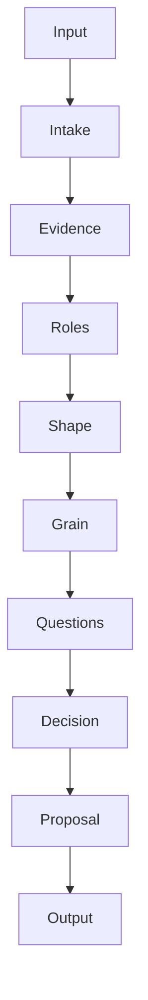
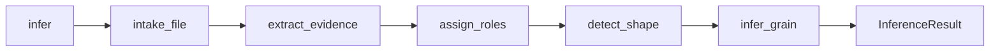
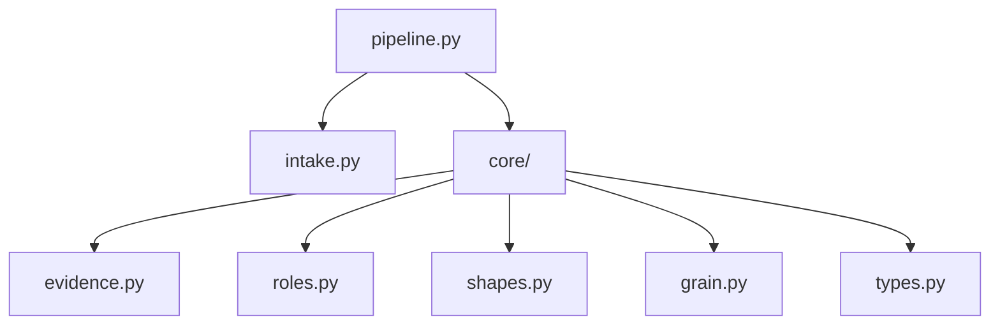

# Pipeline Architecture

The inference pipeline from input to proposal.

## Pipeline Overview



## Stage Details

### 1. Intake

**Module:** `datasculpt.intake`

**Input:** File path or DataFrame

**Output:** `IntakeResult` with:
- Loaded DataFrame
- Dataset fingerprint (hash)
- Dataset preview

**Responsibilities:**
- Load CSV/Excel/Parquet files
- Normalize column names
- Compute content hash for reproducibility

### 2. Evidence Extraction

**Module:** `datasculpt.core.evidence`

**Input:** DataFrame

**Output:** `dict[str, ColumnEvidence]`

**Responsibilities:**
- Infer primitive types (string, integer, number, date, etc.)
- Detect structural types (scalar, array, object)
- Compute statistics (null rate, cardinality)
- Profile value distributions
- Attempt date parsing
- Detect JSON arrays
- Check header date patterns

### 3. Role Scoring

**Module:** `datasculpt.core.roles`

**Input:** Column evidence, config

**Output:** `dict[str, RoleAssignment]`

**Responsibilities:**
- Score each column against 8 possible roles
- Apply name pattern matching
- Apply type-based heuristics
- Apply cardinality-based rules
- Detect pseudo-keys
- Handle shape-conditional adjustments

### 4. Shape Detection

**Module:** `datasculpt.core.shapes`

**Input:** Column evidence, config

**Output:** `ShapeResult`

**Responsibilities:**
- Score all 5 shape hypotheses
- Detect indicator/value pairs
- Detect time in headers
- Detect series columns
- Select top hypothesis
- Flag ambiguity (close scores)

### 5. Grain Inference

**Module:** `datasculpt.core.grain`

**Input:** DataFrame, evidence, config, shape

**Output:** `GrainInference`

**Responsibilities:**
- Identify candidate columns
- Test single columns for uniqueness
- Test column combinations (2, 3, 4)
- Apply pseudo-key penalties
- Compute uniqueness ratio
- Generate diagnostics

### 6. Question Generation

**Module:** `datasculpt.pipeline`

**Input:** Shape result, grain, role assignments, config

**Output:** `list[Question]`

**Responsibilities:**
- Generate shape question if ambiguous
- Generate grain question if low confidence
- Generate role questions if uncertain
- Build question choices with scores

### 7. Decision Recording

**Module:** `datasculpt.pipeline`

**Input:** All inference results

**Output:** `DecisionRecord`

**Responsibilities:**
- Generate unique decision ID
- Capture timestamp
- Store all hypotheses with scores
- Store all evidence
- Link questions and answers

### 8. Proposal Generation

**Module:** `datasculpt.pipeline`

**Input:** Decision record

**Output:** `InvariantProposal`

**Responsibilities:**
- Map shape to DatasetKind
- Build column specifications
- Generate warnings
- List required confirmations
- Link to decision record

## Data Flow



## Module Dependencies



Core modules have no dependencies on each other except `types.py`. This allows testing each stage independently.

## Extension Points

### Custom Evidence

Add custom evidence extraction:

```python
evidence = extract_dataframe_evidence(df)
for col_name in df.columns:
    evidence[col_name].external["custom"] = extract_custom(df, col_name)
```

### Custom Adapters

Adapters in `datasculpt/adapters/` can enrich evidence:

```python
config = InferenceConfig(use_frictionless=True)
# Frictionless adapter adds to evidence.external["frictionless"]
```

### Post-Processing

Process results before use:

```python
result = infer("data.csv")
enrich_proposal(result.proposal)  # Add domain hints
validate_grain(result.decision_record.grain)  # Custom validation
```
