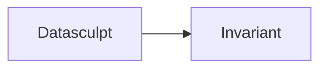

# Scope Boundaries

What Datasculpt does and doesn't do.

## In Scope

### Shape Detection

Determining the structural pattern of a dataset.

| Shape | Datasculpt Determines |
|-------|----------------------|
| long_observations | Rows are atomic observations |
| long_indicators | Data is unpivoted with indicator/value pairs |
| wide_observations | Measures are columns |
| wide_time_columns | Time periods are in column headers |
| series_column | Time series are stored in arrays |

### Column Role Assignment

Determining the structural purpose of each column.

| Role | Datasculpt Determines |
|------|----------------------|
| key | Column contributes to uniqueness |
| dimension | Column is a categorical grouping variable |
| measure | Column is numeric and aggregatable |
| time | Column is temporal |
| indicator_name | Column names metrics in unpivoted data |
| value | Column holds values in unpivoted data |
| series | Column contains embedded arrays |
| metadata | Column is descriptive, non-analytical |

### Grain Inference

Determining the minimal unique key.

| Grain Aspect | Datasculpt Determines |
|--------------|----------------------|
| Key columns | Which columns form the unique key |
| Uniqueness ratio | Fraction of unique rows |
| Pseudo-keys | Whether unique columns are meaningful |
| Diagnostics | Duplicate counts, null locations |

### Evidence Extraction

Extracting facts about columns.

| Evidence | Datasculpt Extracts |
|----------|---------------------|
| Primitive type | string, integer, number, date, etc. |
| Structural type | scalar, array, object |
| Statistics | null rate, cardinality, distribution |
| Parse results | Date parsing success, JSON detection |
| Header patterns | Date-like column names |

### Decision Recording

Capturing the audit trail.

| Decision Aspect | Datasculpt Records |
|-----------------|-------------------|
| Selected hypothesis | The chosen shape |
| Alternatives | All shapes with scores |
| Evidence | Facts per column |
| Questions | Prompts for ambiguity |
| Answers | User responses |

---

## Out of Scope

### Semantic Identity

Datasculpt does NOT determine what things mean.

| Semantic Aspect | NOT Datasculpt's Job |
|-----------------|----------------------|
| Concept definition | What "population" means |
| Unit specification | Whether values are USD or EUR |
| Reference systems | Which geography standard is used |
| Comparability | Whether two datasets can be compared |

**Where it belongs:** Invariant (semantic layer)

### Data Transformation

Datasculpt does NOT modify data.

| Transformation | NOT Datasculpt's Job |
|----------------|----------------------|
| Pivoting/unpivoting | Reshaping data |
| Type coercion | Converting strings to dates |
| Cleaning | Fixing invalid values |
| Normalization | Standardizing formats |

**Where it belongs:** ETL tools (dbt, Airflow, etc.)

### Data Quality

Datasculpt does NOT fix quality issues.

| Quality Aspect | NOT Datasculpt's Job |
|----------------|----------------------|
| Missing value imputation | Filling nulls |
| Outlier removal | Filtering bad data |
| Deduplication | Removing duplicates |
| Validation rules | Enforcing constraints |

**Where it belongs:** Data quality tools (Great Expectations, dbt tests)

### Cataloging

Datasculpt does NOT store metadata.

| Catalog Aspect | NOT Datasculpt's Job |
|----------------|----------------------|
| Metadata storage | Persisting discoveries |
| Discovery | Finding datasets |
| Lineage | Tracking data flow |
| Access control | Managing permissions |

**Where it belongs:** Data catalogs (DataHub, Atlan, etc.)

### Query Execution

Datasculpt does NOT run queries.

| Query Aspect | NOT Datasculpt's Job |
|--------------|----------------------|
| Aggregation | Computing sums, averages |
| Joins | Combining datasets |
| Filtering | Selecting subsets |
| Optimization | Query planning |

**Where it belongs:** Query engines (DuckDB, Spark, etc.)

---

## The Boundary with Invariant

Datasculpt and Invariant have a clear handoff:

**Datasculpt** answers: "What is the structure?"

- Shape, grain, roles, evidence

**Invariant** answers: "What are the rules?"

- Semantic meaning, comparability, aggregation safety

## Anti-Scope-Creep Checklist

Before adding a feature, ask:

1. **Is it about structure?** If no → out of scope
2. **Does it require domain knowledge?** If yes → probably Invariant
3. **Does it modify data?** If yes → probably ETL
4. **Does it persist results?** If yes → probably catalog
5. **Does it execute queries?** If yes → probably query engine

### Examples

| Feature Request | Decision |
|-----------------|----------|
| "Detect if column is currency" | In scope (structural pattern) |
| "Convert currency to USD" | Out of scope (transformation) |
| "Know that 'revenue' is in USD" | Out of scope (semantic identity) |
| "Store detected schema" | Out of scope (cataloging) |
| "Aggregate by detected dimensions" | Out of scope (query execution) |
| "Fix inconsistent date formats" | Out of scope (data quality) |
| "Detect date format inconsistencies" | In scope (evidence extraction) |
