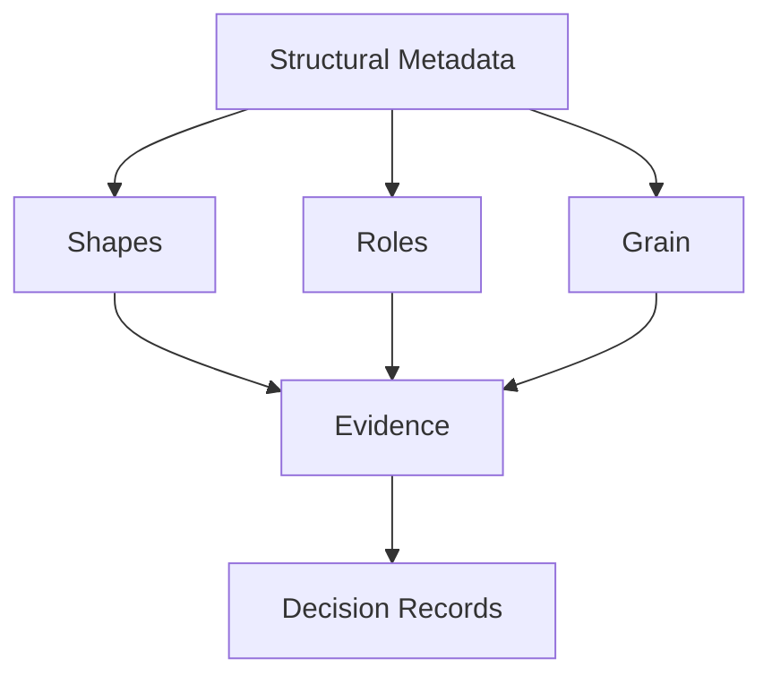

# Concepts

Deep understanding of Datasculpt's domain model.

## Why This Section

The [Getting Started](../getting-started/index.md) section shows you *how* to use Datasculpt. This section explains *why* it works the way it does.

Read this section when you want to:
- Understand what structural metadata captures
- Debug unexpected inference results
- Extend Datasculpt for your domain
- Integrate Datasculpt into a larger system

## Concept Map

## Core Concepts

| Concept | Question It Answers |
|---------|---------------------|
| [Structural Metadata](structural-metadata.md) | What category of metadata is missing? |
| [Evidence](evidence.md) | What facts do we observe about columns? |
| [Shapes](shapes.md) | What structural pattern does the data follow? |
| [Roles](roles.md) | What purpose does each column serve? |
| [Grain](grain.md) | What uniquely identifies each row? |
| [Decision Records](decision-records.md) | How do we trace inference decisions? |

## Reading Order

If you're reading cover-to-cover:

1. **Structural Metadata** — The problem Datasculpt solves
2. **Evidence** — The raw material for inference
3. **Shapes** — The first major inference
4. **Roles** — The second major inference
5. **Grain** — The third major inference
6. **Decision Records** — How everything is captured
