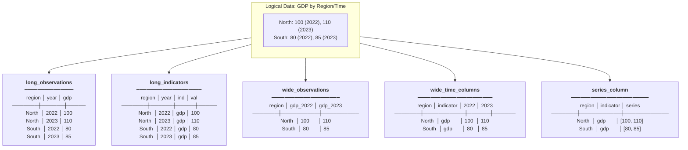

# Shapes

The structural patterns Datasculpt recognizes in datasets.

## What Is a Shape?

A shape describes how data is laid out — not what it means, but how it's structured.

The same logical data can have multiple physical shapes:

```
Logical: GDP by region and time

Shape 1: Wide observations
| region | 2022_gdp | 2023_gdp | 2024_gdp |

Shape 2: Long observations
| region | year | gdp |

Shape 3: Long indicators
| region | year | indicator | value |

Shape 4: Wide time columns
| region | 2022 | 2023 | 2024 |

Shape 5: Series column
| region | gdp_series |
```

Knowing the shape is essential for correct aggregation, joining, and querying.

### Visual Comparison: Same Data, Five Shapes

The table below shows identical GDP data (North: 100, 110; South: 80, 85 for years 2022-2023) in all five shapes:

| Shape | Layout |
|-------|--------|
| **long_observations** | `region, year, gdp`<br>`North, 2022, 100`<br>`North, 2023, 110`<br>`South, 2022, 80`<br>`South, 2023, 85` |
| **long_indicators** | `region, year, indicator, value`<br>`North, 2022, gdp, 100`<br>`North, 2023, gdp, 110`<br>`South, 2022, gdp, 80`<br>`South, 2023, gdp, 85` |
| **wide_observations** | `region, gdp_2022, gdp_2023`<br>`North, 100, 110`<br>`South, 80, 85` |
| **wide_time_columns** | `region, indicator, 2022, 2023`<br>`North, gdp, 100, 110`<br>`South, gdp, 80, 85` |
| **series_column** | `region, indicator, series`<br>`North, gdp, [100, 110]`<br>`South, gdp, [80, 85]` |



## The Five Shapes

### Long Observations

Rows are atomic observations with dimensions and measures as columns.

```csv
region,year,gdp,population
North,2022,100,1000
North,2023,110,1020
South,2022,80,800
South,2023,85,820
```

**Characteristics:**
- Each row is one observation
- Dimensions: `region`, `year`
- Measures: `gdp`, `population`
- Grain: (region, year)

**Use case:** Survey data, transaction logs, sensor readings

### Long Indicators

Unpivoted format with indicator name and value columns.

```csv
region,year,indicator,value
North,2022,gdp,100
North,2022,population,1000
North,2023,gdp,110
North,2023,population,1020
```

**Characteristics:**
- Each row is one indicator value
- Indicator column has concept names
- Value column has the numeric values
- Grain: (region, year, indicator)

**Use case:** Statistical databases, open data portals, data exchange formats

### Wide Observations

Spreadsheet-style with measures as columns.

```csv
region,gdp_2022,gdp_2023,pop_2022,pop_2023
North,100,110,1000,1020
South,80,85,800,820
```

**Characteristics:**
- Each row is one entity
- Multiple measures and/or time periods as columns
- Grain: (region)

**Use case:** Summary reports, dashboards, exports from BI tools

### Wide Time Columns

Time periods encoded in column headers.

```csv
region,indicator,2022,2023,2024
North,gdp,100,110,120
North,population,1000,1020,1040
South,gdp,80,85,90
```

**Characteristics:**
- Column names are dates (2022, 2023, 2024-01, etc.)
- Each column is a time period
- Grain: (region, indicator) — time is in headers

**Use case:** Time series from Excel, economic data, forecasts

### Series Column

Time series stored as arrays in a single column.

```csv
region,indicator,series,start_year
North,gdp,"[100, 110, 120]",2022
South,gdp,"[80, 85, 90]",2022
```

**Characteristics:**
- One column contains JSON arrays
- Arrays have consistent length
- Metadata columns describe the series

**Use case:** APIs returning time series, compact data exchange

## Shape Detection

Datasculpt scores all five shapes based on evidence:

```python
result = infer("data.csv")

for h in result.decision_record.hypotheses:
    print(f"{h.hypothesis.value}: {h.score:.2f}")
    for reason in h.reasons:
        print(f"  - {reason}")
```

### Scoring Signals

| Signal | Suggests Shape |
|--------|----------------|
| Multiple numeric columns | `wide_observations` |
| Indicator/value column pair | `long_indicators` |
| Date-like column headers | `wide_time_columns` |
| JSON arrays in values | `series_column` |
| Single numeric column | `long_observations` |

### Ambiguity

When top shapes have similar scores (gap < 0.10), inference is ambiguous:

```python
>>> result.decision_record.hypotheses[:2]
[
    HypothesisScore(hypothesis=WIDE_OBSERVATIONS, score=0.58),
    HypothesisScore(hypothesis=LONG_OBSERVATIONS, score=0.54)
]
# Gap is 0.04 — ambiguous
```

See [Ambiguous Shape](../examples/ambiguous-shape.md) for handling ambiguity.

## Shape Implications

### For Aggregation

| Shape | Safe Aggregation |
|-------|------------------|
| `long_observations` | `SUM(measure) GROUP BY dimensions` |
| `long_indicators` | `SUM(value) WHERE indicator='x' GROUP BY dimensions` |
| `wide_observations` | `SUM(measure_col) GROUP BY dimensions` |
| `wide_time_columns` | Aggregate across time columns, or unpivot first |
| `series_column` | Expand series, then aggregate |

### For Joins

| Shape | Join Safely On |
|-------|----------------|
| `long_observations` | Grain columns |
| `long_indicators` | Grain columns (includes indicator) |
| `wide_observations` | Grain columns |
| `wide_time_columns` | Grain columns (time is in headers) |
| `series_column` | Grain columns (series is not a key) |

### For Schema Evolution

| Shape | Schema Stability |
|-------|------------------|
| `long_observations` | Stable (new data = new rows) |
| `long_indicators` | Stable (new indicators = new rows) |
| `wide_observations` | Unstable (new measures = new columns) |
| `wide_time_columns` | Unstable (new times = new columns) |
| `series_column` | Stable (new times = longer arrays) |

## Shape to DatasetKind Mapping

Datasculpt maps shapes to Invariant's DatasetKind:

| Shape | DatasetKind |
|-------|-------------|
| `long_observations` | `OBSERVATIONS` |
| `long_indicators` | `INDICATORS_LONG` |
| `wide_observations` | `OBSERVATIONS` |
| `wide_time_columns` | `TIMESERIES_WIDE` |
| `series_column` | `TIMESERIES_SERIES` |

## Configuration

Tune shape detection:

```python
from datasculpt.core.types import InferenceConfig

config = InferenceConfig(
    min_time_columns_for_wide=3,    # Require 3+ date headers for wide_time_columns
    hypothesis_confidence_gap=0.1,  # Gap for ambiguity detection
)
```

## See Also

- [Wide Observations Example](../examples/wide-observations.md)
- [Long Indicators Example](../examples/long-indicators.md)
- [Wide Time Columns Example](../examples/wide-time-columns.md)
- [Series Column Example](../examples/series-column.md)
- [Ambiguous Shape Example](../examples/ambiguous-shape.md)
