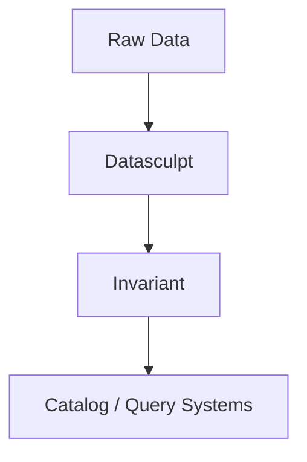

# Structural Metadata

The missing category of metadata that Datasculpt produces.

## The Five Metadata Categories

| Category | What It Captures | Example |
|----------|------------------|---------|
| **Technical** | Physical storage details | File format, encoding, compression |
| **Business** | Domain meaning | "Revenue" means Q4 sales in USD |
| **Operational** | Lineage and freshness | Last updated 2024-01-15, from ERP |
| **Governance** | Access and compliance | PII, restricted to finance team |
| **Structural** | Layout and intent | Wide format, grain is (region, date) |

Most data catalogs and semantic layers handle the first four well. The fifth — **structural metadata** — is usually assumed to exist but rarely produced systematically.

## What Structural Metadata Captures

### 1. Dataset Shape

How is the data laid out?

| Shape | Layout |
|-------|--------|
| Long observations | Rows are atomic observations |
| Long indicators | Rows are unpivoted indicator/value pairs |
| Wide observations | Measures are columns |
| Wide time columns | Time periods are column headers |
| Series column | Time series stored in arrays |

The same logical data can have multiple physical layouts. Structural metadata makes the layout explicit.

### 2. Column Roles

What purpose does each column serve?

| Role | Purpose |
|------|---------|
| Key | Contributes to uniqueness |
| Dimension | Categorical grouping variable |
| Measure | Numeric, aggregatable value |
| Time | Temporal dimension |
| Indicator name | Identifies metric in unpivoted data |
| Value | Holds value in unpivoted data |
| Series | Contains embedded time series |
| Metadata | Descriptive, non-analytical |

Without explicit roles, systems guess — and often guess wrong.

### 3. Grain

What uniquely identifies each row?

- Which columns form the unique key?
- Are there duplicates?
- Are there nulls in key columns?

Grain errors cause silent failures: joins that duplicate, aggregations that double-count.

### 4. Structural Constraints

What invariants must hold?

- Time columns must be sequential
- Indicator names must be from a known set
- Series arrays must have consistent length

Constraints enable validation before data enters downstream systems.

## Why Structural Metadata Is Missing

### Systems Assume It

Data catalogs store whatever you tell them. They don't infer structure.

```python
# Catalog stores what you provide
catalog.register(
    table="demographics",
    columns=["geo_id", "sex", "age_group", "population"],
    # But: Is this wide or long? What's the grain? Which are measures?
)
```

### Manual Annotation Doesn't Scale

You could manually annotate every dataset. In practice:
- New datasets arrive faster than humans annotate
- Annotations drift as data changes
- Different teams annotate inconsistently

### Inference Is Hard

Structural inference requires:
- Understanding multiple shapes
- Handling ambiguity gracefully
- Producing audit trails
- Being deterministic for trust

Most teams build one-off scripts that break on edge cases.

## How Datasculpt Fills the Gap

### 1. Systematic Inference

Every dataset goes through the same pipeline:
```
Evidence → Shapes → Roles → Grain → Decision
```

No ad-hoc scripts. No human in the loop (unless ambiguous).

### 2. Confidence Scores

Every inference is scored:
- Shape hypothesis: 0.72 confidence
- Role assignment: 0.85 confidence
- Grain: 95% uniqueness ratio

Low confidence triggers questions, not silent guesses.

### 3. Audit Trails

Every decision is recorded:
- What was chosen
- What alternatives were considered
- What evidence supported the choice
- What questions were asked

Reproducible. Debuggable. Trustworthy.

### 4. Determinism

Same input → same output. No:
- LLM randomness
- Hidden state
- Environment dependence

## Where Datasculpt Fits



Datasculpt produces structural metadata (shape, grain, roles). Invariant uses it for governance. Catalogs store and serve the governed data.

## See Also

- [Evidence](evidence.md) — The facts Datasculpt extracts
- [Shapes](shapes.md) — The structural patterns Datasculpt recognizes
- [Decision Records](decision-records.md) — How inferences are captured
