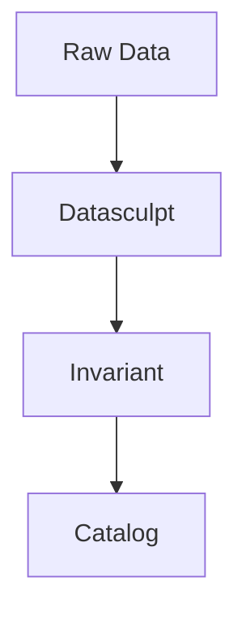

# Mental Model

Where Datasculpt fits and how it thinks.

## Where Datasculpt Sits

Datasculpt works **upstream** of catalogs, semantic layers, and governance engines. It produces the structural metadata these systems assume exists.

## The Problem

Most data systems *assume* structural understanding exists but don't *produce* it.

When you load a CSV into a semantic layer, it assumes you know:
- Is this long or wide format?
- Which columns form the unique key?
- Which columns are dimensions vs measures?

If you guess wrong, errors are silent:
- Joins break without error messages
- Aggregations produce wrong numbers
- Metrics drift over time

## The Solution

Datasculpt infers and explains structural intent. It makes implicit assumptions explicit.

## The Three Outputs

### 1. Shape

What structural pattern does the data follow?

| Shape | Description | Example |
|-------|-------------|---------|
| `long_observations` | Rows are atomic observations | Survey responses |
| `long_indicators` | Unpivoted indicator/value pairs | Statistical data |
| `wide_observations` | Measures as columns | Spreadsheets |
| `wide_time_columns` | Time periods in headers | Yearly data |
| `series_column` | Arrays/objects in cells | Embedded time series |

### 2. Grain

What uniquely identifies each row?

The grain is the minimal set of columns that, when combined, produce unique values for every row. Most data errors are grain errors — joins that silently duplicate rows, aggregations that double-count.

### 3. Column Roles

What purpose does each column serve?

| Role | Description |
|------|-------------|
| `key` | Contributes to uniqueness |
| `dimension` | Categorical grouping |
| `measure` | Numeric, aggregatable |
| `time` | Temporal dimension |
| `indicator_name` | Names in unpivoted data |
| `value` | Values in unpivoted data |
| `series` | Embedded time series |
| `metadata` | Descriptive, non-analytical |

## Evidence → Hypotheses → Decision

Datasculpt uses a three-phase process:

### Phase 1: Evidence

Extract facts about each column:
- Primitive type (string, integer, number, boolean, date)
- Structural type (scalar, array, object)
- Statistics (null rate, cardinality, value distribution)
- Parse results (date parsing, JSON detection)

Evidence is **objective** — it's what we observe, not what we interpret.

### Phase 2: Hypotheses

Score competing interpretations:
- Each shape hypothesis gets a score (0.0 to 1.0)
- Each column role gets a score
- Grain candidates are tested for uniqueness

Hypotheses are **ranked**, not binary. We don't pick one and throw away alternatives.

### Phase 3: Decision

Record the final choice with justification:
- Selected shape with confidence
- Alternative shapes that were considered
- Evidence supporting each choice
- Questions for ambiguous aspects

Decisions are **auditable** — you can trace why any choice was made.

## Why Determinism Matters

Given identical input and configuration, Datasculpt produces identical output.

- No LLMs in the decision loop
- No random sampling
- No hidden state

This means:
- Results are reproducible
- Tests are reliable
- Debugging is tractable
- Trust is earned, not assumed

## When to Use Interactive Mode

Use `interactive=True` when:
- You want to review ambiguous decisions
- The domain requires human confirmation
- You're building a registration workflow

In interactive mode, Datasculpt generates questions for:
- Ambiguous shape (close scores between top hypotheses)
- Low-confidence grain (uniqueness ratio < 1.0)
- Uncertain role assignments

## Next Steps

- [Examples](../examples/index.md) — See these concepts in action
- [Concepts](../concepts/index.md) — Deep dive into each concept
