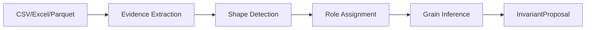
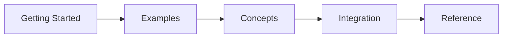

# Datasculpt Documentation

Datasculpt infers the structural intent of tabular datasets before they enter semantic systems.

## Try It Now

**[Launch the Interactive Demo](demo/)** — Upload a CSV or Excel file and see inference in action. Your data never leaves your browser.

!!! note "About the Demo"
    The demo uses [Pyodide](https://pyodide.org/) to run Python entirely in your browser. This is for demonstration purposes only. In production, Datasculpt is designed to run server-side where it can process larger datasets efficiently and integrate with your data pipelines.

## When to Use Datasculpt

Datasculpt is designed for these scenarios:

- **Ingesting unfamiliar datasets** — When you receive data from external sources and need to understand its structure before processing
- **Building data pipelines** — When your pipelines need structural metadata to route, validate, or transform data correctly
- **Governance workflows** — When you need audit trails showing how structural decisions were made
- **Catalog registration** — When preparing datasets for registration in data catalogs like [Invariant](https://github.com/invariant-labs)

## When Not to Use Datasculpt

Datasculpt may not be the right tool if:

- **Schema is already known** — If you have explicit schema definitions, use them directly
- **One-off exploration** — For quick data exploration, tools like pandas profiling are simpler
- **Real-time streaming** — Datasculpt processes complete files, not streaming data
- **Non-tabular data** — JSON documents, images, unstructured text, and other non-tabular formats are out of scope

## How It Works

Each stage builds on the previous, producing a complete structural description with a decision record explaining every inference.

## Who This Documentation Is For

| You are... | Start here |
|------------|------------|
| New to Datasculpt | [Quickstart](getting-started/quickstart.md) |
| Want to understand the concepts | [Mental Model](getting-started/mental-model.md) |
| Looking for usage patterns | [Examples](examples/index.md) |
| Integrating into your pipeline | [Integration Guide](integration/index.md) |
| Looking up API details | [Reference](reference/index.md) |

## Documentation Map

## Quick Links

- **[Quickstart](getting-started/quickstart.md)** — First inference in 5 minutes
- **[Examples](examples/index.md)** — Learn by seeing inference in action
- **[Concepts](concepts/index.md)** — Understand shapes, roles, and grain
- **[API Reference](reference/api.md)** — Function signatures and types
