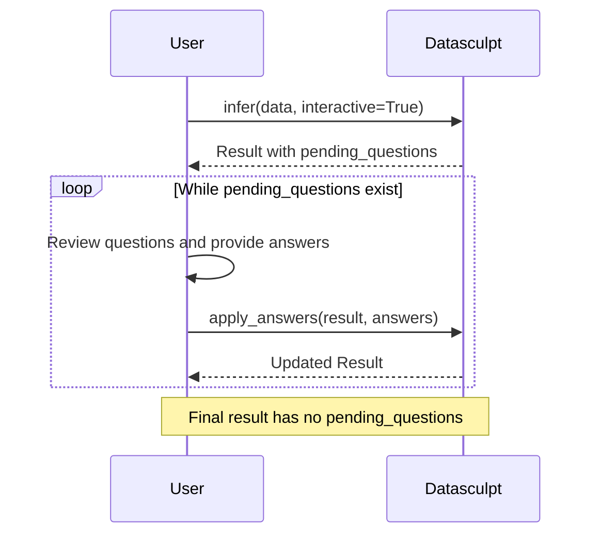

# Interactive Mode

Resolve ambiguity with human-in-the-loop workflows.

## When to Use Interactive Mode

Use interactive mode when:
- Datasets are genuinely ambiguous
- Domain expertise is required for correct interpretation
- You're building a registration workflow with human review
- You want to surface uncertainty rather than hide it

## Enabling Interactive Mode

```python
from datasculpt import infer

result = infer("data.csv", interactive=True)
```

## Workflow Overview



## Checking for Questions

```python
if result.pending_questions:
    print(f"{len(result.pending_questions)} questions need answers")
    for q in result.pending_questions:
        print(f"- {q.prompt}")
else:
    print("No ambiguity detected")
```

## Question Types

### Choose One

Single selection from options:

```python
Question(
    id='q_shape_123',
    type=<QuestionType.CHOOSE_ONE>,
    prompt='The dataset shape is ambiguous. Please select:',
    choices=[
        {'value': 'wide_observations', 'label': 'Wide Observations', 'score': 0.58},
        {'value': 'long_indicators', 'label': 'Long Indicators', 'score': 0.52},
    ],
    default='wide_observations',
    rationale='Score gap is 0.06, below threshold 0.10'
)
```

### Choose Many

Multiple selection (for grain columns):

```python
Question(
    id='q_grain_456',
    type=<QuestionType.CHOOSE_MANY>,
    prompt='Please select the grain (unique key columns):',
    choices=[
        {'value': ['geo_id', 'date'], 'label': 'Inferred: geo_id, date (95% unique)'},
        {'value': ['geo_id'], 'label': 'geo_id'},
        {'value': ['geo_id', 'date', 'category'], 'label': 'geo_id, date, category'},
    ],
    default=['geo_id', 'date']
)
```

### Confirm

Yes/no confirmation:

```python
Question(
    id='q_confirm_789',
    type=<QuestionType.CONFIRM>,
    prompt='Is "row_id" a meaningful key column?',
    default=False,
    rationale='Column appears to be an auto-generated index'
)
```

## Providing Answers

```python
from datasculpt import apply_answers

# Collect answers (from UI, CLI, etc.)
answers = {
    'q_shape_123': 'long_indicators',
    'q_grain_456': ['geo_id', 'date', 'indicator'],
}

# Apply answers and re-run inference
result = apply_answers(result, answers)
```

## Answer Merging

Answers accumulate across multiple apply_answers calls:

```python
# First round
result = infer("data.csv", interactive=True)
answers1 = {'q_shape_123': 'long_indicators'}
result = apply_answers(result, answers1)

# Second round (new questions may appear)
if result.pending_questions:
    answers2 = {'q_grain_456': ['geo_id', 'date', 'indicator']}
    result = apply_answers(result, answers2)

# All answers are merged
>>> result.decision_record.answers
{'q_shape_123': 'long_indicators', 'q_grain_456': ['geo_id', 'date', 'indicator']}
```

## Building a CLI Workflow

```python
from datasculpt import infer, apply_answers

def interactive_infer(filepath: str):
    result = infer(filepath, interactive=True)

    while result.pending_questions:
        answers = {}
        for q in result.pending_questions:
            print(f"\n{q.prompt}")
            if q.rationale:
                print(f"  ({q.rationale})")

            for i, choice in enumerate(q.choices):
                print(f"  [{i}] {choice['label']}")

            selection = int(input("Select: "))
            answers[q.id] = q.choices[selection]['value']

        result = apply_answers(result, answers)

    return result

result = interactive_infer("data.csv")
print(f"Shape: {result.proposal.shape_hypothesis.value}")
print(f"Grain: {result.decision_record.grain.key_columns}")
```

## Building a Web Workflow

```python
from flask import Flask, request, jsonify, session
from datasculpt import infer, apply_answers

app = Flask(__name__)

@app.route('/infer', methods=['POST'])
def start_inference():
    filepath = request.json['filepath']
    result = infer(filepath, interactive=True)

    # Store result in session for later
    session['dataframe'] = result.dataframe.to_json()
    session['answers'] = {}

    if result.pending_questions:
        return jsonify({
            'status': 'questions',
            'questions': [
                {
                    'id': q.id,
                    'type': q.type.value,
                    'prompt': q.prompt,
                    'choices': q.choices,
                    'default': q.default,
                }
                for q in result.pending_questions
            ]
        })

    return jsonify({
        'status': 'complete',
        'proposal': serialize_proposal(result.proposal)
    })

@app.route('/answer', methods=['POST'])
def submit_answers():
    new_answers = request.json['answers']
    session['answers'].update(new_answers)

    # Re-run with accumulated answers
    import pandas as pd
    df = pd.read_json(session['dataframe'])
    result = infer(df, interactive=True, answers=session['answers'])

    if result.pending_questions:
        return jsonify({
            'status': 'questions',
            'questions': [...]
        })

    return jsonify({
        'status': 'complete',
        'proposal': serialize_proposal(result.proposal)
    })
```

## Tuning Sensitivity

Adjust when questions are generated:

```python
from datasculpt.core.types import InferenceConfig

# More questions (lower threshold)
config = InferenceConfig(
    hypothesis_confidence_gap=0.15,  # 15% gap triggers question
)

# Fewer questions (higher threshold)
config = InferenceConfig(
    hypothesis_confidence_gap=0.05,  # Only 5% gap triggers question
)

result = infer("data.csv", config=config, interactive=True)
```

## Non-Interactive Fallback

Without `interactive=True`, Datasculpt picks the top hypothesis but records uncertainty:

```python
result = infer("data.csv")  # Not interactive

# Still see the ambiguity in warnings
>>> result.proposal.warnings
['Shape detection confidence is low (gap: 0.06). Consider manual review.']

# Still see the full hypothesis ranking
>>> result.decision_record.hypotheses
[HypothesisScore(wide_observations, 0.58), HypothesisScore(long_indicators, 0.52), ...]
```

## Next Steps

- [Ambiguous Shape Example](../examples/ambiguous-shape.md) — Detailed walkthrough
- [Optional Adapters](optional-adapters.md) — Enhanced profiling
- [API Reference](../reference/api.md) — Full function signatures
