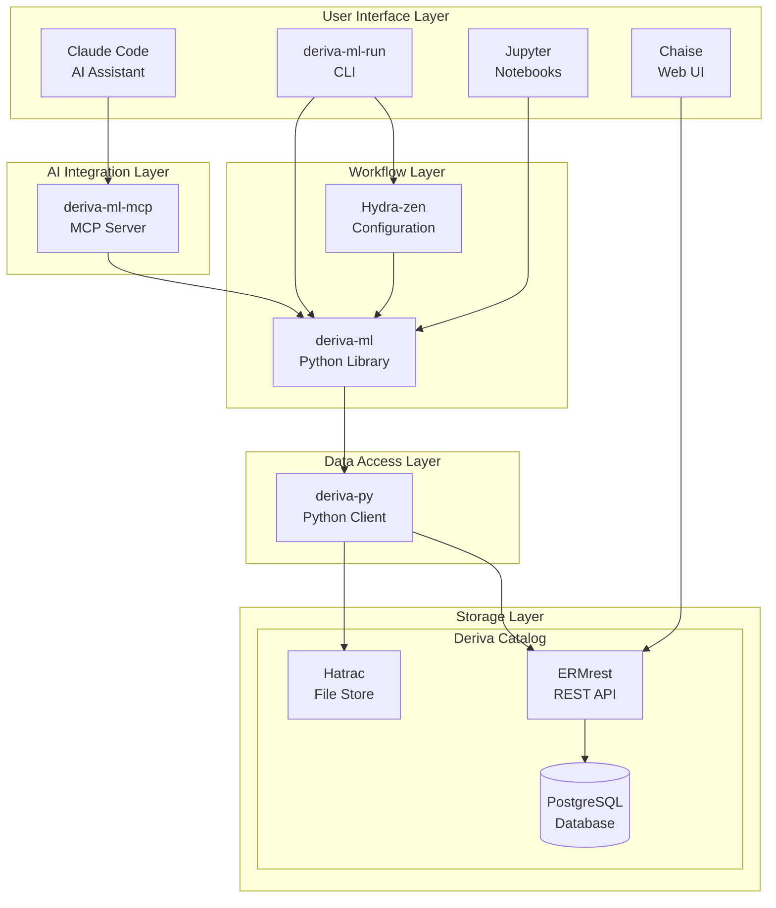
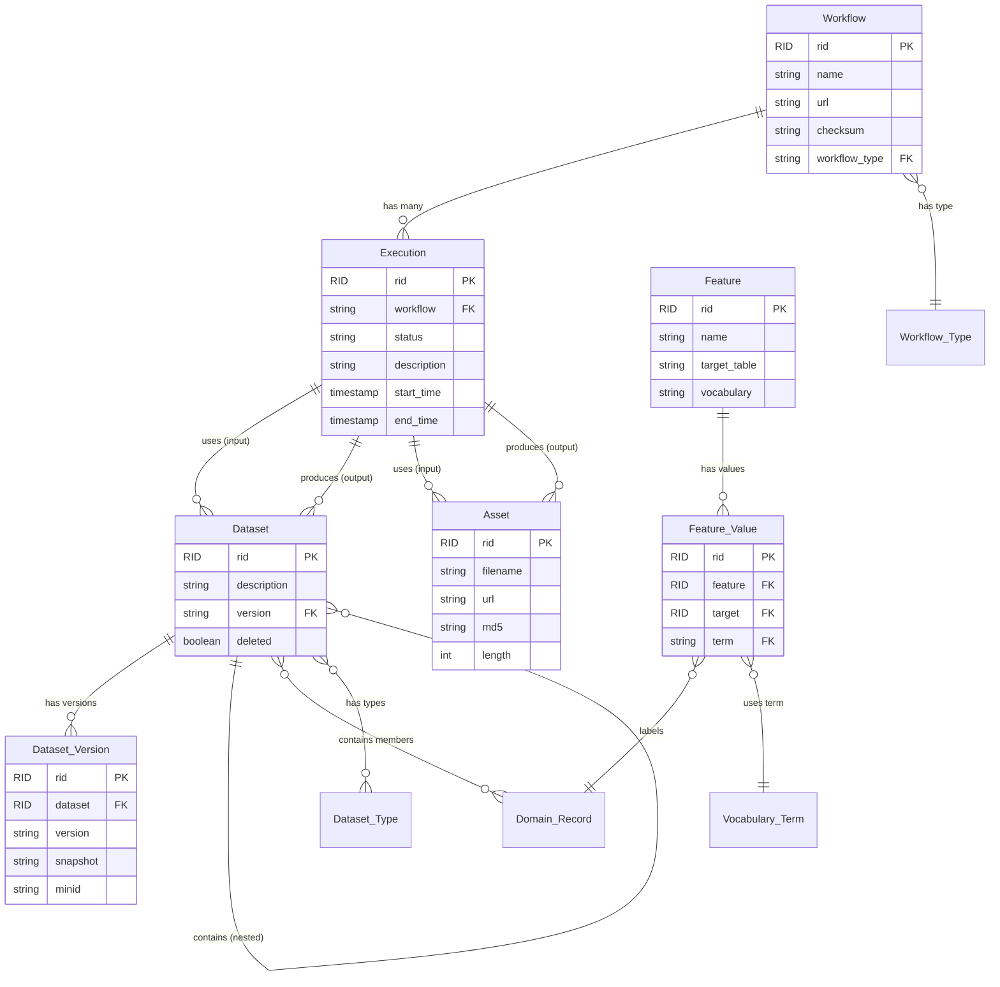
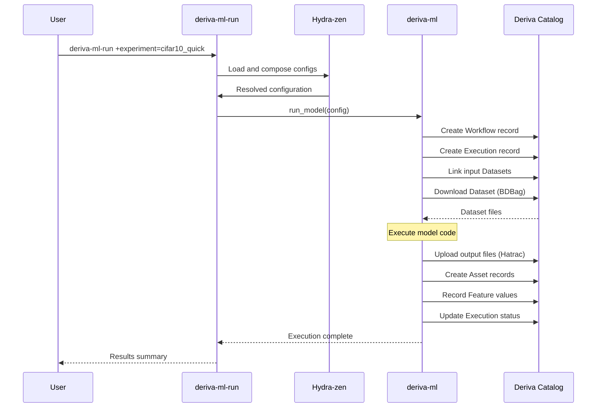
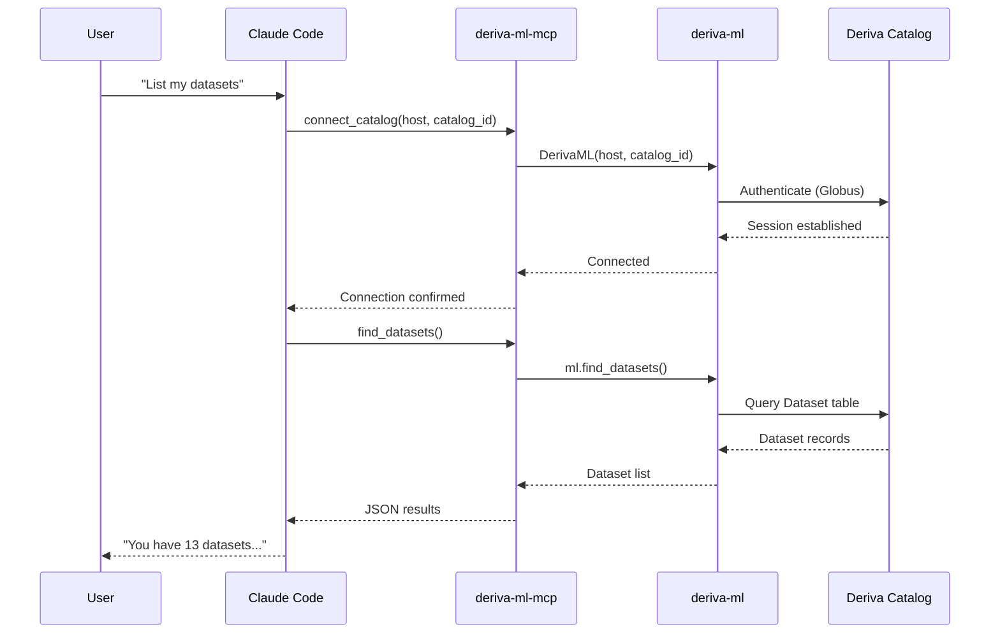
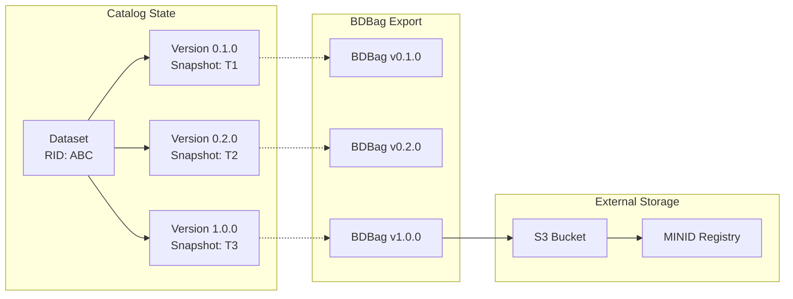
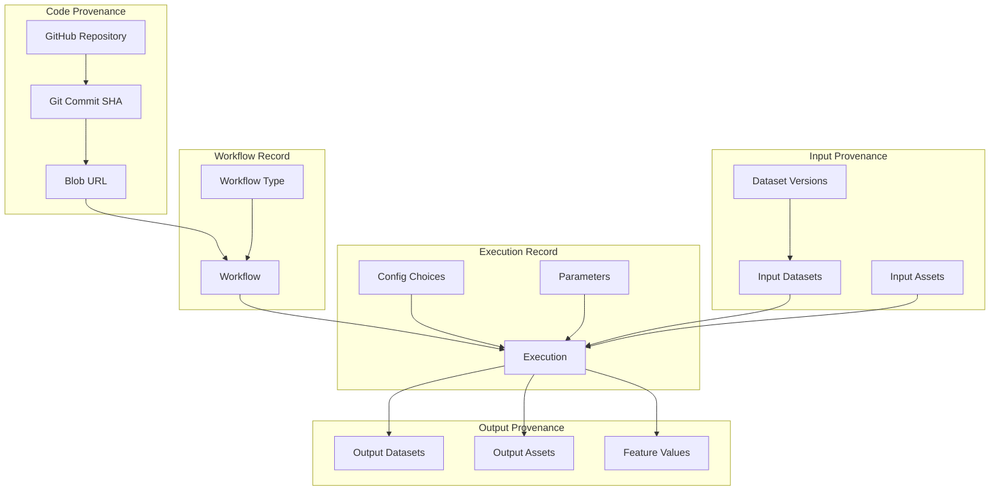
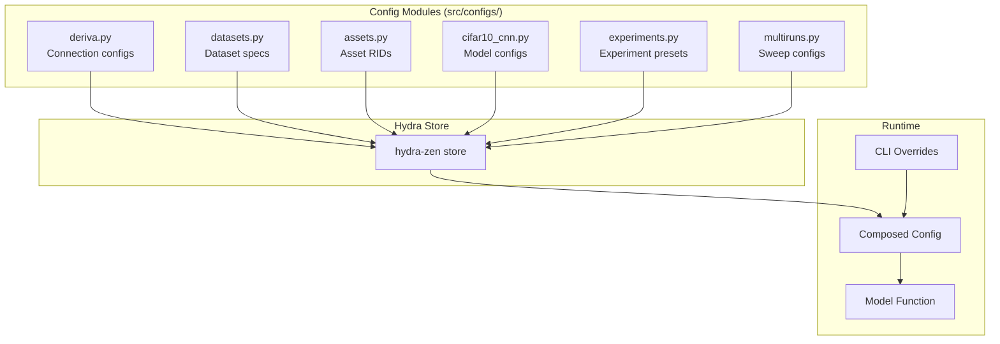
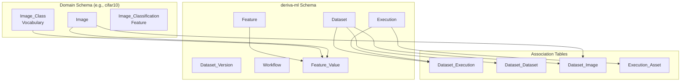
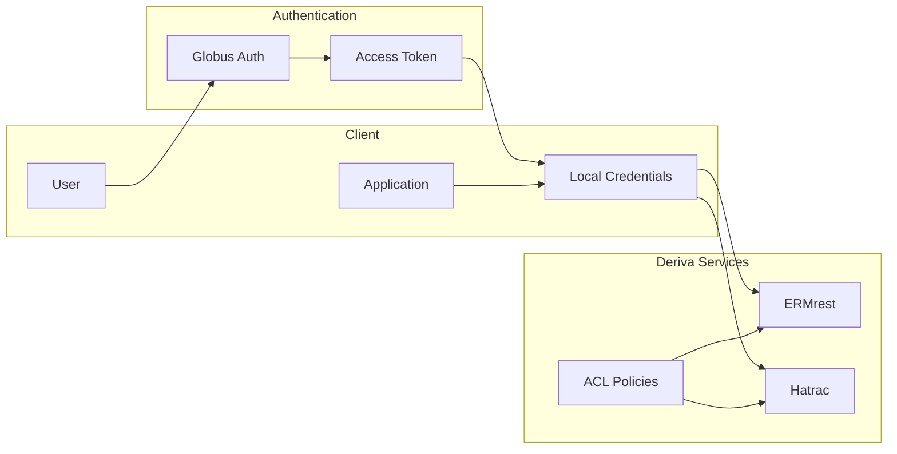

# DerivaML System Architecture

This document describes the architecture of the DerivaML ecosystem, including all components and their relationships.

## System Overview

DerivaML is a comprehensive platform for reproducible machine learning workflows. It combines scientific data management (Deriva), ML workflow orchestration (deriva-ml), AI-assisted development (MCP server + Claude Code), and configuration management (Hydra-zen) into a unified system that captures complete provenance for all experiments.

## Component Descriptions

### Storage Layer: Deriva Catalog

The Deriva catalog provides the persistent storage foundation:

- **PostgreSQL Database**: Stores all structured data including datasets, executions, features, and vocabularies
- **ERMrest**: Entity-Relationship Mapping REST API that provides a RESTful interface to the database with fine-grained access control
- **Hatrac**: Object storage service for large files (images, model weights, prediction outputs)
- **Chaise**: Web-based user interface for browsing and editing catalog data

### Data Access Layer: deriva-py

The `deriva-py` library provides Python bindings for Deriva services:

- ERMrest client for database operations (CRUD, queries, schema management)
- Hatrac client for file upload/download
- Authentication via Globus
- BDBag support for reproducible data packaging

### Workflow Layer: deriva-ml

The `deriva-ml` library provides ML-specific abstractions:

- **DerivaML**: Main class connecting to catalogs and orchestrating workflows
- **Execution**: Tracks individual experiment runs with inputs, outputs, and status
- **Dataset**: Versioned collections of data with semantic versioning
- **Workflow**: Reusable workflow definitions linked to source code
- **Feature**: Maps vocabulary terms to domain records (labels, annotations)
- **Asset**: Files with metadata (images, model weights, predictions)

### Configuration Layer: Hydra-zen

Hydra-zen provides Python-first configuration management:

- Configuration as code (no YAML files)
- Runtime composition and overrides
- Multirun support for hyperparameter sweeps
- Automatic config tracking for reproducibility

### AI Integration Layer: deriva-ml-mcp

The MCP (Model Context Protocol) server exposes DerivaML operations to AI assistants:

- 60+ tools for catalog operations
- Resources for read-only access to schema and data
- Prompts for guided workflows
- Secure credential handling (never exposed to AI)

### User Interface Layer

Multiple interfaces for different use cases:

- **Claude Code**: AI-powered development assistant using MCP tools
- **deriva-ml-run**: Command-line interface for running experiments
- **Jupyter Notebooks**: Interactive analysis with `run_notebook()` API
- **Chaise**: Web UI for browsing and editing data

## Data Model

The core entities and their relationships:

## Workflow: Running an Experiment

The typical flow for running an ML experiment:

## Workflow: AI-Assisted Development

Using Claude Code with the MCP server:

## Dataset Versioning and BDBags

Datasets support semantic versioning for reproducibility:

**Version semantics:**
- **Major**: Breaking changes to dataset structure
- **Minor**: New data added (members, types, features)
- **Patch**: Metadata corrections

**BDBag features:**
- Self-describing archive format
- Cryptographic checksums for integrity
- Remote file references for large assets
- MINID registration for permanent identifiers

## Provenance Chain

Complete provenance tracking from code to results:

## Configuration System

Hydra-zen configuration hierarchy:

**Configuration groups:**
- `deriva_ml`: Connection settings (hostname, catalog_id)
- `datasets`: Dataset specifications with RID and version
- `assets`: Asset RID lists for pre-trained weights, etc.
- `model_config`: Model hyperparameters
- `experiment`: Preset combinations of all settings
- `multirun`: Parameter sweep definitions

## Schema Organization

The catalog uses multiple schemas for organization:

## Security Model

Authentication and authorization flow:

**Security features:**
- Globus authentication with local token caching
- Fine-grained ACLs at table, row, and column level
- MCP server never exposes credentials to AI
- Docker isolation for containerized deployments

## Summary

The DerivaML ecosystem provides:

1. **Reproducibility**: Complete provenance from code to results
2. **Versioning**: Semantic versioning for datasets with BDBag export
3. **Flexibility**: Multiple interfaces (CLI, notebooks, AI assistant, web)
4. **Scalability**: Handles large datasets with remote file references
5. **Security**: Fine-grained access control with Globus authentication
6. **Discoverability**: AI-assisted exploration and development
