# Core Concepts

devqubit treats each execution as a **run** — a complete, tracked experiment with enough context to:

- reproduce what happened,
- compare results across time / devices / SDKs,
- debug failures (even partial ones),
- gate changes in CI via verification policies.

> **Terminology**
> - **Run Record**: lightweight metadata + user logs + pointers to artifacts (`devqubit.run/1.0` schema).
> - **Artifacts**: content-addressed blobs (SHA-256) stored in an object store.
> - **UEC / ExecutionEnvelope**: canonical, structured execution context produced by adapters (`devqubit.envelope/1.0` schema).

## How It Works

When you wrap a backend with `run.wrap()`, devqubit intercepts executions and automatically captures circuits, device state, and results. Manual logging (`log_param`, `log_metric`) is stored alongside. Everything flows into a content-addressed store for deduplication and integrity, with queryable metadata in a registry.

```mermaid
%%{init:{
  "theme":"base",
  "flowchart":{"curve":"basis","nodeSpacing":34,"rankSpacing":44,"htmlLabels":true},
  "themeVariables":{
    "fontFamily":"ui-sans-serif, system-ui, -apple-system, Segoe UI, Roboto, Ubuntu, Cantarell, Noto Sans, Helvetica, Arial, sans-serif",
    "fontSize":"14px",
    "background":"#ffffff",
    "textColor":"#0f172a",
    "lineColor":"#94a3b8",
    "clusterBkg":"#f8fafc",
    "clusterBorder":"#cbd5e1",
    "edgeLabelBackground":"#ffffff"
  }
}}%%

flowchart TB
  subgraph USER["User Code"]
    direction TB
    TRACK["with track(project) as run"]
    LOG["log_param()<br/>log_metric()<br/>set_tag()"]
    WRAP["backend = run.wrap(device)"]
    EXEC["backend.run(circuit, shots=1000)"]
    TRACK --> LOG
    TRACK --> WRAP
    WRAP --> EXEC
  end

  subgraph CAPTURE["Adapter automatic capture"]
    direction LR
    CAP_PRG["📄 Circuit"]
    CAP_DEV["🔧 Device"]
    CAP_RES["📊 Results"]
  end

  subgraph PERSIST["Storage"]
    direction TB
    ENV["ExecutionEnvelope"]
    RR["Run Record"]
    STORE[("Object Store<br/>content-addressed")]
    REG[("Registry<br/>queryable index")]
    ENV -->|artifact| STORE
    RR --> REG
    STORE -.->|refs| RR
  end

  subgraph TOOLS["Analysis"]
    direction LR
    DIFF["diff()"]
    VERIFY["verify()"]
    DIFF ~~~ VERIFY
  end

  EXEC --> CAPTURE
  CAP_PRG --> ENV
  CAP_DEV --> ENV
  CAP_RES --> ENV
  LOG --> RR
  REG --> TOOLS
  STORE --> TOOLS

  linkStyle default stroke:#94a3b8,stroke-width:1.4

  %% Subgraphy jako “sekcje” + białe karty w środku
  style USER fill:#eff6ff,stroke:#2563eb,stroke-width:1.6,color:#0f172a
  style CAPTURE fill:#fffbeb,stroke:#d97706,stroke-width:1.6,color:#0f172a
  style PERSIST fill:#ecfdf5,stroke:#059669,stroke-width:1.6,color:#064e3b
  style TOOLS fill:#f5f3ff,stroke:#7c3aed,stroke-width:1.6,color:#3b0764

  classDef card fill:#ffffff,stroke:#cbd5e1,stroke-width:1.2,color:#0f172a;
  class TRACK,LOG,WRAP,EXEC,CAP_PRG,CAP_DEV,CAP_RES,ENV,RR,DIFF,VERIFY card
  classDef pill fill:#ffffff,stroke:#cbd5e1,stroke-width:1.2,color:#0f172a;
  class STORE,REG pill

```



## What Is Persisted Where?

| Store | Content | Purpose |
|-------|---------|---------|
| **Object store** | Immutable blobs by SHA-256 digest | Deduplication, integrity, offline bundles |
| **Registry** | Run records (run_id, project, timestamps, fingerprints, artifact pointers) | Queries, listing, baseline management |

## Run

A run captures everything about a single experiment execution. Run records follow the `devqubit.run/1.0` schema:

| Category | Description |
|----------|-------------|
| **Metadata** | Project, timestamps, status, run name, adapter |
| **Parameters** | Configuration values via `log_param()` |
| **Metrics** | Numeric results via `log_metric()` (scalar or time series) |
| **Tags** | String key-value pairs via `set_tag()` |
| **Artifacts** | Programs (QASM/QPY), results, device snapshots, envelopes, notes |
| **Fingerprints** | Stable hashes for reproducibility and comparison |
| **Environment** | Python + packages (optional capture) |
| **Provenance** | Git commit/branch/dirty state (optional capture) |

## Run Lifecycle


**Robustness guarantees:**
- Best-effort finalization — failures during finalization are recorded; the system still attempts to persist.
- Content integrity — artifacts are addressed by digest; corruption is detectable.
- Schema evolution — explicit `schema` field enables backwards-compatible readers.

## Artifacts

Artifacts are immutable blobs stored by digest, enabling deduplication, caching, and integrity verification.

| Role | Description |
|------|-------------|
| `program` | Circuit/program artifacts (QPY, QASM) — used for fingerprinting |
| `results_raw` | Raw SDK result payloads |
| `device_raw` | Raw backend properties (lossless capture) |
| `envelope` | ExecutionEnvelope (UEC JSON) |
| `config` | Compile/execute options, environment snapshots |
| `documentation` | Notes, attachments |

Artifact ingestion enforces a maximum size (~20 MB default). For larger blobs, store a URI pointer or truncate with `meta.original_digest` marker.

## Fingerprints

Fingerprints are stable hashes computed from run contents, excluding volatile fields (timestamps, job IDs).

| Fingerprint | Based on |
|-------------|----------|
| `program` | Program hashes (from UEC program snapshot) |
| `device` | Device identity + stable snapshots |
| `intent` | Adapter + SDK + compile/execute config |
| `run` | Combined fingerprint of program + device + intent |

Use fingerprints to detect what changed between runs — same `program` fingerprint means same circuit structure, even if run at different times.

## Comparison and Verification

**diff** compares two runs across multiple dimensions: parameter/metric changes, program match (digest/structural/parametric), device drift (calibration deltas), and result distribution distance (TVD with optional bootstrap noise context).

**verify** checks a candidate run against a baseline with a policy: required equality constraints (params/program), TVD thresholds (hard limit or noise-calibrated), and produces a human-readable verdict with root-cause analysis.

```python
from devqubit.compare import diff, verify_baseline

# Compare two runs
result = diff("run_a", "run_b")
print(result.tvd, result.program.structural_match)

# CI verification
result = verify_baseline("candidate", project="bell")
assert result.ok, result.verdict.summary
```
