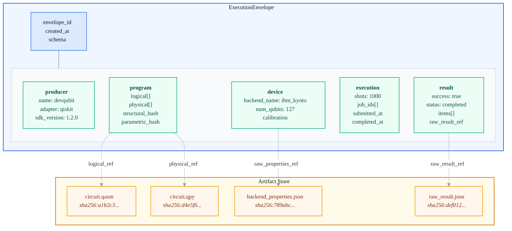

# Uniform Execution Contract (UEC)

> **You don't need to create envelopes manually.** SDK adapters (`devqubit-qiskit`, `devqubit-braket`, etc.) automatically capture and validate ExecutionEnvelopes during `run.wrap()` executions. For runs without an adapter (manual tracking), the engine synthesizes a minimal envelope at finalization. This document describes the internal structure for contributors and advanced debugging.

Quantum experiments depend on **programs**, **devices**, **execution settings**, and (on hardware) **calibration** that drift over time. To keep runs reproducible and comparable, adapters produce a standardized **ExecutionEnvelope** that captures execution context and results.

- A **Run Record** stays small and queryable.
- The **ExecutionEnvelope** is the canonical, schema-validated "evidence pack" used by diff/verify tooling.

## Envelope at a Glance



**Required fields**: `schema`, `envelope_id`, `created_at`, `producer`, `result`.

## Schema Contract

All envelopes are validated against `devqubit.envelope/1.0` (JSON Schema Draft 2020-12). Top-level is strict (`additionalProperties: false`). Extra data belongs in `metadata`.

**Conditional requirements:**

1. If `producer.adapter != "manual"`:
   - `program` and `execution` must exist
   - `program.structural_hash` and `program.parametric_hash` must exist

2. If `program.physical` exists and is non-empty:
   - `program.executed_structural_hash` and `program.executed_parametric_hash` must exist

## Snapshot Reference

Each snapshot has its own schema identifier for independent versioning.

### `producer` — ProducerInfo

Required: `name`, `adapter`, `frontends`.

Optional: `engine_version`, `adapter_version`, `sdk`, `sdk_version`.

### `program` — ProgramSnapshot

Schema: `devqubit.program_snapshot/1.0`

| Field | Description |
|-------|-------------|
| `logical[]` | Pre-transpilation circuit artifacts |
| `physical[]` | Post-transpilation circuit artifacts |
| `structural_hash` | Hash of circuit structure (ignores parameter values) |
| `parametric_hash` | Hash of structure + bound parameter values |
| `executed_structural_hash` | Structural hash of transpiled circuits (when physical exists) |
| `executed_parametric_hash` | Parametric hash of transpiled circuits |
| `num_circuits` | Number of circuits |
| `transpilation` | Adapter-specific transpilation details |

### `device` — DeviceSnapshot

Schema: `devqubit.device_snapshot/1.0`

| Field | Description |
|-------|-------------|
| `captured_at` | Snapshot timestamp |
| `backend_name` | Backend identifier |
| `backend_type` | `hardware`, `simulator`, or `emulator` |
| `provider` | Provider identifier |
| `num_qubits` | Qubit count |
| `connectivity` | Edge list `[[i,j], ...]` |
| `native_gates` | Supported gate set |
| `calibration` | Aggregated calibration metrics |
| `raw_properties_ref` | ArtifactRef to full raw backend properties |

### `execution` — ExecutionSnapshot

Schema: `devqubit.execution_snapshot/1.0`

| Field | Description |
|-------|-------------|
| `submitted_at` | Submission timestamp |
| `completed_at` | Completion timestamp |
| `shots` | Number of shots |
| `execution_count` | Number of executions |
| `job_ids` | Provider job IDs |
| `transpilation` | Transpilation metadata |
| `options` | Raw execution options |
| `sdk` | SDK identifier |

### `result` — ResultSnapshot

Schema: `devqubit.result_snapshot/1.0`

Required: `success`, `status`, `items`.

| Field | Description |
|-------|-------------|
| `success` | Overall execution success |
| `status` | `completed`, `failed`, `cancelled`, `partial`, `pending`, `running` |
| `error` | Structured error info (`type`, `message`) when failed |
| `items[]` | Per-circuit results (counts, quasi_probability, or expectation) |
| `raw_result_ref` | ArtifactRef to full raw SDK result |

**Bitstring normalization:** `counts.format.bit_order` is canonical `cbit0_right` (LSB on right). If the source SDK uses a different convention, adapters set `format.transformed = true` and record `format.source_key_format`. This prevents silent mismatches when comparing distributions across SDKs.

## ArtifactRef

Content-addressed references used throughout:

| Field | Description |
|-------|-------------|
| `digest` | Required, format: `sha256:<64 hex>` |
| `kind` | Artifact type (e.g., `source.openqasm3`, `sdk.result`) |
| `media_type` | MIME type |
| `role` | Logical role (`program`, `results_raw`, `device_raw`) |
| `meta` | Optional small metadata (sizes, versions) |

## Adapter Contract

1. **Emit a schema-valid envelope** for every successful execution.
2. **On failure**, emit an envelope with `result.success=false` and structured `result.error`.
3. **Validate envelopes in adapters** (fail fast on integration bugs).
4. Store large payloads as artifacts via `ArtifactRef` instead of embedding inline.
5. Exclude volatile IDs (job IDs, timestamps) from stability-critical fingerprints.

## Accessing Envelope Data

```python
import json
from devqubit.storage import create_store, create_registry

store = create_store()
registry = create_registry()

record = registry.load(run_id)
envelope_artifact = next(
    (a for a in record.artifacts if a.role == "envelope"), None
)

if envelope_artifact:
    envelope = json.loads(store.get_bytes(envelope_artifact.digest))

    # Device info
    print(f"Backend: {envelope['device']['backend_name']}")

    # Results
    for item in envelope["result"]["items"]:
        if "counts" in item:
            print(f"Counts: {item['counts']['counts']}")
```
