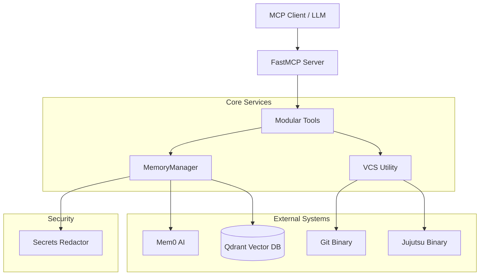

# Architecture: Dotfiles Maintainer MCP

This document describes the high-level design, component interactions, and data flow of the Dotfiles Maintainer MCP server.

## 🏗️ High-Level Design

Dotfiles Maintainer is built as an AI-native system with a modular architecture, designed to provide semantic context to LLMs managing configuration files.

### Core Components

1.  **MCP Server (`server.py`)**: Built using the `FastMCP` framework. It acts as the primary interface for AI agents (like Claude Desktop or Cursor), exposing a suite of specialized tools.
2.  **CLI (`cli.py`)**: A `Typer`-based command-line interface for manual maintenance, health checks, and debugging.
3.  **Semantic Memory (`core/memory.py`)**: Powered by `mem0` and `Qdrant`. It stores the "Why" behind configuration changes, allowing the agent to remember past decisions across sessions.
4.  **VCS Integration (`utils/vcs.py`)**: A hybrid utility that detects and interacts with both **Git** and **Jujutsu (jj)**.
5.  **Modular Tools (`tools/`)**: Each MCP tool is implemented as a standalone module, promoting maintainability and extensibility.

---

## 🧩 Component Interactions

The system follows a "Service-Utility" pattern where tools orchestrate logic by consuming core services.

### Interaction Diagram



---

## 🔄 Data Flow: Tool Execution

When an agent invokes a tool (e.g., `commit_contextual_change`), the data flows as follows:

1.  **Request**: The LLM provides structured input (e.g., file path, change description, rationale).
2.  **Context Gathering**: The tool may query `MemoryManager` to retrieve previous context or `VCS` to check the current state of the file.
3.  **Action**: The tool performs its primary logic (e.g., validating the change).
4.  **Security Scrubbing**: Before any data is persisted to semantic memory, it passes through the `redact_secrets` utility.
5.  **Persistence**: The `MemoryManager` stores the redacted text and metadata in the vector database.
6.  **Response**: A structured result is returned to the LLM, confirming the action and providing any new context.

---

## 🛡️ Security Model

### Secrets Redaction
The `utils/secrets.py` module contains a robust redaction engine. It uses optimized regular expressions to identify and scrub:
*   API Keys (OpenAI, Anthropic, Google, AWS, etc.)
*   Authentication Tokens (GitHub, Slack)
*   Private Key blocks
*   Generic password/token patterns in config files

### Drift Detection
The `check_config_drift` tool acts as a security layer by detecting uncommitted changes at the start of a session. This prevents the agent from working on a "dirty" or potentially compromised environment without explicit user acknowledgement.

---

## 📂 Directory Structure

```text
src/dotfiles_maintainer/
├── core/           # Core logic & Shared Services
│   ├── memory.py   # Mem0 wrapper with redaction logic
│   ├── types.py    # Pydantic models for type safety
│   └── exceptions.py
├── tools/          # MCP Tool Implementations
│   ├── drift.py    # VCS vs Filesystem comparison
│   ├── history.py  # VCS history ingestion
│   ├── changes.py  # Contextual change logging
│   └── ...         # Other specialized tools
├── utils/          # Low-level Utilities
│   ├── vcs.py      # Git/JJ abstraction layer
│   └── secrets.py  # Regex-based secrets scrubbing
├── prompts/        # System Persona & LLM Instructions
├── server.py       # FastMCP Server Entry Point
└── cli.py          # Typer CLI Entry Point
```

---

## 🚀 Extensibility

The project is designed for easy extension:
1.  **New Tools**: Add a new file in `tools/` and register it in `server.py`.
2.  **New VCS**: Extend the `VCSType` and `VCSCommand` class in `utils/vcs.py`.
3.  **New Memory Providers**: Update `ServerConfig` and `MemoryManager` to support different `mem0` backends.
