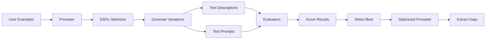

# Architecture

This page explains the internal architecture of DSPydantic, how components interact, and design decisions.

## Overview

DSPydantic is built on top of DSPy and provides a high-level interface for optimizing Pydantic models **and prompts**. The architecture consists of several key components:



## Architecture Components

| Component | Responsibility | Key Functions |
|-----------|---------------|---------------|
| **Prompter** | Main interface | Optimize descriptions and prompts, extract data |
| **DSPy Module** | Optimization logic | Generate variations, handle prompts |
| **DSPy Optimizer** | Algorithm selection | Choose and run optimization algorithm |
| **Evaluators** | Performance measurement | Score variations, guide selection |
| **Extractor** | Field extraction | Extract descriptions, create optimized models |

## Core Components

### Prompter

The `Prompter` class provides a unified interface for both optimization and extraction. It:

- **Optimizes** field descriptions **and prompts**
- Extracts structured data from text, images, and PDFs
- Provides save/load functionality
- Manages the optimization process
- Returns optimization results

### DSPy Module

The Prompter uses an internal DSPy module that:

- Takes field descriptions as input
- Generates optimized descriptions as output
- Handles system and instruction prompts
- Works with DSPy optimizers

### Evaluators

The evaluator system provides flexible evaluation:

- Field-level evaluation
- Multiple evaluator types
- Configurable per field
- Extensible via custom evaluators

### Extractor

The extractor utilities handle:

- Extracting field descriptions from models
- Creating optimized model classes
- Applying optimized descriptions to schemas
- Handling nested models

## Data Flow

### Optimization Flow

1. User provides model and examples
2. `Prompter` extracts field descriptions from model
3. Creates DSPy module with descriptions
4. DSPy optimizer tests variations of descriptions **and prompts**
5. Evaluators score each variation
6. Best variations are selected
7. Results are returned

### Extraction Flow

1. User calls `prompter.run()` with input (text/image/PDF)
2. `Prompter` prepares input data
3. Creates optimized model with descriptions
4. Uses optimized prompts
5. Calls LLM with structured output format
6. Parses response into Pydantic model
7. Returns extracted data

## Design Decisions

### Why DSPy?

DSPy provides:

- Proven optimization algorithms
- Active research and development
- Good community support
- Flexible architecture

### Why Pydantic?

Pydantic provides:

- Type validation
- JSON schema generation
- Structured output support
- Wide adoption

### Why Unified Prompter?

The `Prompter` class provides:

- Simpler API for common use cases
- Production-ready save/load
- Consistent interface
- Backward compatibility

### Why Evaluator System?

The evaluator system provides:

- Flexibility for different use cases
- Per-field customization
- Extensibility
- Clear separation of concerns

## Module Structure

```
dspydantic/
├── __init__.py          # Public API
├── prompter.py          # Prompter class (optimize/run)
├── optimizer.py         # Internal optimizer (used by Prompter)
├── module.py            # DSPy module
├── extractor.py         # Field extraction utilities
├── types.py             # Core types
├── persistence.py       # Save/load functionality
├── utils.py             # Utility functions
└── evaluators/          # Evaluator system
    ├── __init__.py
    ├── config.py        # Evaluator configuration
    ├── functions.py     # Evaluation functions
    └── *.py             # Individual evaluators
```

## Extension Points

### Custom Evaluators

Implement `BaseEvaluator` protocol:

```python
class MyEvaluator:
    def __init__(self, config: dict) -> None:
        self.config = config
    
    def evaluate(self, extracted, expected, input_data=None, field_path=None) -> float:
        # Your evaluation logic here
        return 1.0 if extracted == expected else 0.0
```

### Custom Optimizers

Pass DSPy optimizer instances:

```python
from dspy.teleprompt import MIPROv2

custom_optimizer = MIPROv2(...)
prompter = Prompter(model=MyModel, model_id="gpt-4o")
result = prompter.optimize(examples=examples, optimizer=custom_optimizer)
```

## Performance Considerations

### Optimization

- Uses multiple threads by default
- Can be configured with `num_threads`
- Caches intermediate results
- Parallelizes evaluation

### Extraction

- Single API call per extraction
- No caching (stateless)
- Efficient schema generation
- Minimal overhead

## Future Directions

Potential improvements:

- Caching optimization results
- Batch extraction support
- More evaluator types
- Better error handling
- Performance optimizations

## Further Reading

- [How Optimization Works](optimization.md)
- [Understanding Evaluators](evaluators.md)
- [Reference: API](../reference/api/prompter.md)
