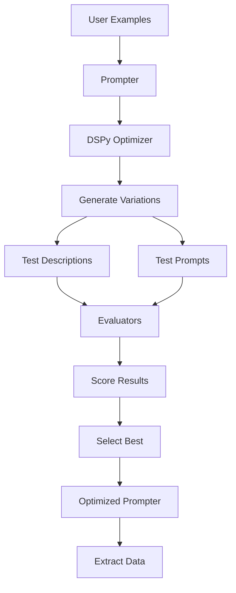

# How Optimization Works

This page explains how DSPydantic optimization works, why it's effective, and the design decisions behind it.

## How Optimization Works

DSPydantic uses DSPy's optimization algorithms to automatically improve field descriptions **and prompts**. The process works by:

1. **Testing Variations**: The prompter generates variations of field descriptions **and prompts**
2. **Evaluating Performance**: Each variation is tested against your examples using an evaluation function
3. **Selecting Best**: The prompter selects the descriptions and prompts that perform best
4. **Iterating**: The process repeats, refining the selections until convergence

## Optimization Flow

## Why It Works

### The Problem with Manual Descriptions and Prompts

Writing good field descriptions and prompts is hard because:

- You need to anticipate how the LLM will interpret descriptions and prompts
- Different LLMs may interpret the same description or prompt differently
- Optimal descriptions and prompts depend on your specific data and use case
- Small wording changes can significantly affect extraction accuracy

### The Solution: Automated Optimization

DSPydantic solves this by:

- **Testing many variations**: The prompter tries many different phrasings automatically
- **Using your data**: Optimization is tailored to your specific examples
- **Measuring performance**: Each variation is evaluated objectively
- **Finding patterns**: The prompter learns what works best for your use case

## Design Decisions

### Why DSPy?

DSPy provides proven optimization algorithms that work well for prompt engineering. DSPydantic auto-selects based on your dataset:

| Examples | Auto-Selected | Reason |
|----------|---------------|--------|
| 1-2 | MIPROv2 (zero-shot) | Too few for bootstrapping |
| 3-19 | BootstrapFewShot | Fast, good for small sets |
| 20+ | BootstrapFewShotWithRandomSearch | More reliable with more data |

### Optimization Algorithms

| Algorithm | API Calls | Speed | Quality | Best For |
|-----------|-----------|-------|---------|----------|
| **BootstrapFewShot** | ~N | Fast | Good | Prototyping, small datasets |
| **BootstrapFewShotWithRandomSearch** | ~N×10 | Medium | Better | Production, reliable results |
| **MIPROv2 (light)** | ~50 | Medium | Better | Quick production |
| **MIPROv2 (medium)** | ~200 | Slow | Best | Balanced quality/cost |
| **MIPROv2 (heavy)** | ~500+ | Slowest | Best | Maximum quality |
| **COPRO** | ~M×K | Medium | Good | Debugging, understanding prompts |
| **GEPA** | ~20-100 | Medium | Good | Complex reasoning, interpretable |
| **BetterTogether** | Sum of all | Slowest | Best | Maximum quality, combines optimizers |
| **SIMBA** | Variable | Medium | Better | Large datasets (500+), batch |
| **Ensemble** | N per input | - | Best | Reliability, variance reduction |
| **BootstrapFinetune** | Variable | Slow | Best | 100+ examples, permanent improvements |

See [Configure Optimizations](../guides/advanced/configure-optimizations.md) for detailed optimizer configuration.

### Why Field Descriptions?

Field descriptions are the primary interface between your schema and the LLM. Optimizing them:

- Directly improves extraction accuracy
- Works with any LLM that supports structured outputs
- Is transparent and interpretable
- Can be version controlled and reviewed

### Why Prompts Too?

System and instruction prompts provide context. Optimizing them:

- Improves overall extraction quality
- Helps the LLM understand the task better
- Works synergistically with field descriptions
- Is essential for accurate extraction

## Trade-offs

### Advantages

- **Automatic**: No manual tuning required
- **Data-driven**: Based on your actual examples
- **Effective**: Typically improves accuracy significantly (10-30%)
- **Flexible**: Works with any Pydantic model
- **Comprehensive**: Optimizes both descriptions and prompts

### Limitations

- **Requires examples**: Need 5-20 examples for good results
- **Takes time**: Optimization can take several minutes
- **API costs**: Uses LLM API calls during optimization
- **Example quality matters**: Better examples lead to better optimization

## When to Use Optimization

Optimization is most valuable when:

- You have example data available (5-20 examples)
- Extraction accuracy is important
- You're willing to invest time upfront
- You want to improve over manual descriptions and prompts

Consider manual descriptions when:

- You have very few or no examples
- Speed is more important than accuracy
- You have domain expertise to write good descriptions
- You need immediate results

## Understanding Results

### Baseline Score

The baseline score shows how well your initial descriptions and prompts perform. This gives you a starting point.

### Optimized Score

The optimized score shows how well the optimized descriptions and prompts perform. This is what you'll get in production.

### Improvement

The improvement percentage shows the gain from optimization. Even small improvements (5-10%) can be significant in production.

### Optimized Descriptions and Prompts

The optimized descriptions and prompts are tailored to your use case. They may:

- Be more specific than your originals
- Include domain-specific terminology
- Emphasize important aspects
- Be longer or shorter depending on what works
- Work synergistically together

## Further Reading

- [Architecture](architecture.md) - System design details
- [Understanding Evaluators](evaluators.md) - How evaluation works
- [Your First Optimization](../guides/optimization/first-optimization.md) - Complete workflow
- [Reference: Prompter](../reference/api/prompter.md) - Technical details
