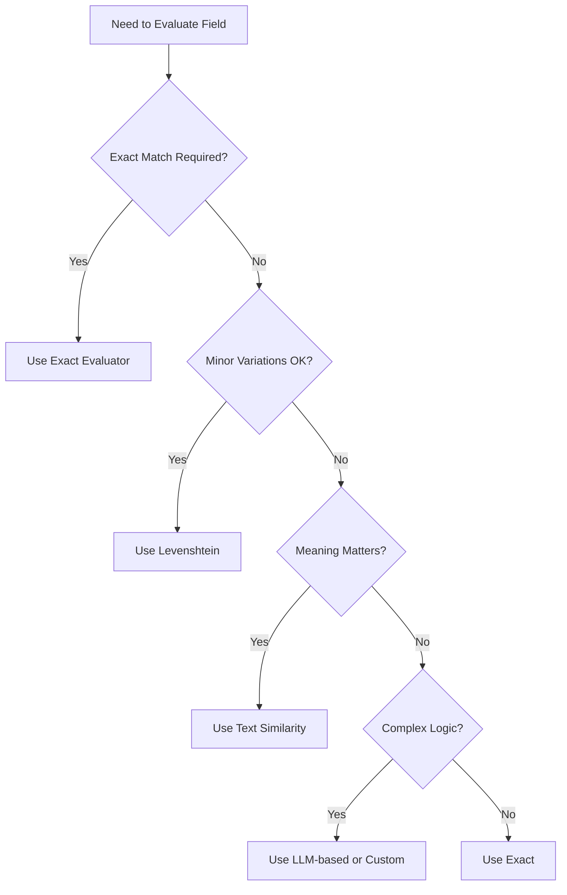

# When to Use Which Evaluator

This guide helps you choose the right evaluator for your optimization needs. Evaluators measure how well extracted data matches expected data, guiding the optimization process.

## Quick Decision Tree



## Evaluator Comparison

| Evaluator | Speed | Accuracy | Use Case | Data Types | Best For |
|-----------|-------|----------|----------|------------|----------|
| **Exact** (`exact`) | Fast | Exact | Precise values that must match exactly | Strings | IDs, codes, exact strings |
| **Levenshtein** (`levenshtein`) | Fast | Fuzzy | Text with minor spelling/formatting differences | Strings | Names, addresses with typos |
| **Text Similarity** (`text_similarity`) | Medium | Semantic | Text where meaning matters more than exact wording | Strings | Descriptions, summaries |
| **Score Judge** (`score_judge`) | Slow | LLM-based | Numeric scores needing quality assessment | Numbers | Ratings, scores |
| **Label Model Grader** (`label_model_grader`) | Slow | LLM-based | Classification labels needing context-aware evaluation | Labels/Categories | Sentiment, categories |
| **Python Code** (`python_code`) | Medium | Custom | Custom evaluation logic for complex business rules | Any | Business rules, thresholds |
| **Predefined Score** (`predefined_score`) | Fastest | Pre-computed | Pre-computed scores (no evaluation needed) | Any | Ground truth exists |

## Field Type → Evaluator Mapping

| Field Type | Recommended Evaluator | Alternative Options | Reason |
|------------|----------------------|-------------------|--------|
| IDs, SKUs, Codes | `exact` | - | Must match exactly |
| Names, Addresses | `levenshtein` | `exact` if no typos expected | Handles minor variations |
| Descriptions, Summaries | `text_similarity` | `levenshtein` for short text | Meaning matters more than wording |
| Ratings, Scores | `score_judge` | `python_code` for simple rules | Context-aware quality assessment |
| Categories, Labels | `label_model_grader` | `exact` if unambiguous | Context-dependent classification |
| Numeric Values | `python_code` | `exact` for integers | Custom thresholds, ranges |
| Timestamps, Dates | `exact` | `python_code` for formats | Standardized formats |

## Performance Comparison

| Evaluator | Speed | API Calls | Cost | Best For |
|-----------|-------|-----------|------|----------|
| `exact` | Fastest | None | Free | Most fields |
| `levenshtein` | Fast | None | Free | Text with variations |
| `text_similarity` | Medium | Embedding API | Low | Semantic matching |
| `score_judge` | Slow | LLM API | High | Complex scoring |
| `label_model_grader` | Slow | LLM API | High | Complex classification |
| `python_code` | Medium | None | Free | Custom logic |
| `predefined_score` | Fastest | None | Free | Pre-computed scores |

## Common Patterns

### Pattern 1: Most Fields Exact, Some Semantic

```python
evaluator_config = {
    "default": "exact",  # Most fields
    "field_overrides": {
        "description": "text_similarity",  # Meaning matters
    },
}
```

**Use when**: Most fields are precise, but descriptions need semantic matching.

### Pattern 2: Text Fields with Variations

```python
evaluator_config = {
    "default": "levenshtein",  # Handle typos
    "field_overrides": {
        "id": "exact",  # IDs must match exactly
    },
}
```

**Use when**: Text fields may have typos, but IDs must be exact.

### Pattern 3: Complex Evaluation

```python
evaluator_config = {
    "default": "exact",
    "field_overrides": {
        "rating": "score_judge",  # Context-aware
        "sentiment": "label_model_grader",  # Context-aware
    },
}
```

**Use when**: Some fields need LLM-based evaluation for context.

### Pattern 4: Custom Business Rules

```python
evaluator_config = {
    "default": "exact",
    "field_overrides": {
        "age": {
            "type": "python_code",
            "config": {
                "code": "def evaluate(extracted, expected): return 1.0 if abs(extracted - expected) <= 2 else 0.0",
            },
        },
    },
}
```

**Use when**: You have specific business rules (e.g., age within 2 years is acceptable).

## Quick Reference

| Need | Evaluator | Example |
|------|-----------|---------|
| Exact match | `exact` | Product SKU: "SKU-12345" |
| Handle typos | `levenshtein` | Name: "John Smith" vs "Jon Smith" |
| Semantic similarity | `text_similarity` | Description: "excellent camera" vs "great photo quality" |
| Rate quality | `score_judge` | Rating: 4.5 vs 5.0 (is 4.5 reasonable?) |
| Classify context | `label_model_grader` | Sentiment: "positive" (is it correct for this review?) |
| Custom rules | `python_code` | Age: within 2 years is acceptable |
| Pre-computed | `predefined_score` | Already have scores from previous evaluation |

## Tips

- Start with `exact` for most fields - it's fastest and most reliable
- Use `levenshtein` when you expect minor variations
- Use `text_similarity` for longer text where meaning matters
- Use LLM-based evaluators sparingly - they're slower and more expensive
- Use `predefined_score` when you already have ground truth scores
- Test evaluator choice with a few examples before full optimization

## See Also

- [Configure Evaluators](configure.md) - How to set up evaluators
- [Custom Evaluators](custom.md) - Create your own evaluators
- [Understanding Evaluators](../../concepts/evaluators.md) - Deep dive into how evaluators work
- [Reference: Evaluators](../../reference/api/evaluators.md) - Complete API documentation
