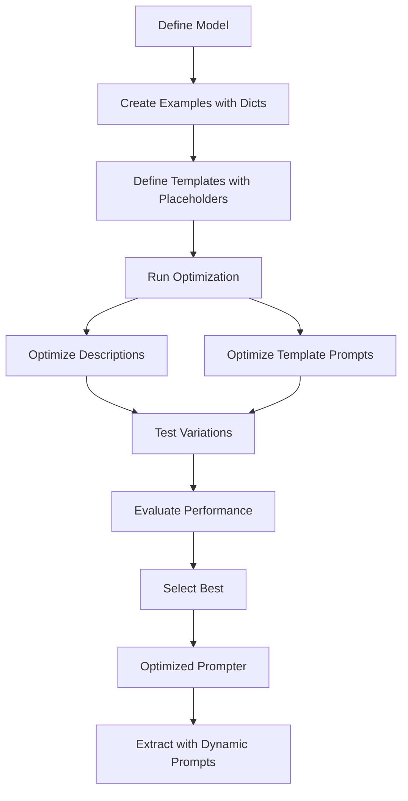

# Prompt Templates

This guide shows you how to optimize your Pydantic models and prompts using prompt templates with placeholders. After optimization, you'll achieve efficient extraction with dynamic, context-aware prompts.

## When to Use Template Optimization

| Data Type | Best For | Optimization Focus | Extraction Outcome |
|-----------|----------|-------------------|-------------------|
| Text | Documents, emails, reports | Field descriptions + prompts | Structured text data |
| Images | Classification, OCR | Image-specific prompts | Labels, classifications |
| PDFs | Forms, invoices, reports | Multi-page optimization | Document data |
| **Templates** | Dynamic contexts | Placeholder optimization | Context-aware data |

Use template optimization when you need dynamic prompts that change based on input data.

## Optimization Workflow



## Problem

You need dynamic prompts that change based on input data, such as including context-specific information in each prompt. You want to optimize these templates for better extraction accuracy.

## Solution

Use dictionary-based text input with prompt templates containing `{placeholders}`. DSPydantic optimizes both the template structure and field descriptions.

## Steps

### 1. Define Your Model

```python
from pydantic import BaseModel, Field
from typing import Literal

class ProductReview(BaseModel):
    sentiment: Literal["positive", "negative", "neutral"] = Field(
        description="Review sentiment"
    )
    rating: int = Field(description="Rating 1-5")
    aspects: list[Literal["camera", "performance", "battery"]] = Field(
        description="Product aspects"
    )
```

### 2. Create Examples with Dictionary Text

Use dictionaries for the `text` field:

```python
from dspydantic import Example

examples = [
    Example(
        text={
            "review": "Amazing camera quality and fast performance!",
            "product": "iPhone 15 Pro",
            "category": "smartphone"
        },
        expected_output={
            "sentiment": "positive",
            "rating": 4,
            "aspects": ["camera", "performance"]
        }
    ),
    Example(
        text={
            "review": "Poor battery life and overpriced.",
            "product": "Samsung Galaxy S24",
            "category": "smartphone"
        },
        expected_output={
            "sentiment": "negative",
            "rating": 2,
            "aspects": ["battery"]
        }
    ),
]
```

### 3. Use Prompt Templates and Optimize

Create prompts with `{placeholders}` that match dictionary keys:

```python
from dspydantic import Prompter

prompter = Prompter(
    model=ProductReview,
    model_id="gpt-4o",
)

result = prompter.optimize(
    examples=examples,
    system_prompt="You are an expert analyst specializing in {category} reviews.",
    instruction_prompt="Analyze the {category} review about {product}: {review}",
)
```

The placeholders `{category}`, `{product}`, and `{review}` will be automatically filled from each example's text dictionary during optimization.

The optimization process tests variations of field descriptions **and template prompts** to find what works best.

### 4. Use Optimized Prompter (Outcome)

After optimization, extract data efficiently with dynamic prompts:

```python
# Extract with prompt templates
data = prompter.run(
    text={
        "category": "smartphone",
        "product": "iPhone 15 Pro",
        "review": "Great camera!"
    }
)
print(data)
```

The prompter fills the placeholders automatically from the dictionary you provide.

## How Template Optimization Works

| Step | What Happens |
|------|--------------|
| **1. Dictionary Input** | Dictionary keys in `text` become available as placeholders |
| **2. Template Filling** | Placeholders in prompts are filled automatically during optimization |
| **3. Optimization** | Each example gets its own filled prompt for evaluation |
| **4. Result** | Optimized prompts retain placeholders for reuse |
| **5. Extraction** | When using `run()`, placeholders are filled from the dictionary you provide |

## What Gets Optimized

| Parameter | What Gets Optimized | Impact |
|-----------|-------------------|--------|
| Field Descriptions | Individual field descriptions | High - direct extraction accuracy |
| System Prompt Template | Template structure and wording | Medium - context understanding |
| Instruction Prompt Template | Template structure and wording | Medium - extraction guidance |

## Tips

- Use descriptive dictionary keys that match placeholder names
- Ensure all examples have the same dictionary keys
- Placeholders are case-sensitive
- See [Reference: Example](../../reference/api/types.md#example) for more details

## See Also

- [Optimization Modalities](modalities.md) - Text, images, PDFs
- [Your First Optimization](first-optimization.md) - Complete optimization workflow
- [Reference: Prompter](../../reference/api/prompter.md) - Complete API documentation
