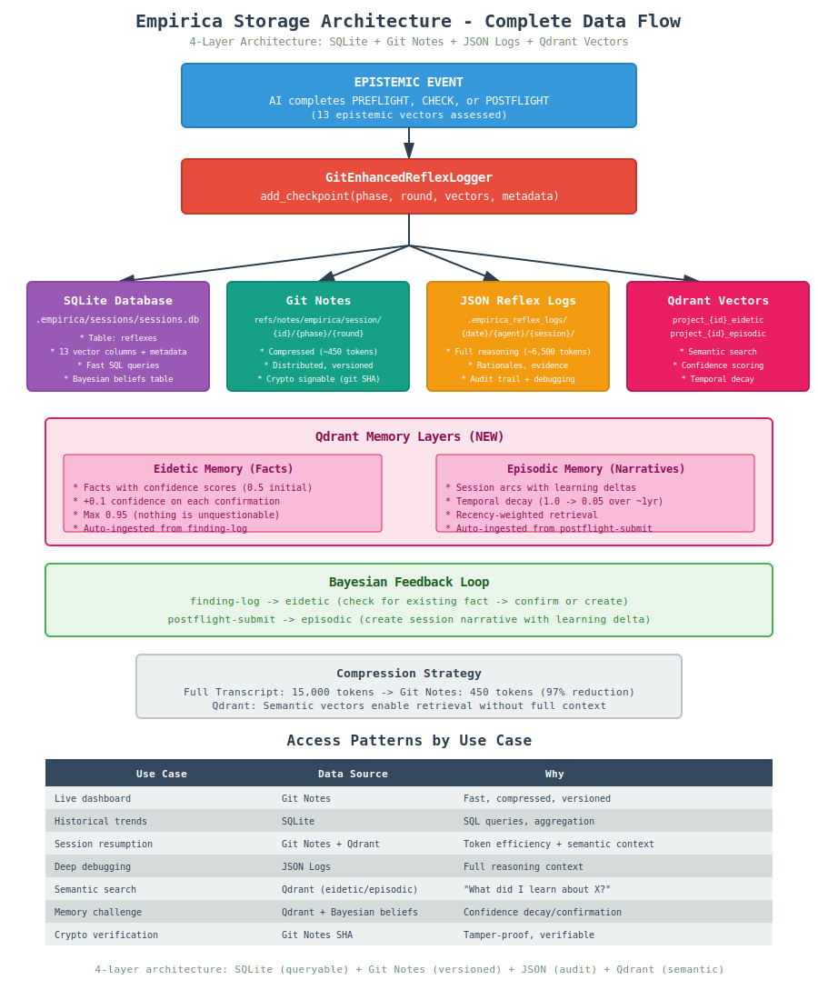

# Empirica Storage Architecture - Complete Data Flow

**Version:** 2.2
**Date:** 2026-01-09
**Purpose:** Document complete storage flow for dashboard/crypto-signing integration

**Related docs:**
- [CANONICAL_STORAGE.md](./CANONICAL_STORAGE.md) - API reference for storage classes
- [Qdrant API Reference](../reference/api/qdrant.md) - Embedding providers and semantic search

---

## Overview (Critical Infrastructure)

This guide provides a comprehensive and visual explanation of Empirica's **four-layer storage architecture** and the critical distinction between git diffs (content tracking) and epistemic vectors (confidence tracking).

### Diagram 1: Complete Storage Architecture Flow

**File:** `storage_architecture_flow.svg`



**What This Shows:**
- Complete data flow from epistemic event → four storage layers: SQLite (HOT), Git Notes (WARM), JSON Logs (AUDIT), and Qdrant (SEARCH).
- High-level overview of how data is compressed and accessed by different use cases (live dashboard, historical trends, debugging, crypto signing, semantic search).

**Key Takeaways:**
1.  **Four-layer storage** ensures data redundancy, semantic search, and optimized access patterns.
2.  **Different storage for different use cases:** SQLite for fast SQL queries, Git Notes for compressed and distributed state, JSON Logs for full audit and debugging, Qdrant for semantic retrieval.
3.  **Significant token reduction** (e.g., 15,000 tokens → 450 tokens, 97% reduction) for efficient storage and transfer of epistemic state.

---

## CASCADE Phase Requirements

**REQUIRED Phases (Every Session):**
- **PREFLIGHT** - Must assess epistemic state before starting work
- **POSTFLIGHT** - Must measure learning after completing work

**OPTIONAL Phases (0-N Times):**
- **CHECK** - Gate decision during work (use when uncertainty is high)

**Note:** ACT and INVESTIGATE are utility commands, NOT formal CASCADE phases.

---

## Storage Architecture Overview

```
┌─────────────────────────────────────────────────────────────┐
│                    EPISTEMIC EVENT                           │
│  (AI completes PREFLIGHT, CHECK, or POSTFLIGHT)             │
└────────────────┬────────────────────────────────────────────┘
                 │
                 ▼
┌─────────────────────────────────────────────────────────────┐
│              GitEnhancedReflexLogger                         │
│         add_checkpoint(phase, round, vectors, meta)          │
└────────────────┬────────────────────────────────────────────┘
                 │
      ┌──────────┴──────────┐
      │                     │
      ▼                     ▼
┌──────────────┐    ┌──────────────────┐
│   SQLite     │    │   Git Notes      │
│  (reflexes)  │    │  (compressed)    │
└──────┬───────┘    └────────┬─────────┘
       │                     │
       │                     │
       ▼                     ▼
┌──────────────┐    ┌──────────────────┐
│  JSON Files  │    │  Crypto Signing  │
│ (full logs)  │    │  (Phase 2)       │
└──────────────┘    └──────────────────┘
```

---

## Four Storage Layers (Comparison)

### Quick Reference Table

### Storage Layer Comparison

| Layer | Location | Size | Purpose | Query Method |
|-------|----------|------|---------|--------------|
| **SQLite** (HOT) | `.empirica/sessions/sessions.db` | 450 tokens | Fast queries, structured | SQL |
| **Git Notes** (WARM) | `refs/notes/empirica/session/...` | 450 tokens | Distributed, signed, compressed | Git commands |
| **JSON Logs** (AUDIT) | `.empirica_reflex_logs/...` | 6,500 tokens | Full audit, debugging | File read |
| **Qdrant** (SEARCH) | `localhost:6333` | 768-dim vectors | Semantic search, pattern retrieval | Vector similarity |

### Token Compression Levels

| Format | Size | Use Case |
|--------|------|----------|
| **Full reasoning transcript** | ~15,000 tokens | Training data only |
| **Full reflex log (JSON)** | ~6,500 tokens | Deep debugging, audit |
| **Compressed checkpoint** | ~450 tokens | Session resumption, multi-AI handoff |
| **Git diff** | ~50 tokens | Code changes only |

### Layer 1: SQLite Database (`.empirica/sessions/sessions.db`)

**Purpose:** Structured queryable storage, SQL access, relational integrity. Primary source of truth.

**Table:** `reflexes`

```sql
CREATE TABLE reflexes (
    id INTEGER PRIMARY KEY AUTOINCREMENT,
    session_id TEXT NOT NULL,
    cascade_id TEXT,
    phase TEXT NOT NULL,  -- PREFLIGHT, CHECK, POSTFLIGHT
    round INTEGER DEFAULT 1,
    timestamp REAL NOT NULL,
    
    -- 13 epistemic vectors
    engagement REAL,
    know REAL,
    do REAL,
    context REAL,
    clarity REAL,
    coherence REAL,
    signal REAL,
    density REAL,
    state REAL,
    change REAL,
    completion REAL,
    impact REAL,
    uncertainty REAL,
    
    -- Metadata
    reflex_data TEXT,  -- Full JSON
    reasoning TEXT,
    evidence TEXT,
    
    FOREIGN KEY (session_id) REFERENCES sessions(session_id)
);
```

**What Gets Stored:**
- Full epistemic vectors (13 dimensions)
- Phase, round, timestamp
- Reasoning and evidence (optional)
- Full JSON in `reflex_data` field

**Queryable By:**
- Session ID, Phase, Round, Timestamp
- Vector values (e.g., `WHERE know > 0.8`)

**Use Cases:**
- Dashboards (SQL queries)
- Analytics (aggregate queries)
- Debugging (full history)
- Fallback (if git notes unavailable)

---

### Layer 2: Git Notes (Compressed Checkpoints)

**Purpose:** Distributed, versioned, compressed epistemic state, ideal for multi-AI coordination and efficient context transfer.

**Namespace:** `refs/notes/empirica/session/{session_id}/{phase}/{round}`

**Example:**
```
refs/notes/empirica/session/abc-123/PREFLIGHT/1
refs/notes/empirica/session/abc-123/CHECK/1
refs/notes/empirica/session/abc-123/CHECK/1
refs/notes/empirica/session/abc-123/POSTFLIGHT/1
```

**What Gets Stored (Compressed):**
```json
{
  "session_id": "abc-123",
  "phase": "PREFLIGHT",
  "round": 1,
  "timestamp": "2025-12-02T11:00:00Z",
  "vectors": {
    "know": 0.85,
    "do": 0.90,
    "context": 0.75,
    "uncertainty": 0.15
  },
  "overall_confidence": 0.833,
  "meta": {
    "task": "Review authentication module",
    "investigated": ["jwt_impl", "session_timeout"],
    "blocked_by": []
  },
  "token_count": 450
}
```

**Compression:** ~450 tokens vs ~6,500 tokens (93% reduction) for full reflex log.

**What's Omitted (vs full reflex logs):**
- Rationales for each vector ❌
- Full reasoning transcript ❌
- Tool execution details ❌
- Investigation breadcrumbs ❌

**What's Kept:**
- Vector scores ✅
- Phase/round/timestamp ✅
- High-level metadata ✅
- Overall confidence ✅

**Use Cases:**
- Session resumption (load last checkpoint)
- Multi-agent coordination (read others' checkpoints)
- Token efficiency (97.5% reduction)
- Distributed storage (travels with git repo)
- Crypto signing (Phase 2 - sign git note SHA)

---

### Layer 3: JSON Reflex Logs (Full Detail)

**Purpose:** Complete reasoning transcript, deep debugging, audit trail for human review and training data.

**Location:** `.empirica_reflex_logs/{YYYY-MM-DD}/{agent_id}/{session_id}/`

**Example:**
```
.empirica_reflex_logs/
└── 2025-12-02/
    └── copilot/
        └── abc-123/
            ├── checkpoint_PREFLIGHT_20251202T110000.json
            ├── checkpoint_CHECK_20251202T113000.json
            ├── checkpoint_CHECK_20251202T120000.json
            └── checkpoint_POSTFLIGHT_20251202T130000.json
```

**What Gets Stored (FULL):**
```json
{
  "session_id": "abc-123",
  "phase": "PREFLIGHT",
  "round": 1,
  "timestamp": "2025-12-02T11:00:00Z",
  "vectors": {
    "know": {
      "score": 0.85,
      "rationale": "I have reviewed JWT implementations in 3 similar projects",
      "evidence": ["Similar patterns in project X", "Tested in staging"],
      "confidence_basis": "hands_on_experience"
    },
    "do": {
      "score": 0.90,
      "rationale": "I can identify common auth vulnerabilities",
      "evidence": ["OWASP top 10 familiarity", "Previous security audits"]
    },
    "uncertainty": {
      "score": 0.15,
      "rationale": "Confident about JWT basics, uncertain about distributed session sync",
      "unknowns": ["redis_cluster_behavior", "session_replication"]
    }
  },
  "overall_confidence": 0.833,
  "meta": {
    "task": "Review authentication module",
    "investigated": ["jwt_impl", "session_timeout"],
    "not_investigated": ["distributed_sync", "redis_cluster"],
    "blocked_by": [],
    "tools_used": ["grep", "git blame", "static analysis"]
  },
  "reasoning_transcript": "I started by examining...",
  "token_count": 6500
}
```

**What's Added (vs compressed):**
- Rationales for each vector ✅
- Evidence lists ✅
- Full reasoning transcript ✅
- Tool execution details ✅
- Confidence basis explanations ✅

**Use Cases:**
- Deep debugging (why did AI think X?)
- Audit trail (regulatory compliance)
- Training data (future calibration)
- Human review (understand AI reasoning)

---

### Layer 4: Qdrant Vector Database (Semantic Search)

**Purpose:** Semantic retrieval of epistemic data (findings, unknowns, dead ends, lessons) across sessions and projects.

**Location:** `localhost:6333` (local Qdrant instance)

**Collections:**

| Collection | Content | Embedding |
|------------|---------|-----------|
| `empirica_findings` | Learnings with impact scores | Text → 768-dim vector |
| `empirica_unknowns` | Unresolved questions | Text → 768-dim vector |
| `empirica_dead_ends` | Failed approaches | Text → 768-dim vector |
| `empirica_lessons` | Cold storage procedural knowledge | Text → 768-dim vector |

**Embedding Providers:**

```python
# Configure in environment
export EMPIRICA_EMBEDDING_PROVIDER=jina  # or voyage, ollama, openai, local
export EMPIRICA_EMBEDDING_MODEL=jina-embeddings-v3
export JINA_API_KEY=your-key  # for Jina
export VOYAGE_API_KEY=your-key  # for Voyage
```

| Provider | Model | Dimensions | Notes |
|----------|-------|------------|-------|
| **Jina AI** | jina-embeddings-v3 | 768 | Recommended for most use cases |
| **Voyage AI** | voyage-3 | 1024 | High quality, code-aware |
| **Ollama** | nomic-embed-text | 768 | Local, no API key |
| **OpenAI** | text-embedding-3-small | 1536 | Popular, requires API key |
| **Local** | sentence-transformers | 768 | Fully offline |

**CLI Commands:**

```bash
# Semantic search across project memory
empirica project-search --project-id <ID> --task "authentication patterns" --output json

# Embed project to Qdrant (full sync)
empirica project-embed --project-id <ID> --output json

# Include global learnings in search
empirica project-search --project-id <ID> --task "error handling" --global
```

**Auto-Embedding:**

- `finding-log` → Embeds to `empirica_findings`
- `unknown-log` → Embeds to `empirica_unknowns`
- `deadend-log` → Embeds to `empirica_dead_ends`
- `postflight-submit` → Auto-embeds session findings

**Pattern Retrieval Hooks:**

| Hook | Trigger | Returns |
|------|---------|---------|
| PREFLIGHT | `task_context` | lessons, dead_ends, relevant_findings |
| CHECK | `approach` + vectors | warnings from dead_ends, mistake_risk |

**Use Cases:**
- Finding prior learnings before starting work
- Avoiding repeated dead ends
- Cross-project knowledge transfer
- Lesson retrieval from cold storage

---

## Data Flow Timeline

### When Checkpoint Is Created

```
Step 1: AI calls add_checkpoint()
  ↓
Step 2: _create_checkpoint() - Build compressed format
  ↓
Step 3: _save_checkpoint_to_sqlite() - Save to reflexes table
  ↓
Step 4: _git_add_note() - Save to git notes
  ↓
Step 5: Return git note SHA (for crypto signing)
```

### Data Transformation

```
Full Assessment (from AI)
  ↓ [compression]
Compressed Checkpoint (~450 tokens)
  ↓ [parallel writes]
  ├─→ SQLite (reflexes table)
  ├─→ Git Notes (refs/notes/empirica/...)
  └─→ JSON File (.empirica_reflex_logs/...)
```

---

## Epistemic State ≠ Git Diff

### Diagram 2: Epistemic State ≠ Git Diff

**File:** `epistemic_vs_git_diff.svg`


**What This Shows:**
- Side-by-side comparison of git diff (WHAT changed) vs epistemic vectors (WHY + HOW CONFIDENT).
- Highlights that both are needed for a complete understanding, serving different purposes.

### The Key Distinction

| Aspect | Git Diff | Epistemic Vectors |
|--------|----------|-------------------|
| **Tracks** | Content changes (syntactic) | Confidence about content (semantic) |
| **Compression** | Syntactic (min chars) | Semantic (min meaning) |
| **Size** | Variable (depends on change) | Fixed (~450 tokens) |
| **Query** | By file/line/author | By phase/confidence/uncertainty |
| **Signed** | Commit SHA | Git note SHA |
| **Purpose** | Version control | Epistemic tracking |

---## Compression Comparison

| Format | Size | Content |
|--------|------|---------|
| **Full Reasoning Transcript** | ~15,000 tokens | "I started by examining the auth module. First I looked at JWT..." |
| **Full Reflex Log (JSON)** | ~6,500 tokens | All vectors with rationales, evidence, reasoning |
| **Compressed Checkpoint** | ~450 tokens | Vector scores + high-level metadata only |
| **Git Diff** | ~50 tokens | Just code changes (no reasoning) |

**Key Insight:** Git diff tells you WHAT changed (50 tokens). Epistemic checkpoint tells you WHY and HOW CONFIDENT (450 tokens). Full transcript explains EVERYTHING (15,000 tokens).

---

## Query Patterns for Dashboards

### Pattern 1: Current State (Latest Checkpoint)

```python
# Fast: Query git notes
latest = logger.get_last_checkpoint()
confidence = latest['overall_confidence']
phase = latest['phase']
```

### Pattern 2: Historical Trend (All Checkpoints)

```python
# SQL: Aggregate over time
cursor.execute("""
    SELECT phase, AVG(know) as avg_know, AVG(uncertainty) as avg_uncertainty
    FROM reflexes
    WHERE session_id = ?
    GROUP BY phase
    ORDER BY timestamp
""", (session_id,))
```

### Pattern 3: Calibration Delta (Learning)

```python
# Compare PREFLIGHT vs POSTFLIGHT
preflight = db.get_checkpoint(phase="PREFLIGHT")
postflight = db.get_checkpoint(phase="POSTFLIGHT")

know_delta = postflight['vectors']['know'] - preflight['vectors']['know']
uncertainty_delta = postflight['vectors']['uncertainty'] - preflight['vectors']['uncertainty']

print(f"Learning: KNOW +{know_delta}, UNCERTAINTY {uncertainty_delta}")
```

### Pattern 4: Multi-Session Comparison

```python
# Find all sessions with low confidence
cursor.execute("""
    SELECT session_id, phase, know, uncertainty
    FROM reflexes
    WHERE know < 0.5 OR uncertainty > 0.7
    ORDER BY timestamp DESC
")
```

---

## Crypto Signing Architecture (Phase 2)

### What to Sign

**Recommended: Git Note SHA**

```
Signature Input:
  - Git note SHA (refs/notes/empirica/session/{id}/{phase}/{round})
  - AI identity (Ed25519 public key)
  - Timestamp
  
Signature Output:
  - Ed25519 signature
  - Stored in: refs/notes/empirica/signatures/{session_id}/{phase}/{round}
```

**Verification:**

```bash
# Get checkpoint
NOTE_SHA=$(git rev-parse refs/notes/empirica/session/abc-123/PREFLIGHT/1)

# Get signature
SIG=$(git notes --ref empirica/signatures/abc-123/PREFLIGHT/1 show HEAD)

# Verify
empirica identity-verify --sha $NOTE_SHA --signature $SIG --ai-id copilot
```

---## Goal Storage System

### Purpose
Goals organize work with **epistemic context** and enable **cross-AI coordination** via git notes.

### Storage Location
```
.git/notes/empirica/goals/<goal-id>/
```

### Goal Data Structure
```json
{
  "goal_id": "uuid-v4",
  "session_id": "abc123",
  "ai_id": "claude-code",
  "created_at": "2025-01-29T10:00:00Z",
  
  "goal_data": {
    "objective": "Audit authentication system",
    "scope": {
      "breadth": 0.7,      // 0-1: codebase span
      "duration": 0.6,     // 0-1: time commitment
      "coordination": 0.4  // 0-1: multi-agent needs
    },
    "success_criteria": [
      "Identify vulnerabilities",
      "Document findings",
      "Propose fixes"
    ],
    "estimated_complexity": 0.65,
    "subtasks": [
      {
        "task_id": "uuid-1",
        "description": "Review authentication code",
        "importance": "high",
        "status": "complete",
        "evidence": "Found JWT validation gap",
        "completed_at": "2025-01-29T10:15:00Z"
      },
      {
        "task_id": "uuid-2",
        "description": "Analyze session management",
        "importance": "high",
        "status": "pending"
      }
    ]
  },
  
  "epistemic_state": {
    "know": 0.6,
    "do": 0.7,
    "context": 0.5,
    "uncertainty": 0.4,
    "clarity": 0.7,
    "coherence": 0.8
    // ... all 13 vectors from PRE assessment
  },
  
  "lineage": [
    {
      "ai_id": "claude-code",
      "action": "created",
      "timestamp": "2025-01-29T10:00:00Z"
    },
    {
      "ai_id": "minimax-agent",
      "action": "resumed",
      "timestamp": "2025-01-29T11:30:00Z"
    }
  ]
}
```

### Cross-AI Coordination Workflow

#### Goal Discovery
```bash
# AI-2 discovers goals from AI-1
empirica goals-discover --from-ai-id claude-code
```

#### Goal Resume with Epistemic Handoff
```bash
# AI-2 resumes AI-1's goal
empirica goals-resume abc123 --ai-id minimax-agent
```

#### Lineage Tracking
```
Goal created by: claude-code (10:00)
Goal resumed by: minimax-agent (11:30)
  → Epistemic handoff: KNOW 0.6→0.7, UNCERTAINTY 0.4→0.3
  → Subtask completed: "Analyze session management"
Goal completed: minimax-agent (12:00)
```

### Benefits
- **Distributed collaboration:** Goals in git notes (pull to sync)
- **Epistemic context:** AI-2 knows what AI-1 understood
- **Progress tracking:** Subtasks completed by either AI
- **Provenance:** Full lineage of who did what

---## Handoff Report System

### Purpose
Enable **session continuity** without transferring full context (98% compression).

### Dual Storage Strategy
```
1. Git Notes (distributed):  .git/notes/empirica/handoff/<session-id>/
2. SQLite (fast queries):    .empirica/sessions/sessions.db
```

### Handoff Data Structure
```json
{
  "session_id": "abc123",
  "ai_id": "claude-code",
  "timestamp": "2025-01-29T14:00:00Z",
  
  "task_summary": "Audited authentication system. Found 3 vulnerabilities...",
  
  "epistemic_deltas": {
    "know": "+0.4 (0.6 → 1.0)",
    "context": "+0.5 (0.5 → 1.0)",
    "uncertainty": "-0.3 (0.4 → 0.1)"
  },
  
  "key_findings": [
    "JWT tokens not validated on every request",
    "Session timeout too long (24h)",
    "Secrets logged in debug mode"
  ],
  
  "remaining_unknowns": [
    "Rate limiting implementation",
    "Secret rotation policy"
  ],
  
  "next_session_context": "Next: Implement fixes for JWT validation...",
  
  "artifacts_created": [
    "docs/security_audit.md",
    "fixes/jwt_validation.patch"
  ]
}
```

### Compression Achievement
- **Full context:** ~20,000 tokens (session DB + reflex logs)
- **Handoff report:** ~300 tokens
- **Reduction:** 98% (66x smaller)

### Session Continuity Workflow

#### Create Handoff (End of Session)
```bash
empirica handoff-create \
  --session-id abc123 \
  --summary "Audited auth system..." \
  --findings '["JWT gap", "Long timeout", ...]'
  --unknowns '["Rate limiting", "Secret rotation"]'

# Stored in:
# - Git notes: .git/notes/empirica/handoff/abc123/
# - SQLite: sessions.db (contains handoff_reports and project_handoffs tables)
# - Format: JSON + markdown (both)
```

#### Resume Work (Next Session)
```bash
# AI retrieves handoff
empirica handoff-query --ai-id myai --limit 1
```

---## Cross-AI Coordination Architecture

### Git-Enabled Distributed Collaboration

Empirica uses **git notes** as a distributed coordination layer:

```
.git/notes/empirica/
├── checkpoints/         # Session continuity (85% compressed)
├── goals/              # Work coordination (full context)
└── handoff/            # Session transfer (98% compressed)
```

### Multi-AI Collaboration Patterns

#### Pattern 1: Sequential Work
```
AI-1: Create goal → Work 50% → Store in git
       ↓ (git push)
AI-2: Discover goal → Resume with context → Complete
       ↓ (git push)
AI-3: Review lineage → Verify completion
```

#### Pattern 2: Parallel Work
```
AI-1: Goal A (authentication)  ─┐
AI-2: Goal B (database)        ─┼─→ git notes (independent)
AI-3: Goal C (rate limiting)   ─┘
```

#### Pattern 3: Coordinated Handoff
```
AI-1: Session → Create handoff → git push
       ↓
AI-2: Load handoff → Continue with 300-token context
       ↓
AI-2: Complete → Create new handoff
```

### Discovery Mechanism
```bash
# Find all goals in repo
empirica goals-discover

# Find goals by specific AI
empirica goals-discover --from-ai-id claude-code

# Find goals by session
empirica goals-discover --session-id abc123

# Find goals by status
empirica goals-discover --status in-progress
```

### Lineage & Provenance
Every goal/handoff tracks:
- **Who created:** Original AI
- **Who resumed:** Subsequent AIs (with timestamps)
- **Epistemic shifts:** How understanding changed
- **Work completed:** Subtasks by each AI

### Synchronization
```bash
# Standard git workflow
git pull    # Sync all goals, checkpoints, handoffs
git push    # Share your contributions

# All in git notes (doesn't touch working tree)
```

---## Standardized Data Formats

### JSON (Reflex Logs)
```json
{
  "session_id": "abc-123",
  "phase": "PREFLIGHT",
  "timestamp": "2025-12-15T14:30:00Z",
  "vectors": {
    "engagement": 0.80,
    "know": 0.65,
    ...
    "uncertainty": 0.45
  },
  "reasoning": "Starting with moderate knowledge..."
}
```

### SQLite Schema
```sql
CREATE TABLE reflexes (
    id TEXT PRIMARY KEY,
    session_id TEXT,
    phase TEXT,  -- PREFLIGHT, CHECK, POSTFLIGHT
    engagement REAL, know REAL, do REAL, ...
    uncertainty REAL,
    timestamp DATETIME
);

CREATE TABLE findings (
    id TEXT PRIMARY KEY,
    project_id TEXT,
    session_id TEXT,
    finding TEXT,
    timestamp DATETIME
);
```

### Git Notes Format
```
refs/empirica/sessions/abc-123/reflexes/preflight-001

Compressed JSON (base64):
eyJzZXNzaW9uX2lkIjoiYWJjLTEyMyIs...
```

---## API Examples

### Dashboard: Show Current Epistemic State

```python
def get_current_state(session_id: str) -> Dict:
    """For live dashboards - use git notes (fast)"""
    logger = GitEnhancedReflexLogger(session_id=session_id)
    latest = logger.get_last_checkpoint()
    
    return {
        "phase": latest['phase'],
        "confidence": latest['overall_confidence'],
        "vectors": latest['vectors'],
        "updated": latest['timestamp']
    }
```

### Dashboard: Show Learning Curve

```python
def get_learning_curve(session_id: str) -> List[Dict]:
    """For analytics - use SQL (structured queries)"""
    db = SessionDatabase()
    rows = db.conn.execute("""
        SELECT phase, round, timestamp, know, do, uncertainty
        FROM reflexes
        WHERE session_id = ?
        GROUP BY phase
        ORDER BY timestamp ASC
    """, (session_id,)).fetchall()
    
    return [dict(row) for row in rows]
```

### Dashboard: Show Calibration Report

```python
def get_calibration_report(session_id: str) -> Dict:
    """Compare PREFLIGHT prediction vs POSTFLIGHT actual"""
    checkpoints = logger.list_checkpoints(session_id=session_id)
    
    preflight = next(c for c in checkpoints if c['phase'] == 'PREFLIGHT')
    postflight = next(c for c in checkpoints if c['phase'] == 'POSTFLIGHT')
    
    return {
        "predicted_know": preflight['vectors']['know'],
        "actual_know": postflight['vectors']['know'],
        "delta": postflight['vectors']['know'] - preflight['vectors']['know'],
        "calibration": "well_calibrated" if abs(delta) < 0.15 else "miscalibrated"
    }
```

### Dashboard: Multi-Session Comparison

```python
def get_low_confidence_sessions(project_id: str) -> List[Dict]:
    """Find all sessions with low confidence or high uncertainty"""
    db = SessionDatabase()
    rows = db.conn.execute("""
        SELECT session_id, phase, know, uncertainty
        FROM reflexes
        WHERE (know < 0.5 OR uncertainty > 0.7) AND project_id = ?
        ORDER BY timestamp DESC
    """, (project_id,)).fetchall()
    
    return [dict(row) for row in rows]
```

---

## Troubleshooting

### Git Notes Not Being Created

**Symptom:** `storage_layers.git_notes = false` in output, or error: `"there was a problem with the editor"`

**Root Cause:** Git subprocess command missing `-F -` flag to read from stdin

**Fixed in:** v0.9.1 (commit daff2801)

**Details:**
The `GitEnhancedReflexLogger` uses `subprocess.run()` with `input=` parameter to pass note content via stdin (avoiding "Argument list too long" errors with large payloads). Git requires the `-F -` flag to explicitly read from stdin rather than opening an editor.

**Solution Applied:**
```python
# Before (failed):
subprocess.run(["git", "notes", "--ref", note_ref, "add", "-f", "HEAD"], 
               input=checkpoint_json, text=True)

# After (works):
subprocess.run(["git", "notes", "--ref", note_ref, "add", "-f", "-F", "-", "HEAD"],
               input=checkpoint_json, text=True)
```

**Verification:**
```bash
# Check if git notes are being created
git notes --ref empirica/session/<SESSION_ID>/PREFLIGHT/1 show HEAD
```

If you're running an older version (< 0.9.1), update to get the fix.

---


### Atomic Writes with Graceful Degradation

The system uses atomic writes to all three storage layers (SQLite, Git Notes, JSON Logs) with graceful degradation:
1.  **SQLite:** Always succeeds (primary source of truth).
2.  **Git Notes:** Best effort (fails gracefully if no Git repo or issue).
3.  **JSON Logs:** Always succeeds (audit trail).

If Git Notes fail, you never lose data – SQLite and JSON continue working, ensuring data integrity.

```